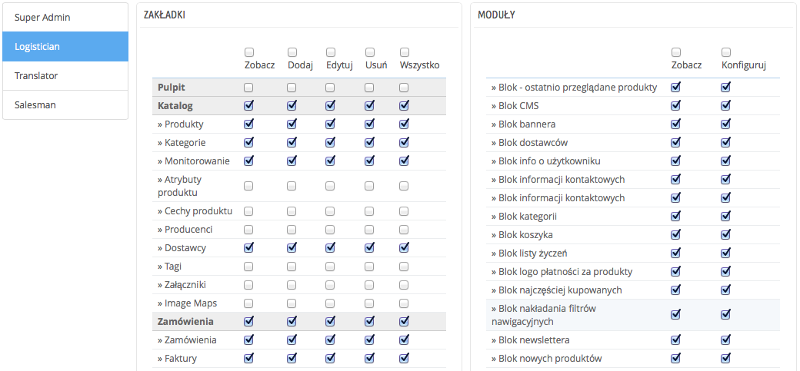

# Uprawnienia

Uprawnienia są centralną częścią profili PrestaShopa. Pozwalają Ci ustalić bardzo dokładnie co dane konto pracownika może, a czego nie może.

Strona składa się z zakładek:

* po lewej, znajduje się tyle zakładek, ile jest profili.
* po prawej stronie, PrestaShop przedstawia uprawnienia podzielone na dwie kolumny.

Jeśli wybierzesz jakikolwiek profil, oprócz SuperAdmina, pojawią się wszystkie informacje:

* W lewej kolumnie uprawnienia dotyczące dostępu do menu. Możesz określić czynności, które dany profil może wykonywać na poszczególnych stronach/podstronach menu. Możesz ograniczyć do wyłącznie podglądu, albo nawet ukryć całkowicie wybraną stronę.
* W prawej kolumnie znajdują się uprawnienia związane z modułami: chociaż możesz zezwolić niektórym na dostęp do niektórych modułów, to tylko najbardziej zaufani pracownicy powinni mieć do nich dostęp.

Dla każdej strony menu masz 5 opcji:

* **Zobacz.** Pracownik może widzieć informacje.
* **Dodaj.** Pracownik może dodawać nowe informacje.
* **Edytuj.** Pracownik może zmienić informacje.
* **Usuń**. Pracownik może usuwać informacje.
* **Wszystko**. Pracownik może skorzystać z każdej wymienionej opcji.

Tymczasem moduły mają tylko 2 opcje:

* **Zobacz**. Pracownik może widzieć konfigurację modułu.
* **Konfiguruj**. Pracownik może dokonywać zmian w konfiguracji.

Uprawnienia SuperAdmina nie mogą być zmienione: ten profil ma po prostu dostęp do wszystkiego.

## Nadawanie uprawnień nowemu profilowi 

Dla tego przykładu stworzymy nowy profil: "Obsługa zamówień"; Najpierw stwórz taki profil, na stronie "Profile". Po utworzeniu go, pojawi się on na liście profili.

Następnie na stronie "Uprawnienia" otwórz zakładkę z nazwą profilu, a pojawią się dwie kolumny z kryteriami. Domyślnie nowy profil nie ma żadnego dostępu do Back-Office i może wyłącznie przeglądać niektóre moduły.

Masz dwa sposoby na wypełnienie odpowiednio pól w zależności od tego jakie chcesz nałożyć limity na dany profil:

* Zaznaczaj pola jeden po drugim, aż profil uzyska wystarczająco duży dostęp, aby wykonywać swoją pracę.
* Zaznacz wszystkie pola, a następnie odznaczaj uprawnienia tam, gdzie uważasz, że dany profil nie powinien ich mieć.

Możesz zaznaczyć wszystko albo według:

* **Kolumny.** U góry każdej z kolumn opcji znajduje się pole, jeśli je zaznaczysz, to wszystkie dane opcje będą oznaczone/odznaczone
* **Linii.** Możesz zaznaczyć/odznaczyć "Wszystko" przy każdej interesującej Cię linii

Aby uniknąć błędów podczas konfiguracji uprawnień, PrestaShop zachowuje automatycznie ustawienia po dokonaniu jakiejkolwiek zmiany. To oznacz, że nie musisz zapisywać tego, co ustaliłeś. Po nadaniu/odebraniu wszystkich uprawnień, możesz przejść do strony "Pracownicy" i nadać nowy profil odpowiedniemu pracownikowi.
