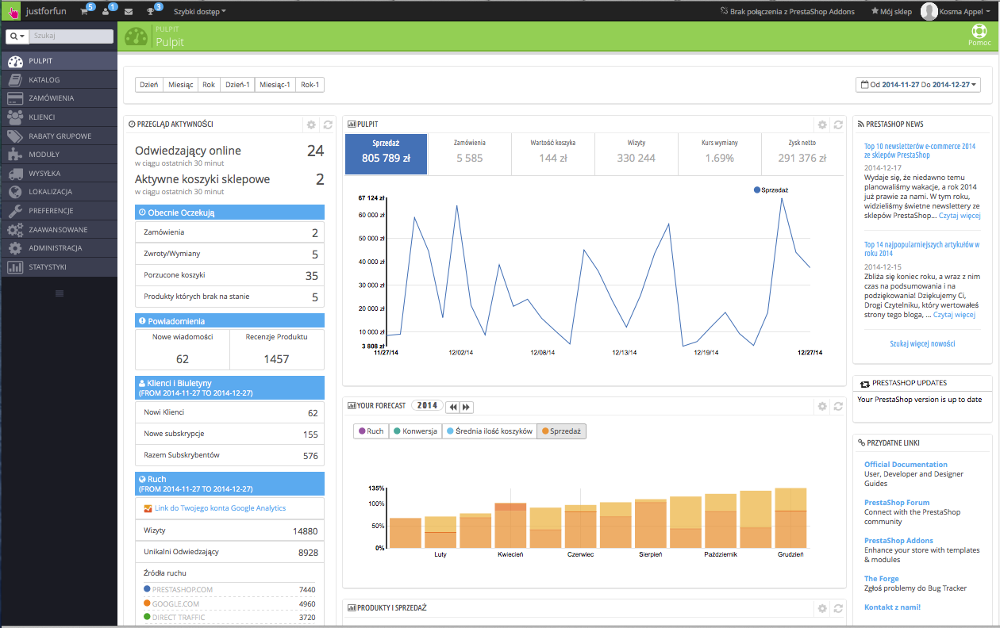
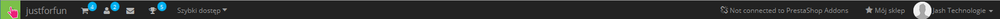
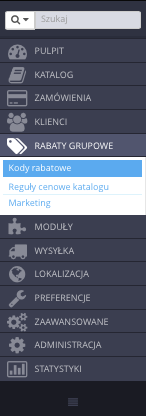
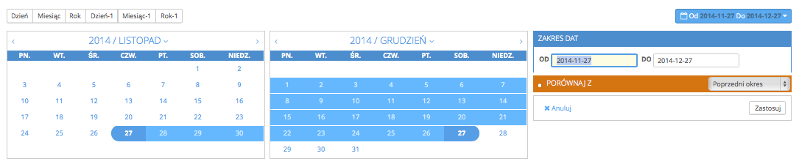
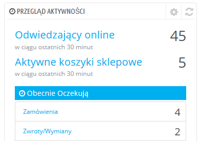
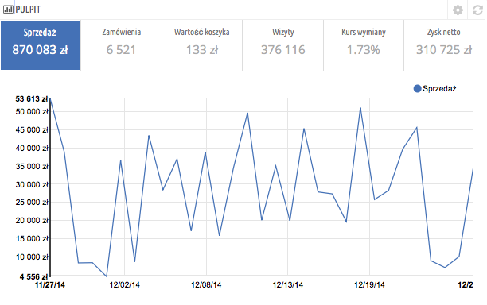
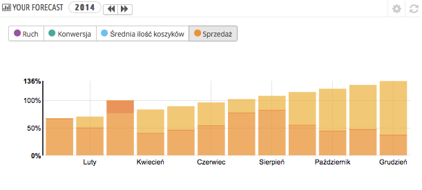
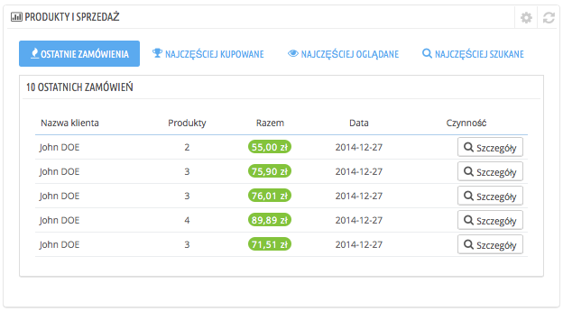

# Odkrywanie obszaru administracyjnego

**Spis zawartości**\
****

/\*\<!\[CDATA\[\*/\
div.rbtoc1597140205355 {padding: 0px;}\
div.rbtoc1597140205355 ul {list-style: disc;margin-left: 0px;}\
div.rbtoc1597140205355 li {margin-left: 0px;padding-left: 0px;}\
\
/\*]]>\*/

* [Odkrywanie obszaru administracyjnego](odkrywanie-obszaru-administracyjnego.md#Odkrywanieobszaruadministracyjnego-Odkrywanieobszaruadministracyjnego)
  * [Prezentacja głównego interfejsu](odkrywanie-obszaru-administracyjnego.md#Odkrywanieobszaruadministracyjnego-Prezentacjagłównegointerfejsu)
    * [Górny pasek](odkrywanie-obszaru-administracyjnego.md#Odkrywanieobszaruadministracyjnego-Górnypasek)
    * [Menu](odkrywanie-obszaru-administracyjnego.md#Odkrywanieobszaruadministracyjnego-Menu)
  * [Przyciski](odkrywanie-obszaru-administracyjnego.md#Odkrywanieobszaruadministracyjnego-Przyciski)
  * [Pomoc kontekstowa](odkrywanie-obszaru-administracyjnego.md#Odkrywanieobszaruadministracyjnego-Pomockontekstowa)
  * [Pulpit](odkrywanie-obszaru-administracyjnego.md#Odkrywanieobszaruadministracyjnego-Pulpit)
    * [Poziomy pasek](odkrywanie-obszaru-administracyjnego.md#Odkrywanieobszaruadministracyjnego-Poziomypasek)
    * [Lewa kolumna](odkrywanie-obszaru-administracyjnego.md#Odkrywanieobszaruadministracyjnego-Lewakolumna)
    * [Środkowa kolumna](odkrywanie-obszaru-administracyjnego.md#Odkrywanieobszaruadministracyjnego-Środkowakolumna)
    * [Prawa kolumna](odkrywanie-obszaru-administracyjnego.md#Odkrywanieobszaruadministracyjnego-Prawakolumna)

## Odkrywanie obszaru administracyjnego 

Teraz, gdy Twój PrestaShop 1.6 został już zainstalowany i jesteś zalogowany do panelu administracyjnego, potrzebujesz trochę czasu, by przejść przez jego interfejs administracyjny, zrozumieć jego powiadomienia i wiedzieć, gdzie znaleźć określone informacje.

Konstrukcja obszaru administracyjnego została w wersji 1.6 PrestaShop całkowicie odnowiona, by był bardziej intuicyjny i ergonomiczny oraz lepiej funkcjonował na urządzeniach mobilnych.

Mimo że większość stron i opcji wersji 1.5 znajduje się tam, gdzie mógłbyś ich oczekiwać, trochę czasu może zająć oswojenie się z nimi.

Stworzyliśmy tę sekcję, by pomóc w odkryciu interfejsu administracyjnego PrestaShop. Został on zaprojektowany, by być bardziej ekonomiczny i łatwiejszy w użyciu, ale należy pamiętać, że powinieneś przeczytać wszystkie rozdziały podręcznika, aby w pełni zrozumieć zalety tego nowego narzędzia e-commerce!

### Prezentacja głównego interfejsu 

Poświęć trochę czasu na zapoznanie się z pulpitem, czyli pierwszą stroną, którą widzisz po połączeniu się z back-office. Nie tylko daje Ci ona zbiór wszystkiego, co powinieneś w danej chwili wiedzieć o swoim sklepie, z linkami do najbardziej przydatnych stron, lecz także udziela Ci, jako nowemu użytkownikowi PrestaShop, kilku porad odnoszących się do ustawień, na które należy zwracać uwagę.

#### Górny pasek 

Na górze strony znajduje się ciemny pasek zawierający kilka linków:

* **(nazwa Twojego sklepu).** Ten link przeniesie Cię z powrotem do pulpitu z dowolnej strony.
* **Ikona koszyka.** Podpowiedź wskazuje na liczbę nowych zamówień. Z tego miejsca możesz albo wyświetlić jedno z zamówień, albo przejść do listy zamówień. Po kliknięciu na ikonę otworzy się okno prezentujące nowe zamówienia, które pojawiły się od czasu ostatniego kliknięcia.
* **Ikona osoby.** Podpowiedź wskazuje na liczbę nowych klientów. Stamtąd można albo wyświetlić stronę z informacjami o klientach, albo przejść do listy klientów. Po kliknięciu na ikonę otworzy się okno prezentujące nowo zarejestrowanych klientów, którzy pojawili się od czasu ostatniego kliknięcia.
* **Ikona wiadomości.** Podpowiedź wskazuje na liczbę nowych wiadomości. Po kliknięciu na ikonę otworzy się okno prezentujące nowe wiadomości otrzymane przez serwis obsługi klienta od czasu ostatniego kliknięcia. Stamtąd można albo wyświetlić jedną z wiadomości, albo przejść do strony serwisu.
* **Ikona pucharu.** Podpowiedź wskazuje na liczbę nowych elementów. Po kliknięciu na ikonę otworzy się okno prezentujące Twoje postępy jako kupca. Stamtąd można wyświetlić całą stronę z odznakami i punktami pochodzącymi z modułu „Osiągnięcia sprzedawcy”.
* **Szybki dostęp.** Menu zawiera skróty do niektórych z najbardziej przydatnych stron, które możesz modyfikować na stronie „Szybki dostęp”, z menu „Administracja”.
* **Nie jesteś zalogowany do PrestaShop Addons.** Otwiera okno modalne umożliwiające podłączenie Twojego sklepu do sklepu Addons i, tym samym, uzyskanie aktualizacji modułów i szablonów, które zakupiłeś.
* **Link „Zobacz Mój Sklep”.** Otwiera nową kartę w przeglądarce ze stroną główną Twojego sklepu.
* **Link (imię i nazwisko).** Proste przypomnienie konta, na którym jesteś zalogowany.
  * **Link „Moje ustawienia”.** Otwiera stronę z bieżącymi ustawieniami konta użytkownika, na której możesz dostosowywać określone opcje, jak język back-office czy Twoje hasło.
  * **Link „Wyloguj się”.** Wylogowałeś się z konta użytkownika.

#### Menu 

Podczas codziennych czynności związanych z administrowaniem sklepem trzeba będzie regularnie przeglądać liczne strony i opcje back-office.

Domyślnie menu systemowe w PrestaShop 1.6 jest wyświetlane po lewej stronie. Możesz je wyświetlić na górze strony, korzystając z opcji „Orientacja menu administracyjnego” na stronie ustawień użytkownika (dostęp do niej masz poprzez link z Twoim imieniem i nazwiskiem znajdujący się w górnym pasku).

.png>)

Czy to będzie w formacie poziomym, czy pionowym, zawartość każdego menu jest wyświetlana, gdy wskaźnik myszy znajduje się na tytule menu, redukując w ten sposób konieczność ładowania nowych ekranów tylko po to, by uzyskać dostęp do opcji menu.

Ponadto format pionowy może być zredukowany tylko do postaci ikon poprzez kliknięcie ikony „linie równoległe”, znajdującej się u dołu menu.

Każde menu odnosi się do danego zbioru zadań:

* **Pole wyszukiwania wraz z listą rozwijaną.** Pozwala Ci na przeszukiwanie zawartości Twojego sklepu.
* **Katalog.** To serce Twojego sklepu, miejsce, gdzie można dodać swoje produkty, tworzyć kategorie, ustawiać przewoźników i dostawców…
* **Zamówienia.** Gdy klient rozpoczyna dodawanie produktów do swojego koszyka, zobaczysz pierwsze zamówienia, które się pojawią w tym menu, wraz z powiązanymi z nimi fakturami. Również z tego menu zarządzać będziesz zwrotami towarów, należnościami i obsługą zamówień klienta.
* **Klienci.** Tutaj dostępne są wszystkie informacje o Twoich klientach. Możesz edytować ich adresy, tworzyć grupy klientów, do których można zastosować specjalne zniżki, zarządzać obsługą klienta, a w razie potrzeby operować zwrotami grzecznościowymi.
* **Reguły cenowe.** To konkretne menu pozwala szybko generować kupony rabatowe i obniżki cenowe poprzez zbiory zasad.
* **Moduły.** Zwiększ możliwości i użyteczność Twojego sklepu, dodając i aktywując moduły: ponad sto z nich jest dostępnych domyślnie, zaś znacznie więcej można zakupić w sklepie Addons ([http://addons.prestashop.com/](http://addons.prestashop.com/)). To także miejsce, gdzie możesz zarządzać szablonami oraz umieszczać bloki z zawartością modułów na Twoim szablonie (włącznie z funkcją edycji na żywo). Ostatnia strona menu pozwala na zastosowanie globalnych ustawień modułów płatności.
* **Wysyłka.** Wszystko, co dotyczy przewoźników i kosztów wysyłki, a także marketingu.
* **Lokalizacja.** Pomaga dostosować Twój sklep do cech lokalnych, takich jak język i tłumaczenie, waluta, jednostki miary, podatki i przepisy podatkowe oraz jednostek geograficznych (regionów, krajów itd.).
* **Preferencje**. PrestaShop jest narzędziem handlu elektronicznego, które można wielorako konfigurować. Pozwala Ci zmieniać jego działania za pomocą jego profesjonalnych i bogatych ustawień.
* **Ustawienia zaawansowane.** To menu zawiera odnośniki do narzędzi i stron informacyjnych, które są zbyt specyficzne, by pasowały do innych menu. Wśród nich znajdują się m.in.: ustawienia usług sieciowych, narzędzie do kopii zapasowych bazy danych czy strona wydajności.
* **Administracja.** Oto ustawienia odnoszące się do samego back-office’a, na przykład zawartość menu szybkiego dostępu, listy pracowników z ich uprawnieniami czy ułożenie menu.
* **Statystyki.** To menu daje Ci dostęp do licznych statystyk i grafik, które są gromadzone i generowane przez PrestaShop.

Powyższe menu są domyślne. Należy pamiętać, że moduły mogą dodawać nowe opcje do istniejących stron, nowe strony do istniejących menu, a nawet nowe menu.

Ponadto jedno menu jest dostępne tylko wtedy, gdy ustawiona jest odpowiednia opcja:

* **Magazyn.** To menu daje Ci dostęp do funkcji zarządzania magazynem, skąd możesz obsługiwać składy, ruchy magazynowe, zamówienia na dostawy. Dostęp do menu możliwy jest poprzez stronę z ustawieniami produktów: wystarczy aktywować opcję „Włącz zaawansowane zarządzanie magazynem” (w sekcji „Stan produktów”), a zobaczysz, że menu się pojawi.

Wszystkie domyślne standardowe menu, włącznie z „Magazynem”, zostały dogłębnie wyjaśnione w niniejszym podręczniku.

### Przyciski 

Wiele stron administrujących używa powracających przycisków, zamieszczonych bądź na górze, bądź na dole ekranu. Na przykład, strona edycji produktu może zawierać 8 przycisków dostępnych w tym samym czasie.

Są czymś więcej niż prostymi skrótami, oferują rzeczywiste funkcje, z których będziesz bardzo często korzystać.

Dostępne przyciski różnią się znacząco w zależności od kontekstu. Dlatego też dwie różne strony mogą mieć różne zestawy przycisków. Mimo wszystko, istnieje kilka, które pojawiają się często:

* **Dodaj nowy.** Otwiera stronę do wprowadzenia nowej treści.
* **Polecane moduły.** Otwiera okno pokazujące moduły dostępne w danej sytuacji.
* **Pomoc.** Otwiera dokumentację online dla bieżącej strony.

Przycisk „Polecane moduły” prezentuje moduły, które mają zastosowanie w danej sytuacji. Na przykład na stronie „Wysyłka > Przewoźnicy” wyświetlone zostaną moduły z kategorii „Wysyłka i logistyka”. Jest to bardzo pomocne w sytuacji, gdy musisz szybko zdecydować, który moduł trzeba zainstalować i skonfigurować, aby osiągnąć dany rezultat.

Wiele formularzy back-office zatwierdza się przyciskami u dołu ekranu:

* **Zapisz.** Zapisuje zawartość bieżącej strony i powraca do listy wszystkich istniejących elementów.
* **Zapisz i zostań.** Zapisuje zawartość bieżącej strony i pozostawia ją otwartą.
* **Anuluj.** Powraca do listy wszystkich istniejących elementów.

### Pomoc kontekstowa 

Począwszy od wersji PrestaShop 1.6.0.7, dokumentacja oprogramowania umieszczona jest bezpośrednio w interfejsie administracyjnym: kliknięcie na przycisk „Pomoc” z jakiejkolwiek strony back-office zmniejsza szerokość głównego interfejsu po to, by po prawej stronie dodać nową kolumnę, która zawiera dokumentację dla tej części back-office.

Kolejne kliknięcie na przycisk „Pomoc” zamyka reklamę kontekstualną. Jeśli nie zamkniesz kolumny z pomocą, PrestaShop odczyta to jako polecenie wyświetlania jej na każdej stronie back-office. Dlatego też pozostawi kolumnę otwartą, dopóki jej nie zamkniesz.

Jeśli obszar wyświetlania przeglądarki ma mniej niż 1220 pikseli szerokości, to PrestaShop otworzy dokumentację kontekstową w nowym oknie przeglądarki. Nie będzie natomiast zmniejszał powierzchni ekranu kosztem głównego interfejsu.

U dołu kolumny z pomocą mały formularz umożliwia Ci poinformowanie ekipy PrestaShop o tym, czy uzyskałeś w tej sekcji pomoc, czy też nie. Oceń stronę pomocy, klikając na jeden z 5 poziomów zadowolenia. Jeśli klikniesz na jeden z dwóch najniższych poziomów, PrestaShop otworzy krótki formularz pozwalający doprecyzować Twoją opinię. Możesz zarówno wypełnić go i kliknąć przycisk „Wyślij” bądź zamknąć formularz kliknięciem w krzyżyk, w którym to przypadku tylko Twoja ocena punktowa zostanie przesłana na serwer.

### Pulpit 

Przyjrzyjmy się teraz zawartości samego pulpitu. Komuś, kto używa go po raz pierwszy może się wydawać przepełniony, ale wkrótce potem przekonasz się, że doskonale pokazuje zestawienie całej aktywności, która odbywa się w Twoim sklepie.

Pulpit podzielony jest na 4 główne obszary: poziomy pasek i trzy kolumny.

Tryb demo

Domyślnie pulpit posługuje się fałszywymi danymi po to, byś mógł sobie lepiej wyobrazić, jak wyświetlane są różne statystyki.

Prowadząc prawdziwy sklep internetowy na PrestaShop, musisz pamiętać, by wyłączyć te nieprawdziwe informacje, aby móc używać z Twoich prawdziwych danych: kliknij na „Nie” w bloku „Tryb demo”, w prawym dolnym rogu ekranu.

#### Poziomy pasek 

U góry pulpitu znajduje się pojedynczy pasek, który pozwala Ci wybrać okres czasu dla aktualnie wyświetlanych statystyk pulpitu. Dostępne są trzy zestawy opcji:

* Bieżący dzień, miesiąc lub rok.
* Poprzedni dzień, miesiąc lub rok.
* Dokładny wybór daty (przycisk po prawej stronie, który otwiera narzędzie wyboru daty).

Wybór opcji uaktualnia wszystkie bloki z zawartością, które znajdują się na pulpicie, aby wyświetlały informacje tylko z danego okresu. Bloki, które nie są oparte na statystykach nie zmieniają się.

W celu wybrania przedziału czasowego możesz zarówno kliknąć w pierwszy i ostatni dzień tego okresu w kalendarzu (kolejność kliknięć nie ma znaczenia), jak i wpisać daty samodzielnie w formacie RRRR-MM-DD w tekście okienka. Kliknij „Zastosuj”, by zobaczyć wprowadzone przez Ciebie zmiany w ustawieniach.

Możesz również porównać dwa przedziały czasowe, zaznaczając pole „Porównaj z”. Wybierz drugi przedział w taki sam sposób, jak pierwszy (mogą one nawet na siebie zachodzić), potem kliknij przycisk „Zastosuj”.

Przy porównywaniu dwóch okresów niektóre bloki zawartości zostaną zaktualizowane, wskazują na ewolucję danych (spójrz np. na główny blok pulpitu, który prezentuje dane z modułu „Trendy”).

#### Lewa kolumna 

To kolumna, która domyślnie przedstawia dane z modułu „Pulpit: Przegląd Aktywności”, pokazując w skrócie najważniejsze informacje o Twojej bazie danych:

* Odwiedzający online w ciągu ostatnich 30 minut.
* Aktywne koszyki sklepowe w ciągu ostatnich 30 minut.
* Obecnie oczekujące zamówienia, zwroty/wymiany, porzucone koszyki i produkty, których nie ma na stanie.
* Powiadomienia o nowych wiadomościach, zapytaniach w kwestii zamówień oraz recenzjach produktów..
* Nowi klienci i nowe subskrypcje biuletynów.
* Statystyki dotyczące ruchu: wizyty, unikalni odwiedzający, źródła ruchu i bezpośrednie linki.

#### Środkowa kolumna 

To środkowa kolumna jest miejscem, w którym słowo „Pulpit” nabiera znaczenia: ten obszar Pulpitu prezentuje użytkownikowi najważniejsze liczby dotyczące codziennej aktywności sklepu wraz z wykresem sprzedaży i listą ostatnich zamówień. Przy każdym logowaniu do panelu administracyjnego Twojego sklepu będziesz przede wszystkim widział zmiany w tych cyfrach/danych. To tutaj widać, że Twój sklep tchnie życiem.

Domyślnie ta kolumna składa się z trzech bloków z zawartością, które obsługiwane są przez moduły:

* **Pulpit** (moduł pulpitu „Trendy”). To główny blok z informacjami na pulpicie. Rozmaite wykresy pomogą Ci zobaczyć, czy Twój sklep zmierza w dobrym kierunku, czy też nie. Kliknij na jeden z typów wykresu, aby go wyświetlić. Dodatkowo, gdy porównasz dwa przedziały czasowe, wyświetlą się procentowe zmiany poszczególnych wartości. Najedź myszką na wykres, aby zobaczyć szczegóły.\
  \
  Kliknięcie na ikonę konfiguracji (w prawym górnym rogu pola) otwiera nową stronę, na której możesz określić różne koszty, jakie ponosi Twój sklep (opłaty bankowe, średnie koszty wysyłki, opłaty za hosting itd.). Pozwoli to lepiej pokazać kierunek, w jakim Twój sklep podąża.
* **Prognoza** (moduł pulpitu „Cele”). Ten blok pokazuje CI cele, które powinieneś osiągnąć w ciągu najbliższych miesięcy i odnosi je do etapu ich realizacji, na którym jesteś. Najedź kursorem na wykres, aby zobaczyć szczegóły.\
  Na podstawie Twoich miesięcznych wyników, powinieneś aktualizować kolejne cele do osiągnięcia. Cele możesz określić w polu z formularzem konfiguracji (prawy górny róg bloku), wskazując swoje oczekiwania do realizacji z miesiąca na miesiąc i biorąc przy tym pod uwagę ruch w sklepie, współczynnik konwersji i średnią wartość koszyka. Kolumna „Sprzedaż” zostanie zaktualizowana zgodnie z celami określonymi w innych kolumnach (na przykład dla 1000 odwiedzających przy współczynniku konwersji w wysokości 2% i średniej wartości koszyka w wysokości $10 powinieneś otrzymać 1000\*(2/100)\*10 = $200). Możesz zmienić walutę, wybierając w menu „Lokalizacja” opcję „Waluty”.
* **Produkty i sprzedaż** (moduł pulpitu „Produkty”). Ten blok prezentuje tabelę zawierającą ostatnie zamówienia oraz rankingi Twoich produktów: najczęściej sprzedawanych, najczęściej oglądanych i najczęściej wyszukiwanych (na podstawie wyszukiwań w sklepie, nie przeglądarkach internetowych).\
  \
  Klikając na ikonę konfiguracji, możesz ustawić liczbę elementów, które będą się wyświetlały w każdym z tych rankingów.

#### Prawa kolumna 

Ta ostatnia kolumna ma charakter informacyjny: zapoznaje Cię z najnowszymi informacjami o PrestaShop, powiadamia o nowych wersjach PrestaShop i sugeruje przydatne linki.

Zawiera również blok pn. „Tryb demo”, dzięki któremu wyłączyć możesz nieprawdziwe dane, jakimi posługuje się pulpit i użyć swoich własnych (zebranych przez system statystyk PrestaShop).
