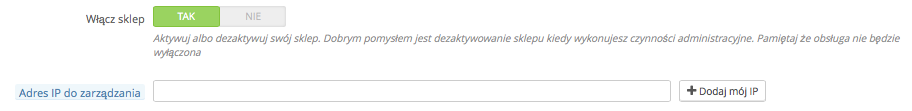
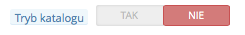
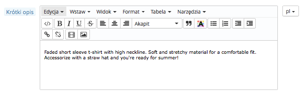
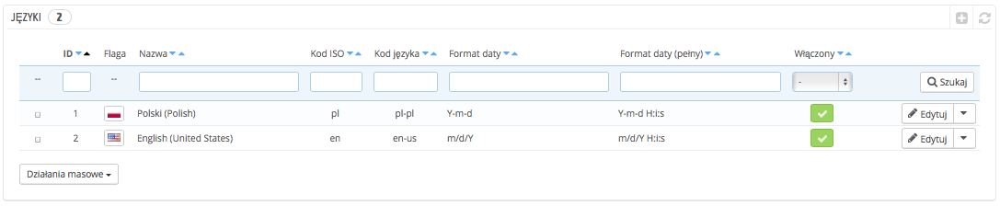
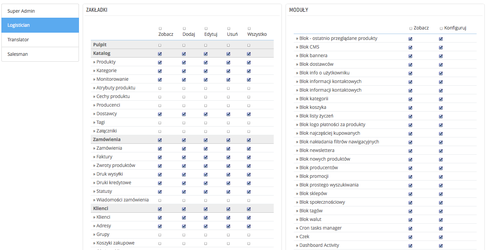

# Pierwsze kroki

**Spis zawartości**

* [Pierwsze kroki w PrestaShop 1.6](pierwsze-kroki.md#PierwszekrokiwPrestaShop1.6-PierwszekrokiwPrestaShop1.6)
  * [Wyłącz swój sklep](pierwsze-kroki.md#PierwszekrokiwPrestaShop1.6-Wyłączswójsklep)
  * [Usuń zawartość domyślnego sklepu](pierwsze-kroki.md#PierwszekrokiwPrestaShop1.6-Usuńzawartośćdomyślnegosklepu)
  * [Konfiguruj informacje sklepowe](pierwsze-kroki.md#PierwszekrokiwPrestaShop1.6-Konfigurujinformacjesklepowe)
    * [Podstawowe ustawienia sklepu](pierwsze-kroki.md#PierwszekrokiwPrestaShop1.6-Podstawoweustawieniasklepu)
    * [Języki sklepu](pierwsze-kroki.md#PierwszekrokiwPrestaShop1.6-Językisklepu)
    * [Informacje dla pracowników](pierwsze-kroki.md#PierwszekrokiwPrestaShop1.6-Informacjedlapracowników)
  * [Skonfiguruj metody płatności](pierwsze-kroki.md#PierwszekrokiwPrestaShop1.6-Skonfigurujmetodypłatności)
  * [Skonfiguruj przewoźników i przesyłki](pierwsze-kroki.md#PierwszekrokiwPrestaShop1.6-Skonfigurujprzewoźnikówiprzesyłki)
  * [Wybierz swój szablon](pierwsze-kroki.md#PierwszekrokiwPrestaShop1.6-Wybierzswójszablon)
  * [Wybierz swoje moduły](pierwsze-kroki.md#PierwszekrokiwPrestaShop1.6-Wybierzswojemoduły)
  * [Utwórz produkty i kategorie produktów](pierwsze-kroki.md#PierwszekrokiwPrestaShop1.6-Utwórzproduktyikategorieproduktów)
  * [Utwórz treści statyczne](pierwsze-kroki.md#PierwszekrokiwPrestaShop1.6-Utwórztreścistatyczne)
  * [Zbuduj górne menu](pierwsze-kroki.md#PierwszekrokiwPrestaShop1.6-Zbudujgórnemenu)
  * [Aktywuj swój sklep](pierwsze-kroki.md#PierwszekrokiwPrestaShop1.6-Aktywujswójsklep)

## Pierwsze kroki w PrestaShop 1.6 

Musisz poświęcić trochę czasu, by mieć pewność, że każda część Twojego przyszłego sklepu internetowego jest prawidłowo skonfigurowana, zabezpieczona, sprawdzona i gotowa do rozpoczęcia sprzedaży.

Wprawdzie PrestaShop znacznie ułatwia zainstalowanie sklepu i zbudowanie Twojego biznesu w Internecie, ale niemożliwe jest rozpoczęcie sprzedaży w kilka sekund: tu masz do czynienia z produktami, klientami, przewoźnikami i, co najważniejsze, z rzeczywistymi kwotami pieniężnymi, które będą przepływały z kont klientów na Twoje konto bankowe. Wiemy, że chcesz mieć pewność, że nie będzie żadnych kłopotów w procesie potwierdzania zamówień, że produkty będzie można znaleźć w magazynie, zapakować i wysłać do klientów bez żadnej awarii ani żadnych nieprzewidzianych okoliczności, które zaszłyby bez Twojej wiedzy.

PrestaShop jest bardzo kompletnym narzędziem, a ogrom jego możliwości może przytłaczać. Niniejszy rozdział poprowadzi Cię zatem przez kilka podstawowych czynności, które należy wykonać przed wielką premierą Twojego sklepu. Wiele można i trzeba zrobić jeszcze zanim Twój sklep zacznie działać, ale te kroki są wymagane zawsze przy uruchamianiu jakiegokolwiek sklepu.

### Wyłącz swój sklep 

Zakładamy, że jesteś w trakcie pierwszej godziny po instalacji Twojego sklepu na PrestaShop. Wyłączenie sklepu powoduje, że nikt nie może uzyskać do niego dostępu w czasie, gdy Ty zajmujesz się wprowadzaniem zmian, wprowadzaniem produktów, określaniem cen i podatków, instalowaniem modułów płatności i nowego szablonu oraz ustalaniem przewoźników… Określa się to jako wprowadzenie sklepu w „tryb konserwacji”.

W panelu administracyjnym przejdź do menu: „Preferencje/Przerwa techniczna”. Strona ta zawiera dwa ustawienia:

* **Włącz sklep.** Wystarczy wybrać „Nie”, a odwiedzający będą na stronie widzieli informację, że sklep będzie wkrótce dostępny.
* **Adres IP do zarządzania.** To miejsce, w którym musisz wpisać swój adres IP, tak aby wciąż mieć dostęp do strony głównej i przeglądać swój sklep tak, jak gdyby był dostępny dla wszystkich. To konieczność za każdym razem, kiedy wprowadzasz sklep w tryb konserwacji, gdyż zawsze będziesz musiał przeglądać front-end (stronę główną, która wyświetla się użytkownikom), tak aby upewnić się, że wszystko znalazło się na miejscu, zgodnie z przeznaczeniem. Wystarczy kliknąć przycisk „Dodaj mój IP”. Możesz dodać więcej adresów IP, rozdzielając je przecinkami.

Jeśli już wybierzesz swój szablon i produkty, możesz zamieścić sklep w trybie katalogu. Oznacza to, że klienci mogą przeglądać zawartość sklepu, ale ceny nie będą wyświetlane. Nie będą oni w stanie dodać czegokolwiek do koszyka, dopóki nie wyłączysz trybu katalogowego.

Tryb katalogu możesz aktywować, przechodząc do strony „Preferencje/Produkty”. Tryb katalogu widniej na pierwszym miejscu.\

### Usuń zawartość domyślnego sklepu 

Domyślna instalacja oferuje tylko garstkę produktów – głównie damską odzież. Ich jedynym celem jest pomóc Ci w poznaniu tego, jak zorganizowany jest prawdziwy sklep. Po tym, gdy opanujesz całą złożoność powiązań pomiędzy produktami, kategoriami, zamówieniami i klientami, należy usunąć te wszystkie elementy, byś mógł uruchomić sklep z czystym kontem.

Należy zatem usunąć wszystkie domyślne dane, co oznacza:

* produkty oraz ich…:
  * kategorie
  * atrybuty
  * funkcje
  * producentów
  * dostawców
  * mapowanie obrazu
  * tagi
* zamówienia\

  * wiadomości z zamówieniami
* klienci\

  * koszyki
* przewoźnicy\

  * zakresy cenowe
  * zakresy wagowe
* kontakt i sklepy (usunąć lub dostosować do potrzeb sklepu)
* strony CMS (usunąć lub dostosować do potrzeb firmy).

Wymagałoby to jednak przeglądania wielu różnych stron w back-office i usuwania zawartości strona po stronie. Jest na to o wiele łatwiejszy sposób:

1. Przejdź do sekcji „Moduły > Moduły”.
2. Odszukaj moduł „Oczyszczanie PrestaShop” (Database Cleaner) i kliknij przycisk „Instaluj”.
3. Przeniesiono Cię bezpośrednio do strony konfiguracji (jeśli nie, należy kliknąć przycisk „Konfiguracja”).
4. Przeczytaj i zatwierdź ostrzeżenie, a następnie kliknij przycisk „Usuń katalog”: zlikwidowane zostaną wszystkie produkty, ich atrybuty, producenci itd.
5. Przeczytaj i zatwierdź ostrzeżenie, a następnie kliknij przycisk „Usuń zamówienia i klientów”: zlikwidowani zostaną wszyscy klienci, ich zamówienia, koszyki itd.
6. Kliknij przycisk „Sprawdź i napraw”, by zlikwidować ograniczenia integralności bazy danych.
7. Kliknij przycisk „Wyczyść i optymalizuj”, by zreorganizować fizyczne przechowywanie danych z tabel i powiązanych z nimi odnośników, by zmniejszyć powierzchnię magazynową i poprawić wydajność wejścia-wyjścia podczas dostępu do tabel.

NIE MA ODWROTU. Pamiętaj, by kliknąć te przyciski tylko wtedy, gdy naprawdę zamierzasz oczyścić bazę danych z jej domyślnej zawartości.

### Konfiguruj informacje sklepowe 

Teraz, gdy już wyczyściłeś sklep domyślny, możesz rozpocząć tworzenie własnego, a to zakłada ustawienie wszystkich Twoich upodobań, rozpoczynając od informacji osobistych i preferencji.

#### Podstawowe ustawienia sklepu 

Należy zwrócić uwagę na następujące ustawienia, których większość jest ważna ze względu na fakt, że wyświetla się na front-office, a więc przed oczyma Twoich klientów.

Niektóre z tych ustawień wymagają konfiguracji modułu zamiast zmiany ustawień PrestaShop.

Konfigurowanie modułu jest bardzo proste:

1. Przejdź do strony „Moduły” w menu „Moduły”.
2. Wpisz nazwę modułu (lub jej część) w polu wyszukiwania. Wyniki powinny wyświetlać się już w trakcie pisania.
3. Gdy moduł zostanie znaleziony, kliknij przycisk „Konfiguruj” i postępuj zgodnie z instrukcjami.

W przypadku każdego przedstawionego modułu należy przeczytać jego dokumentację, aby uzyskać więcej informacji.

| Ustawienia                     | Opis                                                                                                                                                                                                                                                                                                                                               | Gdzie to znaleźć                                                                                                                                                                                                                                                                                                                                                                                                                                                                                                              |
| ------------------------------ | -------------------------------------------------------------------------------------------------------------------------------------------------------------------------------------------------------------------------------------------------------------------------------------------------------------------------------------------------- | ----------------------------------------------------------------------------------------------------------------------------------------------------------------------------------------------------------------------------------------------------------------------------------------------------------------------------------------------------------------------------------------------------------------------------------------------------------------------------------------------------------------------------- |
| Nazwa sklepu                   | Definiuje Twoją markę, zwłaszcza w wyszukiwarkach (Google, Yahoo!, Bing…).                                                                                                                                                                                                                                                                         | Menu „Preferencje”, strona „Kontakty sklepu”, potem w sekcji  „Dane kontaktowe” edytuj „Nazwę sklepu”.                                                                                                                                                                                                                                                                                                                                                                                                                        |
| Logo sklepu                    | 
Definiuje Twoją markę wizualnie. Domyślne logo określone jest jako „Twoje Logo”, by zachęcić do użycia Twojego własnego.

Wyświetlone jest w lewym górnym rogu każdej strony Twojego sklepu, ale także na fakturach i innych automatycznych wiadomościach.
                                                                             | Menu „Preferencje”, strona „Szablony”, sekcja „Twój obecny szablon”, potem zamień różne domyślne obrazy na Twoje logo.                                                                                                                                                                                                                                                                                                                                                                                                        |
| Domyślna waluta sklepu         | Waluta, w której chcesz ustawić domyślną cenę Twoich produktów.                                                                                                                                                                                                                                                                                    | Menu „Lokalizacja”, strona „Lokalizacja”, sekcja „Konfiguracja”. Jeśli waluta nie jest dostępna, należy importować paczkę lokalizacyjną dla jej kraju: użyj narzędzia: „Importuj paczkę lokalizacyjną” znajdującego się na tej samej stronie.                                                                                                                                                                                                                                                                                 |
| Informacje o obsłudze klienta  | Blok zawierający numer telefonu do Twojego serwisu obsługi klienta oraz przycisk umożliwiający wysłanie do Ciebie maila. Wyświetlany w prawej kolumnie front-office.                                                                                                                                                                               | Moduł „Blok kontaktu”.                                                                                                                                                                                                                                                                                                                                                                                                                                                                                                        |
| Informacja o firmie/kontaktowa | Blok prezentujący Twój adres  kontaktowy, numer telefonu do Twojego serwisu obsługi klienta oraz link umożliwiający wysłanie do Ciebie maila. Wyświetlany w stopce front-office.                                                                                                                                                                   | Moduł „Blok informacji kontaktowych”.                                                                                                                                                                                                                                                                                                                                                                                                                                                                                         |
| Reklama                        | Blok prezentujący obraz z linkiem do innej strony. Wyświetlany w lewej kolumnie front-office.                                                                                                                                                                                                                                                      | Moduł „Blok reklam”.                                                                                                                                                                                                                                                                                                                                                                                                                                                                                                          |
| Slider                         | Slider zawiera kilka obrazów, przesuwających się jeden po drugim. To mocne wizualne oznaczenie Twojego sklepu i produktów. Zazwyczaj umieszczony z przodu i na środku strony głównej.                                                                                                                                                              | Moduł „Slider zdjęć na stronie głównej”.                                                                                                                                                                                                                                                                                                                                                                                                                                                                                      |
| Strony CMS                     | Zawartość stron statycznych, takich jak „O nas”, „Dostawa”, „Nota prawna”, „Regulamin” i „Bezpieczeństwo płatności”. Niektóre z nich zawierają domyślne treści, które powinieneś dostosować do Twojego biznesu; inne są puste i należy wkleić własny tekst. Wyświetla się w bloku „Informacje” w lewej kolumnie oraz sekcji „Informacje” w stopce. | Menu „Preferencje”, strona „CMS”, następnie edytuj i twórz strony dowolnie.                                                                                                                                                                                                                                                                                                                                                                                                                                                   |
| Sieci społecznościowe          | Blok prezentujący 3 linki: do strony Twojej firmy na Facebooku, do konta Twojej firmy na Twitterze, kanału RSS do bloga Twojej firmy (lub strony z „bieżącymi wydarzeniami”). Domyślnie wszystkie te linki prowadzą do własnych stron firmy „PrestaShop”. Ważne, aby zmienić je na swoje własne. Wyświetlane w sekcji „Śledź nas” w stopce.        | Moduł „Blok społecznościowy”.                                                                                                                                                                                                                                                                                                                                                                                                                                                                                                 |
| Górne menu                     | Na górze domyślnego szablonu znajduje się górne menu, by wskazać kategorie, do których może przejść odwiedzający, podobnie jak linki do innych adresów – na przykład domyślna instalacja ma link „Blog”, który odsyła do oficjalnego bloga PrestaShop.                                                                                             | Moduł „Górne menu poziome”.                                                                                                                                                                                                                                                                                                                                                                                                                                                                                                   |
| Zawartość strony głównej       | Domyślny motyw zawiera wiele przykładowej treści: teksty, obrazy, linki itp. Jeśli zamierzasz skorzystać z tego szablonu do własnego sklepu zamiast kupować własny szablon, musisz upewnić się, że usunąłeś całą jego zawartość.                                                                                                                   | 
Moduł „Konfigurator szablonu” (Theme configurator): moduł ten obsługuje wiele elementów Twojego szablonu. Przede wszystkim pozwala Ci wyłączać i włączać pewne funkcje (przyciski portali społecznościowych, górny baner, logo płatności) i, co być może ważniejsze, pozwala łatwo dodawać/zmieniać obrazy na Twojej stronie głównej.

Moduł „Własny blok informacyjny CMS”: moduł ten pozwala Ci zarządzać dwoma ostatnimi blokami u dołu strony głównej, tuż przed stopką: „Darmowa dostawa” i „Dostosuj blok”.
 |

Są to najbardziej widoczne ustawienia na Twojej stronie głównej – przynajmniej w szablonie domyślnym.

Kolumna „Gdzie to znaleźć” wskazuje miejsce, w którym można dokonać zmiany poszczególnych elementów sklepu internetowego. Ten podręcznik dostarczy szczegółowych informacji na temat każdego elementu.

#### Języki sklepu 

PrestaShop może funkcjonować w wielu językach – zarówno po stronie klienta (front-office), jak i administratora (back-office). Jeżeli w back-office aktywowano więcej niż jeden język, każdemu polu tekstowemu towarzyszy ikona flagi, która wskazuje na aktualny język. Należy w nią kliknąć, aby w danym polu wstawić zawartość w wybranym języku.

Domyślnie PrestaShop jest zainstalowany w dwóch językach: tym zastosowanym podczas instalacji oprogramowania oraz francuskim. Aby zarządzać zainstalowanymi językami, przejdź do strony „Lokalizacja/Języki”. Tam znajduje się tabela z dostępnymi językami.

Obecnie włączone języki oznaczone są zielonym symbolem „Tak”, zaś pozostałe czerwonym „Nie”. Kliknij na „Tak”, aby wyłączyć wybrany język; kliknij na „Nie”, aby włączyć go z powrotem.

Możesz zainstalować i włączyć wiele języków, jeśli uważasz, że Twój sklep będzie ich potrzebował, ale pamiętaj, że trzeba będzie tłumaczyć całą zawartość sklepu na wszystkie włączone wersje językowe: nazwy produktów, opisy, etykiety, nazwy kategorii i ich opisy, zawartość statyczną (strony CMS), ustawienia modułów itd.

Możesz łatwo importować wiele innych języków na stronie „Lokalizacja/Lokalizacja”, a potem włączyć je poprzez stronę „Lokalizacja/Języki”.

#### Informacje dla pracowników 

Jeśli inne osoby będą pomagać Ci w zarządzaniu sklepem (czy to Twoja rodzina, przyjaciele bądź zatrudnieni pracownicy), dla każdego z nich należy utworzyć osobiste konto administracyjne – choćby po to, by wiedzieć, że ktoś rozpoczął już dane działanie. Inną zaletą jest również możliwość tworzenia dla nich odrębnych profili ze specjalnymi uprawnieniami dostępu do stron administracyjnych: możesz na przykład nie chcieć, by każdy miał dostęp do Twoich statystyk, faktur i ustawień płatności.

Możesz utworzyć tak wiele profili, jak tylko potrzebujesz.

Aby utworzyć nowe konto pracownika, przejdź do menu „Administracja”, wybierz „Pracowników” i kliknij przycisk „Dodaj nowego pracownika”. Nadaj mu nazwę, np. „Martin Doe” lub „Obsługa wysyłki”, i zapisz.

Konto może być używane przez wielu ludzi, ale doradzamy utworzenie odrębnego dla każdej pomagającej osoby.

Gdy już utworzyłeś właściwe dla danego pracownika konto, powinieneś nadać mu konkretne uprawnienia, które dostosowane są do jego zadań. Domyślnie osoba korzystająca z nowego profilu nie może zrobić wiele. To od Ciebie zależy, do jakich części sklepu dany profil uzyska dostęp. To zadanie może być żmudne, ale ważne, by je wykonać.

Aby przypisać uprawnienia do konta pracownika, musisz użyć opcji „Profil” na stronie tworzenia konta: to menu pozwala Ci wybrać profil konta (Super Admin, tłumacz itd.).

Możesz edytować te uprawnienia w sposób następujący: przejdź do menu „Administracja”, wybierz „Uprawnienia”, a po nich profil, który chcesz zmienić. Pojawi się długa lista uprawnień: edytuj je do woli. Twoje zmiany zapisywane są automatycznie.

### Skonfiguruj metody płatności 

Twój sklep ma zarabiać pieniądze, a to może mieć miejsce tylko wtedy, gdy używasz przynajmniej jednego modułu płatności. Niektóre moduły są już dostępne w domyślnej instalacji. Możesz je zainstalować i skonfigurować (ze strony „Moduły” znajdującej się w menu „Moduły”, w kategorii „Płatności, bramki, operatorzy”) oraz stworzyć dla nich ograniczenia (na stronie „Płatności” w menu „Moduły”). Wiele modułów płatności wymaga najpierw utworzenia konta na usługi, dla których zostały stworzone.\
Zobacz sekcję „Płatności” w rozdziale „Uruchamianie wbudowanych modułów” niniejszego podręcznika, aby je wszystkie poznać.\
Możesz również zainstalować inne moduły płatności pobrane ze sklepu Addons: [http://addons.prestashop.com/en/4-payments-gateways-prestashop-modules](http://addons.prestashop.com/en/4-payments-gateways-prestashop-modules).

Czeki i przelewy bankowe to jedyne metody płatności, które są włączone domyślnie. Jeśli zdecydujesz się je zachować, musisz skonfigurować je z informacjami o: zamówieniach i adresach, właścicielu konta, danych rachunku bankowego (IBAN, BIC itd.).

Te metody płatności konfigurowane są przez moduły: „Przelew bankowy”, „Płatności czekiem”, które znaleźć możesz w kategorii „Płatności, bramki, operatorzy” na liście modułów.

### Skonfiguruj przewoźników i przesyłki 

Produkty sprzedawane w Twoim sklepie muszą być wysyłane do klientów – chyba że sprzedajesz wyłącznie produkty do pobrania, w którym to przypadku menu „Wysyłka” będzie mało przydatne dla Ciebie.

Niezależnie od tego, czy wysyłasz produkty tradycyjną pocztą, czy też masz podpisaną umowę z przewoźnikiem, trzeba ustawić te informacje w PrestaShop.

W rozdziale „Zarządzanie wysyłką” tego przewodnika dowiesz się wszystkiego o wysyłce i przewoźnikach.

**Opcja zwrotu towaru nie jest włączona domyślnie.** Jeśli chcesz umożliwić swoim klientom zwrot produktów i zwrócić im pieniądze lub dać kupon rabatowy, możesz to zrobić uaktywniając opcję „Zwrot towaru” na stronie „Zwrot towaru”, w menu „Zamówienia”.

Kwestia zwrotu towaru jest wyjaśniona w rozdziale „Zarządzanie zamówieniami” niniejszego podręcznika.

### Wybierz swój szablon 

Twój sklep powinien mieć własny szablon, aby wyróżniał się stylem i, tym samym, był bardziej rozpoznawalny i odmienny od innych sklepów internetowych.

Wiele szablonów do wyboru znajduje się w sklepie PrestaShop Addons: [http://addons.prestashop.com/en/3-templates-prestashop](http://addons.prestashop.com/en/3-templates-prestashop).

Można również stworzyć własny szablon albo zlecić to programiście. Zapoznaj się z PrestaShop Designer Guide, by uzyskać pomoc.

Już po zainstalowaniu szablonu należy dokładnie go poznać, by w każdej sytuacji być w stanie pomóc klientom. Przeczytaj dokładnie jego dokumentację.

Można, a nawet powinno się dostosować pewne elementy szablonu, [m.in](http://m.in). logo w jego różnych odmianach (w nagłówku, wiadomości, na fakturze itd.). Odbywa się to przy pomocy strony „Szablony” w menu „Preferencje”.

### Wybierz swoje moduły 

Pakiet PrestaShop zawiera ponad 100 modułów. Są one bardzo zróżnicowane: statystyki, funkcje front-office, płatności, wysyłka… Należy w pełni zapoznać się z tymi modułami, aby wiedzieć, które z nich można włączyć, a które mają pozostać wyłączone.

Aby dowiedzieć się o nich wszystkiego, zobacz rozdziały „Zarządzanie modułami” i „Uruchamianie wbudowanych modułów”.

Wiele innych modułów można także znaleźć w sklepie PrestaShop Addons: [http://addons.prestashop.com/en/2-modules-prestashop](http://addons.prestashop.com/en/2-modules-prestashop).

Za każdym razem, gdy aktywujesz i konfigurujesz moduł, upewnij się, że współgra z Twoim szablonem, jeśli jego funkcje mają wspływ na front-office.

### Utwórz produkty i kategorie produktów 

Zostało to szczegółowo opisane w rozdziale „Dodawanie produktów i kategorii produktów”.

### Utwórz treści statyczne 

Jeśli jeszcze tego nie zrobiłeś, powinieneś poświęcić czas na pisanie treści dla różnych stron statycznych, które są już albo dostępne w instalacji PrestaShop lub dla takich, które uważasz, że należy utworzyć.

Niektóre strony już istnieją, ale ich treść powinna być potrójnie sprawdzona, ponieważ może mieć ona istotny wpływ na [m.in](http://m.in). status prawny Twojego sklepu.

Strony domyślne to: „O nas”, „Dostawa”, „Nota prawna”, „Regulamin” i „Bezpieczne płatności”. Niektóre z nich zawierają domyślne treści, które należy zaktualizować, inne są puste i należy wstawić własny tekst.\
W celu edycji tych stron przejdź do menu „Preferencje”, kliknij stronę „CMS”, następnie wybierz stronę, którą chcesz edytować lub utwórz nową.

Możesz utworzyć tyle stron, ile uznasz za konieczne.

### Zbuduj górne menu 

Teraz, kiedy posiadasz już kategorie produktów i strony CMS, należy zaaranżować je w logiczny i ciekawy sposób w górnym menu.

Można to zrobić, używając modułu „Górne menu poziome”: przejdź do strony „Moduły”, wpisz „menu” w polu wyszukiwania modułów, a powinieneś znaleźć właściwy moduł. Włącz go, jeśli jest wyłączony, a potem skonfiguruj: usuń strony i kategorie, których nie uważasz za konieczne, dodaj inne strony i tak przemieszczaj zawartość, dopóty dopóki uznasz, że układ menu spełnia Twoje oczekiwania.

### Aktywuj swój sklep 

Teraz, kiedy wszystko jest gotowe, możesz upublicznić swój sklep.

W menu „Preferencje” przejdź do strony „Przerwa techniczna” i zmień dwie opcje:

* **Włącz sklep:** wybierz z powrotem „Tak”.
* **Adres IP do zarządzania:** Usuń swój adres z listy, choć jest to opcjonalne – Twój sklep nadal będzie działać, jeśli ten adres tam pozostanie.

W tej chwili Twój sklep powinien być w pełni gotowy na przyjęcie pierwszych odwiedzających… i pierwszych zamówień!
