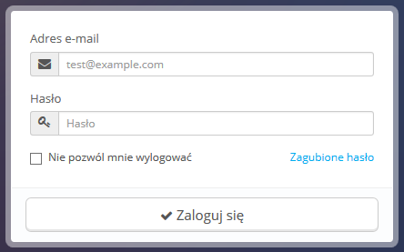
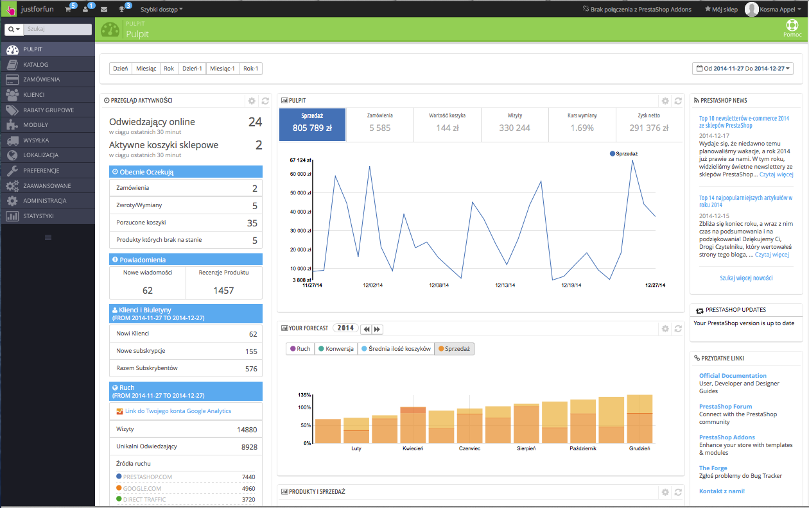

# Połączenie z panelem administracyjnym

Termin PrestaShop back-office, stosowany w tym przewodniku, oznacza panel administracyjny Twojej witryny PrestaShop. Większość czasu spędzisz właśnie w tym panelu, ponieważ wszystko, co widzi użytkownik obsługiwane jest z back-office: dodawanie/edytowanie/usuwanie produktów, obsługa przewoźników, tworzenie paczek i bonów zakupowych, utrzymywanie kontaktu z klientami, udoskonalanie sklepu itd.\
W trakcie procesu instalacji, ze względów bezpieczeństwa, nazwa folderu _/admin_ zmieniona zostaje na unikalną dla Twojego sklepu (na przykład /admin7809). Użyj nowej nazwy folderu, by uzyskać dostęp do back-office (przykładowo: [http://myprestashop.com/admin7890](http://myprestashop.com/admin7890)).

Nazwa jest zmieniana automatycznie przez PrestaShop. Należy uważać, aby zapamiętać nazwę folderu podczas pierwszego uruchomienia go po instalacji!

Przejdź na stronę logowania do panelu kontrolnego.

Wpisz adres e-mail i zarejestrowane hasło podczas instalacji. Kliknij przycisk „Zaloguj się”, a zostaniesz przeniesiony do pulpitu, swoistej strony powitalnej back-office.

Począwszy od tego momentu, możesz rozpocząć konfigurację sklepu i sprzedaż produktów swoim klientom.

Przeczytaj następny rozdział tego przewodnika, „Pierwsze kroki z PrestaShop 1.6”, aby zrozumieć wszystkie sekcje back-office.
