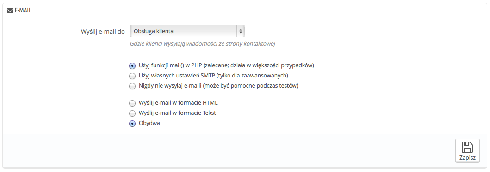
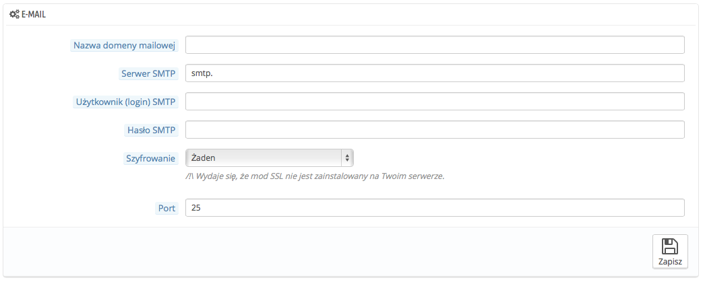
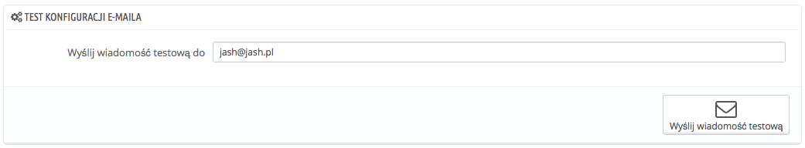

# Adres e-mail

Twój sklep wysyła wiele informacji podczas procesu rejestracji, albo realizacji zamówienia, w tym miejscu możesz skonfigurować wiadomości, które będą wysyłane.

## E-mail 

Tu decydujesz w jaki sposób maile mają być wysyłane i odbierane:

Formularz posiada 3 zestawy opcji:

* &#x20;**Wyślij e-mail do.** To ustawienie front-endu. Na koniec procesu zamówienia, klient może zostawić wiadomość obsłudze sklepu. Możesz tutaj określić do kogo będzie on wysłany z listy rozwijanej.
* Parametry e-mail: w jaki sposób techniczny e-maile są wysyłane, możesz wybrać pomiędzy trzema: Patrz poniżej po więcej informacji.
* Format e-mail: określ w jaki sposób wizualny e-maile mają być wysłane. Wybierz pomiędzy trzema: Patrz poniżej po więcej informacji.

### Konfiguracja techniczna 

Skonfiguruj PrestaShop, aby wysyłał e-maile do Twoich klientów. Sugerujemy, abyś w tej kwestii skonsultował się z Twoim dostawcą usług hostingowych, które z ustawień tutaj wykorzystać: Opcje są następujące:

* **Nigdy nie wysyłaj e-maili**. (może być pomocne podczas testów, ale jak tylko Twój sklep będzie działać nie korzystaj z tego)
* **Użyj funkcji mail() w PHP** : zalecane, działa w większości przypadków, a jeśli nie to użyj metody poniżej.
* **Użyj własnych ustawień SMTP**. W tym przypadku pojawi się poniżej nowa sekcja z polami do wypełnienia: Informacje dla tych pól powinny być dostarczone przez Twój hosting: nazwa domeny mailowej, serwer SMTP , użytkownik SMTP  etc. Upewnij się, że zapisałeś wszystkie dane tak, jak je otrzymałeś.

&#x20;Twój dostawca powie Ci też, które pola są obowiązkowe, a które nie, a także poda Ci informacje dotyczące hasła oraz szyfrowania.

&#x20;Na przykład w przypadku Gmaila (usługi oferowanej przez Google), możesz wprowadzić takie informacje:

* SMTP server: [smtp.gmail.com](http://smtp.gmail.com)
* User: [my.user.name@gmail.com](mailto:my.user.name@gmail.com) (example)
* Password: RT22UE87 (example)
* Encryption: SSL
* Port: 465

### Konfiguracja wizualna 

&#x20;Są dwa sposoby wysłania e-maili: HTML dobrze wygląda, ale nie działa wszędzie, tekst wygląda kiepsko, ale wyświetla się każdemu.

&#x20;Możesz użyć jednego z dwóch, albo obu na raz, polecana jest wersja "obydwa".

## Test konfiguracji e-maila 

&#x20;Test konfiguracji e-maila. Gdy skonfigurujesz swoje e-maile za pomocą, którejś z wymienionych metod, wprowadź swój adres e-mail do tego pola, a następnie naciśnij "Wyślij wiadomość testową"

&#x20;Następnie sprawdź swoją skrzynkę odbiorczą, żeby sprawdzić, czy otrzymałeś e-mail testowy w odpowiednim formacie. Jeśli go nie otrzymasz, uaktualnij konfigurację o prawidłowe informacje.

