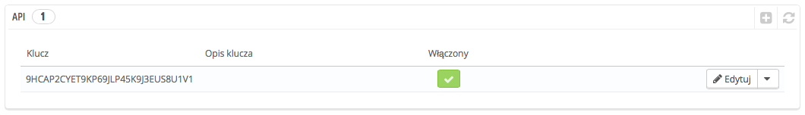
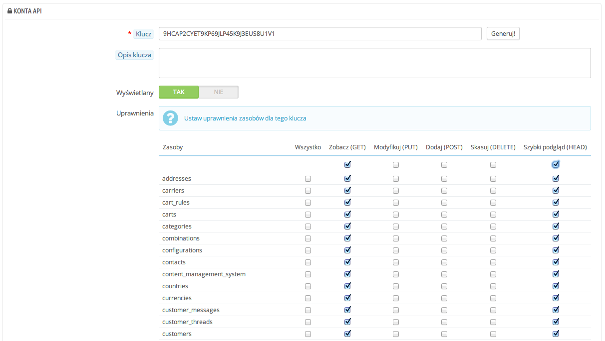
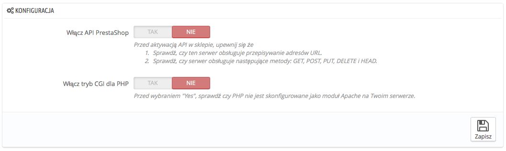

# API

Na tej stronie możesz uruchomić usługi sieciowe Twojego sklepu, dzięki czemu narzędzia firm trzecich będą miały dostęp do Twoich danych. To sprawia, że interesujące narzędzia staną się dostępne dla Ciebie, lub Twoich klientów.

API jest metodą komunikacji pomiędzy dona urządzeniami za pomocą sieci. Opiera się to na znanych zbiorach metod, formatów i praw dostępu, tak aby można było korzystać z zawartości strony za pomocą każdego autoryzowanego narzędzia. Przeczytaj więcej o tym w Wikipedii ([http://en.wikipedia.org/wiki/Web\_service](http://en.wikipedia.org/wiki/Web\_service))

Strona rozpoczyna się tabelą wymieniającą wszystkie istniejące klucze, jeśli istnieją. Klucz pozwala na przyznanie unikalnego dostępu developerowi, który może być użyty do powiązania programu ze sklepem. Dziel się nimi oszczędnie, bo raczej nie chcesz, żeby zbyt wiele osób miało dostęp do Twoich danych.

Nie każda aplikacja może połączyć się z PrestaShopem za pomocą API, możesz zadecydować, które mogą, co mogą zrobić. Każda aplikacja posiada unikalny klucz połączeniowy o określonych prawach dostępu.

## Dodawanie nowego klucza 

Naciśnij "Dodaj nowy" aby przejść do formularza kreacji klucza:

* **Klucz.** Unikalny klucz. Możesz albo utworzyć własny, albo wygenerować go naciskając przycisk "generuj". Klucze wygenerowane są zazwyczaj bezpieczniejsze, ponieważ są trudniejsze do złamania.
* **Opis klucza.** Przypomnienie dla kogo jest ten klucz i jakie daje prawa.
* **Wyświetlany.** Możesz wyłączyć klucz w każdej chwili, to pozwoli Ci na tymczasowe przyznanie praw do danych dla określonych kluczy.
* **Uprawnienia**. Nie musisz dzielić wszystkich danych z każdym kluczem, możesz wybrać pośród szerokiego wachlarza uprawnień, podzielonego na sekcje i typy dostępów. Możesz zadecydować, że niektóre aplikacje mogą mieć dostęp tylko do części danych podczas gdy inne (na przykład te związane ze zdalną obsługą sklepu) mogą mieć prawa do edycji lub usunięcia niemal wszystkiego. Ale pamiętaj wybierać mądrze!

## Konfiguracja 

Dla bezpieczeństwa upewnij się, że serwer na którym znajduje się Twój sklep wspiera połączenia SSL!

Konfiguracja jest dość prosta:

* **Włącz API PrestaShop**. Jeśli nie chcesz dawać dostępu nikomu, to po prostu nie włączaj tej opcji.
* **Włącz tryb CGI dla PHP**. tryb CGI jest specjalnym ustawieniem serwera Apache, gdzie określasz, że należy używać PHP jako skryptu CGI aniżeli jako modułu Apache. Zapytaj swojego dostawcy, które ustawienie będzie dla Ciebie lepsze.

Deweloperzy mogą znaleźć dokumentację, w jaki sposób budować narzędzia wokół API PrestaShopa na poniższej stronie: [http://doc.prestashop.com/display/PS16/Using+the+PrestaShop+Web+Service](http://doc.prestashop.com/display/PS16/Using+the+PrestaShop+Web+Service).
