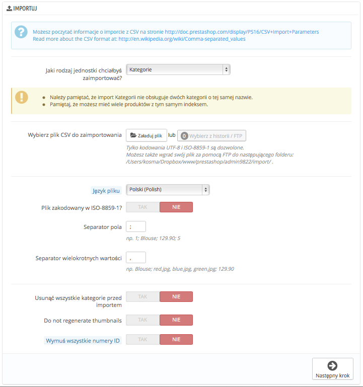
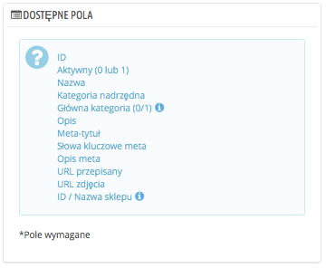
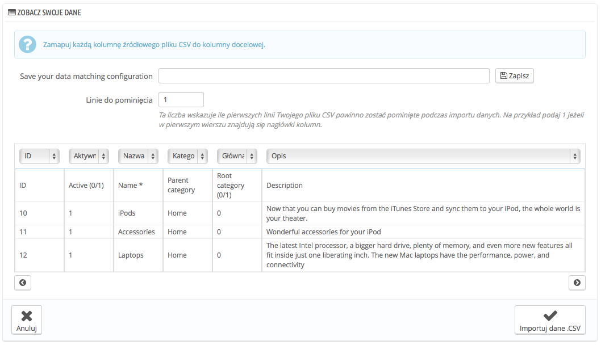
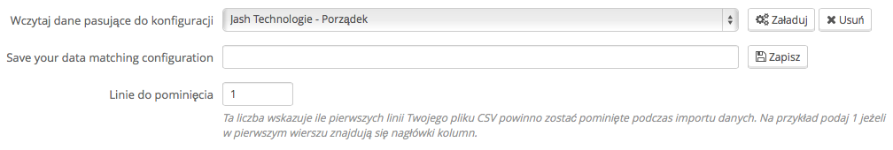

# Import CSV

Strona Import CSV pozwala Ci na spokojne wypełnienie katalogu produktów, kiedy masz dużą ilość produktów, albo zaimportować dane wyeksportowane z innego narzędzia e-commerce.

CSV jest skrótem dla "Comma-separated values". To popularny format tekstowy przydatny w importowaniu, eksportowaniu danych. Niemal każde narzędzie przetwarzania danych wspiera format CSV w wielu jego wersjach. Możesz więcej przeczytać na ten tematu w Wikipedii: [http://pl.wikipedia.org/wiki/CSV\_(format\_pliku)](http://pl.wikipedia.org/wiki/CSV\_\(format\_pliku\))



Proces importowania wymaga przygotowania i rozpoczyna się formularzem z ustawieniami podstawowymi:

**Jaki rodzaj jednostki chciałbyś zaimportować?** Jednostki to typy danych, które możesz zaimportować. "Dostępne pola" na prawo aktualizuje się, kiedy wybierzesz Jednostkę, tak abyś wiedział jaki rodzaj danych, twój plik CSV powinien zawierać.PrestaShop pozwala Ci na import następujących typów danych:

* Kategorie
* Produkty
* Kombinacje
* Klienci
* Adresy
* Producenci
* Dostawcy
* Alias
* Zlecenia dostaw
* Szczegóły zleceń/dostaw
*   **Wybierz plik CSV do zaimportowania.** możesz importować więcej niż jeden plik jednocześnie, ale upewnij się, że zawierają one ten sam typ danych.

    Możesz pobrać przykładowe pliki CSV dla każdej jednostki danych, w kolumnie po prawej. To pozwoli Ci na porównanie tych przykładowych plików z plikami, które posiadasz i dzięki temu upewnisz się, że pliki, które chcesz importować są naprawdę gotowe do importowania do PrestaShop. Te pliki znajdują się w katalogu /docs/csv\_import Twojej instalacji PrestaShop.
* **Język pliku.** Dane mogą być importowane wyłącznie dla jednej wersji językowej. Jeśli Twoje dane istnieją w różnych wersjach językowych, powinien je rozdzielić na języki.
* **Plik zakodowany w ISO-8859-1?** Domyślnie import plików powinien używać kodowania UTF-8, ale jeśli Twoje pliki korzystają z kodowania ISO-8859-1 i nie chcesz ich konwertować, to możesz zaznaczyć tę opcję.
* **Separator pola.** Nie wszystkie pliki CSV używają z przecinka jako separatora, niektóre Tabulacji, inne średnia etc. W tym miejscu możesz wskazać z jakiego separatora korzystają Twoje pliki.
* **Separator wielokrotnych wartości. Tak samo jak separator pola, wskaż ten, z którego korzystają Twoje pliki.**
* **Usunąć wszystkie \_\_\_\_ przed importem?** ta opcja usunie wszystkie istniejące dane dla wskazanej jednostki. dzięki temu możesz zacząć od nowa.
* **Użyć indeksu produktu jako klucza?** Dotyczy wyłącznie produktów. Możesz określić czy klucz produktów ma być ustalony przez Prestashopa, czy zamiast tego używać indeksu produktów jako klucza. W tym przypadku upewnij się, że istnieje klucz dla wszystkich importowanych produktów.
* **Nie regeneruj podglądu.** Dotyczy tylko kategorii i produktów. Możesz określić czy PrestaShop ma wygenerować ponownie pogląd obrazów, które są wymienione w pliku CSV.
* **Wymuś wszystkie numery ID**. Możesz albo zachować numery ID z pliku, albo wymusić automatyczne tworzenie ich podczas importu.

Podczas zmiany jednostki do importowania, zmienia się również część "Dostępne pola", gdzie wymienione są poszczególne pola specyficzne dla importu danej jednostki. Nawet jeśli import PrestaShop pomaga Ci w dopasowaniu poszczególnych pól do Twojego pliku, to powinieneś postarać się naśladować sposób nazywania pól, dzięki temu import danych będzie łatwiejszy.

Niektóre pola posiadają dodatkowe informacje pojawiające się po najechaniu na nie myszką (przedstawione za pomocą literki "i"). Zazwyczaj odnoszą się one do kwestii multisklepu albo zaawansowanego zarządzania magazynem. Przeczytaj je dokładnie, aby lepiej tworzyć pliki danych.



## Format danych <a href="#importcsv-formatdanych" id="importcsv-formatdanych"></a>

Importowane dane muszą być zachowane w pliku tekstowym, w formatowaniu CSV oraz przy zachowaniu rozszerzenia .csv. Zalecamy używanie średnika ";" jako separatora pola. Jeśli Twoje dane (jak na przykład opisy) zawierają średniki, to powinieneś je usunąć, albo wybrać inny separator pola.\
\
Możesz utworzyć plik CSV korzystając z jakiegokolwiek edytora tekstu (polecamy Notepad++ [http://notepad-plus-plus.org/](http://notepad-plus-plus.org/)), ale zalecamy też korzystanie z arkusza kalkulacyjnego i zachowywania pracy w formacie CSV. Używanie programu do arkusza kalkulacyjnego ułatwi Ci operowanie danymi wizualnie w porównaniu do pliku tekstowego. Możesz używać Microsoft Excel ([http://office.microsoft.com/en-us/excel/](http://office.microsoft.com/en-us/excel/)) albo OpenOffice Calc [http://www.openoffice.org/](http://www.openoffice.org/)\
\
Oto przykład pliku importu z listą produktów:

```
"Enabled";"Name";"Categories";"Price";"Tax rule ID";"Buying price";"On sale";"Reference";"Weight";"Quantity";"Short desc.";"Long desc";"Images URL"
1;"Test";"1,2,3";130;1;75;0;"PROD-TEST";"0.500";10;"'Tis a short desc.";"This is a long description.";"http://www.myprestashop/images/product1.gif"
0;"Test 02";"1,5";110;1;65;0;"PROD-TEST2";"0.500";10;"'Tis also a short desc.";"This is a long description too.";"http://www.myprestashop/images/product2.gif"
1;"Test 03";"4,5";150;1;85;0;"PROD-TEST3";"0.500";10;"'Tis a short desc. again";"This is also a long description.";"http://www.myprestashop/images/product3.gif"
```

Zauważ, że jest to plik zbudowany na potrzeby demonstracji, a nie zoptymalizowany pod import PrestaShop. Jeśli potrzebujesz przykładowego pliku, możesz pobrać go z "Przykładowych plików CSV".

Pierwsza linia powinna zawierać odpowiednie nazwy kolumn (podczas importu będziesz mógł ją pominąć) W każdej linii musi być ta sama ilość kolumn.

Powinieneś pamiętać o tym, że:

* W kolumnie cena będzie w domyślnej walucie Twojego sklepu
* Kategorie określone są za pomocą kluczy ID (więc je powinieneś zaimportować najpierw) i rozdzielone za pomocą przecinka (domyślnie)
* Adres URL obrazka musi być odnośnikiem absolutnym, czyli innymi słowy, musi to być pełny link z pomocą którego przeglądarka będzie mogła zlokalizować i wyświetlić zdjęcie, na przykład [http://www.myprestashop.com/images/productXXX.gif](http://www.myprestashop.com/images/productXXX.gif).
* Kodowanie tekstu powinno być UTF-8, jeśli nie jest, to może być również ISO-8859-1, tylko pamiętaj zaznaczyć odpowiednią opcję.
* Daty zapisane są w formacie ISO 8601 bez określania strefy czasowej (strefa czasowa jest określana na podstawie strefy Twojego sklepu): 2013-06-21 15:07:27.

## Przesyłanie pliku CSV <a href="#importcsv-przesylanieplikucsv" id="importcsv-przesylanieplikucsv"></a>

Jak już będziesz mieć wszystkie dane w pliku CSV, możesz przesłać je do bazy danych, używając formularza.

Możesz to zrobić na dwa sposoby:

* Za pomocą przeglądarki, naciśnij przycisk "Załaduj plik", znajdź go i zatwierdź.
* Używając programu do FTP, możesz przesłać pliku do katalogu /admin-dev/import  w PrestaShopie. Przeładuj stronę importu, a powinien pojawić się komunikat "Wybierz z historii FTP" wraz z ilością plików. naciśnij przycisk, a wyświetli się ich lista (wraz z tymi, które mogłeś przedtem importować za pomocą przeglądarki) a następnie użyj przycisku "Użyj" dla plików, które chcesz zaimportować.

Gdy pliki pojawią się w części "Zaznacz swój plik CSV" możesz przystąpić do uzupełniania reszty formularza:

1. **Jaki rodzaj jednostki chciałbyś zaimportować?** - używając menu rozwijanego wybierz odpowiednie dane.
2. **Język pliku** - jeśli docelowy język nie jest dostępny musisz zainstalować go w menu Lokalizacja-Języki.
3. **Plik zakodowany w ISO-8859-1?** - zaznacz tylko jeśli plik jest w tym kodowaniu, w przeciwnym razie powinien być w kodowaniu UTF-8.
4. **Separator pola** - w tym miejscu określ jaki Separator pola występuje w twoim pliki aby oddzielić kolumny. Podobnie zrób dla pola "Separator wielokrotnych wartości".
5. **Usunąć wszystkie kategorie przed importem** - jeśli chcesz usunąć poprzednie produkty z katalogu zaznacz odpowiednio.
6. Gdy tylko dokonasz wszystkich ustawień naciśnij przycisk "Następny krok"

Wszystkie importowane pliki są przenoszone automatycznie do katalogu /import, Jeśli menu z plikami CSV będzie zbyt zatłoczone, możesz usunąć stare importu korzystając z programu FTP.

Gdy naciśniesz "Następny krok", strona przeładuje się do narzędzia mapującego. Pomoże Ci on określić które kolumny w pliku odpowiadają tym wymaganym przez PrestaShop.



W tej tabeli zostaną przedstawione linie z twojego pliku, umieszczone pod określonymi kolumnami dopasowanymi do potrzeb PrestaShopa. To do Ciebie należy upewnienie się, że kolumny z Twoich plików CSV pasują do nagłówków kolumn. Skorzystaj z menu rozwijanych w nagłówkach, aby dopasować prawidłowo zawartość pliku do kolumn.

Zobacz to na poprzednim przykładzie pliku:

* **pierwsza kolumna** jest oznaczona jako "Enabled", PrestaShop prezentuje "ID" jako nagłówek, naciśnij menu rozwijane w tym nagłówku u wybierz "Active (0/1)".
* **druga kolumna** oznaczona jest jako nazwa, podczas gdy nagłówek wskazuje "Active (0/1)", zmień to na "name".
* itd...

Ekran nie może zawierać więcej niż 6 kolumn, więc za pomocą strzałek "<" i ">" możesz przejść do widoku pozostałych kolumn i upewnić się, że są odpowiednio dopasowane.

W naszym przykładzie używaliśmy nazw kolumn w pierwszej linii. Skoro nie chcemy ich importować, powinniśmy wpisać "1" w pole "Linie do pominięcia".

Gdy skończysz przypisywanie kolumn, naciśnij przycisk "Importuj dane .csv", a PrestaShop zacznie import danych. Gdy proces się skończy, zostaniesz przeniesiony do strony głównej, gdzie pojawi się powiadomienie o powodzeniu procesu importowania, albo o problemach, które z nim wystąpiły. W tym drugim przypadku musisz przejrzeć plik i poprawić wszelkie błędy.

### Konfiguracja mapowania <a href="#importcsv-konfiguracjamapowania" id="importcsv-konfiguracjamapowania"></a>

Mapowanie może być męczącym procesem, jeśli nie dostosowałeś przedtem pliku importu do wymaganych kolumn PrestaShopa, tym bardziej, jeśli musisz robić to często. Dlatego PrestaShop udostępnia małe narzędzie, które zachowuje obecne ustawienie mapowania, którego dokonałeś na obecnym pliku.



Narzędzie to składa się z prostego formularza u góry strony, możesz wykonać tylko 3 podstawowe czynności (tylko jedną jeśli jeszcze nie zachowałeś ustawień):

* **Zapisz:** Podaj nazwę opisową i naciśnij zachowaj, a ustawienia zostaną zachowane do listy rozwijanej, która pojawi się obok.
* **Załaduj:** Zaznacz odpowiednie ustawienia do mapowania pliku i naciśnij załaduj.
* **Usuń:** Zaznacz odpowiednie ustawienia, które chcesz usunąć i naciśnij "Usuń"
