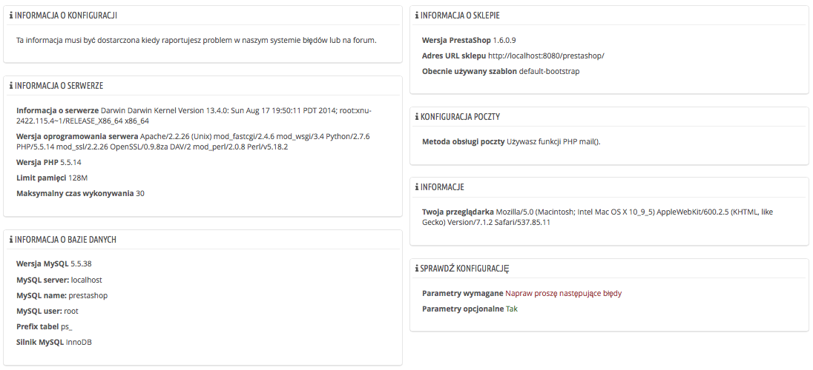

# Informacje konfiguracyjne

Ta strona służy jako przydatne przypomnienie Twoich ustawień PrestaShop: wersja, informacje o serwerze, PHP, MySQL etc. Wszystkie te informacje przydaje się w przypadku kiedy musisz wysłać raport dot. ustawień deweloperowi, administratorowi itp.

Na samym dole znajduje się część "Lista zmienionych plików"; Po instalacji PrestaShopa jedyne co się pojawi tutaj to informacja "Nie wykryto zmiany w Twoich plikach". Ale po instalacji modułów, szablonów, zaawansowanych ustawień, tutaj pojawią się informacje o dokonanych zmianach w stosunku do oryginalnej instalacji sklepu. To pomaga Ci stwierdzić jakie zmiany zostały wprowadzone do instalacji i co powinno być wzięte pod uwagę podczas aktualizacji albo migracji sklepu na inny serwer.

Nawet  przy świeżej instalacji ta sekcja może wskazywać, że brakuje plików  ".gitattributes", ".gitignore", "[CONTRIBUTING.md](http://contributing.md)", "[CONTRIBUTORS.md](http://contributors.md)" lub "[README.md](http://readme.md)". To są pliki specyficzne dla GIT i PrestaShop z nich nie korzysta, więc nie masz się czym martwić.
