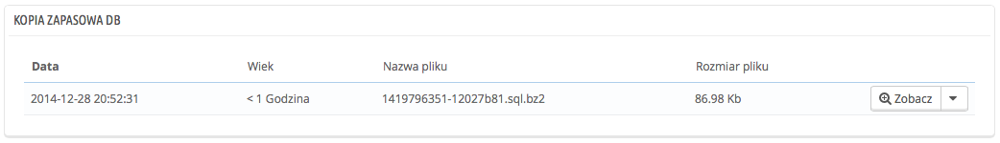
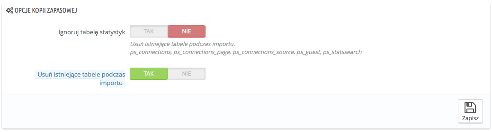

# Kopia zapasowa DB

Kopia zapasowa to czynność, która zachowuje zawartość Twojej bazy danych i zachowuje ją w bezpiecznym miejscu, abyś w każdej chwili mógł wrócić do poprzedniego stanu, jeśli aktywna baza danych zawiedzie.

Musisz dokonywać regularnych kopii zapasowych twojego sklepu, aby w przypadku błędu uruchomić ponownie sklep szybko i w jak najlepszym stanie. Baza danych zawiera wszystkie informacje z Twojego sklepu, wiele z nich niezbędnych do prawidłowego działania PrestaShopa - i to pominąwszy Twoje produkty, kategorie i inne dane, które dodałeś po instalacji.

Im częściej dokonujesz kopii zapasowej tym jesteś bezpieczniejszy. Raz w tygodniu to absolutne minimum.

Aby utworzyć kopię zapasową Twojego sklepu masz kilka rozwiązań, możesz użyć narzędzia phpMyAdmin (przystosowane dla zaawansowanych użytkowników) albo użyć narzędzi zintegrowanego z PrestaShopem na stronie "Kopia zapasowa DB"

Strona ta rozpoczyna się z dwiema informacjami, powinieneś je dokładnie przeczytać, aby mieć lepsze pojęcie o tym, co ta strona robi:

* Ostrzeżenie: ta część daje Ci serie upomnień , które powinieneś przeczytać przed każdym Backupem, część ta kończy się przyciskiem "Przeczytałem ostrzeżenie - utwórz nową kopię zapasową", który musisz nacisnąć aby utworzyć kopię zapasową. Raz utworzona pojawi się ona w nowej części: "Pobierz PrestaShop" u góry strony (naciśnij plik, aby pobrać go na swój komputer).
* Jak przywrócić kopię bazy danych w 10 łatwych krokach - przedstawia informacje o tym w jaki sposób przywrócić informacje z kopii zapasowej. Powinieneś to zapamiętać, albo zapisać gdzieś w przypadku błędu PrestaShopa, który uniemożliwi Ci dostęp do strony administracyjnej strony.

Tabela poniżej pokazuje listę wszystkich dokonanych kopii zapasowych wskazując datę utworzenia, wiek, wielkość i nazwę.

przy każdej kopii zapasowej masz możliwość wykonania dwóch czynności:

* **Zobacz** - pozwala pobrać Ci kopię zapasową.
* **Usuń** - pozwala na jej usunięcie.

Po każdym procesie tworzenia kopii zapasowej, powinieneś pobrać wygenerowany plik naciskając przycisk "zobacz", albo korzystając z linku na u góry strony. Następnie zachowaj plik w bezpiecznym miejscu, ponieważ możesz go potrzebować kiedyś.Ponadto możesz znaleźć wszystkie te kopie bezpośrednio na serwerze w katalogu  `/backup`\
Twoja baza danych zostanie zachowana w formacie `SQL` oraz pod rozszerzeniem `.sql`, oraz skompresowana za pomocą algorytmu `BZIp2` (to jeden z wariantów popularnego formatu zip [http://pl.wikipedia.org/wiki/Bzip2](http://pl.wikipedia.org/wiki/Bzip2)) i rozszerzeniem `.bz2,` co złoży się na rozszerzenie `.sql.bz2`.

## Opcje Kopii Zapasowej 

Na dole strony dostępne są dwie opcje:

*   **Ignoruj tabelę statystyk.** PrestaShop przechowuje statystyki Twojego sklepu w kilku tabelach, a ten mogą dość szybko się powiększać. I chociaż dobrze jest mieć zachowane statystyki, to jednocześnie powiększają one kopię zapasową, podczas gdy możesz być bardziej zainteresowany zachowywaniem twoim produktów, klientów, zamówień

    Domyślnie ta opcja jest wyłączona, czyli statystki są dołączane, ale jeśli masz mało miejsca na serwerze, to możesz zaznaczyć "Tak".
* **Usuń istniejące tabele podczas importu.** Podczas importu pliku kopii zapasowej, system może albo nadpisać istniejące tabele zawartością kopii zapasowej, albo usunąć najpierw istniejące tabele, a następnie załadować zawartość kopii zapasowej. Pierwsza opcja może skutkować duplikatami, dlatego też opcja ta jest domyślnie włączona.

