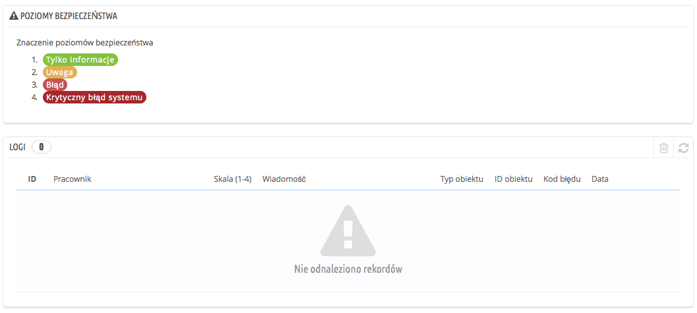
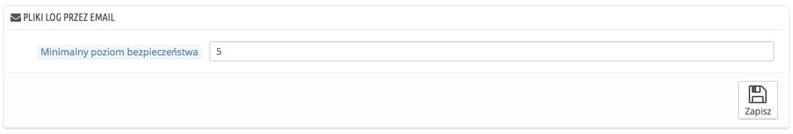

# Logi

Błędy się zdarzają. przeważnie nie jesteś ich świadom, ponieważ PrestaShop zajmuje się nimi po cichu. Ale może chciałbyś o nich wiedzieć, aby móc naprawić te, które pojawiają się nagminnie i zapewnić tym samym lepszą stabilność sklepu.

Na stronie "Logi" możesz spojrzeć na błędy PHP, które pojawiają się w Twoim sklepie. Wyświetlają się one w tabeli i są oznaczone za pomocą 4 poziomów:

* **1: Tylko informacje**. Informacyjne, które wynikają z napotkania błędu, albo są naturalnym wynikiem działania skryptów.
* **2: Uwaga**. Ostrzeżenia, które nie zatrzymały działania skryptów
* **3: Błąd**.
* **4: Krytyczny błąd systemu**. To określa poważne błędy, na przykład z alokacją pamięci. Wykonanie skryptu nie powiodło się.

Więcej o błędach możesz przeczytać tutaj: [http://www.php.net/manual/en/errorfunc.constants.php](http://www.php.net/manual/en/errorfunc.constants.php).

## Pliki Log przez mail: 

Poziomy błędów służą również jako wartości dla funkcji "Pliki Log przez e-mail".

PrestaShop dodaje 5 wartość, który wskazuje, że administrator nie chce otrzymywać żadnych powiadomień, ani o poważnych, ani o drobnych błędach.

Narzędzie logowania pozwala na otrzymywanie maila, kiedy nastąpi błąd. Powiadomienia są wysyłane do właściciela sklepu mailem i możesz ustalić poziom ważności według której powinieneś otrzymać takie wiadomości:

* 1 - jeśli chcesz wiedzieć o wszystkim, nawet najmniejszym błędzie.
* 3 - jeśli chcesz być powiadamiany o problemach i błędach.
* 4 - jeśli chcesz wiedzieć o poważnych błędach.
* 5 - domyślnie, oznacza, że żadne powiadomienie nie zostanie wysłane.
