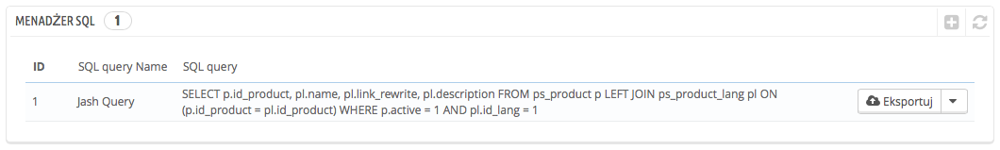
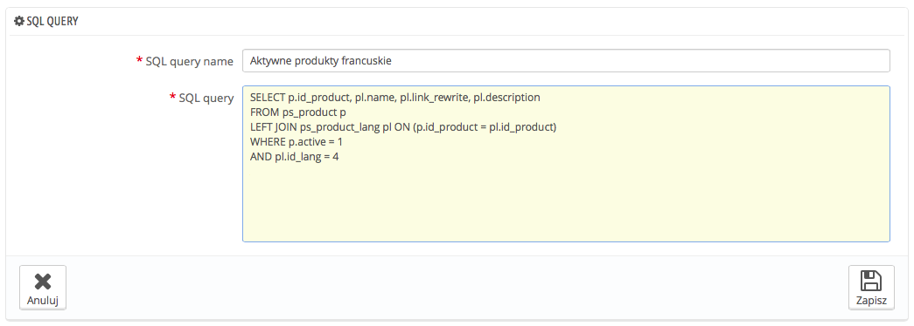
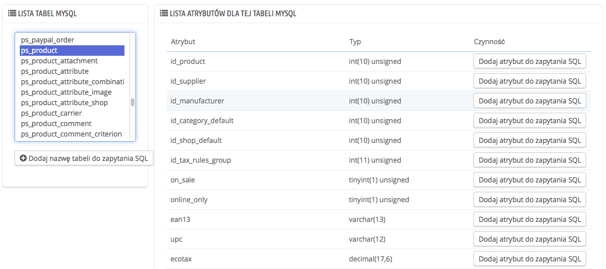
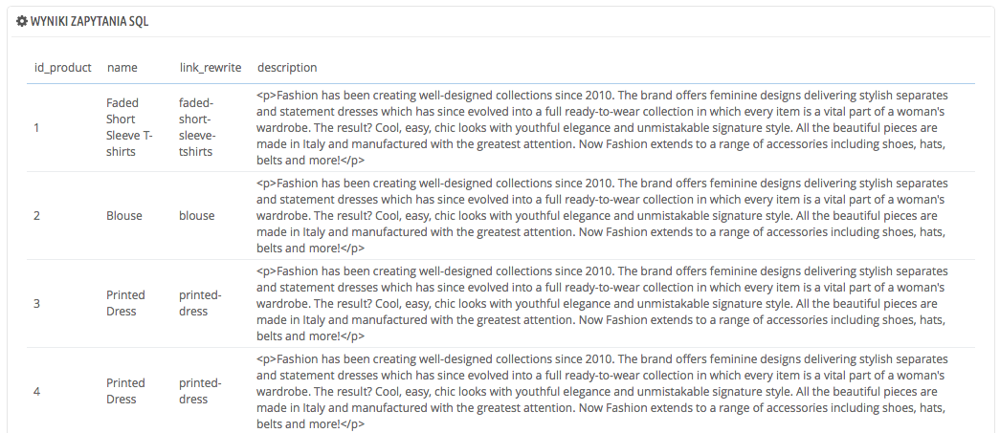
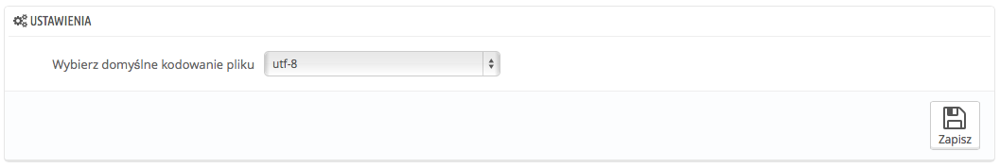

# Menadżer SQL

Jest to kompleksowe narzędzie zarezerwowane dla obsługi technicznej, albo osób, które umieją poruszać się po bazie danych za pomocą języka SQL. Pomimo skomplikowania, narzędzie to może być niezwykle użyteczne dla tych, którzy je opanują.



To narzędzie pozwala Ci na wykonywanie zapytań bezpośrednio na bazie danych PrestaShop i zachowywać je do ponownego użycia w każdej chwili później. PrestaShop przedstawia dane na wiele sposobów, ale może będziesz chcieć mieć do czynienia z czystymi danymi zamiast przejrzystego interfejsu PrestaShop. Korzystając z Menadżera SQL możesz dokonywać kompleksowych zapytań, które utworzą tabele wyników jakich potrzebujesz.

Na przykład używając tego narzędzia i znajomości SAL, mógłbyś utworzyć zapytanie, które dawałoby Ci zaktualizowaną listę użytkowników zapisanych do Twojego Newslettera; albo uzyskiwać listę produktów w formacie HTML, lub CSV.Ze względów bezpieczeństwa możesz korzystać wyłącznie z polecenia SELECT, wszystkie inne jak UPDATE, DELETE, CREATE TABLE, DROP, są zablokowane. Także klucze dostępowe i hasła są ukryte (\*\*\*\*\*\*\*\*\*\*\*).

## Tworzenie nowego zapytania <a href="#menadzersql-tworzenienowegozapytania" id="menadzersql-tworzenienowegozapytania"></a>

Jak zwykle przycisk "Dodaj nowy" prowadzi do formularza, który posiada dwa główne pola:

* **Nazwa.** Podaj nazwę zapytania, która będzie dostatecznie opisowa.
* **Zapytanie SQL.** Tu wpisz zapytanie, możesz spokojnie używać JOIN i innych funkcji.



Ponadto "Lista tabel MySQL" pomoże Ci odkryć strukturę bazy danych i ułatwi Ci tworzenie zapytań. Dostarcza Ci poręczny selektor wszystkich dostępnych tabel. Zaznacz tabelę, a PrestaShop pokaże Ci jej atrybuty u typy, następnie naciśnij "Dodaj atrybut do zapytania SQL" a podana nazwa zostanie wysłana do pola zapytania.



Zachowanie zapytania przeniesie Cię z powrotem na stronę główną.

## Rozpoczynanie zapytania <a href="#menadzersql-rozpoczynaniezapytania" id="menadzersql-rozpoczynaniezapytania"></a>

Każde zachowane zapytanie w tabeli posiada 4 przyciski:

* **Eksportuj.** wykonuje zapytanie i pozwala pobrać wyniki w pliku .CSV
* **Zobacz.** Wykonuje zapytanie i wyświetla jego wyniki w tabeli, bezpośrednio w PrestaShopie.
* **Edytuj.** Możesz edytować zapytanie tak często, jak tylko potrzebujesz, aby osiągnąć lepsze rezultaty.
* **Usuń.** Jeśli nie potrzebujesz już zapytania (albo ono po prostu nie działa) możesz je usunąć naciskając ten przycisk i potwierdzając wybór.



## Ustawienia <a href="#menadzersql-ustawienia" id="menadzersql-ustawienia"></a>

W tej chwili istnieje tylko jedno ustawienie:

* **Wybierz domyślne kodowanie pliku.** Możesz określić kodowanie pliku dla pliku CSV. Domyślnie jest polecane UTF-8, albo możesz wybrać ISO-8859-1, jeśli tego potrzebujesz.



## Przykładowe zapytania <a href="#menadzersql-przykladowezapytania" id="menadzersql-przykladowezapytania"></a>

Możliwości są nieograniczone, ale tutaj przedstawimy kilka z nich, abyś pomóc budować zapytania samodzielnie.

### Wyświetlanie wszystkich adresów e-mail klientów <a href="#menadzersql-wyswietlaniewszystkichadresowe-mailklientow" id="menadzersql-wyswietlaniewszystkichadresowe-mailklientow"></a>

```
SELECT email FROM ps_customer
```

### Wyświetlanie wszystkich adresów e-mail klientów, którzy zapisali się do newslettera <a href="#menadzersql-wyswietlaniewszystkichadresowe-mailklientow-ktorzyzapisalisiedonewslettera" id="menadzersql-wyswietlaniewszystkichadresowe-mailklientow-ktorzyzapisalisiedonewslettera"></a>

```
SELECT email
FROM ps_customer
WHERE newsletter = 1
```

### Wyświetlanie wszystkich produktów, które są aktywne, a ich opis jest po francusku  (id\_lang = 4) <a href="#menadzersql-wyswietlaniewszystkichproduktow-ktoresaaktywne-aichopisjestpofrancusku-id_lang-4" id="menadzersql-wyswietlaniewszystkichproduktow-ktoresaaktywne-aichopisjestpofrancusku-id_lang-4"></a>

```
SELECT p.id_product, pl.name, pl.link_rewrite, pl.description
FROM ps_product p
LEFT JOIN ps_product_lang pl ON (p.id_product = pl.id_product)
WHERE p.active = 1
AND pl.id_lang = 4
```

### Wyświetlanie wszystkich zamówień ze szczegółami dotyczącymi dostawcy, waluty, opłaty, całości kwoty i daty. <a href="#menadzersql-wyswietlaniewszystkichzamowienzeszczegolamidotyczacymidostawcy-waluty-oplaty-caloscikwot" id="menadzersql-wyswietlaniewszystkichzamowienzeszczegolamidotyczacymidostawcy-waluty-oplaty-caloscikwot"></a>

```
SELECT o.`id_order` AS `id`,
	CONCAT(LEFT(c.`firstname`, 1), '. ', c.`lastname`) AS `Customer`,
	ca.`name` AS `Carrier`,
	cu.`name` AS `Currency`,
	o.`payment`, CONCAT(o.`total_paid_real`, ' ', cu.`sign`) AS `Total`,
	o.`date_add` AS `Date`
FROM `ps_orders` o
LEFT JOIN `ps_customer` c ON (o.`id_customer` = c.`id_customer`)
LEFT JOIN `ps_carrier` ca ON (o.id_carrier = ca.id_carrier)
LEFT JOIN `ps_currency` cu ON (o.`id_currency` = cu.`id_currency`)
```
