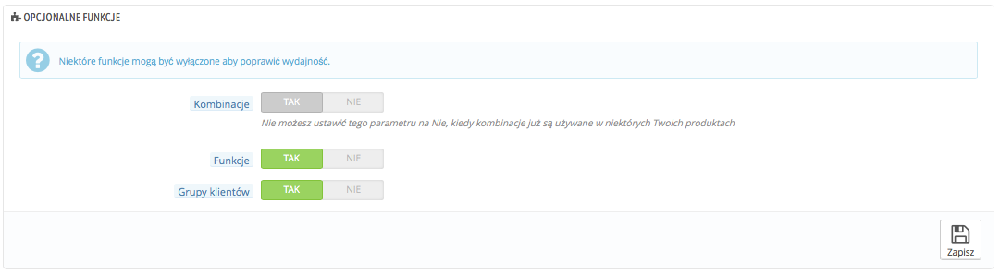

# Wydajność

Ta strona zawiera narzędzia i porady, które mogą podnieść wydajność Twojego sklepu od strony serwera, a nie sprzedaży.

## Smarty <a href="#wydajnosc-smarty" id="wydajnosc-smarty"></a>

Smarty to nazwa języka szablonu z którego korzysta PrestaShop, możesz dowiedzieć się o nim więcej na stronie [http://www.smarty.net/](http://www.smarty.net/).


Są tu dwie opcje do wyboru:

* **Kompilacja szablonu.** Dla lepszej wydajności Front-Endu, Presta szop zapisuje pliki HTML w pamięci podręcznej.\

  * **Nigdy nie kompiluj ponownie plików szablonu.** Normalne zachowanie, strony HTML są kompilowane i zapisane i wyświetlone takimi, jakie są, nawet jeśli w międzyczasie szablon zmienił się.
  * **Skompiluj ponownie szablony jeżeli pliki zostały zaktualizowane.** PrestaShop jest w stanie zobaczyć kiedy szablon się zmienił..
  * **Wymuś kompilację.** Włącz to tylko wtedy, kiedy edytujesz szablon i musisz widzieć zmiany za każdym razem, gdy przeładujesz stronę.
* **Pamięć podręczna.** Ta opcja pozwala na wyłączenie pamięci podręcznej. Wyłącz to tylko w przypadku jeśli sprawdzasz szablon, albo moduł dla PrestaShop. W przeciwnym razie zostaw to włączone.

## Tryb debugowania <a href="#wydajnosc-trybdebugowania" id="wydajnosc-trybdebugowania"></a>

**Nowość w wersji 1.6.**

W trybie debugowania, możesz zmienić wpływ niektórych funkcji na działanie PrestaShop, aby ułatwić odnalezienie źródła problemu.


* **Wyłącz moduły nie od PrestaShop**. Moduły PrestaShop są bardzo szczegółowo testowane i nie powinny powodować żadnych problemów. Jeśli to włączysz, to będziesz wstanie określić czy problem bierze się z rdzenia PrestaShopa, czy z modułów firm trzecich.
* &#x20;**Wyłącz wszystkie nadpisywania.** Wiele modułów w PrestaShopie może być nadpisanych. Jeśli włączysz tę opcję, to nadpisywanie będzie wyłączone i będziesz w stanie stwierdzić, czy problem pochodzi z kodu źródłowego PrestaShop, lub z nadpisania rozszerzeń firm trzecich.

## Opcjonalne funkcje <a href="#wydajnosc-opcjonalnefunkcje" id="wydajnosc-opcjonalnefunkcje"></a>

Niektóre funkcje PrestaShopa mogą być wyłączone, jeśli z nich nie korzystasz, ponieważ mogą one spowalniać Twój sklep.

Jeśli Twój katalog używa, jakiejś z tych funkcji, nie będziesz mógł, jej wyłączyć, dopiero gdy usuniesz te produkty, będziesz mógł to zrobić.

Możesz wyłączyć następujące funkcje:



* **Kombinacje** - pozwalają Ci na posiadanie całej linii produktów z jednego produktu, na podstawie różnic w wielkościach, kolorach, pojemnościach etc
* **Funkcje** - Pozwalają Ci na wyświetlanie specyficznych informacji dotyczących produktów, jak waga, materiał, kraj pochodzenia etc.
* **Grupy klientów** - pozwala Ci na tworzenie grup docelowych klientów, aby nadawać im przywileje, rabaty etc.

## Funkcjonalność CCC (combine, compress and cache. Czyli łącz, kompresuj i zapisuj w pamięci podręcznej). <a href="#wydajnosc-funkcjonalnoscccc-combine-compressandcache.czylilacz-kompresujizapisujwpamiecipodrecznej-." id="wydajnosc-funkcjonalnoscccc-combine-compressandcache.czylilacz-kompresujizapisujwpamiecipodrecznej-."></a>

CCC jest zestawem narzędzi ukierunkowanych na zwiększenie wydajności czasu ładowania stron i zmniejszanie obciążania serwera

Narzędzia te łączą pliki, w jedne większy, co sprawia, że jest ich mniej do pobrania, następnie kompresują plik używając algorytmu Zip, co przyspiesza pobieranie, a w końcu zapisują je w pamięci podręcznej serwera, aby ten nie musiał przechodzić tego procesu za każdym razem, gdy strona jest ładowana, co zmniejsza obciążenie serwera.

Twój szablon musi być kompatybilny PrestaShop w wersji 1.4 co najmniej, w przeciwnym razie CCC nie zadziała tak jak powinno. Dlatego też większość jego opcji jest wyłączona domyślnie.


* **Inteligentna pamięć podręczna dla CSS.** pliki CSS opierają się na tekście, wiec można je swobodnie kompresować
* **Inteligentna pamięć podręczna dla JavaScript.** Pliki JavaScript opierają się także na tekście, ale bywają z tym problemy, lepiej przetestuj dobrze wszystko zanim to włączysz.
* **Minimalizuj HTML** Kod wygenerowany przez Smarty może być zazwyczaj zminimalizowany, to oznacza, że PrestaShop usunie zbędne puste miejsca w pliku, co zredukuje rozmiary plików o kilka bajtów. To jest dość bezpieczna funkcja.
* **Kompresuj JavaScript zawarty w plikach HTML.** Niektóre szablon posiadają kod JavaScript w sobie; Możesz albo go zostawić, albo o skompresować. Ponownie jak w przypadku kompresji JavaScript, sprawdź wszystko dobrze, zanim to włączysz.
* **Optymalizacja Apache.** To ustawienie zmieni konfigurację Twojego serwera, aby poprawić wydajność CCC.

## Serwery Mediów (używaj tylko z CCC) <a href="#wydajnosc-serwerymediow-uzywajtylkozccc" id="wydajnosc-serwerymediow-uzywajtylkozccc"></a>

Ta część pozwala Ci przekierować część twojego ruchu (pliki obrazów, zdjęć, filmów na przykład) na inne serwery pod Twoją kontrolą, poprzez inne domeny, czy poddomeny - najczęściej pliki są przechowywane na CDN (Content Delivery Network). Domyślnie PrestaShop wspiera 3 takie serwery.


Podawanie adresu domeny Twojego sklepu nie jest sposobem na poprawienie wydajności. łatwo jest jednak utworzyć Serwer mediów i korzyści z jego założenia są niemal natychmiastowe. Oto jak to zrobić:

1. Załóż konto na nowym serwerze, najlepiej takim, który specjalizuje się w dystrybuowaniu zawartości: Bardzo popularne jest Akamai ([http://www.akamai.com/](http://www.akamai.com/)), Amazon ( [http://aws.amazon.com/](http://aws.amazon.com/)) albo CloudFlare ([http://www.cloudflare.com/](http://www.cloudflare.com/)), możesz także zapytać Twojego dostawcę czy nie oferuje tej usługi.
2. Skopiuj pliki medialne na swój serwer host. To oznacza, że serwer CDN musi posiadać dokładną kopię katalogów z Twojego serwera głównego: `/img, /themes,` oraz `/modules`.\
   Pamiętaj, że te katalogi muszą być zawsze zsynchronizowane, nawet gdy dodajesz nowy produkt, czy aktualizujesz swój szablon, serwer CDN musi zawierać aktualną wersję tych plików.
3. Gdy ustawisz serwer CDN, dodaj jego adres podany przez hosta CDN w pierwsze pole "Serwer mediów #1", jeśli host  pozwala na więcej to również je dodaj.

Jeśli chciałbyś, żeby Twoje pliki były wizualnie pobierane w ramach nazwy Twojej domeny aniżeli z nieznanego adresu, możesz zrobić co następuje:

1. Stworzyć poddomenę dla domeny Twojej strony na przykład:  [http://cdn1](http://cdn1). [Twojsklep.pl](http://twojsklep.pl) (sposób nazywania zależy od Twojego dostawcy hostingu).
2.  Umieść plik .htaccess na subdomenie, ten plik powinien zawierać jedną linię:

    ```
    Redirect Permanent / http://cdn-adress.com
    ```

    \
    Zamień [`http://cdn-`](http://cdn-)`adress`.com n a ten Twojego serwera CDN. W ten sposób stworzysz automatyczne przekierowanie z Twojej domeny na serwer CDN.
3. Gdy tylko poddomena jest utworzona, dodaje ją do pierwszego pola "Serwer mediów #1", jeśli host  pozwala na więcej to również je dodaj.

Nawet jeśli nie posiadasz serwera CDN, możesz używać funkcji serwera mediów, aby przyspieszyć ładowanie plików:

1. Skonfiguruj swój serwer jako wirtualne subdomeny, jak na przykład: [`images1.example.com`](http://images1.example.com), [`images2.example.com`](http://images2.example.com), oraz [`images3.example.com`](http://images3.example.com),  wskazujące na główny katalog PrestaShop.
2. Na stronie "Wydajność" dodaj je do listy Serwerów mediów.

Gdy je umieścisz PrestaShop będzie ładować zdjęcia z każdej z poddomen i w rezultacie przeglądarka będzie otwierać więcej połączeń z serwerem i wyniki czego wszystko będzie ładować się szybciej.

## Szyfrowanie <a href="#wydajnosc-szyfrowanie" id="wydajnosc-szyfrowanie"></a>

Szyfrowanie oznacza zapisywanie danych w sposób uniemożliwiający ich odczytanie dla niepożądanych oczu, takich jak szczegółowe informacje o kontach klientów, ale też Twoich.


W tym miejscu możesz wybrać algorytm szyfrowania:

* **Użyj biblioteki mcrypt i algorytmu Rijndael** - Wybór domyślny, ale wymaga zainstalowania rozszerzenia Mcrypt dla PHP.
* **Korzystaj z wbudowanej klasy BlowFish. L**epsza jakość bezpieczeństwa, ale jest to rozwiązanie wolniejsze. Twoi klienci mogą cenić większe bezpieczeństwo, ale nie koniecznie muszą lubić czas oczekiwania na załadowanie informacji - chociaż dla wielu różnica w czasie nie jest szczególnie odczuwalna.

Wybierz rozważnie, ponieważ przy zmianie wszystkie ciasteczka (cookies) są wymazywane.

## Cache <a href="#wydajnosc-cache" id="wydajnosc-cache"></a>

Pamięć podręczna serwera przechowuje statyczną wersję twojej dynamicznej strony, aby udostępniać ją Twoim klientom w sposób szybki i bezpieczny.

Zazwyczaj należy sprawdzić swojego dostawcę usług hostingowych odnośnie tych ustawień, ponieważ wymaga to specjalnych ustawień na serwerze.

Ta część pozwala Ci włączyć zapisywanie do pamięci podręcznej a następnie określić metodę zapisywania:


* **System plików.** Pliki statyczne są przechowywane tak jak każdy inny plik na twoim serwerze. Pole ustawione jest na 1, co wskazuje na głębokość zagnieżdżeń. Zmień tę wartość tylko jeśli wiesz co robisz.
* **Memcached.** dystrybuowany system kaszowania, bardzo efektywny, ale musisz upewnić się, że Twój serwer/hosting go wspiera, najczęściej jeśli Twoja konfiguracja PHP wspiera rozszerzenie Memcached PECL, możesz śmiało z tego korzystać (możesz pobrać to z [http://pecl.php.net/package/memcache](http://pecl.php.net/package/memcache)) Możesz dodać serwery Memcached naciskając na "Dodaj serwer".
* **APC**. Jest to darmowe narzędzie, otwarte i sprawne, ale działa tylko z jednym serwerem  - co zdarza się w przypadku jeśli dopiero rozpoczynasz swój biznes. I znów sprawdź dostępność rozszerzenia na swoim serwerze: [http://pecl.php.net/package/APC](http://pecl.php.net/package/APC).
* **Xcache** - jest nowym systemem kaszowania, który jest specyficzny dla serwerów Lighttpd, dlatego też nie będzie działać na popularnym serwerze Apache, przeczytaj więcej na temat tutaj: [http://xcache.lighttpd.net/](http://xcache.lighttpd.net/).
