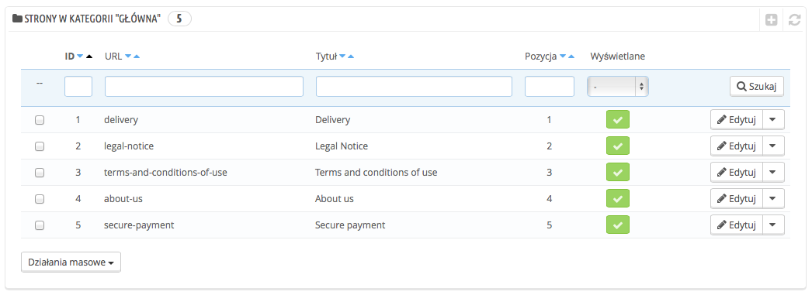
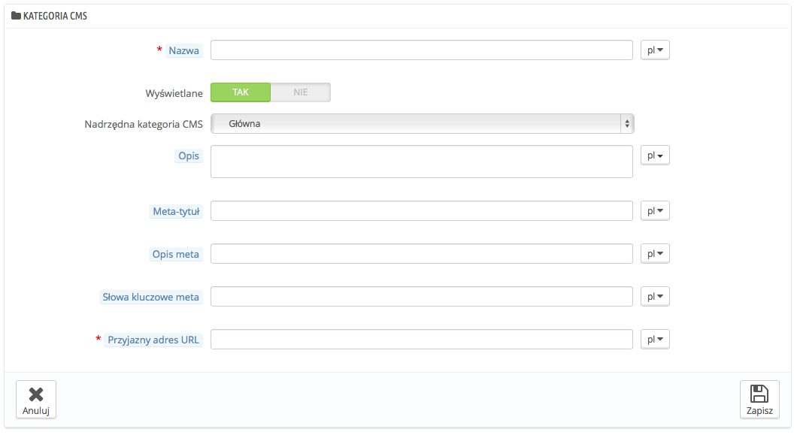
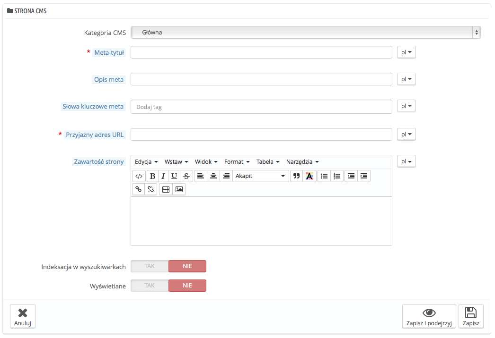

# CMS - Ustawienia

PrestaShop pozwala Ci na proste tworzenie zawartości stron za pomocą narzędzia CMS/ Strony utworzone w ten sposób będą dostępne dla klientów w bloku "Informacyjnym" na Twojej stronie głównej i w menu strony. Możesz dodać stronę CMS do górnego menu korzystając z modułu "Górnego menu"(,który możesz skonfigurować na stronie "Moduły").

Strona CMS przedstawia wszystkie strony , które zostały utworzone w Twoim sklepie dla aktualnie wybranej kategorii (domyślnie strona główna jest jedyną kategorią).

Nie zapomnij stworzyć każdej strony w każdym z języków Twojego sklepu, naciśnij na menu rozwijane określające język, aby zmienić język.

## Tworzenie nowej kategorii CMS 

Naciśnij przycisk "Dodaj nowy", aby dodać nową kategorię, a właściwie, podkategorię katalogu głównego "Home", możesz utworzyć tyle kategorii, ile potrzebujesz.

Formularz jest dość prosty:

* **Nazwa.** Powinna być jasna i krótka
* **Wyświetlane.** Określ, czy kategoria i strony są dostępne publicznie, czy ukryte.
* **Nadrzędna kategoria CMS.** Kategoria, pod która nowa kategoria ma być umieszczona. Domyślnie to kategoria "główna", możesz mieć nieograniczoną liczbę podkategorii.
* **Opis.** Wypełnij to we wszystkich językach, ponieważ niektóre szablonu mogą wyświetlać tę informację klientom.
* **Meta-tytuł.** Nazwa kategorie wyświetlana w przeglądarce.
* **Opis meta.** Opis używany do opisania zawartości dla wyszukiwarek internetowych
* **Meta keywords.** Used by search engines to understand what type of information the category is composed of.
* **Przyjazny adres URL.** Ułatwia wyszukiwarkom indeksowanie zawartości strony, a Twoim klientom zrozumienie, co znajdą w danej kategorii. Pole zostanie automatycznie wypełnione, kiedy podasz nazwę kategorii, ale nadal możesz je zmodyfikować ręcznie.

Kiedy zachowasz kategorię, PrestaShop przeniesie Cię do poprzedniej strony z tabelą, tym razem jednak wykorzystując stworzoną kategorię jako bazę. Dlatego nie zobaczysz tutaj żadnej podkategorii ani podstron, dopóki ich nie utworzysz.\
Aby przejść do kategorii głównej, naciśnij na "Główną" w ścieżce aktualnej kategorii. Możesz następnie modyfikować strony z katalogu głównego i przenosić je do nowej kategorii, jeśli chcesz.

Aby utworzyć podkategorię, po prostu zmień kategorię z opcji "Główna" na inną kategorię główną pod którą chcesz utworzyć kategorię.

## Tworzenie nowej strony CMS 

Naciśnij "Dodaj nowy", aby wyświetlić formularz:

* **Kategoria CMS.** Domyślnie to kategoria główna Twojego sklepu; Jeśli chcesz umieścić ją gdzie indziej, to musisz najpierw stworzyć tę kategorię.
* **Meta tytuł.** Nazwa strony, jaka wyświetli się w przeglądarce.
* **Opis Meta.** Opis używany do opisania zawartości dla wyszukiwarek internetowych
* **Słowa kluczowe meta.** Wykorzystywane przez wyszukiwarki dla zrozumienia typu informacji, z których składa się kategoria.
* **Przyjazny adres URL.** Ułatwia wyszukiwarkom indeksowanie zawartości strony, a Twoim klientom zrozumienie, co znajdą w danej kategorii. Pole zostanie automatycznie wypełnione, kiedy podasz nazwę kategorii, ale nadal możesz je zmodyfikować ręcznie.
* **Zawartość strony**. To edytor za pomocą którego stworzysz zawartość strony, możesz umieścić dowolny tekst, lub zdjęcie, a nawet video.
* **Indeksacja w wyszukiwarkach.** Określ czy chcesz, aby wyszukiwarki rejestrowały tę stronę, czy nie.
* **Wyświetlane.** Możesz wybrać, czy chcesz opublikować stronę i wyświetlać ją użytkownikom, czy może chcesz pozostawić ją ukrytą, aby dokonać na niej odpowiednich zmian i poprawek.

Gdy wypełnisz wszystkie pola, możesz zapisać stronę, albo nacisnąć "Zapisz i podejrzyj", aby zachować stronę i automatycznie ją wyświetlić, aby zobaczyć jej wygląd.
