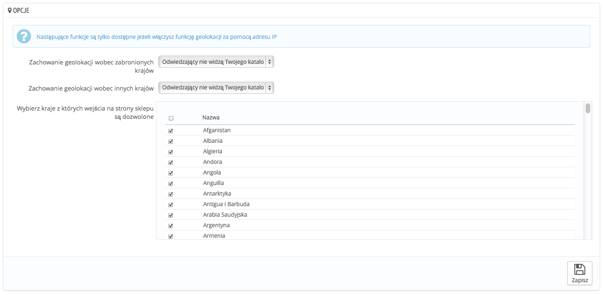

# Geolokalizacja

Geolokalizacja jest używana do wykrycia lokalizacji osoby odwiedzającej Twój sklep za pomocą adresu IP i innych narzędzi. Jednym z przykładowych użyć może być na przykład blokowanie klientów z niektórych krajów.\
Aby skorzystać z tej funkcji, należy najpierw pobrać specjalny plik: [http://geolite.maxmind.com/download/geoip/database/GeoLiteCity.dat.gz](http://geolite.maxmind.com/download/geoip/database/GeoLiteCity.dat.gz)., który zawiera dane geolokalizacyjne miast i ich dokładnego położenia. Po pobraniu pliku należy go rozpakować do katalogu:  `/tools/geoip/` w Twoim PrestaShopie.\
Gdy plik będzie na miejscu, włącz "Geolokalizacja za pomocą adresu IP" i gotowe.\
\

## Opcje 

Możesz wybrać, które kraje mogą odwiedzać Twój sklep (domyślnie wszystkie) oraz określić zachowania PrestaShopa odnośnie blokady/dostępów innych krajów. Możesz wybrać pomiędzy trzema opcjami:

* Odwiedzający nie mogą przeglądać Twojego katalogu.
* Odwiedzający mogą przeglądać katalog, ale nie mogą dokonać zakupu. W wyniku czego, twój sklep jest w trybie katalogowym.
* Wszystkie opcje katalogu są dostępne (tylko dla niezabronionych krajów)

Możesz zaznaczyć/odznaczyć wszystkie kraje naciskając na pole u góry listy. Gdy wybierasz kraje, które będą miały dostęp do sklepu, upewnij się, że nie blokujesz któregoś przez pomyłkę, ponieważ możesz tracić potencjalnych klientów.

## Biała lista adresów IP 

Ta cześć pozwala Ci na odblokowanie dostępu dla wybranych adresów IP. Może być to przydatne w przypadku ataków, botów i spamu, Lista od razu wypełniona jest znanymi, dobrymi adresami IP. Możesz dodać tyle, ile potrzebujesz, po jednym w linii, a na końcu naciśnij "Zapisz".

