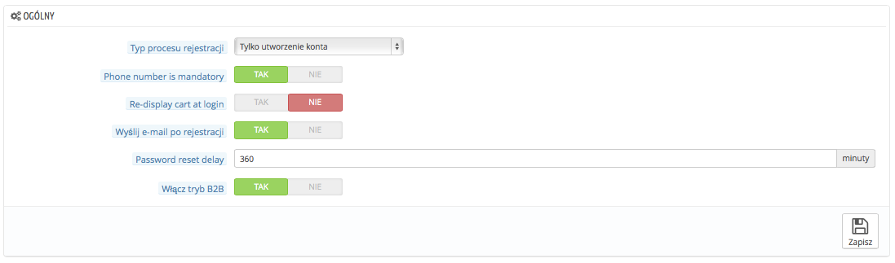

# Klienci - Ustawienia

Strona "Klienci" dostarcza kilku specyficznych opcji związanych z klientami, przede wszystkim także tryb B2B.

* **Typ procesu rejestracji.** Możesz pozwolić odwiedzającym na utworzenie konta bez wymagania od nich podania adresu, albo zmuszania ich do podania adresu podczas tworzenia konta.Pierwsza opcja pozwala na szybsze utworzenie konta, co jest świetne, ale będzie wymagać dodatkowego okna podczas zatwierdzania zamówienia, co może klientów zniechęcić.\
  &#x20;Z drugiej strony, druga opcja wydłuża proces rejestracji, ale podczas składania zamówienia adres będzie już wypełniony i pozostanie jedynie zatwierdzenie zamówienia.
* **Numer telefonu jest wymagany.** Możesz wymagać od klientów podania numeru telefonu. Posiadanie numeru telefonu klientów może być bardzo cenne dla Ciebie, ponieważ pozwala na bezpośredni kontakt, ale niektórzy klienci są niechętni podawaniu takiego rodzaju informacji. Jeśli zaznaczysz "nie", pole "Numer telefonu" nadal będzie dostępne w formularzu, ale nie będzie obowiązkowe.
* **Wyświetl ponownie koszyk po zalogowaniu**. Jeśli klient miał wypełniony koszyk, który nie został dokończony, możesz go wyświetlić po ponownym zalogowaniu.
* **Wyślij e-mail po rejestracji.** PrestaShop może wysyłać e-mail klientom po ich rejestracji, wiadomość z ogólnymi informacjami dotyczącymi ich konta.
* **Przerwa między resetami hasła.** Możesz określić limit częstotliwości w czasie, kiedy klient może dokonać generacji nowego hasła do jego konta. Domyślnie ustawione jest na 360 minut, czyli 6 godzin.
* **Włącz tryb B2B.** Tryb B2B wzbogaca twój sklep o kilka przydatnych funkcji. Klienci nie są już traktowani jako pojedynczy klienci, ale jako firmy i dlatego pojawiają się dodatkowe opcje:\

  * Profil klienta posiada dodatkowe pola powiązane z informacjami biznesowymi (Numer VAT etc),
  * Ceny mogą być ukryte dla niektórych grup.
  * Cenami można zarządzać na zasadzie indywidualnych, albo grupowych, czy za pomocą podziału na kategorie.
  * Faktury mogą być generowane ręcznie
  * itd.
