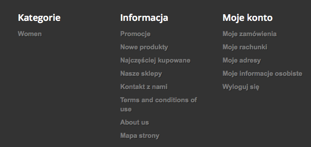
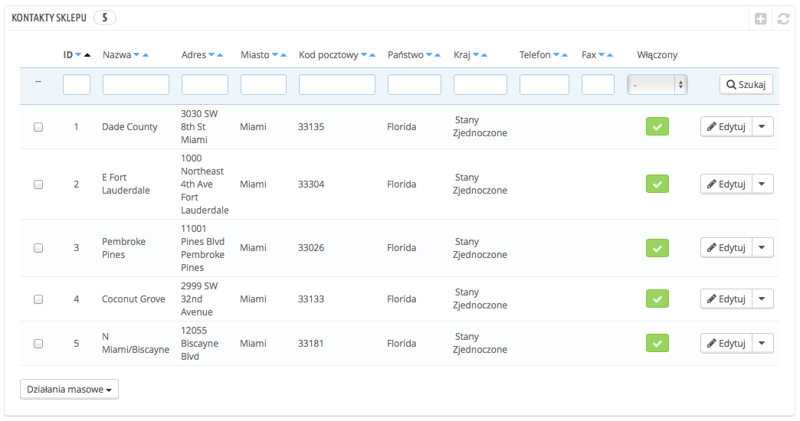
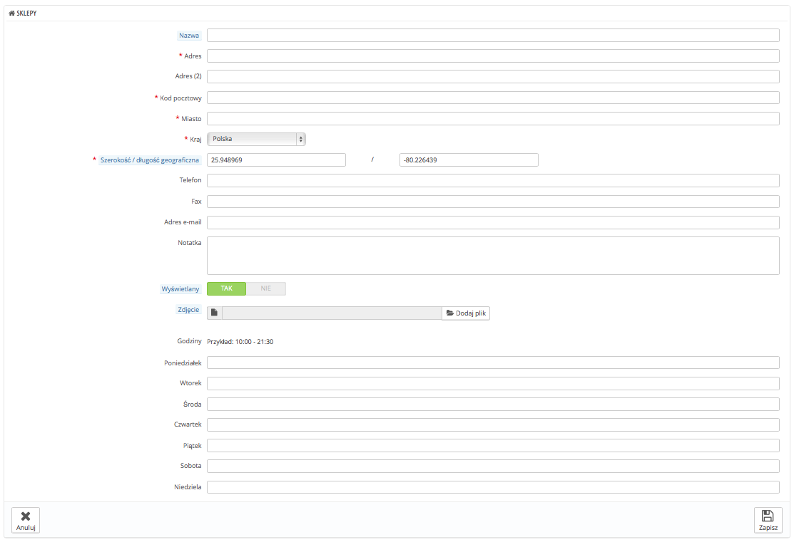
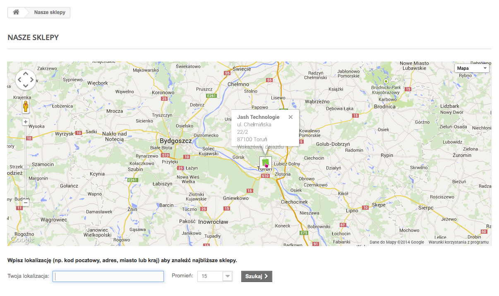
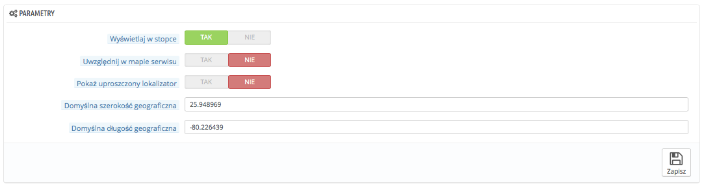
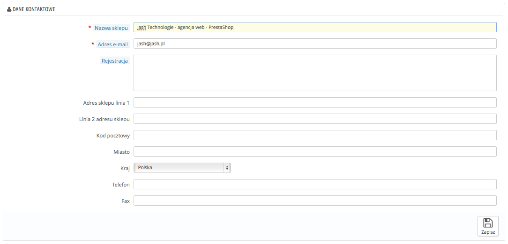

# Kontakty Sklepu

PrestaShop dostarcza narzędzie do lokalizowania sklepów fizycznych ze szczegółowymi informacjami kontaktowymi, co może być przydatne dla Twoich klientów.

Klienci mogą znaleźć Lokalizację sklepu z front-office.

Oczywiście ta funkcja jest przydatna tylko wtedy, kiedy posiadasz fizyczne sklepy, gdzie klienci mogą kupić produkty.

Nie możesz wyłączyć tej funkcji, ale możesz sprawić, że nie będzie dostępna dla klientów:

* Usuń najpierw wszystkie sklepy w tabeli na stronie "Kontakty sklepu". Blok "Sklepy" nie będzie już widoczny na stronie głównej.
* Idź do Moduły->Moduły, znajdź moduł "Blok sklepów" i wyłącz go.
* Wyłącz link w stopce na stronie "Kontakty Sklepu", wybierz "nie" przy opcji "Wyświetlaj w stopce".

Jeśli posiadasz sklepy w swojej bazie danych, ale nie chcesz, aby pojawiały się one na stronie, tymczasowo, albo na stałe:

1. Idź do Moduły->Pozycje.
2. Znajdź węzeł "Right column block" i usuń "Store locator block" z listy, albo naciskając na ikonę kosza na śmieci, albo wybierając "Odczep".
3. Przeładuj stronę główną, blok sklepów powinien zniknąć. Jeśli nadal tam jest, może być to wina pamięci podręcznej: idź na stronę Zaawansowane->Wydajność wyłącz "Pamięć podręczną" i "Wymuś kompilację" tymczasowo. Jak to zrobisz przeładuj ponownie stronę, aby sprawdzić czy blok zniknął.

Możesz przyczepić moduł z powrotem jeśli będziesz potrzebować, na stronie Moduły->Pozycje:

1. Naciśnij na "Przemieszczanie modułu" po prawej stronie u góry strony.
2. Wybierz moduł "Store locator block" z listy.
3. Zaczep go przy "displayRightColumn (Right column blocks)".
4. Zachowaj zmiany. Przeładuj stronę główną, by zobaczyć zmiany.

## Lista sklepów 

Możesz określić w jaki sposób sklepy będą wyświetlane na stronie. Klient będzie miał do nich dostęp poprzez link "Nasze sklepy" (w zależności od szablonu).

Wszystkie sklepy są przedstawione w formie listy, podając jednocześnie informacje o sklepie, oraz czy sklep jest aktualnie aktywny lub nie - możesz na przykład umieścić tu informacje o przyszłym sklepie, aby być gotowym na jego otwarcie.

### Dodawanie nowego sklepu 

Jak zwykle naciśnij "Dodaj nowy",a wyświetli Ci się odpowiedni formularz.

Wypełnij jak najwięcej pól, a one będą się wyświetlać Twoim klientom na mapie.

Jednym z najważniejszych pól jest długość i szerokość geograficzna, ponieważ to jej używa PrestaShop, aby wskazać położenie Twojego sklepu na mapie. Możesz użyć narzędzia Steve Morse, aby uzyskać te dane na podstawie konkretnego adresu: [http://stevemorse.org/jcal/latlon.php](http://stevemorse.org/jcal/latlon.php).\
Dodaj również zdjęcie frontu Twojego sklepu, dzięki temu Twoi klienci będą mogli go bez problemu znaleźć na ulicy.\
Podanie godzin otwarcia sklepu jest także bardzo ważne i należy podać informacje jak najdokładniejsze.

## Parametry 

* **Wyświetlaj w stopce.** Domyślnie PrestaShop wyświetla odpowiednik link w stopce strony zatytułowany "Nasze sklepy". W domyślnym szablonie pojawia się on w bloku Informacyjnym, poniżej prezentacji produktów. Ta funkcja pozwoli Ci na wyłączenie wyświetlania odnośnika w tym miejscu.
* **Uwzględnij w mapie serwisu.** Możesz określić, aby strona sklepów pojawiała się na mapie serwisu, która wyświetla wszystkie strony Twojego sklepu. (Nie pomyl z plikiem Sitemap Google, który jest tworzony tylko dla celu lepszego pozycjonowania).
* **Pokaż uproszczony lokalizator.** Lokalizator sklepu przedstawia się jako mapa interaktywna wraz z polem wyszukiwania/ Możesz uprościć wygląd poprzez proste wyświetlenie listy sklepów.
* **Domyślna szerokość** oraz **długość geograficzna.** Domyślna pozycja początkowa dla Twojej mapy. Przydatne jeśli masz wiele sklepów i chcesz skierować uwagę klientów na jeden, określony obszar.

## Dane kontaktowe 

Ta część pozwala Ci n uzupełnienie informacji dotyczących Twojej firmy, zamiast określonego sklepu. Powinieneś wypełnić wszystkie pola z informacjami dotyczącymi Twojej firmy, ponieważ to na ten adres Twoi klienci będą się z Tobą komunikować.

Pola te należy wypełnić bardzo uważnie:

* **Nazwa sklepu.** Nazwa Twojego biznesu, powinna być krótka, będzie ona również używana dla całej Twojej korespondencji oraz w tytule strony.
* **Adres e-mail.** Oficjalny adres e-mail dla Twojej firmy. Używaj adresu ogólnego, aby klienci widzieli , że otrzymują wiadomości z Twojego sklepu.
* **Rejestracja.** Wskaż numer rejestracyjny firmy, który zależy od systemu prawnego dla Twojego kraju (Duns w USA, SIRET we Francji, KRS w Polsce). To pokaże, że twój biznes jest zarejestrowany, co pozytywnie wpłynie na zaufanie do Twojej firmy.
* **Linia 1/2 adresu sklepu/ Kod pocztowy, Miasto/Kraj.** Podaj swoje oficjalne dane kontaktowe.
* **Telefon.** Podaj oficjalny numer kontaktowy. Jeśli nie chcesz otrzymywać telefonów od klientów, niczego tu nie wpisuj.
* **Fax.** Oficjalny numer Fax Twojego biznesu.

Nie używaj kropki "." w nazwie swojej firmy, to możesz zakłócić funkcjonowanie niektórych funkcji sklepu. (na przykład wysyłanie maili)

Możesz zastąpić kropkę myślnikiem, jeśli Twoja nazwa jest dwuczęściowa.
