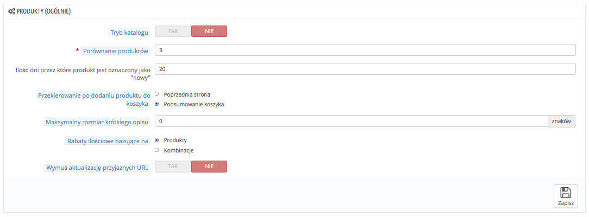
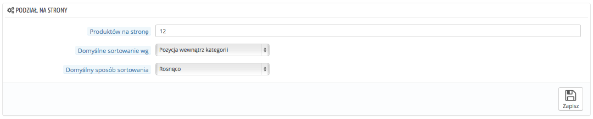
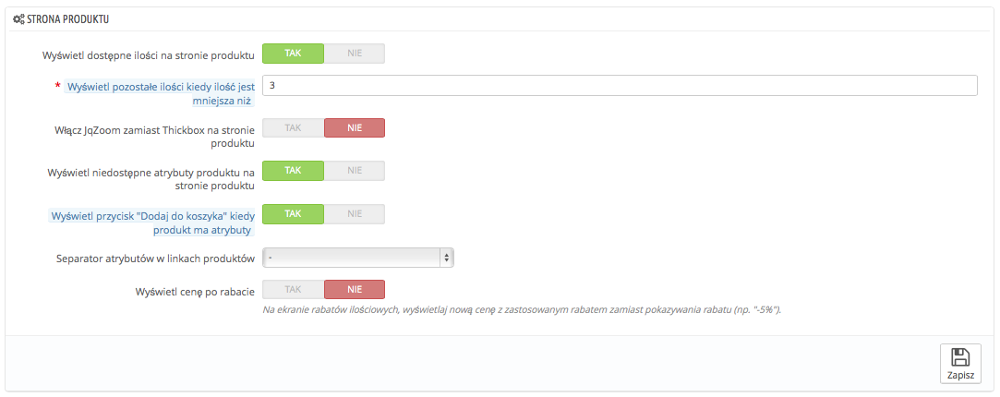
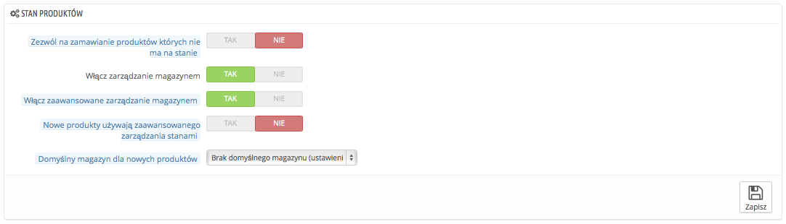

# Produkty - Ustawienia

Strona ta zawiera kilka ustawień związanych z utrzymaniem i wyświetlaniem produktów przez PrestaShop.

## Ustawienia ogólne 

* **Tryb katalogu.** Włączenie tej opcji sprawi, że twój sklep zamieni się w prostą galerię produktów bez możliwości zakupienia produktów.
* **Porównanie produktów.** Określ maksymalną liczbę produktów, które mogą być wyznaczone do porównania.
* **Ilość dni przez które produkt jest oznaczony jako "nowy".** kiedy dodajesz do sklepu produkt, jest on uważany za nowy i pojawia się w bloku "Nowe produkty" oraz na stronie "Nowe produkty". To pole pozwala Ci na określenie, ile dni produkt ma być oznaczony jako nowy. Dzięki temu narzędziu możesz wybrać jak wyświetlać i aktualizować nowe produkty.Strona "Nowe produkty" jest jedną z najczęściej odwiedzanych.
* **Przekierowanie po dodaniu produktu do koszyka.** Możesz przekierować klienta do poprzedniej strony, albo do podsumowania koszyka z zamówieniem.
* **Maksymalny rozmiar krótkiego opisu.** Twój produkt składa się z dwóch opisów "krótkiego" i normalnego. Krótki opis, który pojawia się w wynikach wyszukiwarek oraz opisie kategorii Twojego produktu jest domyślnie ograniczony do 400 znaków, ale te opcja pozwala Ci na zmianę tego limitu. "0" oznacza, że nie ma limitu.
* **Rabaty ilościowe bazujące na.** To ustawienie co powinno być bazą dla zniżek w sklepie, czy produkty, czy może ich kombinacje (czyli kilka produktów].
* **Wymuś aktualizację przyjaznych URL.** Domyślnie przyjazny adres URL dla strony produktu wygenerowany jest na podstawie jej tytułu i pozostaje taki, nawet jeśli tytuł ten ulegnie zmianie - ponieważ dla dobrego pozycjonowania strony Twój URL powinien być stały. Włączając tę opcję PrestaShop będzie aktualizować adres URL za każdym razem, gdy zmienisz nazwę/tytuł produktu.

## Podział na strony 

* **Produktów na stronę.** Wskazuje ile produktów ma być widocznych na stronach kategorii
* **Domyślne sortowanie wg**. Wskazuje porządek według którego będą wyświetlane produkty na stronach kategorii. Jest 6 możliwych opcji:\

  * **Nazwa produktu.** Wyświetla produkty w porządku alfabetycznym.
  * **Cena produktu.** Wyświetla produkty według ceny.
  * **Data dodania produktu.** Wyświetla produkty począwszy od najnowszych.
  * **Data modyfikacji produktu.** Jeśli edytujesz produkt, zmieni się data modyfikacji. Ta opcja pozwala na wyświetlanie wg daty zmian.
  * **Pozycja wewnątrz kategorii.** Wyświetla produkty według pozycji w Twoim katalogu. Pozycja produktu może być zmieniona bezpośrednio w katalogu za pomocą strzałek. W ten sposób możesz przedstawiać produkty w najbardziej interesujący sposób dla Twoich klientów.
  * **Producent.** Wyświetla twojej produkty w porządku alfabetycznym nazw producentów.
  * **Ilość produktu.** Wyświetla produkty według ilości na magazynie.
  * **Indeks produktu.** Wyświetla produkty w porządku indeksowania produktów.
* **Domyślny sposób sortowania.** Powyższe opcje mogą być sortowane rosnąco lub malejąco.

## Strona produktu 

* **Wyświetl dostępne ilości na stronie produktu.** Włączając tę funkcję, Twoi klienci mogą zobaczyć w jakiej ilości produkt jest dostępny. Wyświetlanie tej informacji może być użyte w stymulowaniu sprzedaży, kiedy ilość jest niska. Dostępność produktów pojawia się również dla atrybutów i kombinacji.
* **Wyświetl pozostałe ilości kiedy ilość jest mniejsza niż**. Możesz również określić wyświetlanie ostrzeżenia, kiedy dostępność produktu jest poniżej pewnego poziomu. Ta opcja może być szczególnie przydatna w promowaniu sprzedaży. Tekst oraz umiejscowienie ostrzeżenia zależy od szablonu: w domyślnym szablonie to jest: "Uwaga: Ostatnie sztuki w magazynie!" i jest umieszczony pod polem "Ilość".
* **Włącz JqZoom zamiast Thickbox na stronie produktu.** Domyślnie przy kliknięciu myszą na obrazek pojawia się duża wersja obrazka. Gdy jednak włączysz te opcję, klienci będą również otrzymywać przybliżony obraz produktu w momencie najechania myszą na obraz.
* **Wyświetl niedostępne atrybuty produktu na stronie produktu.** Twoje produkty mogą składać się z wielu kombinacji albo atrybutów: kolor, rozmiar, pojemność. Atrybuty mogą być edytowane na stronie Katalog->Atrybuty. Zapoznaj się z rozdziałem "Zarządzanie atrybutami produktów", aby dowiedzieć się więcej na ten temat.\
  Kiedy jeden lub kilka atrybutów nie jest już dostępnych, masz dwie możliwości:\

  * Możesz pozostawić ustawienie aktywnym. Na przykład iPod Shuffle nie jest już dostępny w wersji niebieskiej w sklepie. Pozostawiając tę funkcję włączoną, kombinacja produktu będzie nadal widoczna w sklepie. Informacja będzie wskazywać, że produkt nie jest już dostępny, a klientowi będzie się sugerować wybranie innego modelu. Jeśli włączysz funkcję "Zezwól na zamawianie produktów których nie ma na stanie" (patrz poniżej), klienci będą mogli dodać niedostępny produkt do koszyka.
  * Możesz wyłączyć tę opcję: Jeśli niebieski iPod Shuffle nie będzie dostępny, to nie będzie wyświetlany i klient nie będzie mógł go kupić.
* **Wyświetl przycisk "Dodaj do koszyka" kiedy produkt ma atrybuty**. Ta funkcja zapobiega dodawaniu produktu bezpośrednio ze strony kategorii, jeśli produkt posiada atrybuty/kombinacje. To zmusza klienta do odwiedzenia strony produktu i wybrania konkretnej kombinacji, zamiast dodawać domyślną do koszyka. Produkty bez atrybutów będą nadal możliwe do dodania do koszyka z poziomu strony kategorii.
* **Separator atrybutów w linkach produktów.** Możesz wybrać separator pomiędzy "-", a ",".
* **Wyświetl cenę po rabacie.** Jeśli używasz opcji rabatowych, pokazuj raczej ceny rabatowe, aniżeli rabat procentowy.

## Stan produktów 

* **Zezwól na zamawianie produktów których nie ma na stanie?** Jeśli produkt nie jest już dostępny, klient może mimo wszystko zamówić produkt.
* **Włącz zarządzanie magazynem.** Ta opcja da Ci dostęp do podstawowych opcji zarządzania magazynem: Możesz określić bieżącą dostępność produktu, którą PrestaShop zmniejszy z każdym zamówieniem, możliwość uzupełnienia stanu magazynowego dla każdego anulowanego zamówienia, albo zwrotu.\
  Domyślnie to ustawienie powinno być włączone, ponieważ wyłączenie go wpływa na całe zarządzanie zasobem w Twoim sklepie. Tylko w przypadku, gdy nie masz fizycznych produktów możesz go wyłączyć, na przykład kiedy sprzedajesz produkty wirtualne.
* **Włącz zaawansowane zarządzanie magazynem.** Kolejna mała opcja niosąca za sobą duże implikacje: Dodaje nowe menu "Magazyn", który umożliwia zarządzanie bardzo szczegółowe Twoim magazynem, nawet na zasadzie podziału na magazyny jeśli to potrzebne. Możesz widzieć wszystkie szczegóły dotyczące Twojego stanu magazynowego: ruchy, pokrycie, uzupełnianie stanu etc.\
  Możesz więcej przeczytać na ten temat w rozdziale "Zaawansowane zarządzanie magazynem".
* **Nowe produkty używają zaawansowanego zarządzania stanami.**
* **Domyślny magazyn dla nowych produktów**
