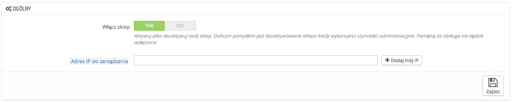

# Przerwa techniczna

Ta bardzo prosta strona ustawień jest nieoceniona, gdy chcesz dokonać zmian w sklepie. Na przykład jeśli będziesz chciał dodać kilka produktów na raz, albo kiedy będzie trzeba zmienić szablon i dokonać przy okazji kilku testów, zanim strona ujrzy światło dzienne.

Strona posiada tylko dwie opcje:

*   **Włącz sklep.** Możesz użyć tej opcji, aby wyłączyć tymczasowo sklep, na przykład, kiedy potrzebujesz dokonać napraw.

    Usługi sieciowe (API) będą nadal dostępne, więc jeśli chcesz je wyłączyć to idź na stronę Zaawansowane->API.
* Adres IP¨do zarządzania. Ta funkcja pozwala na dostęp do sklepu, nawet jeśli jest wyłączony. To oznacza, że możesz zamknąć dostęp dla wszystkich z sieci internet, ale pozwolić na dostęp komputerom używanym przez Twoich współpracowników. Aby odkryć IP urządzenia, idź na stronę: [http://www.whatismyip.com/](http://www.whatismyip.com/) z tego urządzenia. Naciśnij dodaj moje IP, jeśli chcesz dodać IP aktualnego komputera., jeśli chcesz dodać więcej adresów, rozdziel je przecinkami ",".
