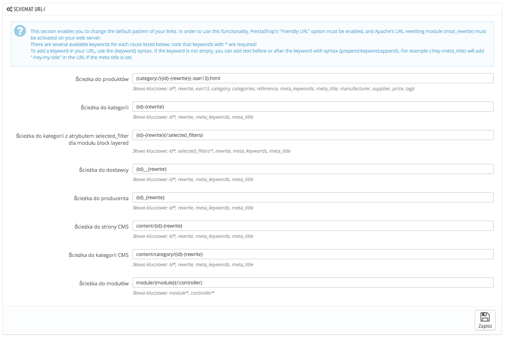

# SEO & URL

Narzędzia na tej stronie pozwalają Ci poprawić obecność Twojego sklepu w wynikach wyszukiwarek i dzięki temu dotrzeć do większej ilości potencjalnych klientów.SEO oznacza "search engine optimization". I reprezentuje zbiór technik i najlepszych praktyk, które mają na celu polepszenie widoczności strony w wyszukiwarkach. Możesz przeczytać więcej na ten temat na stronach Wikipedii: [http://pl.wikipedia.org/wiki/Optymalizacja\_dla\_wyszukiwarek\_internetowych](http://pl.wikipedia.org/wiki/Optymalizacja\_dla\_wyszukiwarek\_internetowych)\
URL to skrót od "uniform resource locator", albo w dużym uproszczeniu jest to adres internetowy. Możesz przeczytać więcej na stronie Wikipedii: [http://pl.wikipedia.org/wiki/Uniform\_Resource\_Locator](http://pl.wikipedia.org/wiki/Uniform\_Resource\_Locator)

Domyślnie format adresu URL (czyli adresy poszczególnych stron, a nie domeny) są raczej mało zrozumiałe dla klienta oraz wyszukiwarek: adres tak jak: [http://www.myprestashop.com/product.php?id\_product=27](http://www.myprestashop.com/product.php?id\_product=27) nie pomaga klientowi określić co znajduje się na tej stronie. Przyjazne adresy URL są o wiele lepsze, na przykład: [http://www.myprestashop.com/2-music-players/27-ipod-nano-green](http://www.myprestashop.com/2-music-players/27-ipod-nano-green).

Jak widzisz w drugim przykładzie można zauważyć, że produkt jak i kategoria mogą korzystać z przyjaznych linków, i tak: id\_category=2 staje się `2-music-players`, a `id_product=27` staje się `27-ipod-nano-green`. Podczas gdy numer ID nie może być domyślnie usunięty, to słowa mogą być wygenerowane z nazwy kategorii/produktu, albo wprowadzić ręcznie.  Możesz to zrobić bezpośrednio na stronie konfiguracji produktu/albo kategorii (w menu "Katalog")"Przyjazny URL" możesz znaleźć bezpośrednio na stronie konfiguracji kategorii, oraz w zakładce "SEO" produktu.

Istnieją również inne indywidualne strony w PrestaShopie, które również mogą zyskać dzięki przyjaznym adresom URL, strony CMS, strony kont klientów, strony z automatycznie wygenerowaną zawartością... "Strona SEO & URL" wyświetla listę tych stron i pozwala Ci na edycję ich odnośników oraz Meta Tagi (tytuł, opis, słowa klucze).

Przyjazne adresy URL działają wyłącznie przy ustawieniach serwera, które pozwalają na przepisywanie adresów URL (poprzez Apache Web Server  `mod_rewrite` na przykład). Upewnij się, że twój serwer posiada taką funkcję (zapytaj swojego dostawcę!) , ponieważ w przeciwnym razie może to sprawić, że twój sklep będzie całkowicie niedostępny dla Twoich klientów.

Ustawienia SEO strony głównej

Aby zmienić ustawienia Meta Tagów na stronie głównej, idź na stronę Preferencje->Seo & URL i edytuj stronę "index", tam będziesz mógł swobodnie wprowadzić ważne informacje dla SEO.

Kilka porad:

*   Tytuł strony domyślnej jest nazwą sklepu i dlatego tytuł "index" jest pusty. Jeśli wprowadzisz tam informację, to pełen tytuł strony będzie wyglądać tak "\<twoje wprowadzenie> - \<nazwa Twojego sklepu>".

    Nazwa sklepu jest wprowadzona podczas instalacji sklepu i może być zmieniona na stronie "Kontakty sklepu" w opcji "Nazwa sklepu" części "Dane kontaktowe".
* Twój opis powinien być krótki, paragraf wystarczy.
* Aby dodać tag, naciśnij "Dodaj tag" w polu "Słowa kluczowe"  i zatwierdź naciskając "Enter". Możesz usuną tagi  naciskając krzyżyk.
* Nie musisz dodawać Przepisanego adresu URL, jeśli nie zostało to zrobione

Pamiętaj, że jeśli Twój sklep był już indeksowany przez Google, albo inną wyszukiwarkę, to może zająć nieco czasu, zanim Twoje zmiany będą widoczne. Bądź cierpliwy.

Na dole strony SEO& URL, są cztery części z dodatkowymi funkcjami: Ustaw URL-e, Ustaw URL sklepu, Schemat URL-i oraz Generowanie pliku Robots. Patrz poniżej, aby poznać więcej szczegółów.

## Dodawanie nowego Przyjaznego adresu URL 

Przyjazne adresy URL można ustawić dla każdego produktu, kategorii, strony CMS... ten formularz jest przydatny wyłącznie dla niektórych stron automatycznych, i zazwyczaj nie będziesz się musiał o to martwić.

Upewnij się, że wypełniłeś wszystkie pola, dla wszystkich dostępnych języków  w Twoim sklepie. nie tylko będzie to użyteczne dla Twoich klientów, ale także wyszukiwarki mogą z tego skorzystać.

Naciśnij dodaj nowy, aby wyświetlić formularz przyjaznego adresu URL:

* **Strona.** Wyświetla listę rozwijaną stron, które mogą zyskać na zmianie.
* **Tytuł strony.** Tytuł będzie pojawiać się w wyszukiwarkach..
* **Opis meta.** Prezentacja strony w kilku słowach, która ma na celu zaciekawić klienta. Pojawia się w wynikach wyszukiwania.
* **Słowa kluczowe Meta.** słowa klucze, którymi musisz określić stronę, aby ta była widziana w porównywarkach. Możesz wielu słów kluczowych.
* **Przepisany URL.** Tutaj wprowadź swój przyjazny adres URL. Powinien być krótki i opisowy, użyj tylko liter i liczb, a spacje " " zamień na myślniki "-".

## Ustaw URL-e-commerce 

Główne ustawienia przyjaznych adresów URL:

*   **Przyjazny adres URL.** Włącz tę opcję, **jeśli wiesz, że Twój serwer wspiera przepisywanie adresów URL.** Jeśli nie, zostaw "Nie".

    Możesz zobaczyć informację "URL rewriting (mod\_rewrite) is not active on your server or it is not possible to check your server configuration. If you want to use Friendly URLs you must activate this mod". W tym przypadku PrestaShop nie jest w stanie wykryć ustawień Twojego serwera, ale to nie znaczy, że funkcja nie będzie działać. Musisz sprawdzić sam.
* **Wyróżniony URL.** Włącz tą opcję, jeżeli chcesz zezwolić na użycie narodowych znaków w przyjaznych URL. Powinieneś aktywować tą opcję tylko jeżeli używasz nie-łacińskich znaków; dla wszystkich łacińskich zestawów znaków Twoje SEO będzie lepsze bez tej opcji.
* **Przekieruj do kanonicznego URL.** Strona PrestaShopa może posiadać wiele adresów URL, przeważnie kiedy są inne parametry powiązane, na przykład:  [http://example.com/product.php?id=5\&option1](http://example.com/product.php?id=5\&option1) oraz [http://example.com/product.php?id=5\&option2](http://example.com/product.php?id=5\&option2) wskazują te same produkty, tylko z jedną drobną różnicą. Ponieważ lepiej mieć jeden adres URL aniżeli kilka duplikatów powinieneś włączyć tę opcję. Kanoniczny adres URL to sposób na wyeliminowanie samotworzącej się zduplikowanej treści, co może dramatycznie wpłynąć na słabe pozycjonowanie w wynikach wyszukiwania. Aby tego uniknąć PrestaShop używa standardu rel="canonical", który wskazuję podstawowy adres URL dla zawartości strony.\
  Podczas gdy włączenie tej opcji jest szczególnie polecane, musisz sprawdzić, czy twój obecny szablon wspiera prawidłowo tag \<link>. Zapytaj autora o więcej szczegółów.\
  przy tej funkcji masz 3 opcje do wyboru:\

  * **Brak przekierowania.** Możesz posiadać zduplikowane adresy URL
  * **301 Przeniesione na stałe.** zwraca status 301 wskazując jednocześnie główny adres URL i oznajmiając silnikom wyszukiwarek, że jest to jedyny adres URL, który powinny brać pod uwagę.
  * **302 Tymczasowo przeniesione.** zwraca status 302 wskazując jednocześnie główny adres URL i oznajmiając silnikom wyszukiwarek, że jest to adres URL, który może się zmienić.
* **Wyłącz opcję Apache's MultiViews**. Serwer Apache jest najpopularniejszym programem obsługi serwera i najprawdopodobniej jego używa twój dostawca internetu (ale musisz to sprawdzić) Multiviews, to system, który jeśli włączony, stara się dostarczyć użytkownikowi stronę w wersji językowej, która według niego jest najlepsza. Niestety to może przysparzać problemów funkcji Przyjaznych adresów URL. Jeśli tak będzie to możesz wyłączyć tę funkcję.
* **Wyłącz moduł Apache's mod\_security.** `mod_security` to moduł, który działa jak zapora, która chroni serwer przed intruzami. Ale jednocześnie może również blokować niektóre funkcje, albo nawet wywoływać błędy w niektórych konfiguracjach? W takim przypadku, możesz wyłączyć tę funkcję tutaj.

W poprzedniej wersji Prestashopa, należało samodzielnie wygenerować plik `.htaccess` po uruchomieniu przyjaznych linków. Ale od wersji 1.5 jest to wykonywane po cichu przez PrestaShopa, więc nie masz o co się martwić.

## Ustaw URL sklepu 

W tej części, możesz przejrzeć i edytować niektóre domyślne wartości konfiguracji serwera:

* **Domena sklepu**. Nazwa domeny Twojego sklepu, lub adres IP.
* **Domena SSL.** twoja bezpieczna domena sklepu (https://)  lub IP.
* **URI bazowy.** Katalog, w którym zainstalowałeś PrestaShopa, jeśli jest to w katalogu głównym (root) domeny, to użyj "/".

Przeważnie ie powinieneś dotykać tych pól, jeśli nie wiesz dokładnie co robisz, ponieważ jeden błąd może zepsuć cały sklep.

## Schemat URLi 

**Nowość w wersji 1.6**

Możesz zmienić sposób w jaki generowane są przyjazne linki, zmieniając ścieżkę z Twoim sklepie.

Na przykład domyślna ścieżka do strony produktu wygląda następująco: `{category:/}{id}-{rewrite}{-:ean13}.html`, co doprowadza, że adres wygląda tak: `/summer-dresses/7-printed-chiffon-dress.html`

Możesz zmienić tę ścieżkę na `{manufacturer:/}{id}-{rewrite:/}` i uzyskać: `/fashion-manufacturer//7-printed-chiffon-dress/`

8 pól jest dostępnych domyślnie, a każde jest wzbogacone o listę dostępnych słów kluczowych. Niektóre słowa są obowiązkowe i są oznaczone gwiazdką ("\*").

Po uaktualnieniu pól, nie zapomnij zachować ustawień, aby wygenerować plik `.htaccess`, który jest niezbędny dla przyjaznych adresów URL.

## Generowanie pliku Robots 

Plik `robots.txt` pozwala Ci na blokowanie określonych botów, które przeczesują sieć w celu dodania stron do ich firmowych serwerów. Niektóre boty chcą mieć pełen dostęp do Twojej strony, na przykład Google i Yahoo, a inne nie, takie jak spam bot, złodzieje danych, zbieracze e-maili etc. Uwaga, najgorsze boty nie biorą tego pliku pod uwagę, i jest on tylko pomocniczy.

Narzędzie PrestaShopa do generowania plików `robots.txt` zastępuje już istniejący plik, nowym. Dlatego, jeśli chcesz dodać jakieś reguły zrób to po wygenerowani pliku przez PrestaShop.

