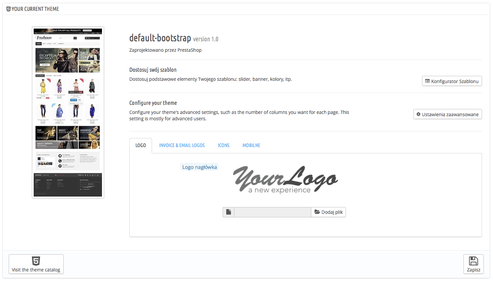
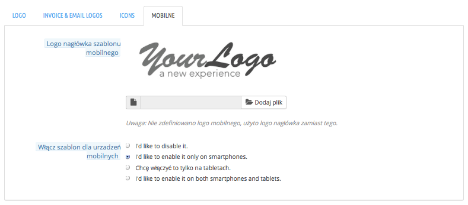
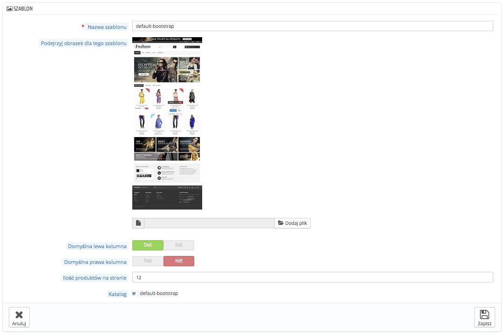
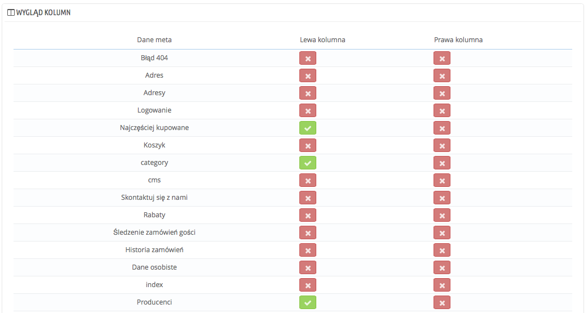
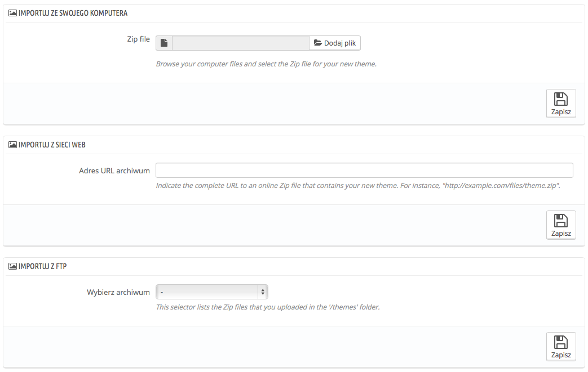
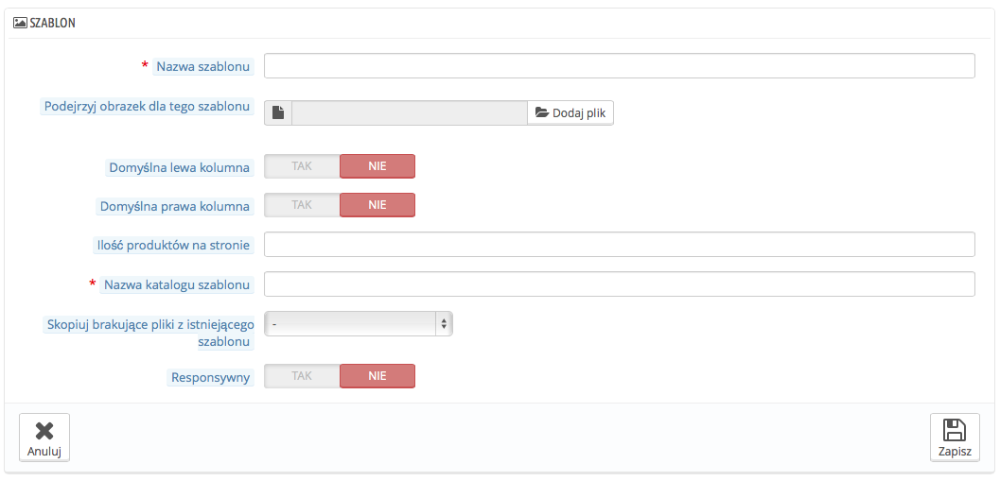
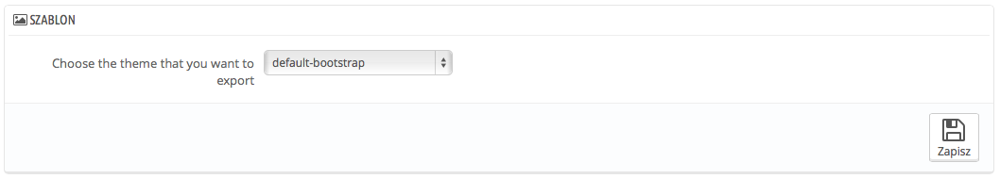
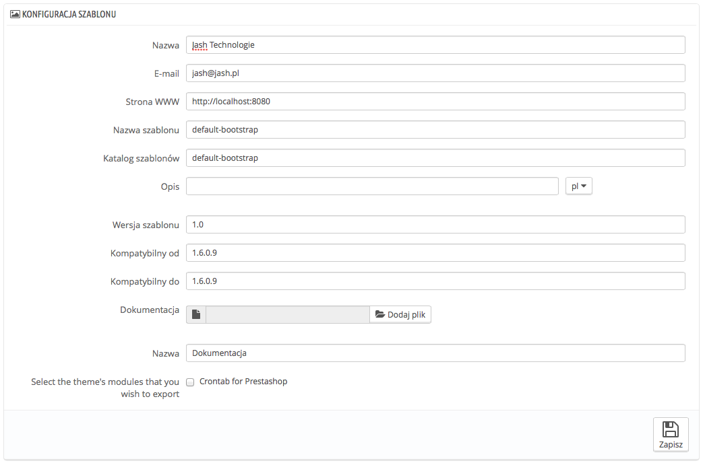

# Szablony - Ustawienia

/\*\<!\[CDATA\[\*/\
div.rbtoc1597140215158 {padding: 0px;}\
div.rbtoc1597140215158 ul {list-style: disc;margin-left: 0px;}\
div.rbtoc1597140215158 li {margin-left: 0px;padding-left: 0px;}\
\
/\*]]>\*/

* [Szablony - Ustawienia](szablony-ustawienia.md#Szablony-Ustawienia-Szablony-Ustawienia)
  * [Twój aktualny szablon](szablony-ustawienia.md#Szablony-Ustawienia-Twójaktualnyszablon)
    * [Konfigurator szablonu](szablony-ustawienia.md#Szablony-Ustawienia-Konfiguratorszablonu)
    * [Ustawienia zaawansowane szablonu](szablony-ustawienia.md#Szablony-Ustawienia-Ustawieniazaawansowaneszablonu)
  * [Zaznacz szablon dla twojego sklepu](szablony-ustawienia.md#Szablony-Ustawienia-Zaznaczszablondlatwojegosklepu)
  * [Dodawanie i eksportowanie szablonu](szablony-ustawienia.md#Szablony-Ustawienia-Dodawanieieksportowanieszablonu)
    * [Importowanie szablonu: przycisk "Dodaj nowy szablon"](szablony-ustawienia.md#Szablony-Ustawienia-Importowanieszablonu:przycisk%22Dodajnowyszablon%22)
    * [Tworzenie całkiem nowego szablonu](szablony-ustawienia.md#Szablony-Ustawienia-Tworzeniecałkiemnowegoszablonu)
    * [Eksportowanie szablonu](szablony-ustawienia.md#Szablony-Ustawienia-Eksportowanieszablonu)
  * [Na żywo z PrestaShop Addons!](szablony-ustawienia.md#Szablony-Ustawienia-NażywozPrestaShopAddons!)

Strona Szablony pozwala Ci na zarządzanie Twoimi szablonami.

## Twój aktualny szablon 

Pierwsza część strony służy jako przypomnienie, którego szablonu używasz obecnie:

* Nazwa szablonu
* Wersja szablonu
* Nazwa autora szablonu, strona internetowa, adres e-mail.
* Podgląd szablonu

Ta część daje Ci dostęp do kilku przydatnych narzędzi, które pozwolą Ci szybko dostosować elementy bieżącego szablonu: logo w nagłówku, logo nagłówka e-mail, logo faktury, favicon, etc.:

* **Dostosuj swój szablon.** Link do konfiguratora Szablonu.
* **Konfiguruj swój szablon.** Link do zaawansowanych ustawień szablonu.
* 4 zakładki, które zawierają opcje zmiany wyglądu szablonu:
  * **Logo.** Logo, które będzie widoczne na każdej stronie Twojego sklepu.
  * **Logo Faktury & Maila**. Loga będą widoczne odpowiednio w fakturach i w mailach.
  * **Ikony.** Favicon (widoczny w przeglądarce internetowej), oraz ikonę sklepu (Do użytku przy określaniu lokalizacji na mapie).
  * **Mobilne.** Logo, które pojawia się na stronach mobilnych. W tym miejscu możesz również określić czy chcesz włączyć/wyłączyć szablon mobilny dla smartphonów, tabletów, albo obydwu.

Domyślny szablon używa logo "YourLogo". Silnie rekomendujemy zmianę logo na swoje własne!

W trybie Multisklep, możesz zatwierdzać te zmiany dla wszystkich sklepów ich grup, lub poszczególnych, używając menu "Multisklep".

"Włącz szablon dla urządzeń mobilnych" pozwala na używanie domyślnego szablonu mobilnego. Z tym szablonem każdy sprzedawca PrestaShop może mieć sklep w wersji mobilnej, począwszy od strony głównej po proces składania zamówienia, jak i strony produktów etc.

Szablon mobilny działa tylko z domyślnym szablonem, ponieważ jest dołączone w katalogu: `/themes/default/mobile.` Dlatego może nie działać z innym szablonem, która nie posiada swojej strony w wersji mobilnej.

Mimo to możesz używać domyślnego szablonu mobilnego z każdym innym szablonem, przynajmniej tymczasowo: po prostu przekopiuj szablon mobilny z katalogu domyślnego szablonu, do katalogu nowego szablonu i powinno działać. Na przykład, jeśli twój szablon znajduje się w katalogu `/themes/magnolia,` skopiuj  katalog `/themes/default/mobile` do nowego szablonu:  `/themes/magnolia/mobile.`

To jest szczególnie przydatne, kiedy nowy szablon nie ma wyglądu responsywnego: w ten sposób twój sklep może nadal wyglądać dobrze na urządzeniach mobilnych, tylko że oczywiście na standardowym szablonie PrestaShop.

### Konfigurator szablonu 

Konfigurator szablonu pomoże Ci skonfigurować pewne aspekty Twojego szablonu..

Naciskając na przycisk "Konfigurator szablonu" na stronie "Szablony", zostaniesz przekierowany na stronę konfiguracji. Ta strona da Ci dostęp do wielu funkcji/modułów odpowiedzialnych z wygląd Twojego Front-office, takich jak wyświetlanie przycisków do mediów społecznościowych, albo blok Facebooka (jeśli odpowiednie moduły są włączone), oraz wskazuje odnośniki do ich podstron konfiguracyjnych. Możesz tam także uzyskać dostęp do edycji na żywo, która pozwoli Ci na łatwą zmianę koloru i czcionki Twojej strony głównej.

W drugiej części Konfigurator pozwala Ci na dodanie obrazów z odnośnikami do strony głównej korzystając z "Zaczepów": home, top, left, right, footer. Każdy dostępny język posiada własną zakładkę ze swoimi zaczepami, które możesz tam edytować: Ważne jest to, że obrazy posiadają teksty, tak więc należy zrobić wszystkie obrazy dla każdej wersji językowej.

Ten moduł jest opisany bardziej szczegółowo w rozdziale "Uruchamianie natywnych modułów".

### Ustawienia zaawansowane szablonu 

Po naciśnięciu przycisku "Ustawienia zaawansowane" na stronie "Szablony" wyświetlają się informacje dotyczące bieżącego szablonu: (Zobacz poniżej podrozdział "Tworzenie nowego szablonu", aby dowiedzieć się więcej na temat dostępnych pól).

Poniżej znajduje się część "Wygląd kolumn" gdzie wyświetlają się informacje o sposobach wyświetlania prawej i lewej kolumny w zależności od strony:

* jeśli pole jest zaznaczone, kolumna pojawia się na stronie (na przykład na stronie Kategorii).
* jeśli pole jest odznaczone, nic nie pojawi się na stronie.

Pamiętaj o tym, że możesz nacisnąć każdy przycisk, ale ustawianie są tylko informacyjne i szablon nie koniecznie będzie w stanie dostosować się do wprowadzonych zmian!

## Zaznacz szablon dla twojego sklepu 

Ta część jest widoczna tylko wtedy, kiedy masz zainstalowane co najmniej dwa szablony. Przedstawia Ci inne dostępne szablony oprócz obecnie używanego.

Strona pokazuje zdjęcia poglądowe dostępnych szablonów.

.png>)

Poruszaj kursorem myszki ponad podglądem, aby wyświetlić menu z dwiema opcjami:

* **Użyj tego szablonu.** To zastąpi twój obecny szablon wskazanym szablonem
* **Usuń ten szablon.** W ten sposób usuniesz ten szablon ze swojego serwera

W prawym górnym rogu "Odwiedź Addons Marketplace" otwiera nową stronę ze sklepem PrestaShopa, gdzie możesz znaleźć więcej szablonów.

W trybie Multistore nie możesz wybrać szablonu dla wszystkich sklepów, albo ich grup, tylko musisz zaznaczyć konkretny sklep z menu "Multisklep", a następnie wybrać szablon.

## Dodawanie i eksportowanie szablonu 

Przyciski u góry strony pozwalają Ci na importowanie i instalowanie modułu (wraz z modułami powiązanymi z szablonem), albo eksportować moduł i jego moduły z Twojego sklepu, aby podzielić się nim ze światem.

### Importowanie szablonu: przycisk "Dodaj nowy szablon" 

Ten obrazek przedstawia trzy sposoby instalacji nowego szablonu: z Twojego komputera, ze strony www, albo z Twojego serwera FTP. Ostatni przycisk prowadzi Cię do formularza tworzenia szablonu, opisanego w następnej części.

Jakąkolwiek metodę wybierzesz, proces pozostaje ten sam: Musisz wskazać położenie pliku .zip z szablonem i nacisnąć zachowaj.  Jedyne co się zmienia to źródło pochodzenia pliku:

* **Importuj z komputera.** Używa przeglądarki plików aby znaleźć twój plik szablonu.
* **Importuj z sieci.** Wskaż adres URL skąd szablon zostanie pobrany.
* **Importuj z FTP.** używając klienta FTP, prześlij plik do katalogu: /themes/.

Naciśnij "Zachowaj", aby potwierdzić Twój wybór. Szablon jest teraz zainstalowany i PrestaShop zapyta Cię, czy chcesz zainstalować modułu powiązane z szablonem, co chciałbyś zrobić z obecną konfiguracją modułów i czy chciałbyś wziąć pod uwagę zdjęcia konfiguracji.

Naciśnij "Zachowaj" po raz ostatni. Pojawi się strona potwierdzająca, że wszelkie zmiany zostały wprowadzone. Naciśnij "Zakończ", aby skończyć proces.

### Tworzenie całkiem nowego szablonu 

Najlepszym sposobem na utworzenie nowego szablonu dla PrestaShopa jest skopiować pliki z szablonu domyślnego i rozpocząć modyfikację jego plików TPL oraz CSS według własnego uznania. Powód ku temu jest prosty, szablon PrestaShop wymaga wielu plików i rozpoczynając nowy szablon od początku jesteś pewien, że twojemu szablonowi nie zabraknie jakiejś części.

Możesz zrobić to bezpośrednio na serwerze, ale PrestaShop ułatwia kopiowanie plików z zainstalowanego szablonu do twojego nowego szablonu w ramach swojego systemu.

To wszystko odbywa się z pomocą przycisku "Stwórz nowy szablon" ze strony "Dodaj szablon" u góry strony, który wyświetla formularz.

Fill-in its fields:

* **Nazwa szablonu.** Upewnij się, że nazwa Twojego szablonu nie jest używana przez inny szablon (sprawdź stronę Addons).
* &#x20;**Podejrzyj obrazek dla tego szablonu.** Powinieneś zawsze dodawać obraz podglądu szablonu, jako przypomnienie tego, jak szablon wygląda. Jeśli nie masz go jeszcze, zostaw to na później, kiedy będzie czas na upublicznienie szablonu.
* **Domyślna lewa kolumna** oraz **Domyślna prawa kolumna.** Wskaż czy twój moduł posiada kolumnę, lub dwie, a jeśli tak to po której stronie. To jest tylko informacja i możesz ją zmienić kiedy tylko chcesz.
* **Nazwa katalogu szablonu.** Postaraj się upodobnić nazwę katalogu do nazwy szablonu. Jeśli nie utworzyłeś jeszcze katalogu szablonu, PrestaShop utworzy go dla Ciebie.
* **Skopiuj brakujące pliki z istniejącego szablonu.** To jest najczystsza metoda na rozpoczęcie nowego szablonu. Wybierz  "default-bootstrap", albo inny szablon, który chcesz, żeby stanowił podstawę dla Twojego szablonu.
* **Responsywny.** Określ, czy twój szablon jest responsywny, czy nie (Jeśli nie wiesz o co chodzi, to zaznacz "nie". To jest tylko informacja i możesz ją zmienić kiedy tylko chcesz.

Naciśnij "Zapisz", a PrestaShop zapisze te informacje dla Ciebie, a szablon będzie gotów do uruchomienia i jego zdjęcie poglądowe pokaże się w przeglądzie szablonów.

Od tej chwili to Ty możesz zmienić swój szablon i sprawić, że będzie unikalny! Na twojej lokalnej instalacji (nie produkcyjnej) zaznacz nowy szablon i zacznij pracować.

Kiedy skończysz idź ponownie na tę stronę i zmień odpowiednio: załaduj obraz podglądu, określ kolumny, liczbę produktów i responsywność.

Czy twój szablon jest tak dobry, że inni mogliby chcieć za niego zapłacić? Możesz sprzedawać go na stronie Addons, oficjalnym sklepie modułów i szablonów PrestaShop: [http://addons.prestashop.com/](http://addons.prestashop.com/).

### Eksportowanie szablonu 

Ta część jest dostępna jedynie, gdy masz zainstalowany co najmniej jeden szablon. Wskazuje on sposób na wyeksportowanie Twojego szablonu w odpowiednim formacie (a przede wszystkim z odpowiednim plikiem konfiguracyjnym).

Eksportowanie szablonu jest bardzo przydatne kiedy na przykład chcesz zrobić kopię zapasową szablonu, albo stworzyć plik z szablonem dla przyjaciela, albo chcesz go udostępnić na stronie Addons ([http://addons.prestashop.com/](http://addons.prestashop.com/)) Nie tylko plik zip zostanie wygenerowany z Twoim szablonem, ale także dodatkowo pliki XML, które są niezwykle przydatne podczas przesyłania szablonu na stronę Addons, albo podczas importowania do innego PrestaShopa.

Zaznacz szablon i naciśnij na "Eksportuj motyw". Pojawi się okno, gdzie będziesz mógł wyeksportować niektóre parametry szablonu: Imię autora, moduły powiązane, nazwa szablonu, kompatybilność, etc.

Gdy tylko wszystkie parametry zostaną prawidłowo wprowadzone, naciśnij "Zapisz", a otrzymasz plik, który będziesz mógł pobrać z przeglądarki na swój komputer, następnie nadaj temu plikowi dobrą nazwę w przeciwieństwie do tej wygenerowanej przez PrestaShop. A następnie możesz z łatwością podzielić się tym plikiem i jeśli jest to twoje dzieło, możesz sprzedać je w sklepie Addons PrestaShop.

## Na żywo z PrestaShop Addons! 

Ostatnia część przedstawia 12 ostatnio dodanych szablonów w sklepie PrestaShop Addons. Możesz nacisnąć każdy obrazek, aby dowiedzieć się więcej na temat tego szablonu, a może go od razu kupić.

.png>)
