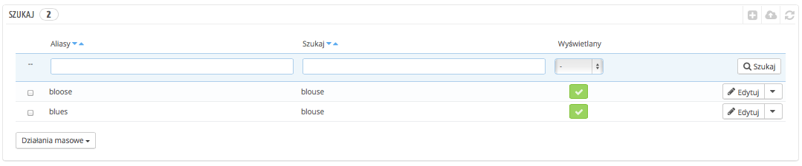
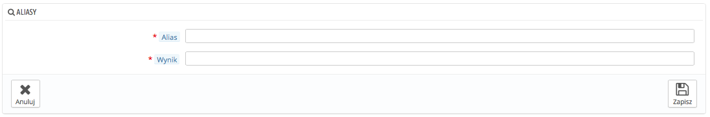
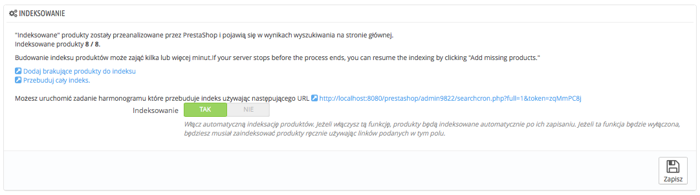
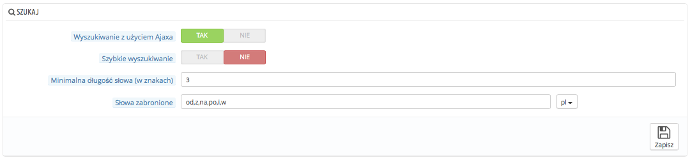
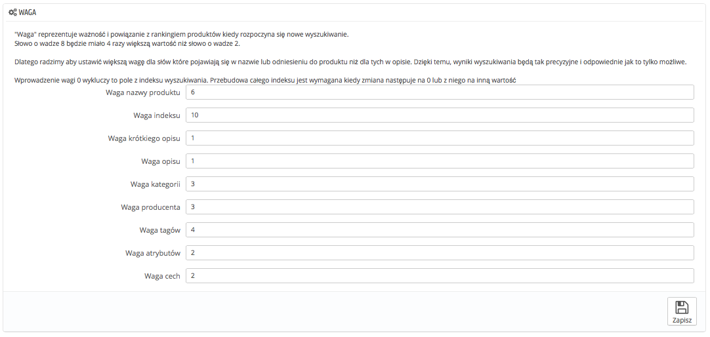

# Szukaj

Preferencje szukania pozwolą Ci skonfigurować funkcje wyszukiwania w Twoim sklepie.

## Aliasy 

Gdy klienci wykonują zapytania korzystając z silnika wyszukiwań sklepu, popełniają błędy literowe. Jeśli PrestaShop nie wyświetla prawidłowych wyników, funkcja "Alias" może je wskazać. Możesz wziąć słowa zawierające błędy i przekierować je na prawdziwe produkty, poszukiwane przez klientów.

Aby stworzyć nowy, przydatny alias, powinieneś najpierw znaleźć błędy popełniane przez użytkowników:

1. Idź na stronę Statystyki -> Statystyki->(tab) Wyszukiwarka sklepu. Możesz zobaczyć słowa wyszukiwane przez Twoich klientów, jak i najczęstsze błędy.
2. Wybierz najczęściej popełniane i dodaj je do listy Aliasów, aby przypisać do nich prawidłowe produkty.
3. Naciśnij "Dodaj nowy" na stronie "Szukaj".

Formularz, który się pojawi, jest dość jasny, podaj błąd i prawidłowe słowo, do którego powinien on prowadzić.

Na przykład powiedzmy, że Twoi klienci często mylą się i zamiast "playstation" wpisują "plejstation", albo "pleystation". Możesz utworzyć alias dla każdej z tych pomyłek i przypasować je do słowa "Playstation". Z aliasów można korzystać od momentu ich zachowania.

Przy okazji zachęcamy Cię do zapoznania się z rozdziałem tego podręcznika opisującym meta tagi dla produktów oraz kategorii, aby zrozumieć w jaki sposób produkty są wyświetlane na podstawie wyszukiwań klientów. Zobacz rozdział "Dodawanie produktów i kategorii" oraz "Spojrzenie w głąb katalogu"

## Indeksowanie 

Ta część dostarcza informacji o ilości produktów, które mogą być przeszukiwane za pomocą wyszukiwarki sklepowej, oraz porównuję tę liczbę do produktów widocznych w bazie danych. Jeśli wartości nie są równe, wybierz opcję "Dodaj brakujące produkty do indeksu" Tylko nowe produkty będą indeksowane.

Jeśli dokonałeś zmian, w produktach już zindeksowanych, możesz woleć przebudować cały indeks. Ten proces może zająć trochę czasu, ale jest bardziej dokładny.

PrestaShop udostępnia Ci również adres URL, który pozwoli Ci na stworzenie zadania w Cronie, aby regularnie przebudowywać index, jeśli nie wiesz nic o Cronie i o Crontab, zapytaj o to twojego dostawcę/twój hosting.

Indeksowanie posiada również opcję automatycznej indeksacji produktów, jak tylko zostaną one stworzone/zmodyfikowane. Czyli link podany powyżej, nie jest potrzebny.

## Szukaj 

Ta część pozwala Ci skonfigurować zachowanie Twojej wyszukiwarki sklepowej:

* **Wyszukiwanie z użyciem Ajaxa**. Pozwala na wyświetlanie listy 10 produktów, jak tylko klient rozpocznie wpisywanie liter do pola wyszukiwania.
* **Szybkie wyszukiwanie.** Pozwala na wyświetlanie listy rezultatów od momentu wprowadzenia pierwszych liter do pola wyszukiwania, ale rezultaty są widoczne w części głównej strony, co może zdezorientować klientów, ponieważ cała zawartość ulega zmianie. Dlatego też korzystaj z tego z rozwagą.
* **Minimalna długość słowa (w znakach)**. Możesz określić minimalną długość słowa, która ma być zarejestrowana w indeksie i możliwa do znalezienia przez klientów. To pozwoli Ci na wyeliminowanie, krótkich słów z wyszukiwań, takich jak przyimki, rodzajniki etc.
* **Słowa zabronione.** Możesz określić, które znaki i słowna, nie mogą być znalezione przez użytkowników, wpisz je bezpośrednio w to pole i oddziel znakiem "|" między społecznościowych.

## Waga 

PrestaShop pozwala Ci na prioretyzowanie niektórych danych podczas wyszukiwania w sklepie.

"Waga" reprezentuje ważność i powiązanie z rankingiem produktów kiedy rozpoczyna się nowe wyszukiwanie. Słowo o wadze 8 będzie miało 4 razy większą wartość niż słowo o wadze 2.

Na przykład "Waga nazwy produktu" wynosi 6, "Waga tagów" 4, a "Waga krótkiego opisu" i "Waga opisu" wynoszą 1. To oznacza, że produkt ze słowem "iPod" w tytule pojawi się wyżej w rezultatach wyszukiwaniach, aniżeli produkt, który ma słowo "iPod" w tagach. Podczas gdy produkt, który posiada słowo "iPod" z opisie będzie miał najniższą pozycję.

Jest wiele czynników, przy których możesz określać i wagę: krótki opis, kategorię, tagi, atrybuty etc. Kolejność sortowania rezultatów wyszukiwania można odwrócić, ponieważ możesz zmienić wagę poszczególnych pól. Dostrojenie tych ustawień będzie bardziej widoczne w przypadku dużego katalogu z wieloma produktami.

Efekt zmian będzie widoczny natychmiast po ich zachowaniu.
