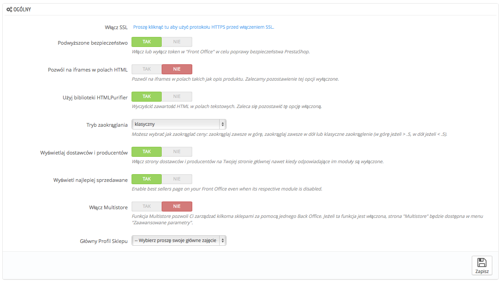

# Ustawienia ogólne

Na tej stronie znajduje się kilka ustawień, które nie znalazły się w innych menu. Niemniej są on bardzo ważne:

* **Włącz SSL.** SSL, czyli "Secure Sockets Layer"i zawiera TSL("Transport Layer Security") są to dwa protokoły bezpieczeństwa w internecie, które zapewniają bezpieczną komunikację, na ten temat możesz więcej przeczytać na Wikipedii: [http://pl.wikipedia.org/wiki/Transport\_Layer\_Security](http://pl.wikipedia.org/wiki/Transport\_Layer\_Security).\
  &#x20;Korzystanie z protokołu SSL nie tylko poprawia bezpieczeństwo transakcji, ale zapewnia Twoich klientów o bezpieczeństwie ich własnych danych (autoryzacji, kart płatniczych etc) w Twoim sklepie. Jeśli Twój dostawca hostingowy wspiera SSL, włącz go dla Twojego sklepu w tym właśnie miejscu. Naciśnięcie informacji dotyczącej SSL odsłoni przycisk "Tak".
* **Podwyższone bezpieczeństwo.** To włącza zabezpieczenie tokenami w Twoim sklepie, co poprawia jednocześnie jego bezpieczeństwo. W rezultacie każdy link URL jest przypisany do sesji klienta i nie może być użyty jako taki na innej przeglądarce, dzięki czemu dane z tej sesji pozostają bezpieczne.
* **Pozwól na iframes w polach HTML.** Ta opcja pozwala Ci na umieszczenie iframe w polach tekstowych takich jak opisy produktów. Iframe to element kodu HTML, który pozwala na załadowanie zewnętrznej zawartości w treść strony. Zalecamy wyłączenie tej opcji, o ile nie jest to naprawdę konieczne.
* **Użyj biblioteki HTMLPurifier.** Klienci mogą wysyłać do Ciebie wiadomości korzystając z pól tekstowych (na przykład produkty opisów, informacje o kliencie), ale hakerzy mogą również próbować użyć tych pól, aby wysyłać złośliwy kod w celu spakowania Twojego sklepu. Ta opcja gwarantuje, że dane wysyłane do Twojego sklepu będą bezpieczne. Możesz to wyłączyć, jeśli naprawdę wiesz co robisz.
* Tryb zaokrąglania: gdy tylko podatki oraz obniżki zostaną wprowadzone, może się zdarzyć, że cena będzie wyglądać na przykład tak:  $42.333333333.\
  Moduł zaokrąglania jest używany podczas procesu obliczania i składa się z kilku trybów:
* **Zaokrąglaj w górę na połowie.** To jest zalecane, 42.55555555 stanie się 42.56.
* **Zaokrąglaj w dół na połowie.** 42.55555555 stanie się 42.56.
* **Zaokrąglaj do następnej parzystej wartości.** 42.55555555 stanie się 42.56.
* **Zaokrąglaj do następnej nieparzystej wartości.** 42.55555555 stanie się 42.56.
* **Zaokrąglenie w górę do najbliższej wartości.** 42.55555555 stanie się 42.56.
* **Zaokrąglenie w dół do najbliższej wartości.** 42.55555555 stanie się 42.55.

For versions below 1.6.0.11

Opcja zaokrąglania została mocno poprawiona w wersji 1.6.0.11, przedtem było dostępnych mniej opcji:

**Moduł zaokrąglania** jest używany podczas procesu obliczania i składa się z trzech trybów:

* **Nadrzędny:** zaokrągla w górę; 42.333333333 staje się 42.34.
* **Podrzędny:** zaokrągla w dół; 42.333333333 staje się 42.33.
* **Klasyczny:** zaokrągla w górę, albo w dół w zależności od wartości: w górę powyżej 5, a w dół poniżej 5.
* **Typ zaokrąglania**. Ta opcja pozwala Ci wybrać typ zaokrąglania, który może zaważyć na całej kalkulacji. Są dostępne trzy typy:\

  * **Zaokrąglenie dla każdego przedmiotu.** Każda cena produktu będzie zaokrąglona przed całkowitym podliczeniem. Jeśli będzie więcej niż jeden ten sam produkt, każdy produkt będzie zaokrąglany osobno.
  * **Zaokrąglenie dla każdej linii**. Każda linia przedmiotów będzie zaokrąglona przed całkowitym podliczeniem. Jeśli będzie więcej niż jeden ten sam produkt, to będą one zaokrąglane całościowo
  * **Zaokrąglanie przy sumie końcowej**. Zaokrąglanie będzie odbywać się pod koniec podliczania, po dodaniu wszystkich wartości.
* Ilość miejsc dziesiętnych.  Wybierz ile miejsc po przecinku chcesz wyświetlić. na przykład, jeśli wybierzesz "3", 42.333333333 stanie się 42.334.
* **Wyświetlaj dostawców i producentów:** Wyświetla dostawców producentów na stronach front-office, nawet jeśli odpowiednie moduły są wyłączone.
* **Wyświetlaj najlepiej sprzedawane**. Włącza stronę z najlepiej sprzedającymi się produktami na stronie głównej, nawet jeśli moduł za to odpowiedzialny jest wyłączony.
* **Włącz Multistore**. Ta mała opcja niesie za sobą wiele konsekwencji: zmienia twój pojedynczy sklep w mutlisklep. To daje Ci dostęp do nowej strony "Multisklep" w menu "Zaawansowane" i każda strona administracyjna może być skonfigurowana odpowiednia dla grupy sklepów, albo poszczególnych sklepów.\
  &#x20;Możesz przeczytać więcej na ten temat w rozdziale "Zarządzanie Multisklepem".
* **Główny Profil Sklepu:** Podczas instalacji mogłeś źle określić swój profil działalności, tutaj możesz go zmienić.

