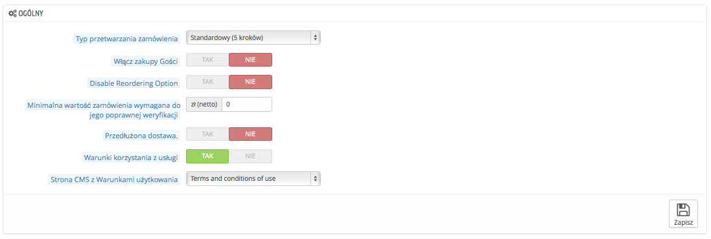
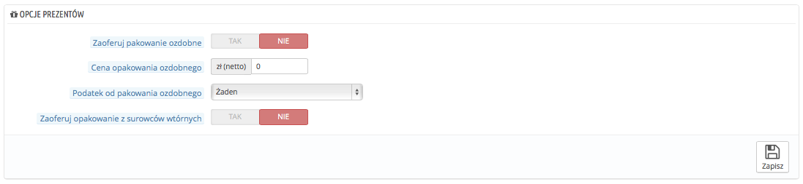

# Zamówienia - Ustawienia

Ustawienia Zamówień odnoszą się do procesu zamówień, które składają Twoi klienci, ale również także inne kwestie jak "opakowywanie prezentów".

## Ustawienia ogólne 

* **Typ przetwarzania zamówienia.** Domyślnie klient musi przejść przez 5 kroków aby zakończyć proces zamówienia, każdy na osobnej stronie. Ale możesz wybrać również, że będzie to robić w ramach jednej strony. Strona będzie dłuższa, ale niektóry klienci mogą woleć to podejście.
* **Włącz zakupy Gości.** Tu możesz pozwolić na składanie zamówień przez niezarejestrowanych gości.
* **Minimalna wartość zamówienia wymagana do jego poprawnej weryfikacji.** Wskazuje na minimalną kwotę zamówienia, która jest wymagana do złożenia zamówienia. Jeśli kwota w tym polu nie będzie osiągnięta, twój klient nie będzie mógł dokończyć zamówienia. Jeśli nie chcesz ustalać kwoty minimalnej, wpisz "0".
* **Przedłużona dostawa.** Jeśli włączysz opcję "Zezwól na zamawianie produktów których nie ma na stanie" w opcjach strony "Produkty", możesz pozwolić na wysłanie produktów, kiedy staną się one dostępne. W tylu dostawach ile potrzeba.Początkowo PrestaShop podzieli zamówienie na dwa: dostępne produkty zostaną wysłane natychmiast, podczas gdy drugie staną się drugim zamówieniem czekającym na potwierdzenie.
* **Warunki korzystania z usługi.** Włączone, zmusza Twoich klientów do zaakceptowania warunków sprzedaży Twojego sklepu podczas zatwierdzania zamówienia.
* &#x20;**Strona CMS z Warunkami użytkowania**. Twoja strona z Warunkami sprzedaży będzie dostępna jako strona statyczna (strona CMS) Określ tutaj, której PrestaShop ma użyć, aby połączyć się z nią bezpośrednio.

## Opcje prezentów 

* **Zaoferuj pakowanie ozdobne.** Pozwól PrestaShopowi zasugerować opakowanie ozdobne Twoim klientom wraz z dedykacją. To jest zawsze miły dodatek dla ludzi, którzy chcieliby wysłać prezent przez Twój sklep.
* **Cena opakowania ozdobnego.** Określ cenę za ten typ usługi.
* **Podatek od pakowania ozdobnego.** Jeśli potrzebne, wskaż jaki lokalny podatek ma zostać użyty. Możesz dodać podatek na stronie Lokalizacja->Podatki.
* **Zaoferuj opakowanie z surowców wtórnych.** Jeśli oferujesz taką usługę, wielu klientów może ją docenić.
