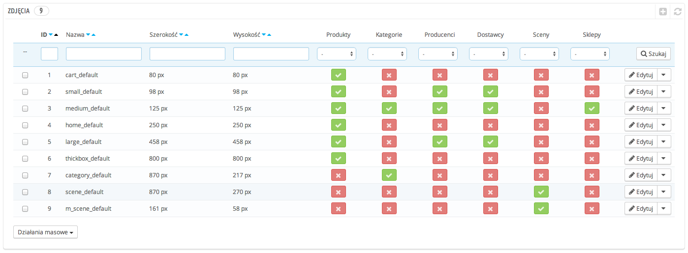
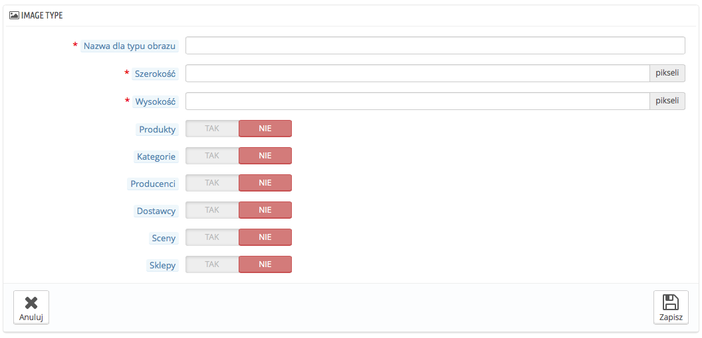
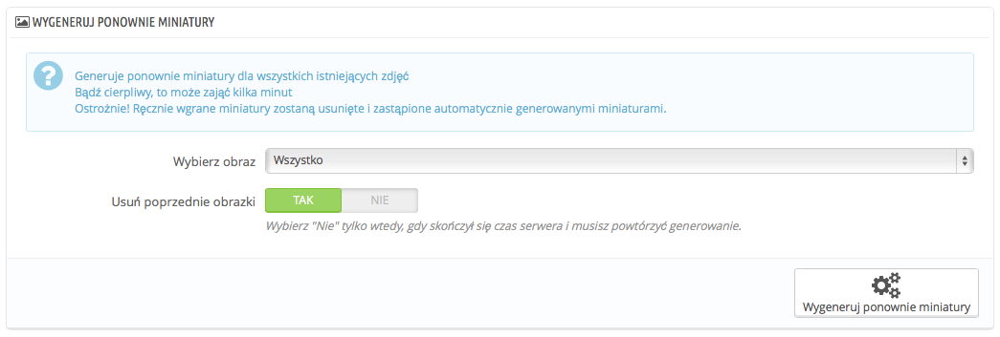

# Zdjęcia - Ustawienia

Ustawienia strony "Zdjęcia" pozwolą Ci na skonfigurowanie wielu rozmiarów zdjęć, które będą dostępne dla Twoich klientów w sklepie.

Kiedy przesyłasz zdjęcia do PrestaShopa, Generuje on automatycznie różne rozmiary zdjęć, wliczając w to pliki poglądowe, oraz wersję mobilną (w zależności od przeznaczenia zdjęcia) Dlatego wystarczy, że prześlesz jedną, główną wersję zdjęcia, na tyle też dużą, że będzie mogła być przekształcona automatycznie na wszystkie rozmiary.

Jeśli chcesz upewnić się, że rozmiar zdjęcia jest odpowiedni, powinieneś przesyłać obraz, który ma prawidłowe proporcję, która będzie pasować do obrazów o innych wymiarach. Jeśli Twój obraz nie ma tej samej proporcji długości do szerokości, co ustawienia, to może się zdarzyć, że pojawią się białe pola na przeskalowanych obrazach.

Możesz włączyć rozmiar obrazka dla określonych typów zawartości, bezpośrednio na liście rozmiarów obrazów.

Na stronie Preferencje->Produkty możesz określić, czy chcesz, aby zdjęcie było automatycznie przybliżane po najechaniu na nie kursorem.

## Dodaj nowy rozmiar zdjęcia 

Możesz łatwo dodać nowy rozmiar zdjęcia, a nawet określić do jakiego rodzaju zawartości go stosować.

Naciśnij "Dodaj Nowy" i następnie:

1. Podaj nazwę, szerokość, wysokość.
2. Określ dla jakiego typu zawartości należy go stosować.
3. Zapisz.

## Opcje generowania zdjęć 

*   **Format obrazu.** Masz do wyboru dwa najpopularniejsze formaty zdjęć: JPEG oraz PNG. Obydwa są rozpoznawalne przez przeglądarki. JPEG potrafi dobrze kompresować, ale w wyniku tego mogą być widoczne skazy na obrazach. Stopień kompresji PNG nie jest tak dobry jak przy JPEG, ale jest też mniej skaz. Ponadto niektóre stare przeglądarki mogą mieć problem w tym formatem.

    Wybór pomiędzy jednym a drugim formatem jest kwestią gustu. JPEG jest rekomendowany. Jeśli jednak zależy Ci na mniejszej kompresji i lepszej jakości, użyj drugiej opcji "Użyj PNG tylko jeżeli zdjęcie podstawowe jest w formacie PNG".

    Format PNG, nie jest kompatybilny z modułem znaku wodnego.
* **Kompresja JPEG**. Nie wybieraj niczego poniżej 80, a w najgorszym razie 75, jeśli obawiasz się widocznych skaz.
* **Kompresja PNG.** Nie wybieraj niczego poniżej 6, a w najgorszym razie 7, jeśli obawiasz się widocznych skaz.
* **Generuje obrazy na podstawie jednej strony obrazu źródłowego**. ta funkcja pozwala Ci na określenie położenia obrazu w określonym miejscu:\

  * wybierz "Wysokość", aby zdjęcie wypełnić na wysokość ramki( w tym czasie szerokość jest zmieniona proporcjonalnie do wysokości obrazu).
  * wybierz "Szerokość", aby zdjęcie wypełnić na szerokość ramki( w tym czasie wysokość jest zmieniona proporcjonalnie do szerokości obrazu).
  * wybierz "Automatyczny", aby szerokość i wysokość były przeliczane tak, aby zająć jak najwięcej ramki.
* **Maksymalny rozmiar pliku dla produktów klientów.** Twoi klienci mogą przesyłać zdjęcia produktów. Domyślnie PrestaShop określa tę wielkość na podstawie maksymalnej wartości dopuszczalnej przez PHP- to oznacza kilka Megabajtów, 8388608 bajtów, to 8 Mb. Możesz powiększyć tę wartość, jeśli to potrzebne, ale upewnij się, że PHP przyjmie przesłanie danych w tym rozmiarze.
* **Szerokość zdjęcia produktu.** Domyślnie klienci mogą przesłać zdjęcie o maksymalnej szerokości 64 pikseli.
* **Wysokość zdjęcia produktu.** Domyślnie klienci mogą przesłać zdjęcie o maksymalnej wysokości 64 pikseli.

## Wygeneruj ponownie miniatury 

Możesz być niezadowolony z obecnych rozmiarów miniatur w Twoim sklepie. Ta część pozwoli Ci na ponowne ich wygenerowanie - albo ograniczenie tego procesu do specyficznego typu zawartości.

1. Zmień rozmiary zdjęć na tabeli omówionej powyżej.
2. Zaznacz jaki typ zawartości powinien być wygenerowany ponownie.
3. Określ czy poprzednie miniatury mają być zachowane, czy nie.
4. Naciśnij "Wygeneruj ponownie miniatury".

Miniatury przesłane ręcznie zostaną usunięte i zastąpione przez te wygenerowane automatycznie.
