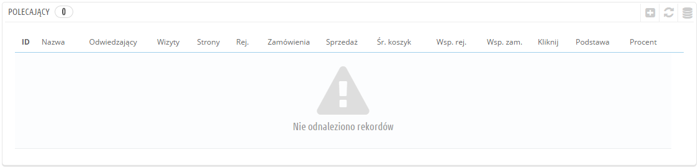
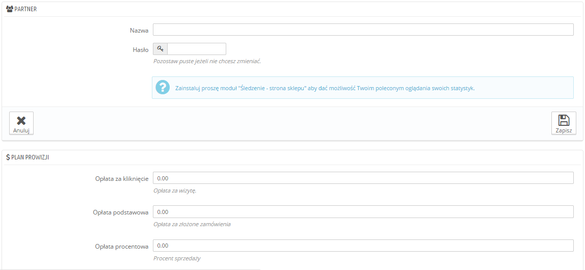
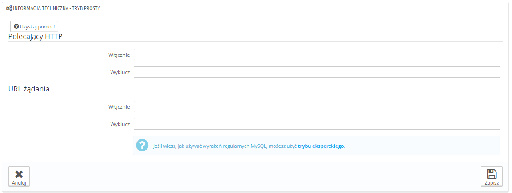
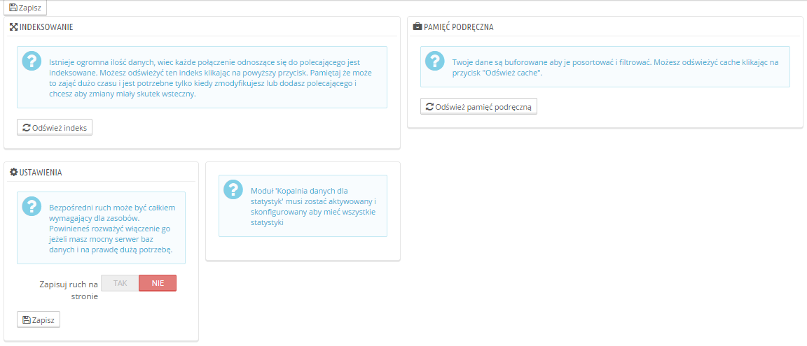

# Polecający

Strona przekierowująca jest stroną, która doprowadzi do Twojego sklepu co najmniej jednego odwiedzającego. Strona ta zawiera link do Twojego e-sklepu, który pomoże Ci w zgromadzeniu odbiorców i tym samym w zwiększeniu sprzedaży.

Warto pamiętać, że niektóre ze stron przekierowujących są bardziej istotne niż inne. Twoi partnerzy mają możliwość umieszczenia linku do Twojego e-sklepu na swojej stronie. Zapewne zarówno oni (tak jak i Ty) chcieliby mieć dostęp do informacji ilu odwiedzających trafiło na docelową stronę dzięki wygenerowanemu linkowi. Oczywiście jest to możliwe. Możesz wynagradzać partnerów za udostępnienie linku do Twojego e-sklepu w zależności od tego jak oceniasz poprawę ruchu na swojej stronie.\
&#x20;W rzeczywistości nazywamy to “Zawarciem Partnerstwa”, a ta strona posłuży Ci do stworzenia prawdziwego Programu Partnerskiego, który umożliwi im zalogowanie się do niego, by zobaczyć liczbę odwiedzin i sprzedaży jaką wygenerował jego link. Nie zapominaj, że zarejestrowani partnerzy generują liczbę odwiedzających w Twoim sklepie. Jak już wiesz program partnerski stanowi narzędzie umożliwiające podgląd liczby odwiedzających, co pozwoli Ci lepiej oszacować wielkość ich wynagrodzenia za pomoc w zwiększaniu ruchu na Twojej stronie.

Narzędzie Programu Partnerskiego PrestaShop może zostać porównane do tabeli panelu statystyk dostępnego dla innych członków jak i Twojej ekipy. Podczas tworzenia kampanii partnerskiej dla strony, możesz jej przypisać dostęp do wszystkich działań, które wygeneruje na stronie waszego e-butiku przez ten link: [http://example.com/modules/trackingfront/stats.php](http://example.com/modules/trackingfront/stats.php).

Na liście oddziałów, ilości kliknięć, baza i procenty są obliczane pod względem kliknięć, a odsetek sprzedaży pod względem sprzedaży rzeczywistej strony partnerskiej.

## Dodanie nowego polecającego 

Program partnerski pozwala Ci na udzielenie polecającym uprzywilejowanego dostępu. Dzięki niemu będą mogli zobaczyć wszelkie statystyki przedstawiające ilość osób odwiedzających pochodzących z ich strony. Aby im to umożliwić musisz stworzyć im konta w swoim programie partnerskim, a następnie zdefiniować rodzaj wynagrodzenia uzależniony od ilości osób odwiedzających oraz osiągniętej przez to sprzedaży.

Aby dodać nowego człona do programu partnerskiego kliknij na "Dodaj nowego polecającego", który przekieruje Cię do właściwego formularza.

Każda z sekcji jest ważna:

* **Polecający**. Konto polecającego w programie partnerskim.\

  * **Nazwa**. Aby zalogować się do back-office programu partnerskiego wymagany jest login. Możecie to być nazwa lub adres e-mail. Istotnym jest, abyście mogli go łatwo zapamiętać.
  * **Hasło**. Przy pierwszym tworzeniu konta PrestaShop zapisuje hasło i login. Kiedy będziesz chciał zmienić konto (np. w przypadku kiedy będziesz chciał zmienić wysokość prowizji) pole z hasłem będzie puste. Nie oznacza to jednak, że hasło nie zostało zapisane, po prostu jeśli wpiszesz inne hasło w puste pole zastąpi ono dotychczasowe hasło.
* **Plan prowizji**. To w tym miejscu ustalasz wynagrodzenie polecającego. Jest to określona suma pieniędzy przysługująca mu w zależności od rodzaju działań osób odwiedzających, które znalazły się na stronie e-sklepu przez jego link.\

  * **Opłata za kliknięcie**. W tym miejscu określisz wartość wynagrodzenia za jedną osobę odwiedzającą. Partner otrzyma określone wynagrodzenie za każdym razem, gdy jakaś osoba odwiedzi Twój e-sklep dzięki linkowi zamieszczonemu na jego stronie.
  * **Opłata podstawowa**. Możesz również wynagradzać swojego partnera w zależności od tego czy odwiedzający kupują Twoje produkty. Należy zaznaczyć, że ma to miejsce tylko wtedy jeśli zakup odbywa się w trakcie sesji po kliknięciu na link odnoszący do e-sklepu, znajdujący się na stronie partnera.
  * **Opłata procentowa**. Oprócz wynagrodzenia zasadniczego (lub zamiast niego) możesz wynagradzać swojego partnera procentem od sprzedaży. Należy jednak pamiętać, że przez sprzedaż rozumiemy w tym wypadku zakup produktu/produktów w sesji po kliknięciu na link odnoszący do e-sklepu, znajdujący się na stronie partnera.
* **Informacja techniczna - Tryb prosty**. Jest to niezwykle ważne ponieważ to pole sprawi, że system zacznie odróżniać polecającego od innej strony przekierowującej. Po konfiguracji należy zrobić kilka testów, aby upewnić się, że rozpoczęcie programu partnerskiego zostało przeprowadzone prawidłowo.
  * **Polecający HTTP**. W polu “Włącznie” wpisz nazwę domeny, którą chcesz monitorować dla danego programu partnerskiego.
  * **URI żądania**. W polu “Włącznie” umieść ostatnia część podlinkowanego adresu. System będzie monitorował strony przekierowujące, które zawierają specjalne zapytanie w adresie. Na przykład, możesz monitorować strony przekierowujące, które posiadają ?prestaff= w argumencie ich URL.
* **Informacja techniczna - Tryb zaawansowany**. Podczas gdy tryb odnosi elementy wpisane w polu przy pomocy “LIKE” MySQL, tryb zaawansowany używa wyrażeń regularnych. Może się to okazać o wiele bardziej wydajne, ale tym samym trudniejsze w utrzymaniu. Używaj tych pól tylko w przypadku kiedy bardzo dobrze znasz się na wyrażeniach regularnych.

W sekcji “Pomoc” znajdziesz cenne wskazówki jak ustawić program partnerski. Przeczytaj je uważnie.

## Ustawienia 

Ustawienia stron przekierowujących są przede wszystkim narzędziem, które pomoże Ci lepiej zarządzać programem partnerskim.

Istnieją trzy możliwości:

* **Zapisywanie ruchu bezpośredniego?**. Ruch bezpośredni odpowiada liczbie osób, które odwiedzają e-sklep, wpisując jego adres w przeglądarce. Mimo, że ci klienci są ważni, gdyż naprawdę znają Twój e-sklep i są zainteresowani znajdującymi się w nim produktami (w przeciwieństwie do odwiedzających trafiających na stronę e-sklepu poprzez link przekierowujący, ponieważ w efekcie nie mają pojęcia na jakiej stronie się znajdą) to zapisywanie tych informacji może w sposób znaczący obciążyć bazę danych. Dlatego też domyślnie ten ruch nie jest ani zapisywany ani analizowany. Włącz tę funkcję tylko w przypadku jeśli dokładnie wiesz czemu ma ona Tobie służyć.
* **Indeksowanie**. Kiedy dodajesz nowy program partnerski i chcesz zanalizować dotychczasowy ruch na stronie sklepu wg nowych ustawień musisz kliknąć na przycisk “Ponowne indeksowanie".
* **Cache**. Dane, które zbiera PrestaShop są umieszczane w cache. W celu regularnego odświeżania danych możesz użyć przycisku “Odświeżenie cache”.
