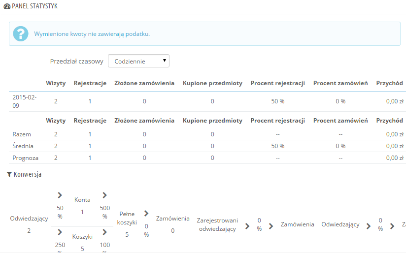
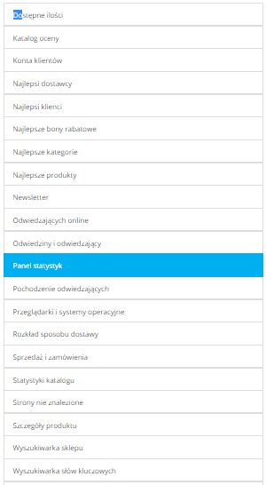

# Statystyki

W tym podrozdziale skupimy się na pokazaniu użyteczności oraz istoty różnych statystyk. Klikając na jakąkolwiek z kategorii zamieszczonych w menu po lewej stronie, centralna sekcja zmienia się przedstawiając najbardziej aktualne liczby. Dla większości statystyk widnieje wyjaśnienie, tak abyś mógł zrozumieć przedstawione informacje i wykorzystać je w celu poprawy zarządzania e-sklepem i zwiększenia tym samym jego obrotów.

Począwszy od pierwszego dnia instalacji PrestaShop  gromadzi statystyki. Jeżeli nie chcesz, aby dane były zbierane z dniem otwarcia Twojego sklepu (i w istocie usunąć wszystkie dane pochodzące z fazy testów), możecie skorzystać z opcji "Période de nettoyage automatique" najpóźniej 24 godziny przed ostatecznym uruchomieniem e-sklepu.

## Główny Interface 

Domyślnie, strona wyświetla panel statystyk, omówienie danych (wielkości) zebranych poprzez system PrestaShop począwszy od dnia uruchomienia sklepu.

Menu na górze strony pozwala na wybranie przedziału czasowego, który ma zostać wyświetlony. Dostępne są trzy opcje:

* Aktualny dzień, miesiąc, rok.
* Poprzedni dzień, miesiąc, rok.
* Konkretna data.

Panel statystyk składa się z 8 sekcji:

* **Panel statystyk**. Stanowi sedno tej funkcji. PrestaShop w jednej tabeli wyświetla przegląd najważniejszych danych, które zostały zebrane w określonym czasie: odwiedzający, liczba rejestracji, nowe zamówienia, sprzedane produkty, odsetek rejestracji na jednego odwiedzającego, odsetek zamówień na jednego odwiedzającego, całkowita ilość sprzedaży. Możesz również dostosować szczegółowość tabeli za pomocą rozwijanej listy na górze po prawej stronie sekcji. Do wyboru są następujące okresy czasu: dzień, tydzień, miesiąc, rok.Wybór okresu nie wpływa na trzy linie znajdujące się u dołu strony: suma, średnia i prognozy. Pozwolą Ci na lepszą ocenę stanu Twojego sklepu.
* **Konwersja**. Ta sekcja daje wyobrażenie o wartości każdego odwiedzającego lub zarejestrowanego klienta, poprzez utworzenie zestawienia w zależności od liczby zamówień.
* **Rozdział płatności**. Ta sekcja przedstawia sposoby płatności najczęściej wybierane przez Twoich klientów. Na podstawie tych danych, masz możliwość dostosowania Twojego sklepu (a nawet firmy) w taki sposób, by lepiej zrozumieć najczęściej używane rozwiązania. Jeżeli chcesz, by Twoi klienci korzystali z takiego rozwiązania, które Ty preferujesz możesz je uwypuklić.
* **Rozkład kategorii**. Ta sekcja udziela informacji pod względem kategorii. Dla każdej z nich, przedstawione zostają przydatne liczby z następujących domen: produkty, sprzedaż, odsetek produktów z całego katalogu, odsetek wszystkich sprzedaży w sklepie, średnia cena. Jeżeli zauważysz, że jedna z kategorii charakteryzuje się większą popularnością niż inne, to możesz zacząć ją promować. Z drugiej strony, możesz również zwiększyć wyniki tej kategorii, która Cię rozczarowała poprzez uruchomienie akcji promocyjnej proponując np. bony zniżkowe.\
  Wybierając przełącznik “Strefa” na górze po prawej stronie sekcji, możesz zawęzić wyniki do określonego obszaru geograficznego, i tym samym zweryfikować, która z kategorii odnosi sukces, a która wręcz przeciwnie, pozostawia wiele do życzenia na określonym rynku.
* **Rozkład języków**. Twoi klienci mogą wybrać język w chwili rejestracji, a Ty możesz zobaczyć to w sposób globalny właśnie dzięki tej sekcji. Spraw, żeby wszystkie produkty zostały poprawnie przetłumaczone na co najmniej dwa najbardziej popularne języki.
* **Rozkład stref**. Masz możliwość filtrowania innych sekcji według regionu geograficznego, natomiast ta sekcja pozwoli Ci na bezpośrednie wyświetlenie liczby zarejestrowanych klientów oraz liczbę zrealizowanej sprzedaży (wraz z wartościami procentowymi).
* **Rozkład płatności**. Jeżeli zaakceptujesz więcej niż jedną walutę, ta sekcja pomoże Ci w ustaleniu, która z nich jest najczęściej używana przez klientów. Wybierając przełącznik “Strefa” na górze po prawej stronie sekcji możesz zawęzić wyniki do określonego obszaru geograficznego, co pozwoli Ci na oszacowanie, która z walut jest najczęściej używana na określonym rynku.
* **Rozkład atrybutów**. W tym wypadku chodzi bardziej o wewnętrzny rodzaj statystyk, które umożliwiają zaobserwowanie, które z atrybutów i grup atrybutów są najczęściej używane względem produktów.

## Lista dostępnych statystyk 

Większość danych statystycznych może zostać pobrana w formie pliku CSV, po kliknięciu na “Export CSV”.

* **Dostępne ilości**. Ta sekcja umożliwia podgląd dostępnej ilości w aktualnym magazynie.
* **Najlepsze kategorie**. Ta sekcja pokazuje wydajność sklepu  wg wybranych wcześniej kategorii. Dla każdej kategorii wyświetlają się informacje dotyczące ilości sprzedanych produktów, przychodu ze sprzedaży oraz liczby odsłon. W celu poprawienia spójności sklepu, starajcie się regularnie przeglądać wyniki różnych kategorii.
* **Najlepsi klienci**. W tej sekcji znajdziesz listę najlepszych klientów Twojego e-sklepu. Dodatkowo masz dostęp do ich danych kontaktowych, liczby odwiedzin strony, liczby odwiedzanych podstron i łącznej sumy jaką wydali w Twoim e-sklepie. Weź pod uwagę te informacje i zadbaj o swoich wiernych klientów. Chcąc zmienić sposób wyświetlania tych informacji, kliknij przycisk na górze strony.
* **Najlepsi dostawcy**. Ta sekcja proponuje statystyki dotyczące dostawców, w których zawiera się wysokość sprzedaży oraz uzyskane z niej przychody.
* **Najlepsze bony rabatowe**. Ta sekcja zawiera zestawienie korzystania z bonów rabatowych, promocji oraz obniżek cenowych (np. drugi produkt za 50%) wdrożonych bezpośrednio lub za pośrednictwem kampanii promocyjnej. W tabeli został wyświetlony również obrót, jak i liczba użytych bonów rabatowych.
* **Najlepsze produkty**. Ta sekcja pokazuje najczęściej wyświetlane produkty. Będziesz miał dostęp do utargu, średniej dziennej sprzedaży, liczby odsłon oraz dostępnej ilości w magazynie. Dzięki tym informacjom bez trudu rozpoznasz najlepiej sprzedające się produkty, co pozwoli Ci na ewentualne dostosowanie ceny (zmniejszenie jej lub zwiększenie), bądź też zaproponowanie rabatu na konkretny produkt.
* **Przeglądarki i systemy operacyjne**. Dzięki tej sekcji dowiesz się z jakich przeglądarek internetowych korzystają Twoi klienci odwiedzając Twój e-sklep. A zatem rozsądnym wydaje się sprawdzenie czy Twój sklep jest w pełni zgodny z minimum trzema najpopularniejszymi przeglądarkami. Dodatkowo dowiesz się czy klienci odwiedzają sklep korzystając ze smartfonów. Jeżeli liczba takich klientów jest znacząca, może warto było by zastanowić się nad stworzeniem wersji mobilnej e-sklepu?\
  Wreszcie będziesz w stanie zanalizować system operacyjny, którego używają Twoi klienci. Upewnij się, że Twój e-sklep jest kompatybilny ze wszystkimi platformami używanymi przez Twoich klientów.
* **Rozkład sposobu dostawy**. Ta sekcja pozwala Ci na ocenę, który z kurierów po pierwsze jest najczęściej wybierany przez klientów, jak i który najlepiej wykonuje swoją pracę (pod względem szybkości oraz skuteczności dostawy).
* **Katalog oceny**. Ta sekcja zawiera przegląd wydajności Twojego katalogu. Dzięki niej dowiesz się czy każdy produkt jest aktywowany oraz czy jego opisy są dostępne we wszystkich wersjach językowych. Możesz również dowiedzieć się, ile zdjęć wyświetla się przy danym produkcie, czy jego sprzedaż plasuje się na dobrym poziomie oraz jaki jest jego stan magazynowy (ile sztuk jest dostępnych). Wyniki są wyświetlane za pomocą kolorowej ikony. Możesz ją spersonalizować określając kolory i ustalając kryteria w tabeli na górze strony. Nie zapomnij o zapisaniu wybranych parametrów.
* **Statystyki katalogu**. Ta sekcja zawiera praktyczne informacje na temat sprzedanych produktów, jak i na temat katalogu w ogóle. Wyniki, które się tutaj pojawiają mogą zostać sklasyfikowane wg kategorii. Możesz również wpłynąć na wydajność katalogu, biorąc pod uwagę następujące wskaźniki:\

  * **Produkty dostępne**. Ilość dostępnych produktów w tej kategorii (domyślnie wszystkie kategorie).
  * **Średnia cena (cena bazowa)**. Średnie ceny produktów w wybranej kategorii.
  * **Wyświetlono stron produktu**. Liczba stron przeglądanych przez klientów. Porównaj te informacje pomiędzy różnymi kategoriami, aby zobaczyć, które produkty są najbardziej popularne, jak również które z nich przyciągają najmniejszą liczbę klientów. Niech posłuży Ci to w ulepszeniu swojego katalogu produktów.
  * **Kupione produkty**. Ilość produktów zakupionych w każdej kategorii.
  * **Średnia liczba oglądanych stron**. Ogólna liczba wizyt dla produktów w wybranej kategorii.
  * **Średnia liczba zakupów**. Całkowity dochód z tytułu sprzedaży produktów w wybranej kategorii.
  * **Ilość dostępnych zdjęć**. Wskazuje liczbę zdjęć powiązanych z produktami w wybranej kategorii. W szybki i łatwy sposób dowiesz się, którym z produktów brakuje zdjęć (w przypadku gdy obrazów jest mniej niż produktów).
  * **Średnia liczba zdjęć**. Liczba obrazów, podzieloną przez liczbę produktów w wybranej kategorii.
  * **Produkty nigdy nie oglądane**. Pokazuje, które z produktów nie przyciągnęły ani jednego odwiedzającego. Sprawdź ich strony, by dowiedzieć się co jest tego przyczyną.
  * **Produkty nigdy nie kupione**. Jeżeli niektóre z produktów nie zostały nigdy zakupione przez Twoich klientów, to jest to kwestia, na którą należy zwrócić szczególną uwagę. Zapewne będziesz potrzebować czasu, by zrozumieć jej przyczyny.
  * **Stopa konwersji**. Przedstawia zależność między liczbą użytkowników a liczbą zakupów. Ważne jest to, aby ten współczynnik był jak najwyższy z możliwych.
  * Tabela na dole strony informuje, jakie produkty z tej kategorii nie zostały zakupione. Aby poprawić sprzedaż tych produktów, sugerujemy zmianę ceny lub napisanie atrakcyjnego opisu.
* **Konta klientów**. Ta strona przedstawia wykres z liczbą stworzonych kont użytkowników w sklepie. Dzięki niemu jesteś w stanie określić wpływ kampanii marketingowej na wysokość sprzedaży. Pozwoli Ci to także na zweryfikowanie liczby zapisanych użytkowników oraz ilu z nich nie dokonało żadnego zakupu. Dodatkowo istnieje możliwość zweryfikowania ilu użytkowników dokonało zakupu zaraz po rejestracji.
* **Newsletter**. Ta strona wyświetla statystyki dotyczące subskrypcji newslettera. Dzięki tej bazie danych sprawisz, że Twoi klienci będą na bieżąco, co pozwoli na zwiększenie ruchu na stronie. Jeżeli zależy Ci na zwiększeniu subskrpcji możesz spróbować zaoferować bony rabatowe w  newsletterze. Możliwość sprawdzenia adresu wszystkich abonentów znajduje się na stronie "Moduły" -> modułu "Newsletter".
* **Strony nie znalezione**. W tym miejscu przedstawiamy strony Twojego katalogu, które nie zostały załadowane (błąd "HTTP 404"). Jest to przydatne przy identyfikacji potencjalnych problemów technicznych, które mogą zmniejszyć wydajność Twojego e-sklepu.
* **Szczegóły produktu**. Ta strona wyświetla wszystkie produkty ze sklepu pod względem ich numeru referencyjnego, nazwy i dostępnej ilości do sprzedaży. Istnieje również możliwość sortowania wyników wybierając interesującą Cię kategorię z menu rozwijanego na górze strony. Aby uzyskać dostęp do statystyk danego produktu, musisz na niego kliknąć. Zostanie wtedy wyświetlony wykres z dwiema informacjami: liczbą sprzedaży oraz liczbą wizyt na stronie produktu, a także współczynnikiem konwersji.
* **Zarejestrowany Klient informacje**. Ta sekcja została podzielona na pięć wykresów:\

  * **Rozkład płci**. Jesteś w stanie zobaczyć w jaki sposób klienci zostali rozdzieleni względem ustawionych zwrotów grzecznościowych (domyślnie Pani, Pan, Państwo). Jednakże pośród nich mogą znaleźć się również inne (np. dr, prof itp.). Tak więc nie można mieć pełnego zaufania  wobec informacji przestawionych na tym wykresie, dopóki klienci nie zostaną podzieleni na dwie podstawowe grupy (kobiety i mężczyźni).
  * **Przedziały wiekowe**. Możesz zobaczyć jak wygląda podział klientów wg wieku. Jeżeli okaże się, że dominujący wiek klientów nie koresponduje z docelową grupą wiekową, do której skierowane były dotychczasowe działania, być może oznacza to, że należałoby skorygować strategię marketingową.
  * **Podział wg kraju**. Możesz szybko sprawdzić w jakich krajach mieszkają Twoi klienci. Zdecydowanie ułatwi to ukierunkowanie działań marketingowych.
  * **Zakresy walut**. Możesz zobaczyć jak rozkłada się częstotliwość używania poszczególnych walut w sklepie oraz w jakich proporcjach.
  * **Podział wg języka**. Możesz zobaczyć, która z wersji językowych jest najczęściej wybierana i zadecydować czy należy poprawić tłumaczenia.&#x20;
* **Sprzedaż i zamówienia**. Te dwa wykresy pokazują zmiany zachodzące w sprzedaży i zamówieniach realizowanych w sklepie. Mogą  być one filtorwane wg kraju, przy użyciu rozwijanego menu znajdującego się nad nimi po prawej stronie.
  * Pierwszy wykres wskazuje na całkowitą liczbę zatwierdzonych zamówień oraz całkowitą liczbę produktów zamówionych. Za pomocą tego wykresu z łatwością możesz ustalić w jakim okresie otrzymałeś najwięcej zamówień.
  * Drugi wykres pozwala na graficzne przedstawienie sprzedaży oraz na analizę określonych ram czasowych, np. okres w którym osiągnąłeś najlepsze rezultaty. Pozwoli Ci to na określenie, kiedy kampania marketingowa będzie najbardziej przydatna.
* **Wyszukiwarka słów kluczowych**. Ta strona pokazuje, które słowa kluczowe wpisywane w wyszukiwarkach skierowały odwiedzających do Twojego sklepu. Dzięki temu bez problemu określisz, które ze słów czynią go łatwo rozpoznawalnym, a które z nich są mało efektywne.&#x20;
* **Wyszukiwarka sklepu**. Ta sekcja zawiera dwa wskaźniki.
  * Pierwszy przedstawia rozkład słów kluczowych, które były wyszukiwane na stronie Twojego sklepu. Możesz zatem dowiedzieć się, które produkty przyciągają największą liczbę klientów. I to właśnie te produkty powinieneś mieć w ciągłym zapasie w magazynie.
  * Drugi to tabela podsumowująca wyszukiwania Twoich klientów. Możesz dzięki temu zobaczyć jakie hasła i jak często były wpisywane oraz jakie dało to wyniki. Ważnym jest, aby wszystkie wyszukiwania klientów doprowadzały do jakiegoś rezultatu (wyniku). Dlatego, aby zwiększyć efektywność wyszukiwania, do najczęściej wyszukiwanych produktów należy dodać takie produkty które spełniają zapotrzebowanie klientów. Dodatkowo przypisując im tagi, sprawisz, że staną się one z łatwością wyszukiwane.
* **Panel statystyk**. Jest to główna strona statystyk, która nadaje im ogólny zarys. Wybierając tę opcję wrócisz do głównego panelu statystyk.
* **Odwiedzający online**.  Ta sekcja pokazuje liczbę osób aktualnie odwiedzających Twój e-sklep. Masz możliwość zobaczenia ich nazwisk oraz stron/podstron, które oglądają. Te dane są na bieżąco uaktualniane z uwzględnieniem ich przemieszczania się pomiędzy kategoriami.
* **Pochodzenie odwiedzających**. Ta strona przedstawia wykres z dziesięcioma najlepszymi stronami i wyszukiwarkami internetowymi,  dzięki którym odwiedzający znaleźli się na stronie Twojego e-sklepu. Najczęściej to przeglądarki internetowe odgrywają ważną rolę. W przypadku gdy stworzysz kampanię marketingową  opierającą się na publikowaniu artykułów/produktów na innych stronach, będziesz w stanie określić jak duży wpływ miało to na Twój e-sklep.  Poniżej wykresu znajdują się nazwy stron, które doprowadziły odbiorców do Twojego e-sklepu  z liczbą odwiedzających z każdej z nich (prawa kolumna).
* **Odwiedziny i odwiedzający**. Ta strona pokazuje statystyki dotyczące odwiedzających Twój e-sklep oraz liczbę ich wizyt. Jak dobrze wiadomo wraz ze wzrostem liczby odwiedzin wrasta popularność  e-sklepu. Zamieszczony tu wykres pomoże Ci w zrozumieniu zachowania użytkowników. Będziesz mógł z niego odczytać ile wizyt miała Twoja strona i porównać ją z liczbą odwiedzających. PrestaShop jest w stanie rozpoznać, kiedy użytkownik odwiedza stronę kilkukrotnie, stąd też istnieje możliwość odnotowania znacznie większej liczby odwiedzin (wizyt) od liczby odwiedzających. Jeżeli różnica między tymi dwiema liczbami jest istotna, może to oznaczać, że posiadasz grupę lojalnych klientów.
