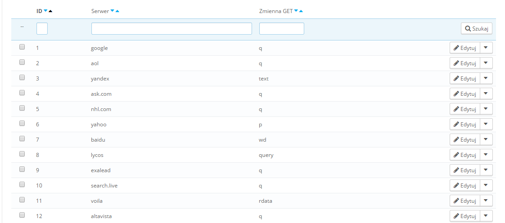
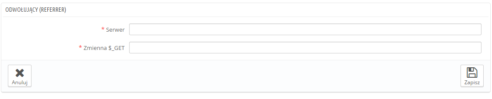

# Wyszukiwarki

Większość odwiedzających Twój sklep internetowy dostaje się do niego za pomocą różnych wyszukiwarek internetowych. Dlatego też jeśli chcesz usprawnić działanie sklepu, musisz sprawić, aby stał się on kompatybilny z większością wyszukiwarek używanych przez Twoich klientów. Pozwoli Ci to również na wyróżnienie najczęstszych zapytań/wyszukiwań.

Na tej stronie znajdziesz tabelę z listą wszystkich wyszukiwarek internetowych zintegrowanych podczas instalacji PrestaShop (te które PrestaShop jest w stanie rozpoznać). Umożliwi to wyodrębnienie z wyszukiwarki internetowej zapytania, jakie wpisał do niej odwiedzający (potencjalny klient).

Jak wiadomo Google jest jedną z najczęściej używanych wyszukiwarek internetowych, jednakże istnieje wiele innych, dzięki którym Twój e-sklep również może zostać znaleziony. Dlatego też powinieneś być w stanie zebrać ich zapytania. Kiedy zauważysz, że jakaś z wyszukiwarek regularnie kieruje odwiedzających do Twojego e-sklepu należy ją dodać do Twojej bazy danych. Jeżeli tego nie zrobisz ci odwiedzający zostaną zaklasyfikowani jako pochodzący “z innej wyszukiwarki internetowej”, co w niczym Ci nie pomoże.

## Dodawanie wyszukiwarki 

Dodawanie wyszukiwarki jest bardzo łatwe.

Załóżmy, że chcesz dodać  DuckDuckGo, przyjazną wyszukiwarkę, która szanuje prywatne dane użytkownika:

1. Uzyskaj adres URL odsyłający do wyszukiwania. Na przykład: [http://duckduckgo.com/?q=kids+shoes](http://duckduckgo.com/?q=kids+shoes)
2. Kliknij na górze strony buton “Dodaj nowy” i w polu “Serwer” wpisz nazwę wyszukiwarki, w tym wypadku: “duckduckgo”.
3. Znajdź zmienną zapytania:\

   1. Znajdź łańcuch zapytania. Występuje on w formie ciągu znaków składającego się kolejno ze znaku “=”, ciągu liter i ze znaku “&” albo końca łańcucha zapytania. Na przykład: "q=buty+dla+dzieci".
   2. zmienna zapytania jest ciągiem liter znajdującym się przed znakiem "=". W naszym przypadku jest to "q". Wpisz go do pola "Zmienna $ \_GET".
4. Kliknij przycisk "Zapisz". Od teraz PrestaShop będzie w stanie rozpoznać odwiedzających z DuckDuckGo.
