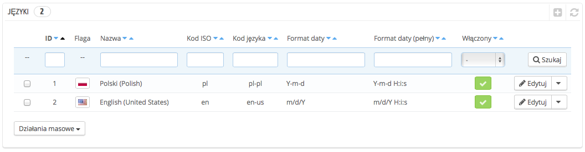
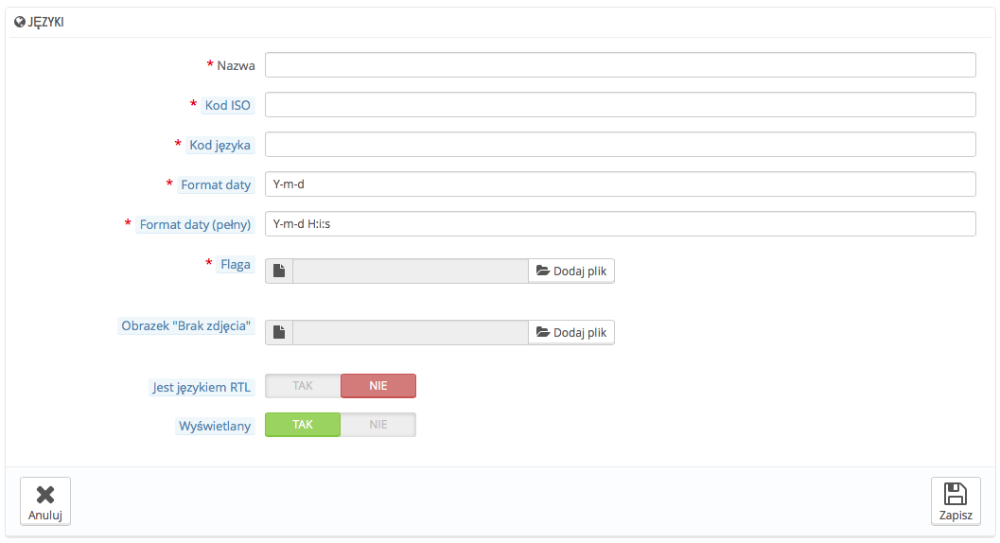

# Języki

PrestaShop został zaprojektowany, aby być wielojęzyczny: jest w nim jeden język domyślny (ten, który został użyty podczas instalacji), a wiele innych jest dostępnych do pobrania.

Strona „Języki” zarządza językami, które zobaczysz w swoim panelu administracyjnym oraz w sklepie.

Strona wyświetla języki już zainstalowane w Twoim sklepie wraz z pewnymi informacjami: kod ISO, kod języka, format daty (krótki lub pełny). Możesz włączyć lub wyłączyć język, klikając w ikonę znajdującą się w kolumnie „Włączony”.

Dodanie nowego języka to jedynie kwestia importu pakietu lokalizacyjnego kraju, który ten język stosuje (na stronie „Lokalizacja”). Jeśli okaże się, że to nie działa albo potrzebujesz czegoś bardziej dostosowanego do Twoich potrzeb, możesz dodać język ręcznie, posługując się formularzem dostępnym po kliknięciu przycisku „Dodaj nowy język”.

## Tworzenie nowego języka 

Stworzenie nowego języka wymaga przetłumaczenia wszystkich tekstów znajdujących się w części interfejsowej, w części administracyjnej sklepu, w modułach etc. Można również zaryzykować użycie tłumaczeń domyślnych w języku angielskim. Tłumaczenie odbywa się przy pomocy narzędzia na stronie „Tłumaczenia” w menu „Lokalizacja”.

Możesz również wprowadzić nowy język, aby lepiej zintegrować pakiet językowy, który pobrałbyś ze strony PrestaShop.

W celu wprowadzenia nowego języka należy uzupełnić tyle pól formularza, ile to tylko możliwe:

* **Nazwa**. To pole widoczne publicznie. Jeśli tworzysz język dla konkretnego regionu, możesz to zaznaczyć w nazwie na przykład: "Francuski (Quebec)".
* **Kod ISO**. Wprowadź odpowiedni 2-literowy kod ISO 639-1. W celu uzyskania więcej informacji zajrzyj tutaj: [http://en.wikipedia.org/wiki/List\_of\_ISO\_639-1\_codes](http://en.wikipedia.org/wiki/List\_of\_ISO\_639-1\_codes).\
  &#x20;W przypadku importowania pakietu językowego, kod ten powinien dokładnie odpowiadać jednemu z pakietu.
* **Kod języka**. Wprowadź odpowiedni 4-literowy kod języka, w postaci xx-yy, xx to kod języka ISO (tak samo jak wyżej), a yy to kod ISO kraju, przy użyciu ISO 3166-1 alpha-2 ([http://en.wikipedia.org/wiki/ISO\_3166-1\_alpha-2](http://en.wikipedia.org/wiki/ISO\_3166-1\_alpha-2)). W celu uzyskania więcej informacji zajrzyj tutaj: [http://en.wikipedia.org/wiki/IETF\_language\_tag](http://en.wikipedia.org/wiki/IETF\_language\_tag) .
* **Format daty**. Kraje nie zawsze stosują ten sam format daty (Zobacz: [http://en.wikipedia.org/wiki/Date\_format\_by\_country](http://en.wikipedia.org/wiki/Date\_format\_by\_country)). Tak więc, datę 02/08/12, klient z Francji odczyta jako "2 sierpnia 2012", klient z USA jako "8 lutego 2012", a klient z Japonii jako "12 sierpnia 2002". Dlatego ważne jest, aby wskazać format daty, powiązany z językiem. Użyte litery powinny być zgodne z funkcją daty () PHP: [http://php.net/manual/en/function.date.php](http://php.net/manual/en/function.date.php).
* **Pełny format daty**. Taki sam jak format daty jak wyżej, lecz uwzględniający również godzinę (godzina : minuty).
* **Flaga**. Prześlij obraz flagi, która odpowiada językowi, który chcesz dodać. Powinien on wynosić 16 \* 11 pikseli. Skorzystaj z darmowego zestawu obrazków Flag famfamfam: [http://www.famfamfam.com/lab/icons/flags/](http://www.famfamfam.com/lab/icons/flags/).
* **Obraz "Brak zdjęcia"**. Prześlij obraz, który będzie wyświetlany, gdy produkt nie ma jeszcze zdjęć. To zdjęcie jest pustym obrazem, z napisem "Nie ma obrazu" lub "Brak zdjęć" w konkretnym języku. Zdjęcie powinno wynosić 250 \* 250 pikseli. Możesz znaleźć już istniejący obraz "Brak zdjęcia" w katalogu /img/l instalacji PrestaShop.
* **Język RTL**. W niektórych językach piszę się od prawej do lewej, a szczególnie w tych używających skryptu arabskiego lub alfabetu hebrajskiego ([http://en.wikipedia.org/wiki/Right-to-left](http://en.wikipedia.org/wiki/Right-to-left)). Gdy motyw PrestaShopStyle jest dobrze zakodowany, to jest w stanie obsłużyć języki RTL - pod warunkiem, że są wyraźnie określone jako takie właśnie języki.
* **Status**. Możesz wyłączyć nowy język, dopóki wszystkie tłumaczenia nie będą gotowe.
* **Sklep powiązany**. Możesz sprawić, że konkretny język będzie dostępny tylko w wybranych sklepach, na przykład tych, których celem są konkretne lokalizacje.

Gdy język zostanie zapisany i włączony, możesz zaimportować jego pakiet językowy. Można to zrobić na stronie "Tłumaczenia" w menu "Lokalizacja". Użyj funkcji "Importuj pakiet językowy ręcznie".

Na koniec, upewnij się, że wszystko działa: przejdź do front-office sklepu i kliknij na wybraną flagę znajdującą się na górze. W podobny sposób Twoi klienci, za pomocą tych ikon, będą mogli wybrać język.
