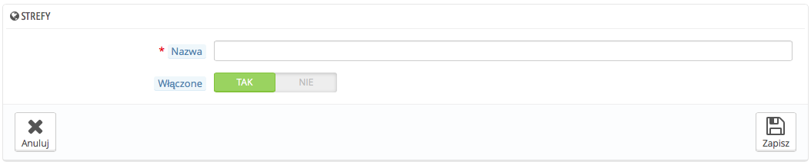
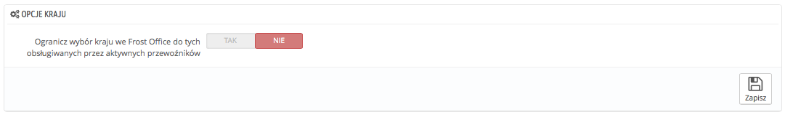
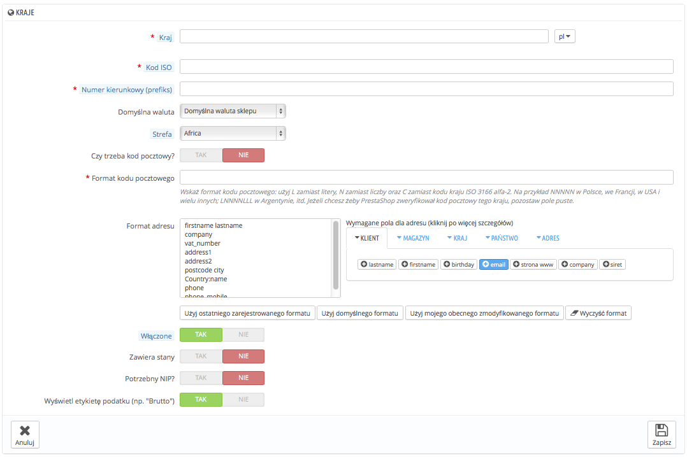

# Kraje

Podczas instalacji PrestaShop musi znać listę wszystkich istniejących krajów, aby klienci mogli jasno wskazać, gdzie mieszkają.

Istnieje około 200 krajów na świecie, ale w PrestaShop jest 244 zarejestrowanych 244. Różnica ta wynika z faktu, że lista krajów obejmuje regiony zamorskie stanowiące część kraju właściwego.

Na przykład, departamenty francuskie oficjalnie znane jako DOM (Gwadelupa, Martynika, Reunion, Majotta i Gujana Francuska) obecnie mają równy status z Francją i noszą nazwę Francuskiego regionu metropolitalnego.Podobnie, Alaska i Hawaje należą do USA.\
Mimo to, przesyłka do Gwadelupy nie jest równoznaczna z przesyłką do Francji, jeśli już to tylko dla opłat wysyłki.Dlatego też lista krajów w PrestaShop oddziela kraj od kontynentu.

Domyślnie włączony jest tylko twój kraj. Jeśli chcesz dodać inne musisz je włączyć je jeden po drugim, w miarę potrzeb klientów. Jeśli nie jesteś pewien, które z nich należy włączyć, sprawdź statystyki. Zobacz z jakich krajów pochodzi większość użytkowników.

Na dole listy sekcja "Opcje krajów" służy tylko do wyświetlenia na front-office krajów, które obejmują Twoi dostawcy. Warto włączyć to ustawienie. Zapobiegnie ono przed koniecznością przewijania wszystkich nazw krajów przez klienta i ułatwi mu znalezienie własnego kraju.

## Dodawanie nowego kraju 

Normalnie PrestaShop jest wyposażony w bazę danych ze wszystkimi obecnymi krajami. Jednakże w przypadku gdyby został stworzony nowy kraj, istnieje możliwość dodania go.

* **Kraj**. Oficjalna nazwa kraju, który chcesz dodać, we wszystkich obsługiwanych językach.W razie jakichkolwiek wątpliwości odnośnie nazwy kraju, sprawdź jego stronę na Wikipedii.
* **Kod ISO**. Kod kraju ISO-3166, który można znaleźć na oficjalnej stronie ISO: [http://www.iso.org/iso/country\_codes/iso\_3166\_code\_lists/country\_names\_and\_code\_elements.htm](http://www.iso.org/iso/country\_codes/iso\_3166\_code\_lists/country\_names\_and\_code\_elements.htm).
* **Prefiks połączeń**. Międzynarodowy kod połączenia kraju, który możesz znaleźć na stronie Wikipedii: [http://en.wikipedia.org/wiki/List\_of\_country\_calling\_codes](http://en.wikipedia.org/wiki/List\_of\_country\_calling\_codes).
* **Domyślna waluta**. Możesz użyć domyślnej waluty (jak również ustawić ją na stronie "Lokalizacja", w menu "Lokalizacja"), lub wybrać jedną z już istniejących. Pamiętaj, że w razie potrzeby możesz dodać nową walutę za pomocą strony "Waluty".
* **Strefa**. Podregion świata, do którego jest przypisany konkretny kraj. Jeśli to konieczne, możesz dodać nowe strefy za pomocą strony "Strefy", z menu "Lokalizacja".
* **Czy trzeba zip / kod pocztowy?**. Wskazuje, czy użytkownik mieszkający w danym kraju musi podać kod pocztowy, podczas logowania się do sklepu.
* **Format kodu pocztowego i kodu zip**. Możesz również podać więcej szczegółów na temat formatu kodu pocztowego (lub kodu zip). Jeśli nie umieścisz niczego, PrestaShop nie będzie weryfikował poprawności kodu pocztowego, gdy otrzyma nowy adres dla danego kraju.\
  Użyj następujących kodów dla kodu pocztowego: "L" dla litery "N" dla numeru i "C" dla kodu ISO kraju (ten, który wprowadziłeś przy ISO powyżej).\
  Jeśli nie wiesz jak wygląda format kodu pocztowego w konkretnym kraju, możesz to sprawdzić na stronie Wikipedii [http://en.wikipedia.org/wiki/List\_of\_postal\_codes](http://en.wikipedia.org/wiki/List\_of\_postal\_codes). Upewnij się, że nie skopiowałeś notacji z Wikipedii, ale ją dostosowałeś! Na przykład, Wikipedia wskazuje, że kod pocztowy na Malcie to "AAA 9999 \*", a zatem dla PrestaShop zapis ten powinien wyglądać następująco "LLL NNNN" (bez końcowego \*).
* **Format adresu**. Podaj szczegóły dotyczące układu adresu, podczas wyświetlania go do klientowi. Możesz kliknąć na poszczególne linki pomocnicze na stronie pola tekstowego, aby dodać więcej pól. W użytkowaniu na żywo, są one automatycznie zastąpione przez PrestaShop z danymi z konta klienta.\
  Zmiany są zapisywane podczas zapisywania całej strony. Jeśli popełnisz błąd, w zależności od sytuacji możesz skorzystać z jednego z czterech przycisków pomocniczych na dole.
* **Włączone**. Wyłączony kraj nie będzie znajdował się w podpowiedziach podczas rejestrowania się klienta w Twoim sklepie.
* **Zawiera stany/regiony**. Wskazuje czy kraj składa się ze stanów/regionów, czy też nie. Dodaje to nowe pole w formularzu adresu PrestaShop. Należy pamiętać, że "stanami" mogą być regiony, prowincje, departamenty. Wszystko to co ma jakiekolwiek znaczenie dla adresu pocztowego danego kraju.
* **Czy potrzebny jest numer identyfikacji podatkowej?** oraz **Wyświetlanie etykiety podatku (np "brutto")**. Numer identyfikacji podatkowej jest używany przez urzędy skarbowe krajów określonych przez prawa podatkowe. Nie każdy kraj potrzebuje, czy posiada taki numer. Dowiedz się, czy nie potrzebujesz takiego numeru w ramach Twojej działalności.
* **Przypisanie sklepu.** Możesz udostępnić kraj do wybranych produktów w Twoim sklepie, na przykład sklepy, które celują w określoną lokalizację.\
  ****
