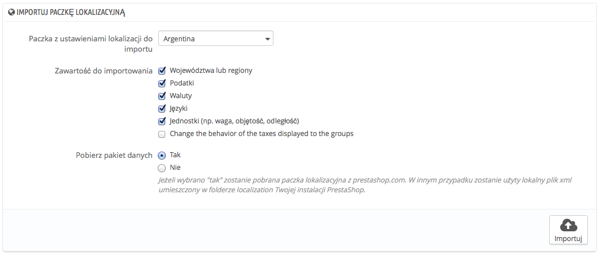
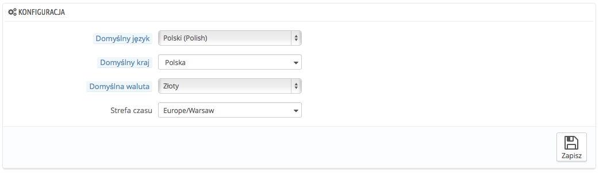
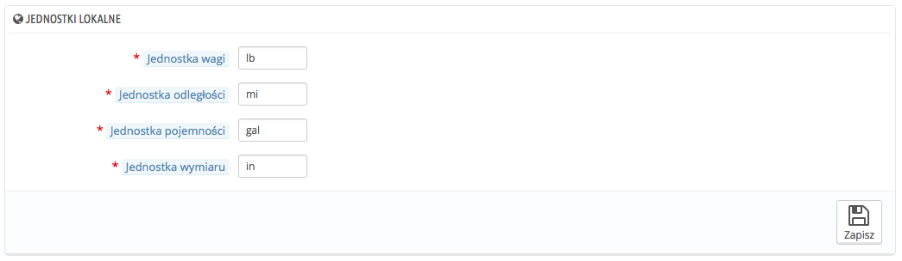
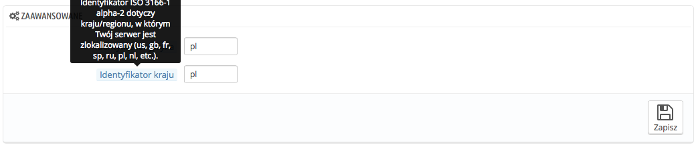

# Lokalizacja

Strona główna w menu „Lokalizacja” pozwala skonfigurować jednostki stosowane dla Twoich produktów.

## Importuj pakiet lokalizacyjny 

Ta sekcja zawiera obszerną listę istniejących pakietów lokalizacyjnych, które można zaimportować. Pozwala ona nie tylko zainstalować PrestaShop z odpowiednimi jednostkami lokalnymi, ale również zawiera wiele innych danych:

* **Regiony.** Podczas transportu produktu do danego kraju ważne może okazać się, by wiedzieć do jakiego regionu geograficznego jest on dostarczany, ponieważ może mieć to wpływ na lokalne opłaty celne i podatki. Dodane regiony można przeglądać i edytować na stronie „Kraje” w menu „Lokalizacja”.
* **Podatki.** Prawdziwe znaczenie lokalizacji ujawnia się w kwestii podatków lokalnych, a te mogą być liczne i zróżnicowane w zależności od państwa czy regionu. PrestaShop zapewnia podstawowe wsparcie dla głównych podatków i przepisów podatkowych. Dodane podatki i ustalone reguły podatkowe mogą być przeglądane i edytowane na stronach „Podatki” i „Reguły podatkowe” w menu „Lokalizacja”.
* **Waluty.** Zagraniczni klienci docenią w Twoim sklepie możliwość konwersji cen do ich waluty. Obok waluty obowiązującej w Twoim kraju powinieneś mieć również amerykańskiego dolara i euro (chyba że Twoja narodowa waluta jest jedną z tych dwóch). Po dodaniu waluty należy ją aktywować, posługując się stroną „Waluty” w menu „Lokalizacja” upewniając się, że kurs wymiany jest prawidłowy. Dodane waluty mogą być przeglądane i edytowane na stronie „Waluty”.
* **Języki.** Wszystkie ogólnodostępne pola w Twoim sklepie mogą być tworzone w wielu językach. Ważne jest, by tak było przynajmniej w przypadku nazw produktów i ich opisów. Należy zauważyć, że importowanie języka pociąga za sobą między innymi import jego formatu daty (d/m/r, m/d/r, d.m.r. etc.). Dodany język może być przeglądany i edytowany na stronach „Języki” w menu „Lokalizacja”..
* **Jednostki.** Waga, rozmiar, objętość, odległość: te jednostki są niezbędne, by poprawnie opisać produkt klientowi oraz dla własnej informacji potrzebnej przy pakowaniu. Mogą być one przeglądane i edytowane na stronie „Lokalizacja”.
* **Zmień zachowanie produktów wyświetlanych dla grup**. To nie są dane do importowania, ale ustawienie, które można zmienić podczas importowania.

Jak możesz zauważyć, te dodatkowe dane są opcjonalne: możesz importować walutę i język dla danego kraju, ale na przykład nie jego podatki.

Chociaż nie należy dodawać zbyt wielu lokalnych danych z uwagi na możliwość przytłoczenia nimi zarówno siebie, jaki klienta, przydatne może być zaimportowanie pakietu lokalizacyjnego dla najczęściej odwiedzanych krajów (zgodnie z Twoimi statystykami).

Oprócz jednostek domyślnych **nie można automatycznie usunąć wszystkich danych dla danego kraju**; jeżeli musisz usunąć dane, należy to zrobić ręcznie na ich odpowiednich stronach w menu „Lokalizacja”.

## Konfiguracja 

Ta sekcja grupuje cztery domyślne, najważniejsze ustawienia lokalne:

* **Domyślny język.** Jest to główny język Twojego sklepu. Ustawienie to wpłynie na język back-office(włączając to główny język dla Twoich produktów) oraz front-office. Należy pamiętać, że język front-office może dostosowywać się do ustawień przeglądarki klienta.
* **Domyślny kraj.** To lokalizacja Twojej firmy. Jeśli masz siedziby w wielu państwach, użyj Twojego głównego bądź oryginalnego kraju.
* **Domyślna waluta.** To waluta, w której określone są początkowo ceny Twoich produktów. Waluty dodawane są poprzez import i aktywację waluty kraju. Zauważ, że jeśli zmienisz walutę już po określeniu cen produktu, trzeba będzie ręcznie zaktualizować wszystkie istniejące ceny. Upewnij się, by  ustawić tę wartość raz na zawsze.
* **Strefa czasowa.** Twoja własna strefa czasowa przydatna jest na przykład w ustalaniu codziennych zniżek: wiesz wtedy dokładnie, kiedy się zaczynają i kończą.

## Lokalizacja 

Jednostki fizyczne prezentowane w tej sekcji (waga, odległość, rozmiar, objętość) są niezbędne zarówno dla prawidłowego opisu produktu klientowi, jak i dla Twojej własnej informacji potrzebnej do pakowania – co więcej, są kluczowym elementem Twojej współpracy z przewoźnikiem.

Wartości te można określić podczas importowania pakietu lokalizacyjnego dla państwa, ale mogą być również ręcznie edytowane w późniejszym czasie. Przykładowo, jeśli wolisz jako jednostkę zastosować centylitr zamiast litr zmień domyślne „l” na „cl”.\
Wartości powinny być podawane w symbolach jednostek określonych w Międzynarodowym Układzie Jednostek Miar [http://en.wikipedia.org/wiki/International\_System\_of\_Units](http://en.wikipedia.org/wiki/International\_System\_of\_Units).

## Zaawansowane 

Ostatnia sekcja wymaga podania języka oraz państwa, w którym Twój serwer jest zlokalizowany, jako kodu (identyfikatora) ISO:      &#x20;

* Dla języka: ISO 639-1 ([http://en.wikipedia.org/wiki/List\_of\_ISO\_639-1\_codes](http://en.wikipedia.org/wiki/List\_of\_ISO\_639-1\_codes)).
* Dla państwa: ISO 3166-1 alfa-2 ([http://en.wikipedia.org/wiki/ISO\_3166-1\_alpha-2](http://en.wikipedia.org/wiki/ISO\_3166-1\_alpha-2)).

Wartości te mogą być ustalone podczas importowania pakietu lokalizacyjnego dla danego państwa, ale można także edytować je ręcznie w późniejszym czasie.
