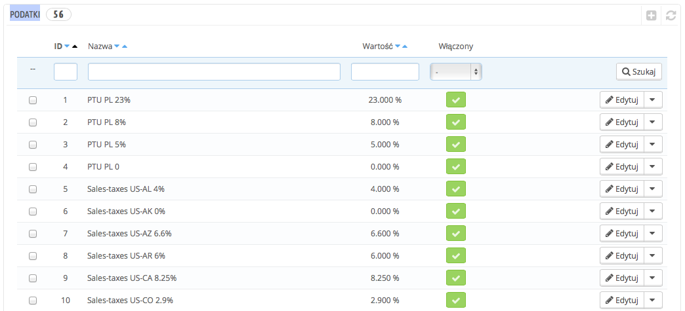
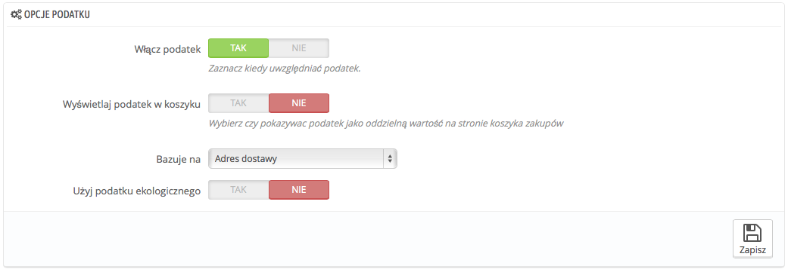
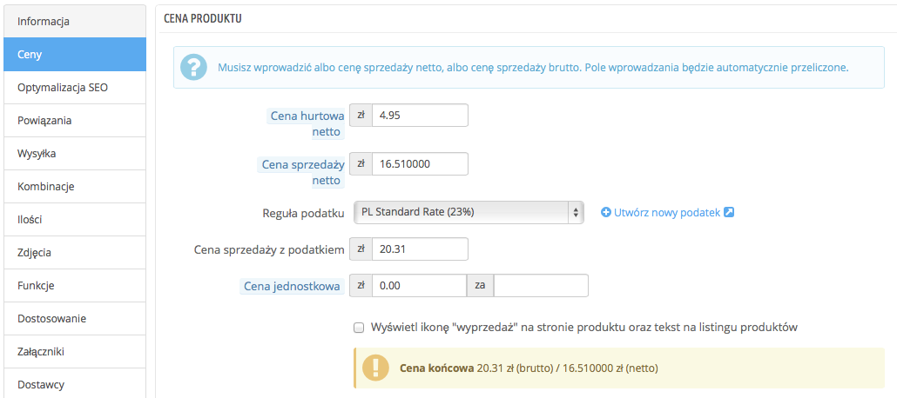
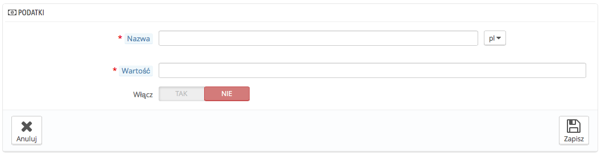

# Podatki

Podatki do skomplikowany temat, który należy zrozumieć w pełni, ponieważ może on mieć wyraźny wpływ na ceny produktu oraz koszty przesyłki. Ten podręcznik nie ma na celu wskazanie wszystkich możliwości podatkowych, ale powinien wskazać Ci konkretne punkty, na które powinno się zwrócić uwagę.

Cytując za Wikipedią: "Podatek – obowiązkowe świadczenie pieniężne pobierane przez związek publicznoprawny (państwo, jednostka samorządu terytorialnego) bez konkretnego, bezpośredniego świadczenia wzajemnego. Zebrane podatki są wykorzystywane na potrzeby realizacji zadań publicznych." W skrócie: każdy produkt, który sprzedajesz podlega opodatkowaniu, które zależy od obecnego prawa.

Istnieje wiele stawek podatkowych na świecie i różnią się one pomiędzy poszczególnymi krajami, a nawet mogą być różne w zależności od stanów, regionów etc (tak jak w przypadku USA, Niemiec, Rosji etc). Tak więc powinieneś upewnić się, że ściśle przestrzegasz prawa podatkowego Twojego kraju, a także tych lokalnych, które mogą Cię obowiązywać. Dowiedz się z odpowiednich lokalnych urzędach wszystkich niezbędnych szczegółów.

Domyślnie w PrestaShopie, podatki nakładane są na we wszystkich krajach/stanach/strefach. Aby nadać konkretny podatek na poszczególny kraj, albo grupy krajów (a nie jakiś innych), musisz nadać regułę podatkową. Reguła podatkowa, jest nadawana poszczególnym produktom podczas tworzenia produktu (zakładka "Ceny")

Nie możesz nałożyć podatku bezpośrednio na produkt, tylko i wyłącznie reguły. Dlatego musisz najpierw zapisać odpowiednie podatki i utworzyć odpowiednie reguły, aby określić kraje, gdzie należy nałożyć i przypisać odpowiedni podatek.

## Opcje podatku 

Na dole strony znajduje się sekcja "Opcje podatku". Te opcje obowiązują w całym sklepie i dla wszystkich zamówień.

* **Włącz podatek**. Określ, czy uwzględniać podatek podczas każdego zamówienie, czy nie.
* **Wyświetlaj podatek w koszyku**. Możesz chcieć, aby klient nie był świadomy podatków, które są nakładane na zamówienie. W takim przypadku wyłącz tę opcję.
* **Bazuje na**. Klient może wybrać, żeby produkt został dostarczony na inny adres, niż ten na rachunku (fakturze). Domyślnie PrestaShop bazuje podatki na adresie dostawy, ale możesz wskazać, aby domyślnie był wysyłany na adres rozliczeniowy.
* **Użyj podatku ekologicznego**. Podatek ekologiczny, to "który służy opodatkowaniu niektórych działań, towarów lub usług w celu włączenia w ich cenę kosztów [ochrony środowiska](http://pl.wikipedia.org/wiki/Ochrona\_%C5%9Brodowiska) lub w celu ukierunkowania producentów i konsumentów na działania charakteryzujące się większym poszanowaniem dla środowiska". Więcej na ten temat znajdziesz na: [http://pl.wikipedia.org/wiki/Podatek\_ekologiczny](http://pl.wikipedia.org/wiki/Podatek\_ekologiczny).\
  &#x20;Gdy włączysz podatek ekologiczny, wszystkie produkty w Back-Office, będą posiadać opcję "Podatku ekologicznego" w zakładce "Ceny". Powinieneś uzupełnić to pole z odpowiednią kwotą, która zależy od prawa podatkowego w Twoim kraju.

Jeśli zdecydujesz włączyć podatek ekologiczny, po dodaniu produktów, musisz pamiętać dodać odpowiedni podatek do nich.

Pamiętaj też, że jeśli ustawiłeś podatek ekologiczny dla Twoich produktów i zdecydujesz wyłączyć podatek, wtedy wszystkie produkty stracą ustawienia podatku ekologicznego i włączenie ponownie podatku będzie oznaczać wprowadzenie wszystkich danych ponownie.

Podatek ekologiczny będzie również widoczny dla klienta na stronie produktu.

## Dodawanie nowego podatku 

Dodawanie nowego podatku jest bardzo łatwe, ponieważ reguły podatkowe  przejmują cały ciężar określania kraju, dla którego podatek jest nakładany. Dlatego też formularz kreacji podatku jest bardzo krótki.

* **Nazwa**. Bądź konkretny i precyzyjny, to pozwoli Ci na szybsze tworzenie reguł podatkowych.\
  &#x20;Polecamy dodać także przypomnienie w nazwie odnoszące się do kraju/grupy/strefy, gdzie dany podatek obowiązuje oraz jego wysokość. To ułatwi zapamiętanie, który podatek przypisać do której reguły.
* **Wartość**. Dokładna wartość podatku w formacie XX.XX.
* **Włącz**. Możesz włączać/wyłączać podatki, kiedy chcesz.

