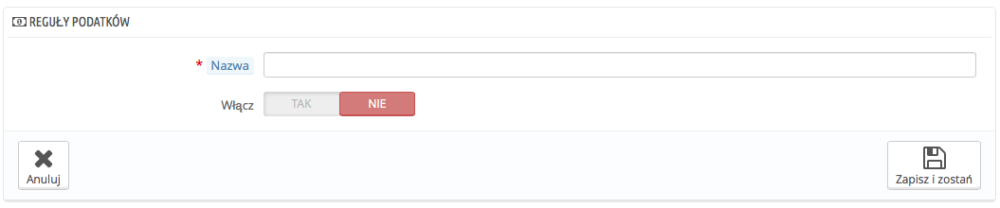

# Reguły podatków

Reguły podatków sprawiają, że poszczególne podatki nakładane są na poszczególne kraje

Domyślnie w PrestaShopie podatek nakładany jest na wszystkie kraje/stany/strefy. Aby nałożyć konkretny podatek, na jeden kraj, albo zbiór krajów, musisz utworzyć regułę podatkową. Ta reguła będzie następnie nakładana na każdy produkt podczas procesu tworzenia produktu (zakładka "Ceny").

Nie możesz nałożyć podatku bezpośrednio na produkt. Dlatego najpierw musisz zapisać odpowiednie podatki, następnie stworzyć regułę, aby określić kraje, gdzie obowiązuje dany podatek, i w końcu ustawić podatek przy produkcie.

Kilka prostych reguł podatkowych jest już wprowadzonych, zależą one od tego, jaki kraj wybierzesz podczas instalacji PrestaShop. Reguły podatkowe są ustawione dla każdego podatku: reguły służą aktualnie jako filtr krajów, ograniczając użycie danego podatku do specyficznego kraju.

Powinieneś edytować kilka zaprezentowanych reguł, aby lepiej zrozumieć jak mogą być ustawione.

## Dodawanie nowej reguły podatkowej 

Możesz dodać tyle reguł, ile potrzebujesz. Ale powinieneś się upewnić także, że wszystkie wymagane podatki są zarejestrowane w sklepie.

Tworzenie nowej reguły odbywa się w dwóch krokach:

1. Utwórz nową regułę podatkową:
   * Naciśnij przycisk "Dodaj nowy".
   * W formularzu, który się pojawi podaj nazwę dla reguły. Nazwa powinna wiele mówić, użyj syglu oznaczającego nazwę kraju, podaj pełną nazwę kraju, może również kwotę podatku, wszystko, co pomoże Ci łatwo to odnaleźć i zidentyfikować ponownie. Jeśli PrestaShop posiada już reguły dla wybranego kraju, możesz się zainspirować nazwami, aby wszystko było spójne\
     .
   * Zaznacz, czy reguła powinna być włączona, czy nie, zawsze możesz ją włączyć później.
   * Naciśnij na przycisk "Zapisz i zostań" strona przeładuje się  i pojawi się poniżej tabela.
2. Określ kraj i zachowania:
   * Przejdź do "nowa reguła podatku" i wypełnij pola:\
     \

     * **Kraj**. Wskaż kraj, dla którego tworzysz regułę.
       * **Stan**. Niektóre kraje posiadają stany zapisane w PrestaShopie (patrz strona "Województwa lub regiony" w menu "Lokalizacja". W takim przypadku możesz zawęzić podatek do danego regionu, albo określić go dla całego kraju. Możesz wybrać więcej niż jeden region/Stan naciskając przycisk CTRL podczas wybierania stanów.
     * **Zakres kodu pocztowego**. Niezależnie od tego, czy kraj posiada zarejestrowane stany, bądź nie, możesz przypisać określony podatek do specyficznego kodu pocztowego klienta. To pole pozwala Ci zdefiniować kody pocztowe, dla których podatek powinien być nakładany: albo pojedynczy kod pocztowy, albo ich zakres rozdzielony myślnikiem. Na przykład: "75000-75012" aby brać pod uwagę wszystkie kody pocztowe pomiędzy tymi dwoma.
     * **Akcja**. Niektórzy klienci mogą mieć adres, który pasuje do więcej niż jednej reguły podatkowej. W takim przypadku możesz określić jak dana reguła ma się zachowywać:
       * **Tylko ten podatek**. Zastosuje tylko ten jeden podatek, a nie żaden z innych pasujących podatków.
       * **Połącz**. Połącz podatki. Na przykład: 100€ + (10% + 5% => 15%) => 115€.
       * **Jeden za drugim**. Nałóż podatek jeden za drugim, na przykład: 100€ + 10% => 110€ + 5% => 115.5€.
     * **Podatek**. Określ podatek używane dla tej reguły. Podatek musi być już zapisany w systemie, jeśli nie jest zaznacz "Bez podatku", wyłącz regułę zachowaj ją i przejdź na stronę "Podatki", gdzie utworzysz brakujący podatek. Następnie powróć do zachowanej reguły i określ wprowadzony podatek.
     * **Opis**. Możesz dodać krótki tekst, jako przypomnienie, dlaczego dana reguła istnieje dla danego kraju.
   * Naciśnij Zapisz i zostań. Kraj zostanie dodany do tabeli poniżej i możesz zacząć dodawać kolejny kraj korzystając z nowych pustych pól.

Zauważ, że domyślny podatek nałożony na Twoje produkty opiera się na domyślnym kraju ustawionym dla Twojego sklepu.
