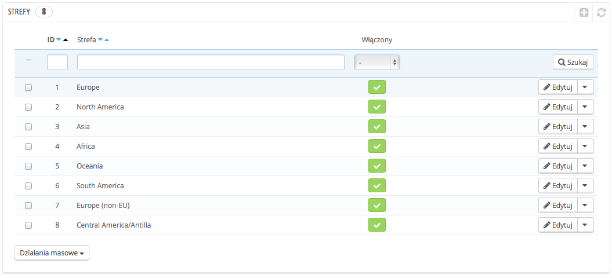
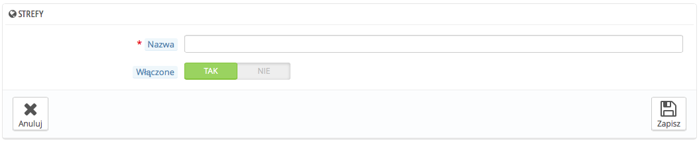

# Strefy

Strefy PrestaShop - to lista podregionów świata ([http://en.wikipedia.org/wiki/Subregion](http://en.wikipedia.org/wiki/Subregion)). Pomaga to w kategoryzacji krajów.

W razie potrzeby można utworzyć więcej stref: kliknij na "Dodaj nową strefę", aby wyświetlić formularz tworzenia.

Wszystko czego potrzebujesz to nazwa i status, na przykład wskazując, że nie pozwalasz na dostawy w Oceanii.\
&#x20;W trybie Multistore, możesz również powiązać strefę z wybranymi sklepami.
