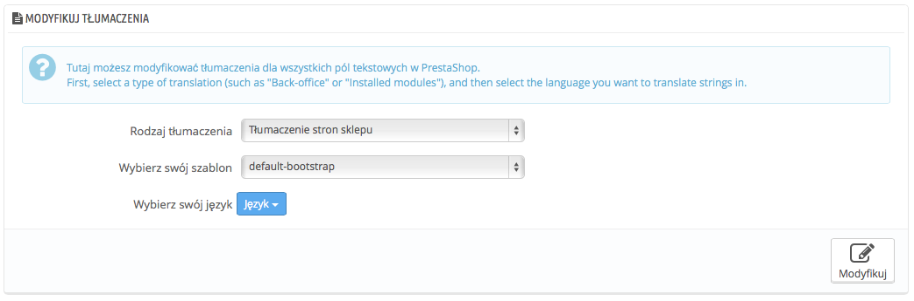
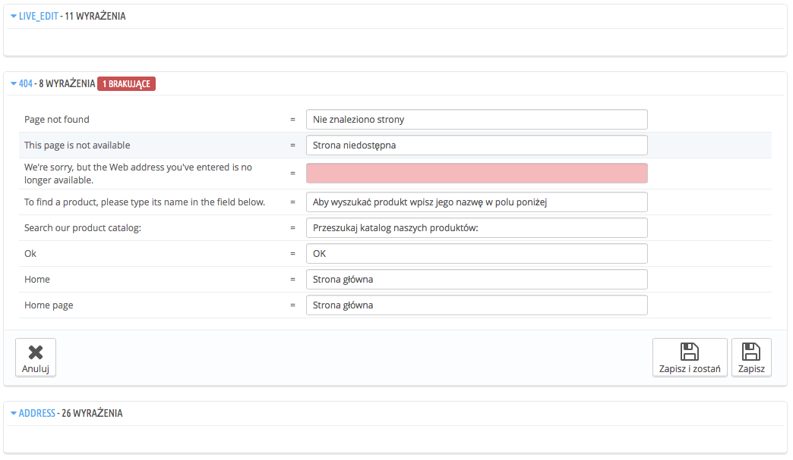
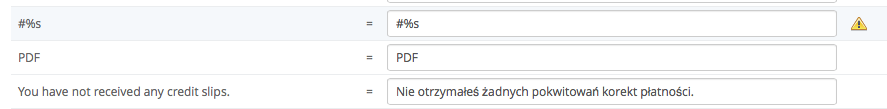
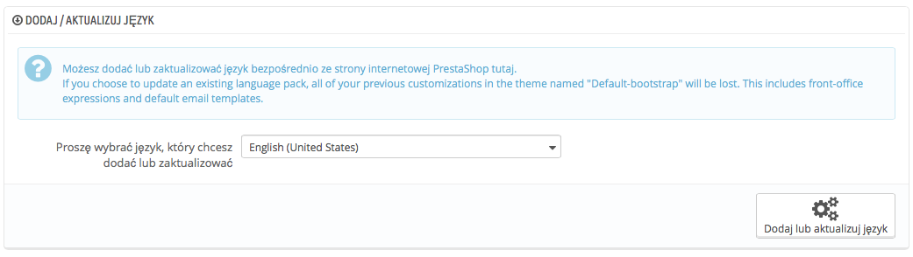
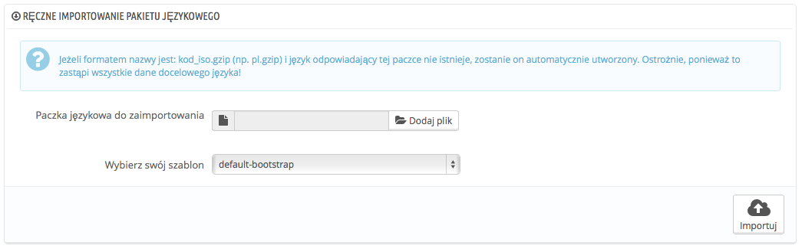
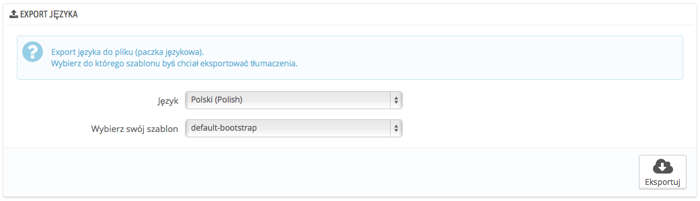
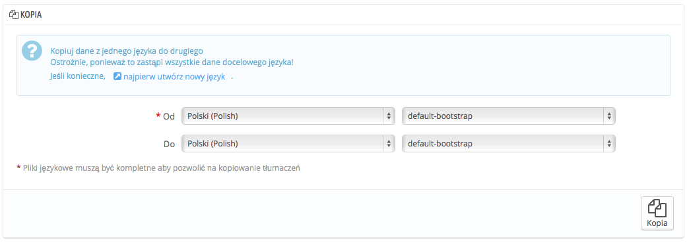

# Tłumaczenia

PrestaShop udostępnia narzędzie do pełnego tłumaczenia sklepu. To pozwoli Tobie dodawać, oraz edytować strony z tłumaczeniami. W ten sposób będziesz "Panem" swojego sklepu i będziesz mógł tłumaczyć teksty bez oczekiwania na oficjalne tłumaczenie poprawionych tekstów.

Nawet jeśli nie chcesz poprawiać pracę tłumaczy, możesz chcieć zmienić nazewnictwo przez nich używane (na mniej formalne, mniej wyszukane itp.) i dostosować wiele dostępnych tekstów w ten sposób dopasować swoją stronę do odbiorców. Na przykład sklep z ubraniami dla miłośników Hip Hopu może używać innych wyrażeń aniżeli sklep z luksusowymi zegarkami.

Proces adaptacji programu do obcego języka nazywa się _internacjonalizacją_ i _lokalizacją,_ albo i 18n lub L10n w skrócie.

Internacjonalizacja to pierwszy etap, podczas którego developerzy wybierają mechanizm do tłumaczenia oprogramowania. Wszystkie ciągi znaków oprogramowania są następnie przetworzone, aby móc z nich korzystać za pomocą tego mechanizmu.\
&#x20;Lokalizacja jest kolejnym krokiem, gdzie dwujęzyczni lub wielojęzyczni użytkownicy oprogramowania tłumaczą ciągi znaków na ich język ojczysty. Lokalizacja może także dostarczać lokalnych danych, aby poprawić oprogramowanie dla lokalnych użytkowników. Możesz dowiedzieć się więcej na ten temat z Wikipedii: [http://en.wikipedia.org/wiki/Internationalization\_and\_localization](http://en.wikipedia.org/wiki/Internationalization\_and\_localization)

Ekipa PrestaShopa zdecydowała skorzystać z własnego narzędzia do tłumaczeń, dzięki czemu każdy, kto zainstaluje PrestaShopa, może dostosowywać sklep do własnych potrzeb.\
&#x20;Tłumaczenie tworzone przez społeczność jest dokonywane za pomocą  narzędzi online, które znajduje się tutaj: [https://crowdin.net/project/prestashop-official](https://crowdin.net/project/prestashop-official).

Oficjalne paczki tłumaczeń mogą zostać pobrane bezpośrednio z poniższego adresu: [http://www.prestashop.com/en/translations](http://www.prestashop.com/en/translations).

## Modyfikacja tłumaczenia 

Najważniejszym narzędziem na stronie "Tłumaczenia" jest sekcja "Modyfikuj tłumaczenia". To tam możesz  określić edycję tłumaczenia i kompletnie spersonalizować każde zdanie, jeśli chcesz.

Zaznacz część obecnego tłumaczenia, którą chcesz edytować:

* **Tłumaczenie stron sklepu**. Widoczny tekst dla Twoich klientów podczas przeglądania Twojego sklepu.
* **Tłumaczenia panelu administracyjnego**. Teksty widoczne dla Ciebie i ekipy obsługującej panel administracyjny.
* **Tłumaczenie informacji o błędach**. Wiadomości o błędach, które mogą pojawić się na stronach sklepu.
* **Tłumaczenie nazwy pola**. Nazwy pól na stronach sklepu i stronach administracyjnych.
* **Tłumaczenie zainstalowanych modułów**. Pojęcia używane przez zainstalowane moduły. Pamiętaj, że moduły, które są dostępne, ale nie zainstalowane, nie będą widoczne.
* **Tłumaczenie PDF**. Pojęcia używane w generowanych plikach PDF: faktury,  listy przewozowe itp.
* **Tłumaczenia wiadomości e-mail.** Pojęcia używane w domyślnych szablonach wiadomości.

Niektóre kategorie posiadają listy rozwijane, gdzie figurują dostępne szablony. Szablony PrestaShopa posiadają własne ciągi znaków, ale także własne moduły, szablony PDF i wiadomości. W ten sposób lista rozwijana pozwala Ci na wybranie, z którym szablonem chcesz pracować.

Gdy dokonasz wyboru szablonu, wybierz język, który chcesz edytować w danej kategorii.

Pojawi się długa stron a, która zawierać będzie setki dostępnych ciągów znaków dla danej kategorii, czasami podzielona na dziesiątki zbiorów pól.

Domyślnie tylko pola, które posiadają nieprzetłumaczone pola będą otwarte. Jeśli chcesz otworzyć wszystkie, naciśnij dwukrotnie na przycisk u góry po lewej, raz, aby wszystkie zamknąć, drugi, aby wszystkie otworzyć. Możesz otwierać i zamykać zbiory pól naciskając na ich tytuły.

Edycja tłumaczenia jest prosta:

* Otwórz zbiór pól
* edytuj ich zawartość
* Naciśnij albo na "Zapisz i zostań", aby zachować dokonane zmiany i kontynuować dalej tłumaczenie, albo naciśnij na "Zapisz", aby zachować zmiany i przejść do strony głównej "Tłumaczenia".

PrestaShop 1.5 wprowadził nową składnię, gdzie ciągi znaków mogą zawierać "schowki", takie jak: `%s`, `%d`, `%1$s`, `%2$d`,

Kiedy znajdziesz tłumaczenie z takimi znakami, to oznacza, że PrestaShop zamieni je dynamicznie na określoną wartość, zanim wyświetli tłumaczenie.

Na przykład " Twoje zamówienie w sklepie %s jest gotowe", znaczek `%s` zostanie zamienione na nazwę sklepu. Dlatego musisz zachowywać te znaki w ostatecznych tłumaczeniach, na przykład to samo tłumaczenie po francusku, wyglądałoby następująco: "Votre commande sur %s a bien été enregistrée."

Technicznie pozwala to na nie rozdzielanie tłumaczeń na części. W taki sposób wyglądało to w starszych wersjach PrestaShopa, że to samo zdanie, było podzielone na dwie części. I podczas gdy to rozwiązanie sprawdzało się dla niektórych języków, dla wielu było właściwie niemożliwe do przetłumaczenia. Dzięki tym "schowkom", PrestaShop 1.5 można przetłumaczyć w całości na jakikolwiek język.

Niektóre pola posiadają znak wykrzyknika po prawej stronie. To wskazuje na obecność "schowków". Możesz nacisnąć na tę ikonę,aby otrzymać więcej informacji.

W przypadku pola ze "schowkiem" upewnij się, że jego zawartość znajdzie się w odpowiednim miejscu zdania ze względu na składnie zdania, a ponadto unikaj dokładnego tłumaczenia.

Numerowane schowki (`%1$s`, `%2$d`, etc.) pozwalają tłumaczom na zmianę porządku w wyświetlaniu informacji, jednocześnie zachowując je w odpowiednim miejscu. Dzięki temu, tłumacz może zmienić tłumaczenie "Order #%1$d from %2$s" na "Zamówienie o numerze: #%1$d  ze sklepu %2$s", albo "Numer twojego zamówienia w sklepie %2$s to: #%1$d".

### Specyficzne funkcje 

Większość kategorii tłumaczeń przedstawia tłumaczenia, w ten sam sposób: pola są zgrupowane w zestawy, które zwijasz/rozwijasz naciskając na ich tytuł. W tytule znajduję się także liczba określając ilość pól tłumaczeń, oraz w na czerwono opisana jest ilość tłumaczeń brakujących.

Zgadza się w to we wszystkich przypadkach oprócz trzech:

* **Tłumaczenie informacji o błędach.** Wszystkie pola tłumaczenia są razem.
* **Tłumaczenie PDF**. Jest tylko jeden zbiór tłumaczeń "PDF".
* **Tłumaczenie wiadomości e-mail** Pola są podzielone na zestawy, ale nie są to już proste pola. Każdy e-mail posiada dwa szablony: HTML, który jest wystylizowany i pokolorowany oraz tekstowy, prosty i czysty. Podczas gdy tekstowy, można edytować bezpośrednio w polu tekstowym, szablon HTML, może być edytowany wyłącznie w zakładce "Edytuj wersję HTML". Po naciśnięciu na niego pojawi się edytor WYSIWYG (what you see is what you get). Za jego pomocą będziesz w stanie zmienić wszystkie elementy wybranego szablonu, począwszy od kolorów, po wielkość czcionki etc.\
  Zwróć uwagę, że szablony e-maili także posiadają "schowki" jak `{lastname}` czy `{shop_name}`, co oznacza, że PrestaShop wypełni te schowki aktualnymi informacjami podczas wysyłki wiadomości. Upewnij się, że znajdują się one w obydwu wersjach e-maila.\
  .png>)

## Dodaj/aktualizuj język 

Tłumaczenia PrestaShopa są dostępne w pakietach, które zawierają w s obie różne kategorii tłumaczeń w jednym pliku. Wiele pakietów językowych jest dostępnych za darmo do pobrania i instalacji bezpośrednio z serwerów PrestaShopa.

PrestaShop zajmie się pobraniem pakietu językowego, rozpakowaniem go i utworzy podkatalog `/translation.`

Możesz zaktualizować zainstalowany pakiet językowy, także bezpośrednio z serwerów PrestaShopa, ale pamiętaj, że każda zmiana, którą mogłeś wprowadzić w tłumaczeniach, zostaną utracone podczas aktualizacji.

## Samodzielny import pakietu językowego 

W przypadku, kiedy nie chcesz skorzystać z oficjalnego pakietu tłumaczenia PrestaShopa, ale raczej z bardziej spersonalizowanego, z jakiegoś innego źródła, to to narzędzie jest dla Ciebie.

Zaznacz plik zip, zaznacz szablon, do którego chcesz dodać pakiet, a następnie naciśnij przycisk "Importuj", a PrestaShop zainstaluje pakiet do katalogu `/translation`.

Jeśli istnieje już katalog z plikami językowymi o taki samym kodzie ISO 639-1, zostanie on zamieniony z aktualnie importowanym.

## Eksportowanie pakietu języka 

Możesz utworzyć swoją paczkę językową za pomocą tego narzędzia, albo jako kopię bezpieczeństwa dla Twoich poprawek w tłumaczeniach, albo  aby podzielić się swoim tłumaczeniem z inną instalacją PrestaShopa.

Po prostu wybierz język oraz szablon wersji językowej, którą chcesz zachować i naciśnij "Eksportuj".

Pamiętaj, że pakiet będzie zawierać informację dotyczącą wspieranego szablonu.

## Kopiowanie 

Możesz skopiować zawartość jednego języka do drugiego. Jest to przydatne kiedy chcesz zamienić język szablonu na ten sam język z innego szablonu.

Wybierz plik źródłowy języka i szablon, oraz język i szablon docelowe, następnie naciśnij przycisk "Kopiuj". W większości przypadków język będzie takie sam na obydwu listach rozwijanych.

Jeśli już istnieje katalog dla danego języka w szablonie docelowym, zostanie on zastąpiony plikami z języka źródłowego.

Jeśli wolisz, to utwórz najpierw nowy język w docelowym szablonie, zanim skopiujesz do niego język źródłowy.
