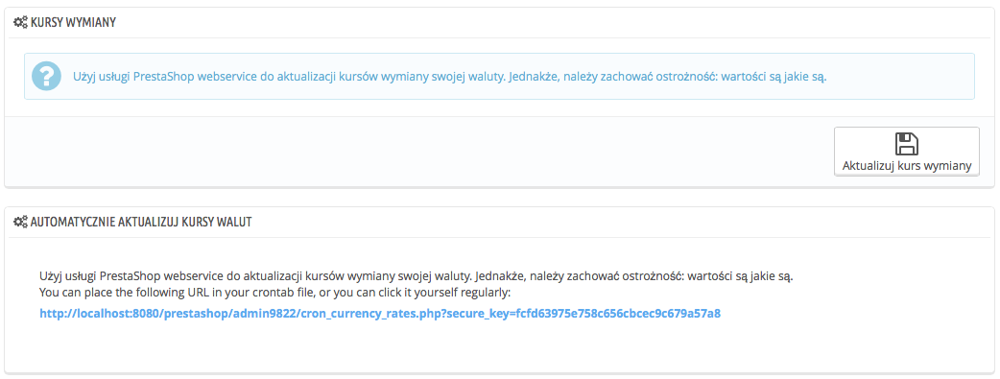

# Waluty

PrestaShop  akceptuje wiele różnych walut. Domyślnie jest dostępna tylko jedna waluta: dla Twojego kraju. Jednakże, możesz dodać i konfigurować inne waluty wg potrzeb Twoich klientów. Klienci doceniają możliwość wyświetlania cen produktów w ich własnej walucie.

Dwie sekcje na dole strony "Waluty" są bardzo proste, ale bardzo ważne, ponieważ odnoszą się do kursu wymiany walutowej pomiędzy dwiema walutami. Kurs wymiany walut zmienia się codzinnie, nie raz w sposób dramatyczny w zależności od bieżących wydarzeń, a twój sklep powinien być aktualizowany do najświeższych wartości.

Aby zmienić domyślną walutę, musisz udać się na stronę "Lokalizacja" w menu "Lokalizacja", i wybrać opcję "Domyślna waluta" w części Konfiguracji. Jeśli waluta, której chcesz użyć, nie jest dostępna, musisz zaimportować walutę z kraju, który z niej korzysta za pomocą Importu paczki lokalizacyjnej dostępnej na tej samej stronie.

## Aktualizacja kursu wymiany walut 

W PrestaShopie istnieją dwa sposoby aktualizacji kursu wymiany walut:

* **Ręcznie**. W sekcji "Kursy wymiany" naciśnij na "Aktualizuj kurs wymiany". To pobierze plik z aktualizacją z serwera PrestaShop.com.
* **Automatycznie**. Ta metoda jest rekomendowana. Zamiast naciskać przycisk "Aktualizuj kurs wymiany" raz dziennie, możesz stworzyć zadanie Cron, który wywoła aktualizację pliku tak często, jak będzie to potrzebne. Aby to zrobić, wykorzystaj podany adres URL w pliku crontab, aby aktywować automatyczną aktualizację. Jeśli nie znasz Crona i Crontab, skontaktuj się z Twoim dostawcą usług.

Zwróć uwagę, że kursy walut są takie jakie są: PrestaShop stara się uważać na podawanie prawidłowych  wartości w pliku, ale mogą się one delikatnie różnić od aktualnych, dzieje się to dlatego że kursy potrafią zmieniać się bardzo szybko w krótkich przedziałach czasowych.

## Dodawanie nowej waluty 

Najprostszym sposobem, aby dodać walutę jest zaimportowanie paczki lokalizacyjnej. Można to zrobić na stronie "Lokalizacja" w menu "Lokalizacja", i wybrać opcję "Domyślna waluta" w części Konfiguracji. Jeśli waluta, której chcesz użyć, nie jest dostępna, musisz zaimportować walutę z kraju, który z niej korzysta za pomocą Importu paczki lokalizacyjnej dostępnej na tej samej stronie. W takim przypadku możesz skorzystać z formularza kreacji.

* **Nazwa waluty**. Nazwa powinna być znajoma i rozpoznawalna, najlepiej w języku, kraju który korzysta z danej waluty.
* **Kod ISO**. Kod ISO 4217 składa się z trzech liter, więcej na ten temat znajdziesz na Wikipedii: [http://pl.wikipedia.org/wiki/ISO\_4217](http://pl.wikipedia.org/wiki/ISO\_4217).
* **Kod numeryczny ISO**. Kod ISO 4217, który składa się z 3 cyfr.
* **Symbol**. Symbol waluty, jeśli takowy posiada, patrz Wikipedia: [http://en.wikipedia.org/wiki/Currency\_sign](http://en.wikipedia.org/wiki/Currency\_sign).
* **Kurs Waluty**. Jest to kurs zdefiniowany według domyślnej waluty Twojego sklepu. Na przykład, jeśli domyślną walutą jest Euro, a aktualną jest dolar, to podaj "1.31" ponieważ aktualnie tyle jest wart dolar w stosunku do euro. Możesz skorzystać w celu obliczania tego konwertera: [http://www.xe.com/ucc/](http://www.xe.com/ucc/).
* **Format waluty**.Określ w jaki sposób chcesz, aby cena była wyświetlana. X oznacza symbol waluty. masz pięć możliwości.
* **Części** **dziesiętne**. Możesz określić, czy Twój sklep powinien wyświetlać części dziesiętne. Podczas gdy możesz wybrać zaokrąglenie wszystkich cen, podczas gdy rabaty i kombinacje produktów będą posiadały części dziesiętne. Możesz powstrzymać to za pomocą tej opcji.
* **Odstępy**. Po wybraniu formatowania waluty, możesz określić, czy chcesz wyświetlać odstęp pomiędzy wartością a symbolem waluty.
* **Włącz**. Każda waluta może być wyłączona w każdej chwili. Albo w trybie edycji, albo w tabeli na stronie walut.
