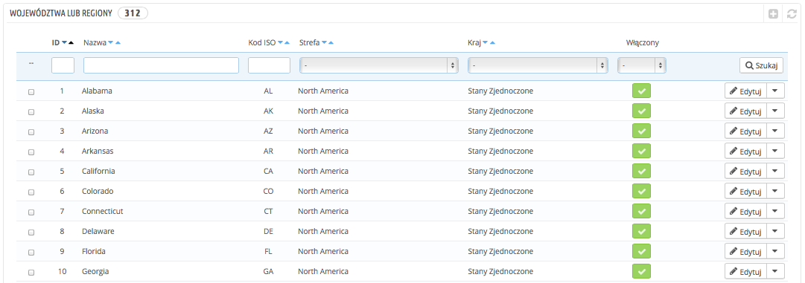
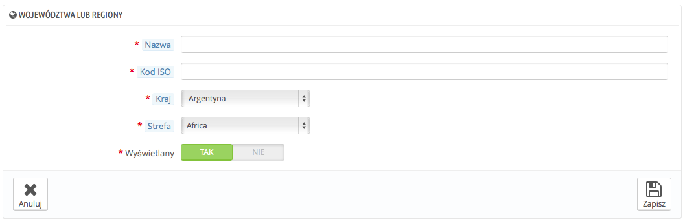

# Województwa lub regiony

Poprzez "region" PrestaShop rozumie także Stany, czyli jednostki pierwszego stopnia w podziale administracyjnym państwa. W Stanach Zjednoczonych są to stany, we Włoszech regiony, w Polsce województwa.

Domyślnie PrestaShop dostarcza zestaw regionów: 54 stanów USA, 13 _estados_ Meksyku, 13 prowincji Kanady, 34 prowincje Indonezji, 24 prowincje Argentyny, 47 _todōfuken_ Japonii, oraz 110 prowincji Włoch.

Poprawnie zdefiniowane w bazie danych regiony pozwalają na lepsze przedstawienie możliwości dostawy dla Twoich przewoźników. Te regiony mogą być również niezwykle ważne w obliczaniu podatku w zależności od państwa. Dlatego ważne jest wprowadzenie podziału administracyjnego, jeśli jest to ważne dla Twoich przewoźników. Możesz znaleźć odpowiednie informacje dotyczące podziału administracyjnego na tej stronie Wikipedii: [http://en.wikipedia.org/wiki/Table\_of\_administrative\_divisions\_by\_country](http://en.wikipedia.org/wiki/Table\_of\_administrative\_divisions\_by\_country).

Formularz adresowy w PrestaShopie wyświetla regiony tylko wtedy, gdy są one dostępne dla wybranego kraju. Dlatego upewnij się, że posiadasz praktyczną listę regionów, kiedy będzie ją dodawać. Z tego też powodu lista regionów zawiera włoskie prowincje (czyli drugi poziom podziału administracyjnego), zamiast regionów (pierwszy poziom).

## Dodawanie nowego regionu/województwa/stanu 

Stwórzmy więc nowy region. Naciśnij "Dodaj nowy", aby wyświetlić formularz.

* **Nazwa**. Nazwa regionu będzie widoczna na fakturach i na liście przewozowym. Dlatego musi być napisana w języku kraju danego regionu.
* **Kod ISO.** Kod ISO-3166-2 regionu:
  1. Idź na tę stronę Wikipedii: [http://en.wikipedia.org/wiki/ISO\_3166-2](http://en.wikipedia.org/wiki/ISO\_3166-2),
  2. Naciśnij na dwuliterowy kod stanu.
  3. Na tej stronie znajdź kod stanu.
  4. Jeśli go znajdziesz usuń prefiks kraju, aby kod miał mniej niż 4 znaki. Na przykład pełen kod dla Devon w Wielkiej Brytanii to "GB-DEV". Użyj po prostu "DEV" jako kodu ISO – będzie on już przypisany do Kraju za pomocą listy rozwijanej krajów w Prestashop (patrz kolejny krok)
* **Kraj**. Wskaż kraj regionu za pomocą rozwijanej listy.
* **Strefa**. Wskaż geograficzne położenie strefy za pomocą rozwijanej listy. Nie pomyl się, ponieważ to może przełożyć się na błędne funkcjonowanie ustawień kraju i strefy w PrestaShopie.
* **Wyświetlany.** Nie wyświetlany region, nie będzie sugerowany jako opcja podczas rejestracji klienta w sklepie.
