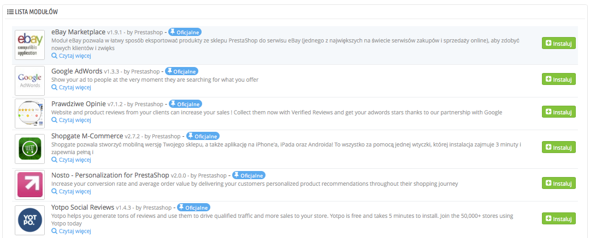

# Moduły marketingu

Ta strona skupia w jednym miejscu najważniejsze z punktu widzenia marketingu moduły, dostępne w Twojej wersji PrestaShop. Służy jako skrót do niektórych kategorii modułów ze strony „Modułów”.

Moduły na tej stronie pochodzą z sekcji „Marketing i reklama” oraz „Inteligentne zakupy” na stronie „Modułów”.

Możesz zainstalować moduły bezpośrednio z tej strony. Po kliknięciu w „Instaluj” moduł jest instalowany, a Ty zostajesz przeniesiony do strony „Moduły”, na której możesz otworzyć stronę konfiguracji modułu, klikając na link „Konfiguruj”. Możesz również wrócić do strony „Marketing” w celu otwarcia konfiguracji strony albo usunąć, wyłączyć, zresetować lub odinstalować ten moduł, w zależności od jego statusu.
