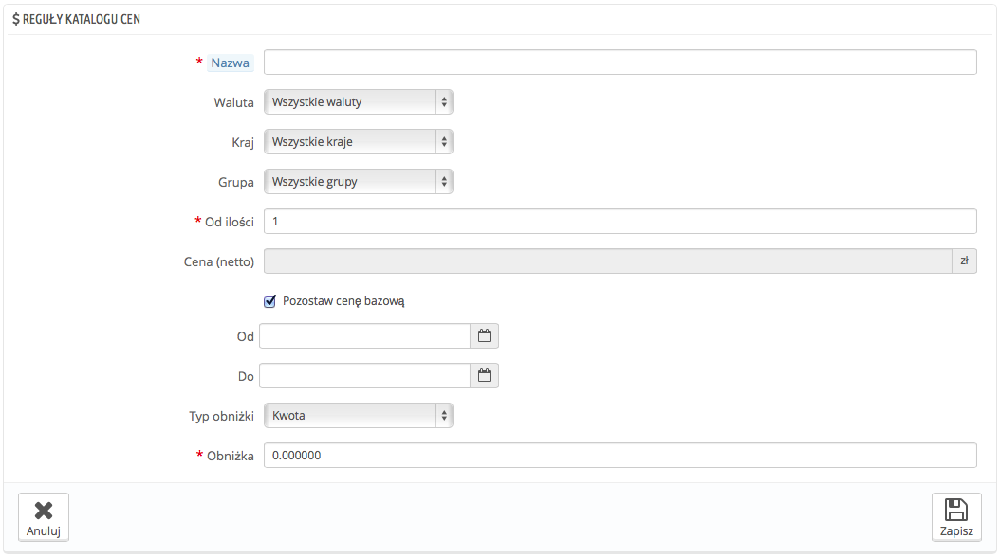
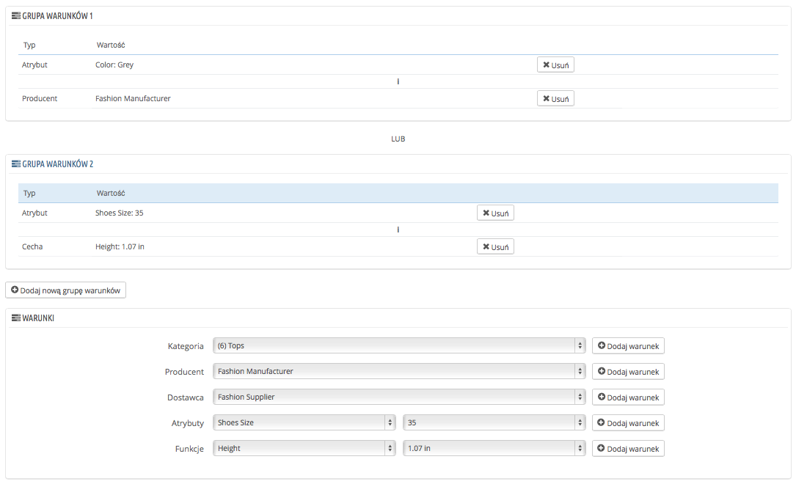

# Reguły cenowe katalogu

Reguły cenowe katalogu umożliwiają przypisanie obniżki cenowej do kategorii, producenta, dostawcy, atrybutu lub funkcji. Jak wskazuje sama nazwa, ten typ reguł stosuje się w odniesieniu do szeregu produktów; nie może być wykorzystany dla jednego produktu. Jeśli chcesz zastosować zniżki w stosunku do pojedynczych produktów, musisz zamiast tego stworzyć regułę koszyka lub cenę specjalną (w zakładce "Ceny" na stronie edycji produktu).

Przykładowo, możesz określić zasadę, że hiszpańscy klienci należący do grupy „Dobrych klientów” będą uprawnieni do 10% zniżki na produkty z kategorii „Elektronika” oraz wszystkie produkty firmy Sony w pierwszym tygodniu lipca.

Strona „Reguły cenowe katalogu” zawiera listę aktualnie obowiązujących zasad, którą możesz usunąć bądź edytować, klikając na ikony w kolumnie „Status”. Jeśli chcesz wyłączyć tę zasadę, po prostu zmień jej datę końcową na datę z dnia poprzedniego.

## Tworzenie nowej reguły cenowej katalogu 

Formularz jej tworzenia składa się z dwóch sekcji, pozwalających Ci na precyzyjne tworzenie nowych reguł.

### Szczegółowe reguły cenowe 

Pierwszy formularz jest łatwy w zrozumieniu.

W tym miejscu określasz, kto powinien korzystać z reguły, jakie zniżki ona zakłada i inne szczegóły.

* **Nazwa.** Pojawia się publicznie, więc powinna być zwyczajna.
* **Sklep.** Tylko w trybie Multisklep. Reguła odnosi się do klientów, którzy kupują za pośrednictwem wybranego sklepu. Dostępna tylko wtedy, gdy posiadasz przynajmniej dwa sklepy.
* **Waluta.** Odnosi się do klientów, którzy zdecydowali się płacić w określonej walucie.
* **Kraj.** Zasada odnosi się do klientów z określonego kraju.
* **Grupa.** Reguła dotyczy klientów, którzy należą do określonej grupy klientów.
* **Od ilości.** Zasada obowiązuje, gdy zamówienie ma przynajmniej określoną liczbę pasujących produktów.
* **Cena netto.** Nowa cena produktu. Tutaj możesz zmienić cenę produktu na taką, która odpowiada ustanawianej regule. Domyślnie reguła ma zastosowanie do ceny podstawowej.
* **Od… do.** Zasada ma zastosowanie dla tego przedziału czasowego.
* **Typ obniżki.** Zniżka może być określona albo kwotowo, albo procentowo.
* **Obniżka**. Wartość obniżki. Zależnie od wybranego z powyższych typów, liczba „10.0” wpisana w polu może oznaczać albo „$10 mniej” (w zależności od domyślnej waluty), albo „10% mniej”.

Możesz połączyć wszystkie te reguły.

### Warunki 

Sekcja „Warunki” jest miejscem, gdzie ustawiasz produkty, do których ma zastosowanie reguła cenowa katalogu. Pojawia się tylko wtedy, gdy klikniesz przycisk „Dodaj nową grupę warunków”.

Na warunki składają się grupy warunków, co oznacza, że Twoje dane z powyższej sekcji „Reguły cenowe katalogu” mogą być stosowane dla szerokiego asortymentu produktów. Warunki są pogrupowane w sposób inkluzywny: wszystkie warunki muszą być spełnione, aby można stosować cenę katalogową. Stąd „I”.

Tymczasem grupy warunków są ekskluzywne: wystarczy, że jedna grupa ma zastosowanie, aby można było stosować cenę katalogową. Stąd „LUB”.

Domyślna grupa warunków jest pusta. Możesz dodać do niej warunki, używając menu rozwijanego w dolnej części sekcji:

* Wybierz kategorię lub jakikolwiek inny rodzaj selekcji, a następnie kliknij przycisk „Dodaj warunek”.
* Warunek pojawi się w grupie warunków. Możesz ich w niej umieścić wiele.
* Gdy grupa jest ukończona, a Ty chcesz utworzyć nową, kliknij na „Dodaj nową grupę warunków”. Pojawi się nowa grupa, którą można wypełnić w taki sam sposób.

Nowe warunki są domyślnie dodawane do grupy warunków, która została utworzona jako ostatnia. Jeśli chcesz dodać warunki do wcześniejszej grupy, kliknij na tę grupę, by ją zaznaczyć, a następnie dodaj warunki.

Nie możesz aktualnie usunąć grupy warunków.
