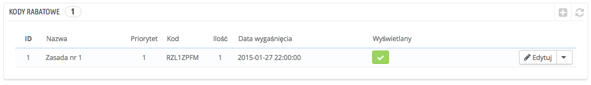

# Reguły koszyka

Strona „Reguły koszyka” daje dostęp do zaawansowanego narzędzia, które zastępuje system kodów rabatowych w PrestaShop 1.4. Doświadczeni użytkownicy PrestaShop nie będą zaskoczeni funkcjami, które zostały dodane, ale będą musieli przyzwyczaić się do nowej nazwy: gdy przewodnik wspomina kody rabatowe (voucher) chodzi o reguły koszyka, które same w sobie różnią się od dokumentów uprawniających do wymiany towaru lub zwrotu pieniędzy.

Strona „reguły koszyka” zawiera listę obowiązujących reguł, które można włączyć i wyłączyć, klikając na ikony w kolumnie „Status”.

Różnice pomiędzy potwierdzeniem uprawniającym do wymiany towaru lub zwrotu pieniędzy (credit slip), kodem rabatowym (voucherem) a regułą koszyka

Różnice pomiędzy potwierdzeniem uprawniającym do wymiany towaru lub zwrotu pieniędzy (credit slip), kodem rabatowym (voucherem) a regułą koszyka

Credit slip jest przede wszystkim pisemnym potwierdzeniem zwrotu produktu. W większości przypadków użytkownik może użyć go jako vouchera.

Voucher to kod rabatowy, który nie musi być powiązany ze zwrotem towaru lub pieniędzy i który może przybrać znacznie więcej form niż potwierdzenie:

* Rabatu na zamówienie (procentowego).
* Rabatu na zamówienie (kwotowego).
* Bezpłatnej wysyłki.

Kod rabatowy można zastosować wobec wszystkich klientów, grupy klientów lub pojedynczego klienta; można ustawić jego datę ważności.

Reguła koszyka jest zasadniczo zaawansowaną wersją kodu rabatowego: oprócz tego, na co pozwalały kody rabatowe w wersji PrestaShop 1.4, system reguł koszyka wprowadzony w PrestaShop 1.5 pozwala na:

* Nadanie nazwy rabatowi.
* Umożliwienie klientowi jedynie częściowego skorzystania z rabatu.
* Ustalenie priorytetów w regułach koszyka.
* Ustawienie kompatybilność pomiędzy regułami koszyka.
* Ustawienie, by zniżki działały tylko wobec niektórych przewoźników.
* Ustawienie, by zniżki odnosiły się tylko do wyboru produktów/kategorii/producentów/dostawców/atrybutów… lub wszystkich jednocześnie, jeśli to konieczne.
* Ustalenie, by zniżki odnosiły się do bezpłatnej wysyłki/zniżek na zamówienia/darmowych prezentów… lub wszystkich jednocześnie, jeśli to konieczne.

W niniejszym przewodniku pojęcia „reguła koszyka” i „voucher” są traktowane jako synonimy i stosowane wymiennie.

## Tworzenie nowej reguły koszyka 

Kod rabatowy może być tworzony automatycznie po zwrocie towaru, ale w dowolnym czasie można utworzyć nowy kod ręcznie i bardzo precyzyjnie ustalić jego własności.

Formularz tworzenia zawiera trzy zakładki, co pozwala ściśle definiować nowe reguły i kody rabatowe:

### Zakładka „Informacja” 

Pierwsza zakładka, „Informacja”, zawiera oznaczenie reguły i jej główne ustawienia.

* **Nazwa**. Pojawia się publicznie, więc niech będzie zwyczajna.
* **Opis**. Nie jest publiczny. Pomaga pracownikom sklepu zrozumieć, dlaczego reguła została stworzona.
* **Kod.** Nadaj regule unikalny kod. Możesz albo utworzyć go ręcznie (a więc użyć możliwych do odczytu słów, jak 1VOUCHDLAANNY), lub wygenerować jeden unikalny ciąg znaków, klikając na przycisk „Generuj”. Oczywiście możesz używać innego generatora znaków (np. [http://www.random.org/strings/](http://www.random.org/strings/)).\
  Zauważ, że jeśli kod nie jest ustawiony, reguła dotyczyć będzie każdego klienta, który spełnia inne warunki:\

  * Jeśli kod istnieje, klient musi wprowadzić go w procesie zamawiania.
  * Jeśli kod nie istnieje, reguła automatycznie dotyczy wszystkich klientów, którzy mogą z niej skorzystać.
* **Wyświetl w koszyku**. Jeśli opcja jest włączona, PrestaShop poinformuje użytkownika, że kod rabatowy odpowiadający pozycjom w koszyku jest dostępny i może zostać dodany.
* **Częściowe użycie**. Jeśli ta opcja jest wyłączona, reguła/kod mogą zostać użyte tylko raz, nawet jeśli kwota nie jest w pełni wykorzystana. Jeśli opcja jest włączona, generowany jest nowy kod, gdy obecny nie jest w pełni wykorzystany.
* **Priorytet**. Jeśli klient (lub grupa klientów) ma prawo do więcej niż jednego kodu, lub jeśli zamówienia dotyczyć może więcej niż jeden kod, wówczas PrestaShop stosuje kod jeden po drugim w kolejności alfanumerycznej. Możesz zmienić kolejność, przydając niższy priorytet dla Twojego kodu. Domyślnie wszystkie one mają priorytet nr 1. Jeśli nadasz mu wyższy numer, kod będzie zastosowany po kodach z niższymi numerami.
* **Status**. Możesz włączyć lub wyłączyć regułę, kiedy tylko widzisz taką potrzebę.

### Zakładka „Warunki” 

Druga zakładka, „Warunki”, zawiera duży zbiór możliwości, pozwalając na precyzyjne określenie, kto będzie mógł skorzystać ze zniżki.

* **Ogranicz do pojedynczego klienta.** W tym miejscu można wskazać, że kod, który generujesz, odnosi się tylko do jednego klienta. Jeśli na przykład miałeś opóźnienia w dostawie i chcesz zrekompensować to klientowi, wówczas możesz stworzyć kodo rabatowy specjalnie dla niego. Aby szybko odnaleźć klienta, wpisz kilka pierwszych liter jego imienia, nazwiska lub e-maila w polu tekstowym.\
  Jeśli pozostawisz je puste, PrestaShop odczyta to w ten sposób, że każdy klient będzie mógł skorzystać z rabatu, chyba że wstawisz ograniczenie w postaci wybranej grupy klientów (zobacz okienko: „Wybór grupy klientów”).
* **Ważność.** Domyślny okres ważności wynosi jeden miesiąc, ale możesz skrócić go do jednego tygodnia lub nawet jednego dnia.
* **Kwota minimalna.** Minimalna wartość zamówienia, od której kod rabatowy ma zastosowanie. Rabat zostanie udzielony tylko wtedy, gdy zamówienie klienta przekracza określoną kwotę. Możesz zdecydować, czy ta kwota obejmuje koszt wysyłki i/lub podatek.
* **Łącznie dostępnych.** Ustaw liczbę dostępnych kodów: albo „1”, jeśli dotyczyć ma tylko jednego klienta, albo dowolną, jeśli kody przeznaczone mają być dla tych, którzy skorzystają z nich pierwsi.
* **Łącznie dostępnych dla każdego użytkownika.** Możesz określić, ile razy kod rabatowy ma być dostępny dla każdego klienta. Liczba ta musi być co najmniej równa łącznej liczbie dostępnych kodów (pole „Łącznie dostępnych”).\

  * Jeśli liczba ta jest niższa od łącznej liczby dostępnych kodów, wówczas jeden klient nie będzie mógł wykorzystać ich wszystkich.
  * Ustawienie jej jako „1” gwarantuje, że każdy z klientów może użyć kodu tylko jeden raz. W tym przypadku upewnij się, że kod odnosi się raczej do grupy klientów niż pojedynczego.

Pola do zaznaczenia znajdujące się u dołu tej sekcji są bardzo istotne, ponieważ pomagają w dokładniejszym określaniu grupy użytkowników, których rabaty mają dotyczyć.

* **Wybór dostawcy.** Możesz wprowadzić takie ustawienia, że klient otrzyma zniżkę tylko wtedy, gdy wybierze określonego dostawcę przesyłki.
* **Wybór grupy klientów.** To bardzo przydatne narzędzie, ponieważ dzięki niemu PrestaShop pozwala stosować zniżki wobec wielu użytkowników i określać dodatkowo inne warunki uzyskiwania rabatów dzięki narzędziu reguł koszyka.
* **Zgodność z innymi regułami koszyka.** Domyślnie zamówienie może być objęte wieloma regułami koszyka. Dzięki tej opcji możesz zaznaczyć, że reguła ta nie może być łączona z innymi. Ta opcja pojawia się tylko wtedy, gdy ustawionych masz więcej niż jedną regułę.
* **Wybór produktu.** To inne przydatne narzędzie, które pozwala tworzyć automatyczne kody rabatowe dla koszyków, które zawierają określone produkty. Instrument ten opisano dokładniej poniżej.
* **Wybór sklepu.** Domyślnie reguła koszyka odnosi się do wszystkich Twoich sklepów. Dzięki tej opcji dana reguła może odnosić się tylko do sklepów wybranych.

Opcja „Wyboru produktu” odkrywa nowy formularz i pozwala tworzyć nie tylko kody rabatowe odnoszące się do produktów, ale także do kategorii, producentów, dostawców, a nawet atrybutów. Dodatkowo można połączyć wszystkie te elementy, aby jak najprecyzyjniej określić klienta, którego zniżki mają dotyczyć.

Możesz na przykład stworzyć automatyczne kody rabatowe dla Twoich klientów w formie „Kup co najmniej 3 produkty firmy Apple, a otrzymasz dostawę gratis!”. Jest to narzędzie w obrębie reguł koszyka, a jego konfiguracja jest dość specyficzna. Możesz dodać tak wiele kryteriów wyboru produktów, ile uznasz za potrzebne, podążając według tych wskazówek:

1. Kliknij „Wybór produktu”, aby dodać nowy produkt.
2. Określ liczbę produktów potrzebnych do aktywacji zniżki.
3. Dodaj przynajmniej jedno kryterium dowolnego typu: produkty, atrybuty, kategorie, producenci, dostawcy. Możesz dodać tak wiele kryteriów wyboru produktu, ile uznasz za potrzebne.
4. Kliknięcie przycisku „Dodaj” tworzy nowy wiersz wyboru. Dla każdego kryterium należy podać szczegóły odnośnie treści, których zasada dotyczy. Kliknij przycisk „Wybierz”, a otworzy się okno z listą zawartości dostępną dla tego kryterium (produkty, kategorie…). Przenieś treść z lewej kolumny do prawej, klikając przycisk „Dodaj”, a następnie zamknij okno, klikając na „X” w prawym górnym rogu. Jeśli zaznaczony został tylko jeden element, w polu z zawartością pojawi się jego pełna nazwa. Jeśli zaznaczono więcej elementów, w polu z zawartością pojawi się tylko ich liczba.

Możesz określić tyle reguł wyboru, ile jest potrzebnych. Zasady te albo są stosowane w całości, albo promocja nie jest stosowana.

Wybory produktów mają niezależny charakter: możesz ich dodać tyle, ile konieczne, zaś one nie będą wpływać na siebie nawzajem. To pozwoli Ci objąć regułami koszyka szeroką gamę produktów.

### Zakładka „Akcje” 

Trzecia, ostatnia zakładka, „Akcje”, jest miejscem, w którym możesz wybrać, co składa się na zniżkę.

* **Darmowa dostawa.** Dzięki tej zasadzie klienci mogą korzystać z darmowej dostawy.
* Zastosuj rabat.\

  * **Procentowy (%).** Zasada ta określa zniżkę jako procent wartości całego zamówienia. Załóżmy na przykład, że zamówienie wyceniono na $200 przed opodatkowaniem. Wartość reguły określono na 15%. Klient, który z niej skorzysta zapłaci tylko $170 (nie licząc podatków i kosztów dostawy).
  * **Kwotowy.** Zasada określa kwotę rabatu dla danej wartości zamówienia. Załóżmy na przykład, że zamówienie wyceniono na $200 przed opodatkowaniem. Wartość zniżki określono na $20. Klient, który z niej skorzysta zapłaci tylko $180 (nie licząc podatków i kosztów dostawy). Możesz określić, czy zniżka obejmuje podatek, czy też nie.
  * **Żaden.** Zasada nie oferuje żadnego rabatu. Jeśli wybierzesz tę opcję, znika inna opcja: „Zastosuj rabat do”.
* **Zastosuj rabat do.**\

  * **Zamówienia (bez dostawy).** Zniżka odnosi się do całości zamówienia.
  * **Wybranego produktu.** Możesz wybrać, jakiego produktu rabat ma dotyczyć: wpisz pierwsze litery nazwy produktu, a następnie wybierz właściwy z listy pasujących nazw.
  * **Najtańszego produktu.** Opcja dostępna tylko dla rabatów procentowych.
  * **Wybranego produktu(ów**)**.** Klient może wybrać, dla których produktów zniżka ma mieć zastosowanie. Opcja dostępna tylko dla rabatów procentowych.
* **Wyślij darmowy prezent.** Możesz zaoferować prezent po spełnieniu określonych warunków (i pominąć wszystkie zniżki). Pojawi się pole, w którym wpisać należy pierwsze litery nazwy produktu, a następnie odszukać na liście pasujących nazw.

Kiedy wszystko zostało zapisane, możesz wysłać kod rabatowy do Twoich klientów lub pozwolić systemowi na automatyczną obsługę zasad koszyka, zależnie od Twoich ustawień.

Twój kod rabatowy pojawi się na stronie „Reguły koszyka” w menu „Reguły ustalania cen”. Możesz go usunąć bądź edytować w dowolnym momencie. Jeśli kod ustalony został dla wybranej grupy bądź klienta, pojawi się na stronie głównej, na koncie klienta w sekcji „Kody rabatowe”, a także w koszyku (jeśli tak zdecydujesz), gdzie klienci wybiorą, który kod odnosi się do ich zamówienia.

Reguły koszyka, które mają zastosowanie do wszystkich klientów nie pojawiają się na stronie klienta „Moje kody rabatowe”: klient musi o nich wiedzieć, aby z nich skorzystać. Poinformowanie ich o wszystkich dostępnych publicznie promocjach zależy od Ciebie.

Aby zastosować regułę koszyka, klient musi przejść do swojego koszyka i wpisać kod rabatowy w polu „Kodu rabatowego” oraz kliknąć „Dodaj”. Nie będzie mógł skorzystać z kodu, jeśli zakup został już zatwierdzony.

Po zastosowaniu kodu, w podsumowaniu koszyka wyświetla się wpływ kodu rabatowego na wysokość kwoty zamówienia.

