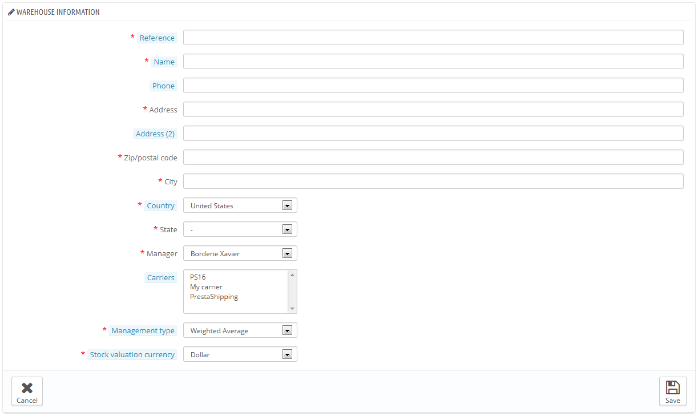
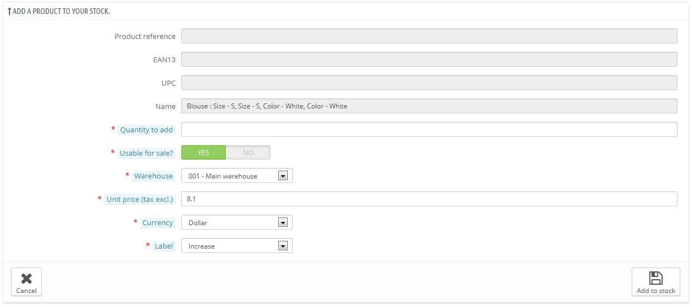
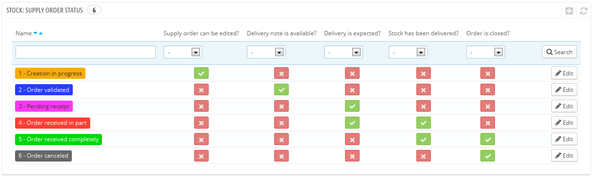

# Prezentacja interfejsu zarządzania magazynem

* [Prezentacja interfejsu zarządzania magazynem](prezentacja-interfejsu-zarzadzania-magazynem.md#Prezentacjainterfejsuzarządzaniamagazynem-Prezentacjainterfejsuzarządzaniamagazynem)
  * [Zarządzanie magazynem z poziomu karty produktu](prezentacja-interfejsu-zarzadzania-magazynem.md#Prezentacjainterfejsuzarządzaniamagazynem-Zarządzaniemagazynemzpoziomukartyproduktu)
  * [Zarządzanie hurtowniami](prezentacja-interfejsu-zarzadzania-magazynem.md#Prezentacjainterfejsuzarządzaniamagazynem-Zarządzaniehurtowniami)
  * [Zarządzanie magazynem](prezentacja-interfejsu-zarzadzania-magazynem.md#Prezentacjainterfejsuzarządzaniamagazynem-Zarządzaniemagazynem)
  * [Ruchy magazynowe](prezentacja-interfejsu-zarzadzania-magazynem.md#Prezentacjainterfejsuzarządzaniamagazynem-Ruchymagazynowe)
  * [Natychmiastowy stan magazynu](prezentacja-interfejsu-zarzadzania-magazynem.md#Prezentacjainterfejsuzarządzaniamagazynem-Natychmiastowystanmagazynu)
  * [Pokrycie magazynu](prezentacja-interfejsu-zarzadzania-magazynem.md#Prezentacjainterfejsuzarządzaniamagazynem-Pokryciemagazynu)
  * [Zamówienia u dostawcy](prezentacja-interfejsu-zarzadzania-magazynem.md#Prezentacjainterfejsuzarządzaniamagazynem-Zamówieniaudostawcy)
  * [Konfiguracja](prezentacja-interfejsu-zarzadzania-magazynem.md#Prezentacjainterfejsuzarządzaniamagazynem-Konfiguracja)

Zarządzanie magazynem jest niezbędne począwszy od momentu, kiedy ilość produktów, które sprzedajesz stopniowo wyczerpuje się. Aby dowiedzieć się czy potrzebujesz zaawansowanego zarządzania magazynem zaproponowanym przez PrestaShop przeczytaj dział "Pojęcia ogólne” tego rozdziału : [http://doc.prestashop.com/display/PS16/General+Concepts](http://doc.prestashop.com/display/PS16/General+Concepts).

Jeśli chcesz korzystać z zaawansowanego zarządzania magazynem, musisz:

* Połączyć produkty z hurtowniami.
* Połączyć hurtownie z dostawcami.
* Połączyć hurtownie z właściwymi sklepami.

Zarządzanie magazynem w PrestaShop odbywa się poprzez kilka ekranów i dzieli się na dwa różne poziomy.

Są to następujące poziomy:

* Brak zarządzania stanem magazynowym: Nie zarządzasz jakąkolwiek ilością. PrestaShop zakłada, że ilość produktów jest nieskończona. Użyj tej opcji, jeśli sprzedajesz usługi lub produkty wirtualne (np. pliki).
* Proste zarządzenie stanem magazynowym: Dla każdego sprzedawanego produktu, możesz wskazać aktualnie dostępną ilość (włącznie z kombinacjami produktów. Ta opcja jest rekomendowana, jeśli nie posiadasz zbyt wielu produktów lub masz niewielki magazyn.
* Zaawansowane zarządzanie stanem magazynowym: Dla każdego sprzedawanego produktu (i jego kombinacji), możesz wskazać, gdzie znajduje się dostępna ilość (w nieograniczonej liczbie magazynów - z różnymi dostawcami i metodami wyceny). Możesz również zobaczyć ruchy Twojego magazynu, jego stan w danym momencie, jak i jego natychmiastowe pokrycie oraz składanie zamówień u dostawców.

Są to następujące ekrany:

* Preferencje -> Produkty -> “
* Katalog -> Produkty -> strona produktu (informacja) -> dodane od jednej do dwóch zakładek do tworzenia/edycji strony produktu:\

  * &#x20;Ilość:
    * W trybie prostym: możesz ręcznie ustawić ilość każdego produktu.
    * W trybie zaawansowanym: ilość jest zarządzana z menu “Magazyn” PrestaShop.
  * Magazyny: w trybie zaawansowanym, można wskazać lokalizację produktu lub jego kombinacji w magazynie.
* Magazyny: w trybie zaawansowanym, możesz skorzystać z wszystkich stron zarządzania zapasami (tworzenie magazynów, ruch magazynowy, stany magazynowe, pokrycie magazynu, dostawa zamówień).

Kolejne sekcje opisują kolejno każdy z ekranów.

## Zarządzanie magazynem z poziomu karty produktu 

### Zarządzanie ilością 

W PrestaShop 1.4 należało ręcznie ustawić liczbę produktów dostępnych do sprzedaży w sklepie.

W PrestaShop 1.5 i 1.6 istnieje możliwość ręcznego ustawienia ilości produktów dostępnych w sklepie. Jednakże jeśli uruchomiłeś zaawansowane zarządzanie zasobami, masz również możliwość automatycznego sprecyzowania tej liczby w zależności od stanu Twojego fizycznego magazynu. Zauważ zatem, że jest możliwa globalna aktywacja funkcjonalności zaawansowanego zarządzania zasobami, ale używaj jej tylko wtedy kiedy masz tylko kilka produktów.

Po włączeniu opcji "Włącz zarządzanie magazynem" (na stronie "Preferencje > Produkty"), wszystkie produkty są widoczne jako dodane w nowej zakładce do ich strony administracyjnej o nazwie “Ilość”. Ten prosty, przejrzysty i unikalny interface pozwala Ci na zarządzanie ilością dostępną do sprzedaży dla danego produktu i wszystkich jego ewentualnych kombinacji.

Przy użyciu tylko tej opcji możesz w każdym przypadku zarządzać ilością produktu (produkt po produkcie).

Jeżeli nie chcesz tego robić ręcznie (produkt po produkcie) i chcesz, aby każda ilość produktów była bezpośrednio zarządzana poprzez zaawansowanego managera zapasów PrestaShop, musisz aktywować inną opcję, która znajduje się na stronie "Preferencje > Produkty" : "Włącz zaawansowane zarządzanie magazynem".

.png>)

Zakładka “Ilość” otwiera się wraz z sekcją wyjaśniającą, którą warto przeczytać w całości. Ta sekcja jest śledzona przez interface zarządzania ilością dostępną do sprzedaży i otwiera się ją za pomocą trzech opcji:

* **Chcę używać zaawansowanego zarządzania stanem magazynowym dla tego produktu**.
* **Dostępne ilości bieżącego produktu i jego kombinacji bazują na stanie magazynowym w magazynie (przy użyciu systemu zaawansowanego zarządzania stanem magazynowym)**.
* **Chcę podać dostępne ilości ręcznie**.

Domyślnie tylko trzecia opcja (“Chcę dostępne ilości ręcznie.”) jest aktywowana. Dopóki nie zaznaczysz pierwszej opcji (“Chcę używać zaawansowanego zarządzania stanem magazynowym dla tego produktu”) Ilość produktów będzie zarządzana w taki sam sposób jak odbywało się to w wersji 1.4, tzn. ręcznie. Tak więc musisz samodzielnie dodać dostępną ilość, a PrestaShop odejmie odpowiednią część po każdorazowej sprzedaży.

Jeżeli chcesz, aby ilość danego produktu była zsynchronizowana z zapasami magazynu (jednej lub kilku), musisz zmienić sposób zarządzania ilościami:

1. Zaznacz okienko wyboru “Chcę używać zaawansowanego zarządzania zasobami dla tego produktu”, aby zmienić sposób zarządzania.
2. Druga opcja, “Dostępna ilość dla tego produktu jest synchronizowana z magazynem fizycznym znajdującym się w hurtowni” jest zatem dostępna. Wybierz ją, aby zsynchronizować dostępną ilość konkretnego produktu z zapasami Twojej hurtowni.

Po wybraniu drugiej opcji kolumna “ILOŚĆ” w tabeli stanie się niemożliwa do modyfikacji. A zatem liczby (ilość) będą bezpośrednio pobierane z aktualnego magazynu wskazanego przez Twojego zaawansowanego managera zapasami, aniżeli z zakładki “Ilość” każdego produktu.

Przypadek zestawów jest dość szczególny. W istocie, wiedząc że na chwilę obecną nie ma możliwości dodania odmian konkretnego produktu do pakietu, deweloperzy PrestaShop zdecydowali (jeśli jest to konieczne) na oparciu się o domyśle odmiany, tak aby dekrementować magazyn fizyczny.

Ponadto komunikat wskazuje zalecaną maksymalną liczbę zestawów.

Pozostałe elementy tej strony zostały wyjaśnione w rozdziale "Zarządzanie katalogiem" tego przewodnika.

### Zarządzanie dostawcami 

Od tej pory istnieje możliwość zdefiniowania kilku dostawców jednego produktu. Dla każdego dostawcy przypisanego do danego produktu istnieje możliwość nadania identyfikatora dostawcy oraz cenny jednostkowej netto dla konkretnego produktu, jak również dla wszystkich jego kombinacji. Informacje te są wykorzystywane przy dokonywaniu zamówienia u dostawcy

.png>)

### Zarządzanie magazynami 

Po aktywacji zaawansowanego zarządzania zasobami, zakładka “Magazyny” automatycznie doda się do karty produktu, aby określić w jakim lub jakich hurtowniach może znajdować się dany produkt (fizycznie) i każda z jego ewentualnych kombinacji. Istnieje również możliwość sprecyzowania miejsca występowania w hurtowni danego produktu i jego odmian.

.png>)

Przed możliwością połączenia jakiegoś produktu i zdefiniowania miejsca występowania, wcześniej należy wskazać co najmniej jeden magazyn (zobacz poniżej). Ten etap jest niezbędny. Ważne jest także określenie, co najmniej jednej hurtowni, w której to określony produkt może się znajdować, gdyż będzie to miało istotny wpływ na przygotowanie zamówień w ramach multishipping.

## Zarządzanie hurtowniami 

Od tej pory używając zaawansowanego zarządzania magazynem masz możliwość stworzenia jednej lub wielu hurtowni. Aby to zrobić otwórz stronę “Hurtownie” z menu “Magazyn”.

.png>)

Przy tworzeniu nowej hurtowni, musisz wypełnić następujące pola:

* **Numer referencyjny i Nazwa**. Unikalny login hurtowni i jego nazwa. Upewnij się, że używasz nazwy rozpoznawalnej. Musisz być w stanie z łatwością rozróżnić hurtownie pomiędzy sobą, które znajdują się na rozwijanej liście.
* **Adres, Kod pocztowy\*, “Miasto”** i **“Kraj”**. Adres fizyczny hurtowni. Ta informacja będzie używana przy zamówieniach dokonywanych przez waszych dostawców.
* **Kierownik**. Osoba odpowiedzialna za hurtownię/magazyn, wybrana spośród jej pracowników zarejestrowanych w Twoim e-sklepie. Jeżeli konta pracowników nie zostały stworzone, musisz koniecznie to zrobić.
* **Przewoźnik**. Licencjonowani przewoźnicy, którzy zajmą się przesyłkami pochodzącymi z e-sklepu. Przytrzymaj klawisz Shift i kliknij, aby wybrać więcej niż jednego dostawcę.
* **Sposób wyceny**. Sposób, w który zarządzasz e-sklepem, w zależności od prawa podatkowego Twojego kraju. Przeczytaj dział "Zasady zarządzania magazynem", aby dowiedzieć się więcej.&#x20;
* **Waluta wyceny magazynu**. Waluta wyceny dla hurtowni magazynu (spośród zarejestrowanych walut).

Nie ma możliwości zmiany sposobu i waluty wyceny określonej hurtowni po pierwszej inicjacji. W razie konieczności zmiany tego ustawienia musisz stworzyć nową hurtownię i usunąć tę niewłaściwą. Możesz również usunąć hurtownię, jeśli nie zawiera ona już żadnego produktu.

Uważaj przy wyborze dostawców, gdyż będzie to miało zasadniczy wpływ podczas przygotowywania zamówień w ramach mutlishopping.

W przypadku, gdy zarządzasz wieloma butikami, musisz również pamiętać aby połączyć każdy sklep z jedną lub kilkoma hurtowniami. Pozwala to na zdefiniowanie, z której hurtowni zamówienia Twoich klientów będą mogły być wysyłane do odpowiedniego sklepu.

Po utworzeniu magazynu, wszystkie jego dane są wyświetlane w sposób syntetyczny i zwięzły. Kliknij na ikonę “Wyświetl” po prawej, aby wyświetlić podgląd z informacjami dotyczącymi e-sklepu, w tym liczbę odniesień produktów znajdujących się w magazynie, sumy ilości, ogólną wycenę księgową, opis przechowywanych produktów oraz historię ruchów magazynu powiązanego z konkretną hurtownią.

.png>)

Strona ze szczegółowymi informacjami na temat magazynu zawiera również dwa linki:

* **Zobacz szczegóły produktu**. Przekieruje Cię na stronę "Bieżący stan magazynu" hurtowni.
* **Zobacz szczegóły aktywności tej hurtowni**. Przekieruje Cię na stronę "Ruchy magazynu" hurtowni.

## Zarządzanie magazynem 

Następnie po stworzeniu przez Ciebie hurtowni należy zainicjować magazyn dla każdej z nich. Aby to zrobić przejdź do strony “Zarządzanie magazynem" z menu "Magazyn".

.png>)

Wszystkie dostępne produkty w Twoim katalogu zostaną wylistowane w tym interfejsie. Dla ewentualnych odmian istnieje możliwość zarządzania nimi poprzez użycie operacji “Szczegóły".

W razie potrzeby ten interface umożliwia ręczną zmianę magazynu:

* **Dodać zapasy do magazynu**. Dodaj zapas dla konkretnego produktu w określonym magazynie.
* **Usunąć zapasy z magazynu**. Usuń zapas dla konkretnego produktu w określonym magazynie.
* **Transfer zapasów pomiędzy magazynami**.  Przenoś zapasy z jednej hurtowni do drugiej.

.png>)

Dwie ostatnie opcje wyświetlają się tylko wtedy, gdy istnieje już zapas produktu w jednej z hurtowni.\
Opcja "Transfer zapasów pomiędzy magazynami" pojawia się tylko wtedy, gdy macie zapisane minimum dwie hurtownie

### Dodawanie zapasów do hurtowni 

Aby dodać zapasy konkretnego produktu lub jego odmian do magazynu użyj opcji “Dodaj do magazynu” (strzałka w górę). Otworzy się strona, na której zostaną wyświetlone istotne informacje umożliwiające rozpoznanie danego produktu (odniesienie, cod EAN-13 i UPC oraz nazwę). Informacja zawarte w tym formularzu nie mogą zostać zmienione dlatego też wyświetlają się na szaro.

Musisz zatem sprecyzować:

* **Ilość zapasów przeznaczona do dodania**. Liczba ta musi być dodatnia. Nie możesz dodać zapasów przy użyciu ujemnej liczby.
* **Dostępne do sprzedaży?**. Jeśli liczba zapasu jest przeznaczona do użycia w sklepie lub zwyczajnie przechowywana i zarezerwowana do późniejszego użycia.
* **Skład/przechowalnia/hurtowania**. Miejsce, do którego dany produkt powinien zostać dodany. Formularz pozwala Ci na dodanie zapasów danego produktu tylko do jednej hurtowni. Jeśli musisz dodać zapasy produktu do więcej niż jednej hurtowni musisz ponowić cały proces dodawania dla każdej hurtowni.
* **Cena jednostkowa netto**. Cena jednostkowa produktu w trakcie dodawania do zapasów (aby dokonać wyceny).
* **Waluta**. Wartość odnosząca się do ceny jednostkowej. Jeśli jakaś waluta nie jest dostępna, możesz ją stworzyć na stronie “Waluty” w menu “Lokalizacja” lub importować ją ze strony “Lokalizacja” (z tego samego menu), importując pakiet lokalizacyjny kraju, który posługuje się walutą, którą chcesz użyć.
* **Etykieta**. Wygenerowana etykieta dla ruchów magazynu, w celu przyszłych odniesień. Ma tylko i wyłącznie charakter informacyjny.

Po rozwinięciu kursorem pól "Ilości do dodania" i "Cenna jednostkowa netto" domyślnie jako przypomnienie. Wyświetlą się wartości ustawione podczas ostatniego dodawania.

### Usuwanie zapasów z hurtowni 

Kiedy chcesz usunąć pewną wartość zapasów jakiegoś produktu, musisz użyć opcji “Usuń z magazynu” (strzałka w dół dostępna wyłącznie wtedy, kiedy produkty są już  w magazynie). Następnie otworzy się nowa strona z formularzem, na której znajdują się najistotniejsze informacje, tak aby ułatwić Ci jego rozpoznanie (odniesienie, kod EAN-13 i UPC oraz jego nazwę). Ta informacja nie może zostać zmieniona w tym formularzu, tak więc jest nieaktywna.

Musisz zatem sprecyzować:

* **Ilość zapasów przeznaczona do usunięcia**. Liczba ta musi być dodatnia. Nie możesz usunąć części zapasów przy użyciu liczby ujemnej.
* **Przeznaczone do sprzedaży**. Jeżeli konkretna ilość ma być usunięta spośród spośród tych użytecznych w e-sklepie lub spośród całości zapasów. (zawierające się w niej zarezerwowane ilości).
* **Przechowalnia/skład**. Tutaj ustalisz z jakiego magazynu wycofać daną ilość. Formularz pozwala Ci na wycofanie zapasów produktu z jednego składu, jednej przechowalni/hurtowni. Jeżeli musisz wycofać zapasy produktu z więcej niż jednego składu, musisz ponowić proces wycofywania dla każdego składu.
* **Etykieta**. Wygenerowana etykieta dla ruchów magazynu, w celu przyszłych odniesień. Ma tylko i wyłącznie charakter informacyjny.

### Transfer zapasów z jednego składu do innego 

Transfer magazynu umożliwia transfer zasobów z jednego magazynu do drugiego lub z jednego statusu do innego (nadające się do sklepu / zarezerwowane) w obrębie jednego magazynu. Kliknij na przycisk "Transfer magazynu" (strzałka w bok, dostępna tylko wtedy, gdy istnieją już produkty w magazynie). Otworzy się nowa strona zawierająca formularz, w którym zawarte zostały najważniejsze informacje służące identyfikacji produktu (odniesienia, EAN13 i kod UPC oraz nazwa). Te informacje, które nie mogą zostać zmienione zostały zaznaczone na szaro.

Musisz zatem sprecyzować:

* **Ilość do przeniesienia**. Liczba musi być dodatnia.
* **Pierwotny magazyn**. Magazyn “źródłowy”, z którego chcesz przenieść produkty lub w którym chcesz zmienić stan niektórych zapasów.
* **Czy ten produkt jest w sprzedaży w magazynie źródłowym/pierwotnym?**. Jeśli ilość przeznaczona do wycofania z pierwotnego magazynu. Liczba ta musi znajdować się pomiędzy liczbą używaną w sklepie a tą zarezerwowaną.
* **Magazyn odbiorczy**. Magazyn “docelowy” do którego chcesz przenieść produkty. Jeśli chcesz po prostu zmienić stan niektórych zasobów w magazynie “źródłowym”, zadbaj o to aby dobrze wybrać ten sam skład jako “źródłowy” jak i “docelowy”.
* **Czy ten produkt jest użyteczny do sprzedaży w magazynie docelowym?**. Jeśli ilość przeznaczona do dodania do magazynu “docelowego” jest używana w sklepie lub zarezerwowana. Możesz użyć tej opcji, kiedy chcesz tylko zmodyfikować stan części zapasów w magazynie “źródłowym”:\

  * Jeśli nie chcesz zmienić stanu w chwili transferu pomiędzy dwoma składami: Upewnij się oba ustawienia "Dostępne do sprzedaży?" są identyczne.
  * Jeśli chcesz zmienić stan w ramach jednego magazynu lub w chwili transferu pomiędzy dwoma magazynami. Upewnij się oba ustawienia "Dostępne do sprzedaży?" są różne.

To co wiąże się z wyceną jest zarządzane automatycznie według trybu zarządzania wybranego dla każdej hurtowni. Tak samo została rozwiązana konwersja walut.

## Ruchy magazynowe 

Ten interface pozwala na przeglądanie historii ruchów magazynowych. Można wyświetlić wszystkie ruchy magazynowe, jak i tylko te związane z jednym składem/hurtownią. Aby zawęzić wyszukiwanie zastosuj filtry.

.png>)

Kiedy sekcja "Filtruj ruchy poprzez hurtownie" jest ustawiona na hurtowni, istnieje możliwość wyeksportowania otrzymanej listy do pliku CSV.

## Natychmiastowy stan magazynu 

Ten interface pozwala na otrzymanie w sposób globalny sprecyzowanego widoku magazynu lub poprzez konkrety skład/hurtownie. Wyświetlone liczby są aktualne już w momencie wyświetlania się na stronie.

.png>)

Dla każdego produktu lub jego kombinacji dostępne są następujące wskaźniki:

* Cena jednostkowa (netto).
* Szacowanie produktu pod względem dostępności (fizycznej) w magazynie.
* Ilość dostępna w magazynie.
* Zapasy dostępne do sprzedaży.
* Realna ilość (zostało to już wcześniej wyjaśnione).

Pod względem wybranego sposobu wyceny, rozkład cen jednostkowych i powiązana wycena są dostępne po kliknięciu na opcję “Szczegóły" (znak "+").

Dodatkowo, istnieją dwa sposoby wyeksportowania wyświetlonej listy dla konkretnego składu/hurtowni do pliku CSV:

* Eksportuj wskaźniki związane z ilością.
* Eksportuj wskaźniki związane w wyceną (cena).

## Pokrycie magazynu 

Ten interfejs pozwala na sprawdzenie pokrycia magazynu. Wskazuje on liczbę dni sprzedaży, którą magazyn jest w stanie pokryć. Jest to bardzo pomocna informacja, aby przewidzieć z góry konieczne uzupełnienia. Jest ona obliczana na podstawie wcześniej zapisanych ruchów magazynowych.

.png>)

Możesz uzyskać pokrycie magazynu dla wszystkich magazynów, bądź też dla konkretnego magazynu. Możesz również wybrać okres (tydzień, dwa tygodnie, trzy tygodnie, miesiąc, sześć miesięcy, rok), którego zapisane ruchy będą brane pod uwagę celem obliczenia pokrycia. Wreszcie możesz uwypuklić magazyn, którego liczba dni sprzedaży jest mniejsza niż wprowadzona ilość (w dniach). Ta funkcja uwypukli te produkty, na które należy zwrócić uwagę.

Aby otrzymać pokrycie zapasami dla odmian produktu, będziesz musiał skorzystać z opcji “Szczegóły" dla wybranego produktu.

Istnieje możliwość otrzymywania alertów dotyczących pokrycia zapasami produktu. Moduł notyfikacji poprzez e-mail (alert mailowy) może brać pod uwagę pokrycie zapasami. Jest zatem możliwe wskazanie liczby dni pokrycia począwszy, od tego w którym otrzymujesz powiadomienie. Przeczytaj dokumentację tego modułu.

## Zamówienia u dostawcy 

Jedną z głównych funkcjonalności zarządzania magazynami jest możliwość składania zamówień w dostawców w celu lepszego zarządzania uzupełnianiem zapasów.

Ten interface pozwala na zarządzanie całością zamówień u dostawców, jak również modelami zamówień wielokrotnego użytku.

.png>)

Tworzenie modelu zamówień odbywa się w taki sam sposób jak tworzenie zamówienia (z wyjątkiem pola "Data dostawy"). A zatem dalej zostanie omówiony sam proces tworzenia zamówienia.

### Tworzenie zamówienia 

Tworzenie zamówienia u dostawcy składa się z dwóch etapów: tworzenia zamówienia, następnie dodania do niego produktów.

.png>)

Zacznij od zdefiniowania nagłówków zamówienia:

* Określ unikalne odniesienie. Chodzi o odniesienie administracyjne - nie używaj zatem liczby, która wydaje się Tobie unikalna.
* Wybierz dostawcę. Jeśli pożądany dostawca nie znajduje się w rozwijanej listy, musisz go stworzyć za pośrednictwem strony "Dostawcy" z menu "Katalog".
* Wybierz magazyn aby otrzymać zamówienie. Musisz mieć już utworzony co najmniej jeden magazyn.
* Wybierz walutę, w jakiej zostanie sfinalizowane zamówienie. Jeśli jest taka potrzeba, możesz stworzyć lub zaimportować walutę przechodząc kolejno przez strony "Waluty" lub "Lokalizacja" z menu "Lokalizacja".
* Wybierz język, w którym zostanie sfinalizowane zamówienie. Jeśli jest taka potrzeba, możesz stworzyć lub zaimportować język przechodząc kolejno przez strony "Waluty" lub "Lokalizacja" z menu "Lokalizacja".
* Jeśli jest taka potrzeba, wybierz ogólny rabat procentowy. Możesz zostawić pole na “0” jeśli nie ma rabatu odnośnie tego zamówienia.
* Jeśli jest taka potrzeba wybierz ilość fizyczną produktu, poniżej której wszystkie produkty muszą zostać uzupełnione i automatycznie dodane do zamówienia. Ilością do zamówienia dla każdego wstępnie dodanego produktu będzie wcześniej ustalona ilość pomniejszona o aktualnie dostępną (ilość).
* Wybierz przewidywaną datę dostawy.

Drugi etap polega na dodaniu produktów do zamówienia. Aby go zrealizować możesz:

* Kliknąć na przycisk “Zapisz zamówienie i pozostań".
* Kliknąć na przycisk "Zapisz". Zostaniesz w tym wypadku przekierowany do listy zamówień na dostawę: kliknij na opcję “Edytuj” zamówienia, które właśnie stworzyłeś.

Interface formularza tworzenia zamówienia został zaktualizowany, tak aby przedstawić drugi formularz (pod wypełnionymi już polami). Musisz użyć drugiego formularza, aby dodać produkty do Twojego zamówienia, przy pomocy zintegrowanej wyszukiwarki. Produkty, które dodajesz pojawiają się na nowej liście.

.png>)

Dla każdego produktu należy sprecyzować lub uaktualnić następujące informacje: jednostkową cenę netto zakupu, ilość do zamówienia, ewentualną stopę podatkową (jeśli ma zastosowanie), ewentualny rabat dla tego produktu.

Raz stworzone zamówienie pojawia się na liście ze statusem “w trakcie tworzenia”. Ten status umożliwia Ci na wyświetlenie i edycję informacji, które wprowadziłeś, jak również dodanie produktów do zamówienia. Gdy zmienisz jego status na “Zamówienie zatwierdzone”, nie możesz edytować zamówienia po raz kolejny.

Nie ma możliwości usunięcia zamówienia dostawy. Możesz je jedynie anulować.

Przy raz stworzonym zamówieniu musisz kontynuować proces wskazując zmiany statusu w interface PrestaShop. To właśnie do tego służy pierwszy przycisk znajdujący się na liście. Kliknij na ikonę “Zmień status” w celu otwarcia formularza zmian statusu. Aby uzyskać więcej informacji, przeczytaj sekcję “Zmień status zamówienia dostawy” poniżej.

Ikona "+" na liście zamówień dostaw wyświetla historię zamówienia. Dzięki niej dowiesz się kto zamawiał, co zamawiał i kiedy?

### Tworzenie modelu zamówienia 

Zaletą tego modelu jest to, że służy jako podstawa do generowania zamówienia.

.png>)

Proces tworzenia modelu zamówienia dostawy jest taki sam jak przy tworzeniu zamówienia, za wyjątkiem:

* Przewidywana data dostawy nie jest wymagana.
* "Automatycznie załadować produkty" wartością będzie ilość do zamówienia dla załadowanych produktów, a nie różnice magazynowe.

.png>)

Ponad to, w przeciwieństwie do normalnego zamówienia dostawy:

* Model nie posiada statusu.
* Model może zostać usunięty.
* Model nie posiada historii zmian.

Przy raz stworzonym modelu wystarczy użyć opcji "Użyj tego modelu, aby stworzyć zamówienie dostawcy" (ikona "dwa okna"), by rozpocząć tworzenie zamówienia.

### Zmiana statusu zamówienia dostawy 

Każda komenda ma klika działań. Niektóre z nich pozwalają na na zmianę statusu. Domyślnie istnieje sześć rożnych domyślnych statusów, lecz możesz również dodać własne (przeczytaj sekcję "Konfiguracja") tego rozdziału.

Status zamówienia pomaga w zrozumieniu ruchów Twojego magazynu dzięki kodowi kolorystycznemu. Poniżej znajduje się wyjaśnienie sześciu domyślnych statusów:

1. **W trakcie tworzenia**. Jest to etap tworzenia zamówienia, w którym masz możliwość wprowadzenia dowolnych modyfikacji.
2. **Zatwierdzone zamówienie**. Ten etap zatwierdza zamówienie oraz nie pozwala na zmianę zamieszczonych w nim informacji (ceny zakupu, ilości, itp.). Na tym etapie pojawia się nowa opcja(akcja), która pojawia się w kolumnie Opcje (Akcje) pozwalającej na edycję w formacie PDF dokumentu zamówienia do wysłania dostawcy.
3. **W oczekiwaniu na przyjęcie**. Jak tylko dostawca otrzyma Twoje zamówienie i je zatwierdzi musisz zmienić status zamówienia na “W oczekiwaniu na przyjęcie”.
4. **Częściowe przyjęcie zamówienia**.  Jak tylko nastąpi pierwsze przyjęcie produktu, musisz zmienić status zamówienia na “Częściowe przyjęcie zamówienia”. Wielokrotne przyjęcia są możliwe a historia jest zachowywana dla każdego produktu. Za każdym odbytym przyjęciem stan magazynu jest aktualizowany.
5. **Całkowite przyjęcie zamówienia**. Kiedy nastąpi całkowite odebranie zamówienia  lub częściowe (przez wzgląd na częściową anulację), musisz nadać zamówieniu ten właśnie status. Na tym poziomie nie ma to wpływu na zapasy, jak również nie ma możliwości wprowadzania zmian w zamówieniu.
6. **Zamówienie anulowane**. Ten status dotyczy zamówień anulowanych niezależnie od powodu. Na tym poziomie nie ma to wpływu na zapasy, jak również nie ma możliwości wprowadzania zmian w zamówieniu.

Interface zmian statusu zmienia się przy każdej zmianie statusu, żeby przedstawiać tylko możliwe statusy w zależności od aktualnego statusu. Niedostępne statusy są zaznaczone siwym kolorem.

### Szczegóły zamówienia dostawy 

Klikając na opcję “Wyświetl” z listy zamówień wyświetli się zwięzła informacja dotyczącą Twojego zamówienia. Możesz również pobrać dokument zamówienia wygenerowany w formacie PDF (pod warunkiem, że zatwierdziłeś zamówienie) z poziomu listy zamówień lub z poziomu strony zmian statusu.

Opcja “Szczegóły” umożliwi Ci wyświetlenie historii zmian statusu dla realizowanego zamówienia.

### Zapisywanie przyjęcia produktów 

Musisz zmienić status  Twojego zamówienia dostawy wewnątrz PrestaShop jak tylko działania zostaną podjęte. Aby to zrobić użyj ikony “Zmień status” z kolumny “Akcje” (“Opcje”) z listy zamówień. Formularz tej strony przedwstępnie wybiera ten, który jest zgodny z ogólną logiką, jednakże możesz wybrać jakikolwiek z dostępnych statusów.

Podczas przygotowywania zamówienia do dostawy zmień jego status na “W trakcie tworzenia”. Po skończeniu przygotowywania zamówienia nadaj mu status “Zamówienie zarezerwowane”, a później wydrukuj zamówienie PDF, które wyślesz swojemu dostawcy. Jak tylko potwierdzi on otrzymanie zamówienia, nadaj mu status “W oczekiwaniu na przyjęcie”.

Podczas statusów “W oczekiwaniu na przyjęcie” i “Częściowe przyjęcie zamówienia”  pojawia się nowa opcja w kolumnie “Akcje” (“Opcje”). Za pomocą ikony “ciężarówki”, opcja "Aktualizacja bieżącego odbioru produktów" pozwala Ci na odbiór produktu/towaru w określonej kolejności w ciągu ostatniego dnia…\
Formularz, który otwiera się po kliknięciu na ikonę z “ciężarówką” pozwala Ci na wgląd ile artykułów oczekuje i na wskazanie ilości produktów dostarczonych podczas tego dnia. Kliknij na przycisk “Zapisz zmiany", aby wskazać, że produkty zaznaczone zostały dobrze dostarczone, w ilości którą wskazałeś w polu "Dzisiejsza otrzymana ilość ?". Okienko po lewej w każdym wersie musi być zaznaczone, żeby PrestaShop mógł wziąć to pod uwagę.

Ta operacja może być wykonana tyle razy ile potrzeba. Istnieje również  możliwość przyjmowania i uwzględnienia w magazynie więcej produktów, niż planowano.

Jeśli otrzymałeś mniej towaru (zapasów) niż oczekiwałeś, PrestaShop zmieni automatycznie status zamówienia na "Zamówienie otrzymane w części".

Historia odbioru jest dostępna dla każdego produktu (opcja "Szczegóły" lub "+") jak również wskazówka odnośnie otrzymanej, oczekiwanej i pozostałej ilości. Jeśli “ilość otrzymana” jest równa “ilości  oczekiwanej” linia je łącząca będzie wyświetlona na zielono, natomiast jeśli “ilość otrzymana” przewyższy “ilość oczekiwaną” linia wyświetli się na czerwono.

Kiedy wszystkie produkty zamówienia zostaną wysłane, musisz ręcznie zmienić status zamówienia dostawy na “Zamówienie przyjęte w całości”. Zakończy to proces zamówienia dostawy i pojawi się nowa opcja eksportowania, którą możesz użyć w celu pobrania pliku CSV zawierający wszystkie informacje związane z tym zamówieniem.

### Import CSV 

Istnieje możliwość zaimportowania zamówień i produktów do zamówienia poprzez interfejs dedykowany importowi CSV.

## Konfiguracja 

Strona konfiguracji pozwala dostosować sposób pracy niektórych części zaawansowanego menedżera magazynu:

* Dostępnych statusów dla zamówienia u dostawcy.
* Etykiet ruchów magazynowych.
* Domyślne statusy, dla niektórych ruchów magazynowych standardowo stosowane.&#x20;

### Dodawanie nowego domyślnego statusu zamówienia 

Istnieje możliwość dodania własnych statusów w zależności od Twojej działalności. Nie ma natomiast możliwości usunięcia domyślnych statusów.

Lista na stronie głównej pozwala Ci na posiadanie lepszego widoku dostępnych statusów i ich wpływ na zamówienie.

Kliknij na przycisk “Stwórz” aby otrzymać formularz tworzenia.

.png>)

Status ma etykietę, kolor, i daje możliwość wprowadzenia zmian, jeśli:

* Zamówienie jest edytowalne. Tak długo jak zamówienie jest edytowalne, tak długo nie możesz go wysłać do dostawcy.
* Dokument zamówienia może być wygenerowany.
* Odbiór produktów jest w oczekiwaniu, co oznacza że nie otrzymałeś wszystkich zamówionych produktów.
* Odbiór produktów jest w trakcie realizacji, co oznacza że oczekujesz jeszcze na przesyłkę produktów.

### Dodawanie statusu ruchów magazynu 

Istnieje również możliwość dodania statusów ruchów magazynu. Kliknij na przycisk “Stwórz” znajdującego się w sekcji "“Nadaj statusy ruchom magazynu”, aby otworzyć formularz tworzenia.

.png>)

Wystarczy zdefiniować status i sprecyzować czy koresponduje on z dodaniem do magazynu lub wycofaniem z magazynu. Statusy te będą przydatne podczas dodawania/wycofywania/przeniesienia z magazynu fizycznego (jak zostało to wcześniej wytłumaczone).

### Edycja domyślnego statusu zamówienia dostawy 

Istnieje możliwość wybrania domyślnych statusów zamówień dostawy dla następujących standardowych przypadków:

.png>)

* Inkrementacja magazynu (ręczna).
* Dekrementacja magazynu (ręczna).
* Dekrementacja magazynu nawiązująca do wysyłki zamówienia od klienta.
* Inkrementacja magazynu nawiązująca do odbioru produktu zamówieniu dostawy.
