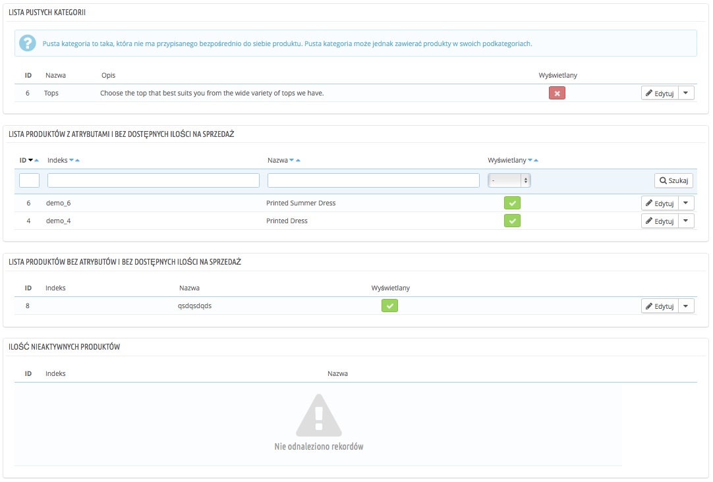

# Monitorowanie Twojego katalogu

Strona monitorowania wyświetla części Twojego sklepu, którym musisz poświecić więcej uwagi, aby dobrze zarządzać katalogiem i upewnić się, że nic nie wymyka się spod kontroli.

Pokazane są 4 sekcje:

* **Lista pustych kategorii.** Pokazuje kategorie, które nie mają żadnych produktów. Puste kategorie należy usunąć albo uzupełnić produktami. To zapobiega trafieniu klienta na kategorię, która jest pusta.
* **Lista produktów z atrybutami i bez dostępnych ilości na sprzedaż**. Pokazuje produkty, które nie są już w sprzedaży. Jeśli nie widzisz dobrego powodu, dla którego nie powinny być one z powrotem w sprzedaży, możesz je ponownie umieścić online.
* **Lista produktów bez atrybutów i bez dostępnych ilości na sprzedaż**. Podobnie jak w poprzednim przypadku, znajdź powód, dla którego warto przywrócić te produkty online.
* **Ilość nieaktywnych produktów.** Daje Ci listę produktów, które zostały wyłączone i nie są widoczne dla Twoich klientów. Zastanów się, czy chcesz je włączyć po uzupełnieniu stanu magazynowego, czy też chcesz je usunąć.

Strona monitorowania powinna być sprawdzana regularnie, aby poprawić zarządzanie katalogiem produktów.
