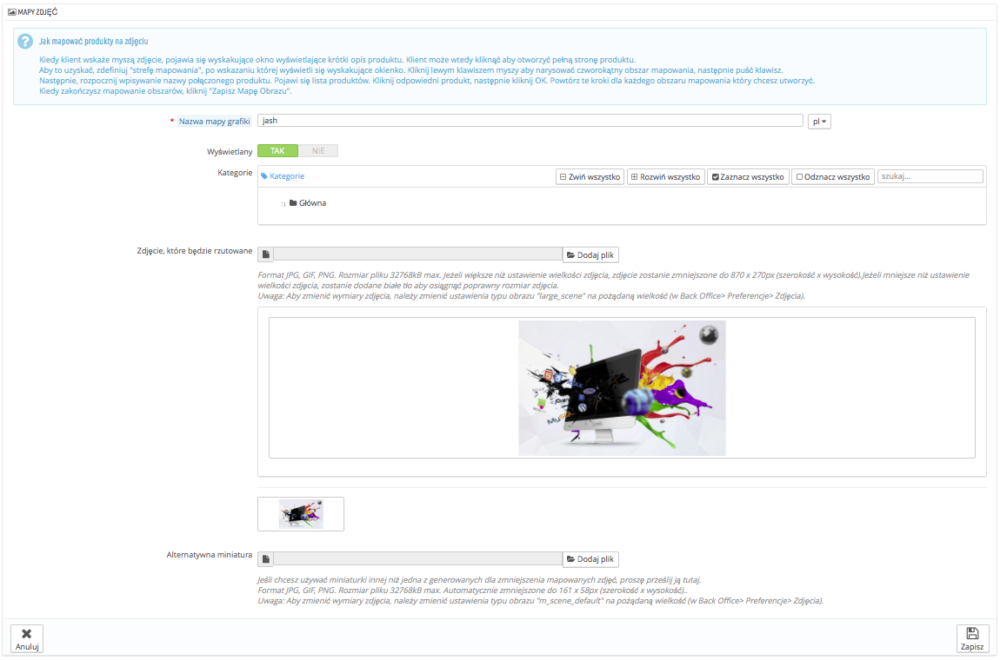

# Tworzenie map obrazów

Mapy obrazów to funkcja wprowadzona w wersji 1.1 PrestaShop i dostępna do wersji 1.5.\
**W nowej instalacji 1.6 nie jest ona dostępna, ale sklepy aktualizowane do wersji 1.6 mogą z niej korzystać.**

Jeśli posiadasz świeżą instalację PrestaShop 1.6 i chcesz korzystać z map obrazów, możesz zrobić to w następujący sposób:

1. Idź na stronę Administracja->Menu.
2. Naciśnij na "Dodaj menu".
3. W formularzu podaj nazwę (a priori "Mapy Obrazów"), a w pole "Klasa" wpisz "AdminScenes". Pole "Moduł" zostaw puste, a jako kategorię nadrzędną wybierz "Katalog".
4. Zachowaj formularz, mapa obrazów będzie w ten sposób widoczna w menu "Katalog".

**Pamiętaj, że ta funkcja jest już nieaktualna i nie jest wspierana.**

Mapowanie obrazu polega na przypisywaniu licznych aktywnych obszarów w obrębie jednego obrazu, tak aby różne strony produktów otwierane były poprzez klikanie na jednym obrazie. Ta funkcja może uatrakcyjnić stronę, ułatwiając klientowi nawigację.

Zanim utworzysz mapę obrazu, musisz posiadać obraz, który zawiera różne wariacje produktu albo różne produkty w jego obrębie.

Kliknięcie na opcję menu "Mapowanie obrazów" odsyła Cię do nowej strony, która zawiera listę obecnie zapisanych map, jeśli jakieś są dostępne.

Aby stworzyć nową mapę, naciśnij na "Dodaj nową mapę obrazu". Wyświetli się formularz.

* **Nazwa mapy grafiki.** Podaj nazwę mapy.
* **Wyświetlana.** Określ, czy mapa jest dostępna, czy może nie. Możesz opóźnić jej wyświetlanie, dopóki nie dokończysz dodawania wszystkich linków.
* **Zdjęcie, które będzie rzutowane.** Zaznacz obraz, który ma stanowić Twoją mapę obrazu, następnie naciśnij na "Zachowaj". Powrócisz do listy map, następnie naciśnij przy nowej mapie "edytuj", aby zmapować zdjęcie.

Teraz dowiesz się, jak zmapować obraz. Naciśnij gdziekolwiek na wgrane zdjęcie i przeciągnij myszą, zaznaczając jeden z prezentowanych produktów w celu podświetlenia/wycięcia fragmentu zdjęcia, który ma się stać aktywny dla użytkownika.

Zaznaczony obszar stanie się podświetlony i wyraźny, podczas gdy reszta obrazu będzie przyciemniona. Zwróć uwagę, aby dokładnie dopasować ramkę do wybranej powierzchni obrazu, gdzie klient ma kliknąć.

Gdy to zrobisz:

1. W polu poniżej wpisz pierwsze litery produktu powiązanego ze strefą.\
   W naszym przykładzie wpisalibyśmy "sukienka", po czym pojawiłoby się kilka możliwości wyboru. Wybralibyśmy "Sukienka z nadrukiem".
2. Zatwierdź wybór, naciskając "OK". Twoja mapa obrazu została utworzona.

Powtórz ten proces dla wszystkich produktów widocznych na obrazie, które chcesz uczynić aktywnymi.

Strefy klikalne są widoczne na obrazie, dzięki ikonie "+". Umieszczając wskaźnik myszy na obrazie, zobaczysz małe okno prezentujące nazwę obrazu, obraz domyślny, krótki opis i cenę.

Jeśli popełniłeś błąd i jakieś powierzchnie nachodzą na siebie, naciśnij na ramkę i dopasuj jej rozmiar.

Jeśli chcesz usunąć powierzchnię, zaznacz wybraną strefę i naciśnij ikonę kosza.

Na końcu musisz przypisać zmapowany obraz do kategorii, Zrobisz to w oknie "Kategorie".

Gdy dokonasz wszystkich zmian, zachowaj ustawienia.

Dzięki temu mapa obrazu będzie dostępna w Twoim sklepie we wskazanej kategorii.
