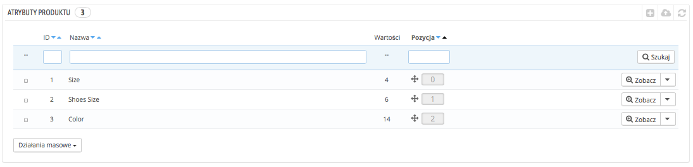
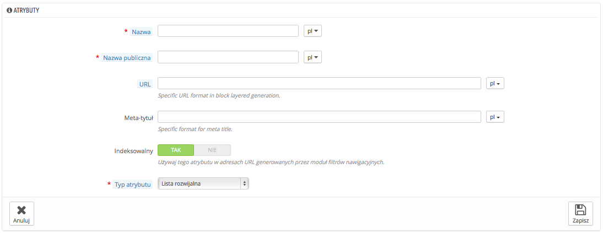
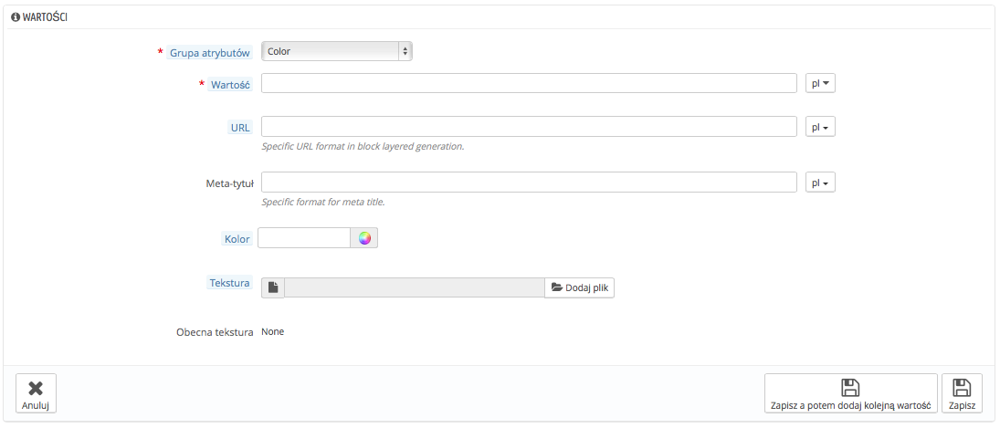

# Zarządzanie atrybutami produktów

Atrybuty stanowią podstawę dla kombinacji produktów w  PrestaShop: możesz stworzyć kombinacje produktu, jeśli co najmniej jeden z jego atrybutów się zmienia.

Atrybuty należy postrzegać jako właściwości produktu, które mogą zmieniać się w różnych wariacjach, jednocześnie zachowując tę samą nazwę produktu, np. kolor, rozmiar, objętość, waga etc. Możesz używać wszystkiego - za wyjątkiem ceny - co sprawia, że ten sam produkt występuje w wielu różniących się od siebie wariantach.

Różnica pomiędzy atrybutem a funkcją zależy od samego produktu. Niektóre mogą dzielić tę samą właściwość, dla jednych będzie to atrybut do tworzenia kombinacji, dla innych nieodmienna funkcja.

Na przykład, klient może kupić kombinację iPoda na podstawie atrybutów (kolor, pojemność), ale nie funkcji (waga, rozmiar).

Podobnie inny sklep może sprzedawać t-shirty w kombinacjach (kolor, rozmiar, płeć), ale nie jego funkcjach (waga).

Atrybuty są konfigurowane w odniesieniu do konkretnych produktów na stronie Katalog->Produkty, ale najpierw muszą istnieć w sklepie, będąc tworzone za pomocą narzędzia "Atrybuty produktów" w menu "Katalog".

Ta strona przedstawia listę obecnie zapisanych atrybutów. Możesz edytować lub usuwać każdy z nich, korzystając z menu po prawej, albo wyświetlić ich wartości, naciskając na przycisk "Zobacz", który wyświetli nową tabelę.

Możesz też zmienić porządek wyświetlania atrybutów, chwytając za "krzyżyk" w kolumnie "Pozycja" i przeciągając do wybranej pozycji dany element.

## Tworzenie nowego atrybutu 

Aby dodać atrybut - innymi słowy, dodać grupę możliwych wariacji (kolory, pojemności, materiały) - naciśnij na przycisk "Dodaj grupę atrybutów". Pojawi się nowa strona.

Wypełnij formularz:

* **Nazwa.** Dokładny opis atrybutu. Musi być krótki i dokładny, aby danego atrybutu nie pomylić z innym.
* **Nazwa publiczna.** Nazwa atrybutu, która będzie widoczna dla klientów. Ponieważ niektóre atrybuty mogą mieć różne nazwy w zależności od zawartości, to pole pozwala na przedstawienie ich prawidłowo w ramach produktu.
* **Typ atrybutu.** Pozwala określić, czy strona produktu powinna wyświetlać jego wartości w formie listy rozwijanej, listy do zaznaczania, czy palety kolorów.

Trzy dodatkowe opcje pojawiają się, jeśli włączysz moduł Blok Nakładania filtrów nawigacyjnych. Nie są one bezpośrednio powiązane z nawigacją: udostępniają bezpośredni adres URL do wariacji produktu. W ten sposób nie tylko klient będzie mógł podać prawidłowy link przyjacielowi, ale pozwoli to na lepsze pozycjonowanie produktu w wyszukiwarkach.

* **URL.** Słowo, które powinno zostać użyte w adresie URL, domyślnie PrestaShop używa tego, co składa się na nazwę publiczną atrybutu.
* **Meta tytuł.** Słowo, które znajdzie się w tytule strony, domyślnie PrestaShop używa tego co składa się na nazwę publiczną atrybutu.
* **Indeksowalny.** Określ, czy wyszukiwarki mają indeksować ten atrybut, czy nie.

Klienci otrzymają adres URL, wybierając odpowiedni atrybut, a końcówka adresu zmieni się na przykład na: `#/kolor-metal` or `#/pojemnosc-16gb/kolor-zielony`.

Generator filtrów nawigacyjnych też z tego skorzysta.

Zachowaj swój nowy atrybut i wróć do listy atrybutów. Teraz musisz dodać wartości do swojego atrybutu.

## Dodawania nowej wartości 

Naciśnij "Dodaj nową wartość", a pojawi się nowa strona:

Wypełnij formularz:

* **Grupa atrybutów.** Z listy rozwijanej wybierz jeden z dostępnych atrybutów.
* **Wartość.** Nadaj wartość atrybutowi, np. "Czerwony", "16 Gb" etc.

Następne wartości widoczne są tylko w przypadku, gdy atrybut jest Kolorem.

* **Kolor.** Jeśli atrybut jest kolorem, możesz wprowadzić jego wartość w kodzie HTML (np. "#79ff52" lub "red") albo użyć palety kolorów, aby dokładnie określić barwę.
* **Tekstura.** Jeśli Twój produkt nie ma koloru, a raczej teksturę (np. paski), możesz przesłać mały plik graficzny, który wyświetli się na stronie produktu. Pamiętaj jednak, że to zastąpi kolor wybrany powyżej.
* **Obecna tekstura.** Gdy prześlesz plik z teksturą, zostanie on wyświetlony w tym miejscu jako przypomnienie.

Możesz dodać więcej atrybutów dla tego samego atrybutu, naciskając na "Zapisz, a potem dodaj kolejną wartość".

Dostępne są dwie dodatkowe opcje, jeśli korzystasz z Bloku nakładania filtrów nawigacyjnych. Nie są one bezpośrednio powiązane z nawigacją: udostępniają bezpośredni adres URL do wariacji produktu. W ten sposób nie tylko klient będzie mógł podać prawidłowy link przyjacielowi, ale pozwoli to na lepsze pozycjonowanie produktu w wyszukiwarkach.

* **URL.** Słowo, które powinno zostać użyte w adresie URL, domyślnie PrestaShop używa tego co w nazwie publicznej atrybutu.
* **Meta tytuł.** Słowo, które znajdzie się w tytule strony, domyślnie PrestaShop używa tego co w nazwie publicznej atrybutu.

Klienci otrzymają adres URL, wybierając odpowiedni atrybut, a końcówka adresu zmieni się na przykład na: `#/kolor-metal` or `#/pojemnosc-16gb/kolor-zielony`.

Generator filtrów nawigacyjnych też z tego skorzysta.

Gdy skończysz dodawanie atrybutów i ich wartości, możesz zacząć tworzyć kombinacje produktów w zakładce "Kombinacje" strony produktu na stronie Katalog->Produkty.
