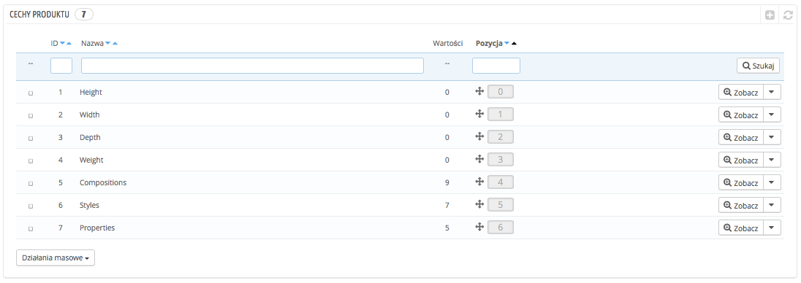
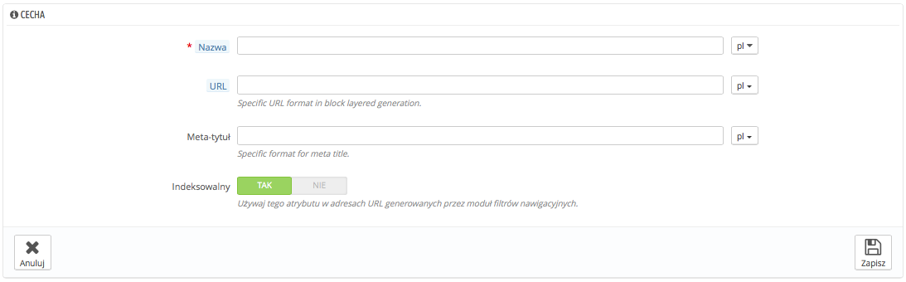
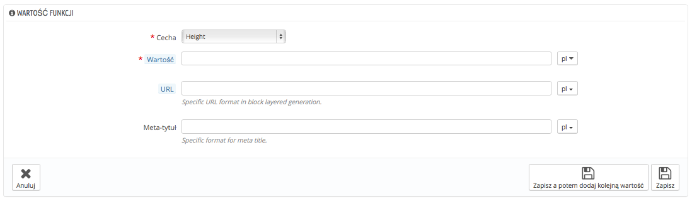

# Zarządzanie cechami produktów

Funkcje/cechy to charakterystyka wewnętrzna produktu: pozostają one niezmienne dla wszystkich kombinacji produktu.

Powinieneś myśleć o funkcjach/cechach tak samo jak o atrybutach, z tą różnicą, że nie możesz stworzyć kombinacji produktów w oparciu o funkcje.

Różnica pomiędzy atrybutem a funkcją/cechą zależy od samego produktu. Niektóre mogą dzielić tę samą właściwość, dla jednych będzie to atrybut do tworzenia kombinacji, dla innych nieodmienna funkcja/cecha.

Na przykład, klient może kupić kombinację iPoda na podstawie atrybutów (kolor, pojemność), ale nie funkcji/cech (waga, rozmiar).

Podobnie inny sklep może sprzedawać t-shirty w kombinacjach (kolor, rozmiar, płeć), ale nie jego funkcjach/cechach (waga).

Funkcje/cechy są konfigurowane w odniesieniu do konkretnych produktów na stronie Katalog->Produkty, ale najpierw muszą istnieć w sklepie, będąc stworzone za pomocą narzędzia "Cechy produktu" w menu "Katalog".

Możesz też zmienić porządek wyświetlania funkcji chwytając za "krzyżyk" w kolumnie "Pozycja" i przeciągając do wybranej pozycji dany element.

Możesz również edytować, przeglądać i usuwać wybrane cechy (funkcje) za pomocą menu w ostatniej kolumnie.

## Dodawanie cechy 

Naciśnij na "Dodaj nową cechę", pojawi się prosty formularz, gdzie możesz nazwać poszczególne cechy.

Nadaj nazwę nowej funkcji i zachowaj ją, aby wrócić do listy cech.

Trzy dodatkowe opcje pojawiają się, jeśli włączysz moduł Blok nakładania filtrów nawigacyjnych. Nie są one bezpośrednio powiązane z nawigacją: udostępniają bezpośredni adres URL do wariacji produktu; w ten sposób nie tylko klient będzie mógł podać prawidłowy link przyjacielowi, ale pozwoli to również na lepsze pozycjonowanie produktu w wyszukiwarkach.

* **URL.** Słowo, które powinno zostać użyte w adresie URL, domyślnie PrestaShop używa tego, co w nazwie publicznej cechy.
* **Meta tytuł.** Słowo, które znajdzie się w tytule strony, domyślnie PrestaShop używa tego, co w nazwie publicznej cechy.
* **Indeksowalny.** Określ, czy wyszukiwarki mają indeksować tę cechę, czy nie.

Klienci otrzymają adres URL wybierając odpowiednią cechę, a końcówka adresu zmieni się na przykład na: #/Kolor, #/pojemnosc-16Gb/zielony itd.

Generator filtrów nawigacyjnych też z tego skorzysta.

## Dodawanie wartości do cechy 

Naciśnij na "Dodaj nową wartość funkcji", aby wyświetlić formularz:

Wypełnij go:

* Cecha. Z listy rozwijanej wybierz dostępną cechę.
* Wartość. Podaj odpowiednią wartość do danej cechy/funkcji.\
  \

Dwie dodatkowe opcje pojawiają się, jeśli włączysz moduł Blok nakładania filtrów nawigacyjnych. Nie są one bezpośrednio powiązane z nawigacją: udostępniają bezpośredni adres URL do wariacji produktu; w ten sposób nie tylko klient będzie mógł podać prawidłowy link przyjacielowi, ale pozwoli to również na lepsze pozycjonowanie produktu w wyszukiwarkach.

* **URL.** Słowo, które powinno zostać użyte w adresie URL, domyślnie PrestaShop używa tego co w nazwie publicznej cechy.
* **Meta tytuł.** Słowo, które znajdzie się w tytule strony, domyślnie PrestaShop używa tego co w nazwie publicznej cechy.

Klienci otrzymają adres URL wybierając odpowiedni cechę, a końcówka adresu zmieni się na przykład na: #/Kolor, #/pojemnosc-16Gb/zielony itd.

Generator filtrów nawigacyjnych też z tego skorzysta.

... oraz zachowaj wartość cechy. Jeśli chcesz dodać więcej wartości dla tej samej funkcji/cechy, naciśnij na przycisk "Zapisz, a potem dodaj kolejną wartość".
