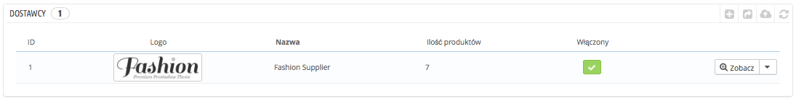
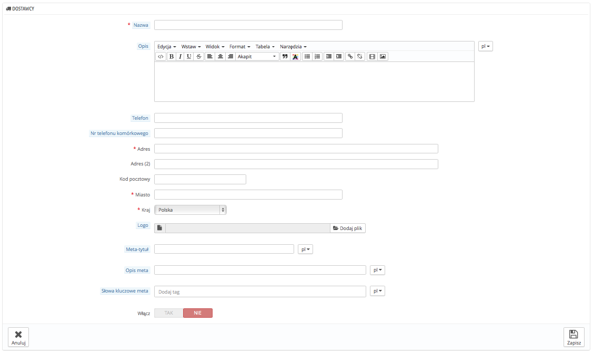

# Zarządzanie dostawcami

Rejestrowanie dostawców jest opcjonalne, jeśli posiadasz już producentów, którzy dostarczają Ci towary. Wszystko zależy od Twoich potrzeb, ale jeśli Twój dostawca nie jest tym samym co producent, to powinieneś mieć obydwu zapisanych w systemie i przypisanych do poszczególnych produktów.

W PrestaShop dostawca to firma, która dostarcza Ci produkt.

Nawet jeśli sprzedajesz swoje własne produkty, musisz przynajmniej utworzyć Twoją firmę jako dostawcę.

Tak, jak w przypadku producentów, Twoi klienci mogą mieć szybki dostęp do wszystkich dostawców. To może ułatwiać nawigację oraz wpływać pozytywnie na pozycjonowanie sklepu.

Naciśnij na "Dodaj nowego dostawcę", a pojawi się formularz.

Wypełnij wszystkie pola formularza:

* **Nazwa.** Wskaż nazwę dostawcy, aby ułatwić jego identyfikację.
* **Opis.** Dodaj więcej informacji dotyczących tego dostawcy. Opisy te będą widoczne w sklepie.
* **Pola adresowe.** (Telefon, adres etc.).
* **Logo.** Możesz dodać logo dostawcy, aby wzmocnić swój wizerunek.
* Pola SEO (Meta tytuł, opis meta, słowa kluczowe meta) posiadają te same właściwości, co w przypadku kategorii.
  * **Meta tytuł.** Tytuł, który będzie widoczny w wynikach wyszukiwania.
  * **Opis meta.** Prezentacja dostawcy w kilku słowach, która ma za zadanie przyciągnąć uwagę klienta. Pojawia się wynikach wyszukiwania.
  * **Słowa kluczowe meta.** Słowa kluczowe potrzebne do indeksacji strony przez wyszukiwarki. Możesz mieć kilka oddzielonych przecinkami, tak jak i wyrażenia wpisane w cudzysłowie.
* **Włącz.** Możesz wyłączyć tymczasowo dostawcę. To wyłączy jedynie jego obecność we front-endzie Twojego sklepu.

Zachowaj zmiany i wróć do listy dostawców, tam możesz:

* Nacisnąć na nazwę lub logo dostawcy i wyświetlić listę powiązanych produktów. Jeśli takich nie ma, możesz przypisywać produkty podczas opisywania produktu, na stronie "Produkty" w menu "Katalog", używając dla każdego produktu zakładki "Powiązania", znajdującej się po lewej stronie.\
  Ten sam efekt osiągniesz, naciskając ikonę "Zobacz" po prawej.
* Wyłączyć dostawcę, naciskając na zielone "tak". Gdy wyłączony, czerwony znak "X" pojawia się na jego miejscu: kliknij, by ponownie włączyć dostawcę.
* Edytować/usuwać dostawców, naciskając odpowiednie przyciski w kolumnie po prawej.
