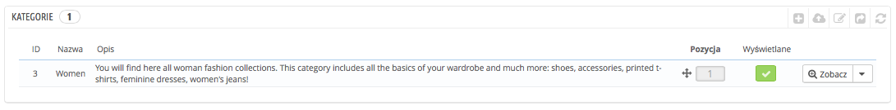
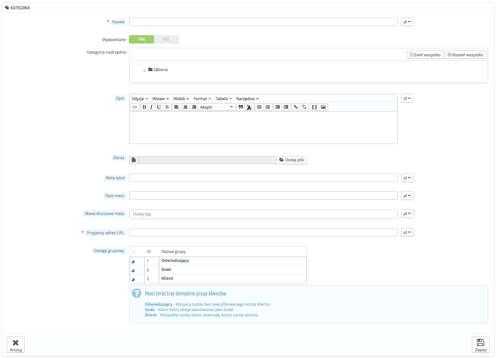

# Zarządzanie kategoriami

Kategorie są niezwykle ważne, ponieważ pozwalają Ci na grupowanie podobnych produktów. To pomaga klientom odnaleźć się w różnorodności Twojego katalogu i zawężać wyszukiwanie do specyficznego typu produktów. Kategorie ułatwiają klientom znajdowanie i porównywanie produktów (także dzięki funkcji porównywania wbudowanej w PrestaShop).

Możesz stworzyć nową kategorię, począwszy od chwili gdy masz co najmniej 2 produkty o podobnych/tych samych atrybutach. Produkty w kategorii powinny być porównywalne, jeśli nie wymienne. Pamiętaj o tym, dodając nowe produkty i tworząc nowe kategorie.

Możesz nie tworzyć kategorii i mieć wszystkie produkty umieszczone w jednej globalne kategorii "Główna", z tymże wtedy klienci nie będą w stanie ich porównać.

Możesz też zdecydować, że nie interesuje Cię porównywanie produktów i wolisz budować swobodnie kategorie. W takim przypadku wyłącz tę funkcję na stronie Preferencje->Produkty i ustaw "0" w opcji "Porównanie produktów".

Przy tworzeniu kategorii produktów należy skupić się na jednej rzeczy: **produkty w kategorii muszą być porównywalne** poprzez ich atrybuty (nie funkcje). To nie tylko użyteczne dla klientów, ale niezbędne dla funkcji porównywania PrestaShop.

Kategorie są zarządzane na stronie "Kategorie" w menu "Katalog". Strona ta wyświetla aktualnie istniejące kategorie wraz z głównymi informacjami.

Aby wyświetlić podkategorie, naciśnij kategorię macierzystą i zaznacz "Zobacz".



Używając kolumny "Wyświetlane", możesz wskazać te kategorie, które chcesz ukryć przed użytkownikami, naciskając na zielony symbol, który zmieni się na czerwony znak "x".

Wszystkie kategorie są właściwie podkategoriami "Głównej".

Aby edytować kategorię "Główna" (albo aktualnie zaznaczoną kategorię), naciśnij na edytuj.

W celu utworzenia kategorii (albo podkategorii), naciśnij na "Dodaj nową".



Przetłumacz kategorie!

Upewnij się, że przetłumaczyłeś każde pole na każdy język w Twoim sklepie, wybierając selektor języka przy każdym edytowalnym polu.

Po pierwsze musisz wprowadzić ogólne informacje:

* **Nazwa.** Podana nazwa kategorii powinna być krótka i opisowa, jednocześnie jasna dla Twoich klientów.
* **Wyświetlane.** Określ, czy kategoria ma być wyświetlana dla Twoich klientów. Możesz na przykład opóźnić wyświetlanie nowej kategorii, ponieważ nie będzie ona kompletna.
* **Kategoria nadrzędna.** Nie pojawia się, kiedy tworzysz kategorię główną. Jeśli chcesz utworzyć podkategorię należącą do innej kategorii niż strona główna, wybierz kategorię, gdzie ma się ona pojawiać.
* **Opis.** Powinieneś wypełnić to pole, nie tylko dlatego, że może przydać się Twoim pracownikom, ale szablon może również wyświetlać je Twoim klientom.
* **Obraz.** Dodaj plik obrazu, który miałby przedstawiać daną kategorię.
* **Tytuł meta.** Tytuł, który będzie się pojawiać w wynikach wyszukiwarek.
* **Opis meta.** Prezentacja Twojej kategorii w kilku słowach, sformułowana tak, by przyciągnąć uwagę Twoich klientów. Pojawi się w wynikach wyszukiwania.
* **Słowa kluczowe meta.** Słowa-klucze, które należy zdefiniować w celu poprawnej indeksacji przez wyszukiwarki. Możesz podać ich wiele, oddzielonych przecinkami, dotyczy to także wyrażeń, które powinny być zapisane w cudzysłowie.
* **Przyjazny adres URL.** Pozwala na dowolne przepisanie adresu URL Twojej kategorii.\
  &#x20;Na przykład zamiast adresu: [http://www.example.com/category.php?id\_category=3](http://www.example.com/category.php?id\_category=3), możesz mieć nazwę [http://www.example.com/123-nazwa-twojej-kategorii](http://www.example.com/123-nazwa-twojej-kategorii).\
  W tym przypadku pamiętaj, by wskazać w polu "Przyjazny URL" te słowa, które mają się pojawić zamiast "nazwa-twojej-kategorii" oddzielone myślnikami, nie zaś cały adres.
* **Dostęp grupowy.** Możesz ograniczyć dostęp do kategorii wybranym grupom. Aby zobaczyć kategorię, klienci będą musieli należeć do danej grupy. Sprawdź stronę "Grupy" w menu "Klienci", aby dowiedzieć się więcej.
*   **Kategoria główna.** Dostępna jedynie, gdy tworzysz kategorię główną. Możesz chcieć użyć nową kategorię jako kategorię główną w miejscu "Głównej". Jeśli tak, to zaznacz tę opcję.

    Kategoria główna jest bardzo przydatna w trybie multisklep. Wyobraź sobie, że masz trzy sklepy z różnymi lub częściowo różnymi produktami i kategoriami: chciałbyś korzystać z innej kategorii głównej w każdym sklepie.

    Wybrana kategoria główna staje się kategorią główną dla każdego sklepu, dlatego jeśli nie chcesz mieć tych samych produktów w kategorii na stronie głównej każdego ze sklepów, lepiej jest ustalić różne kategorie główne dla każdego sklepu.

    W ten sposób łatwiej przypisać kategorie do każdego ze sklepów, dzięki czemu w kategorii głównej możesz mieć różne produkty.

Gdy skończysz konfigurowanie kategorii, zachowaj ją, a następnie wypełnij produktami.

## Nawigacja i edycja kategorii <a href="#zarzadzaniekategoriami-nawigacjaiedycjakategorii" id="zarzadzaniekategoriami-nawigacjaiedycjakategorii"></a>

Przycisk "edytuj" pozwala Ci na edycję wybranej kategorii nadrzędnej w stosunku do obecnie wyświetlanych podkategorii. Oznacza to, że gdy widzisz główne podkategorie, kliknięcie przycisku "Edytuj" umożliwi Ci edytowanie kategorii "Głównej".

Możesz nacisnąć na każdą kategorię w tabeli, to otworzy tę kategorię i wyświetli wszystkie dostępne podkategorie. W efekcie, zmieni to kontekst interfejsu: kliknięcie przycisku "Edytuj" pozwoli na edycję obecnej kategorii nadrzędnej, natomiast kliknięcie przycisku "Dodaj nową" otworzy formularz tworzenia kategorii z opcją "Kategorii nadrzędnej" ustaloną w odniesieniu do obecnej kategorii nadrzędnej.

## Importowanie i eksportowanie kategorii <a href="#zarzadzaniekategoriami-importowanieieksportowaniekategorii" id="zarzadzaniekategoriami-importowanieieksportowaniekategorii"></a>

Poza przyciskami "Dodaj nową" oraz "Edycja", są także przyciski:

* **Eksportuj.** Pozwala na pobranie wszystkich kategorii w formacie CSV.
*   **Importuj.** Otwiera stronę "Zaawansowane->Import CSV" z określonym typem importu ustawionego na Kategorie. Zapoznaj się z rozdziałem "Zrozumienie ustawień zaawansowanych" tego podręcznika, aby dowiedzieć się więcej na temat importowania plików CSV.\
    Twój plik CSV powinien naśladować ten model:

    ```
    ID;Name;Description;Position;Displayed;
    3;iPods;Now that you can buy movies from the iTunes Store and sync them to your iPod, the whole world is your theater.;1;1;
    4;Accessories;Wonderful accessories for your iPod;2;1;
    5;Laptops;The latest Intel processor, a bigger hard drive, plenty of memory, and even more new features all fit inside just one liberating inch. The new Mac laptops have the performance, power, and connectivity of a desktop computer. Without the desk part.;3;1;
    ```

    Identyfikator kategorii (Category identifer) to ID, a nie nazwa kategorii.
* **Odświeżanie listy**. Przeładuj listy, aby zobaczyć wszelkie dokonane zmiany.

Więcej opcji importu dostępnych jest na stronie "Zaawansowane->Import CSV".

## Dodawanie produktu do kategorii <a href="#zarzadzaniekategoriami-dodawanieproduktudokategorii" id="zarzadzaniekategoriami-dodawanieproduktudokategorii"></a>

Aby dodać produkt do kategorii, musisz otworzyć stronę konfiguracji produktu i przejść do zakładki "Powiązania". Tam możesz określić kategorie, do których ma należeć dany produkt.

Kategoria "Główna" jest kategorią specjalną, gdzie możesz promować produkty z każdej innej kategorii, które będą pojawiać się w "Bloku Promocji". Domyślnie możesz wyświetlać tylko 8 produktów na stronie głównej.

"Blok promocji" zależy od modułu "Polecane produkty na stronie głównej". Jeśli chcesz mieć więcej lub mniej produktów na stronie głównej, skonfiguruj ten moduł.

Pamiętaj, że nie musisz usuwać produktu z jego kategorii, aby pojawił się na stronie głównej. Produkt może mieć znajdować się w tylu kategoriach, w ilu chcesz.
