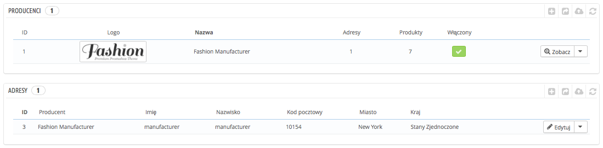

# Zarządzanie producentami

Jeśli sam nie jesteś producentem, który sprzedaje swoje produkty, powinieneś zawsze zapisywać producentów w PrestaShop.

W PrestaShop producent to marka produktu. Jeśli sprzedajesz własne produkty, musisz wprowadzić przynajmniej swoją firmę jako producenta. To pomoże Twoim klientom znaleźć to, czego szukają i dostarczy kilka cennych punktów wyszukiwarkom internetowym.

Na Front-endzie Twojego sklepu marki są posortowane alfabetycznie. Nie możesz zmienić tej kolejności.

Nowi producenci są automatycznie wyłączeni. Musisz ich włączyć, aby pojawili się online - nawet jeśli nie posiadają jeszcze produktów.

Wprowadzając informacje o producencie, Twoi klienci będą mieli szybki dostęp do produktów danej marki. To ułatwia nawigację po stronie, a jednocześnie poprawia pozycjonowanie Twojej strony.

## Tworzenie producenta 

Naciśnij na "Dodaj nowego producenta", a pojawi się formularz.

Wypełnij następujące pola:

* **Nazwa.** Wskaż nazwę marki.
* **Krótki opis.** Ten opis może pojawić się w wynikach wyszukiwarek, jest ograniczony do 100 znaków.
* **Opis.** Możesz dodać bardziej obszerny opis działalności producenta. Możesz napisać o specyfice jego produktów, jakości. Ten opis będzie widoczny na Twojej stronie.
* **Logo.** Posiadanie Logo Producenta jest bardzo ważne: przyciąga ono wzrok klienta i wzmacnia zaufanie do Twojej marki.
* Pola SEO (Meta tytuł, opis meta, słowa kluczowe meta), posiadają te same właściwości, jak w przypadku kategorii.
  * **Meta tytuł.** Tytuł, który będzie widoczny w wynikach wyszukiwania.
  * **Opis meta.** Prezentacja producenta w kilku słowach, która ma za zadanie przyciągnąć uwagę klienta. Pojawia się wynikach wyszukiwania.
  * **Słowa kluczowe meta.** Słowa kluczowe potrzebne do indeksacji strony przez wyszukiwarki. Możesz wprowadzić kilka z nich, oddzielając je przecinkami, albo wpisać wyrażenia, umieszczając je w cudzysłowie.
* **Włącz.** Możesz wyłączyć tymczasowo producenta. To usunie go jedynie jedynie z listy producentów widocznej na Front-endzie Twojego sklepu.

Zachowaj zmiany i wróć do listy producentów, tam możesz:

*   Nacisnąć na nazwę lub logo producenta i wyświetlić listę powiązanych produktów. Jeśli takich nie ma, możesz przypisać produkty do producenta podczas opisywania produktu na stronie "Produkty" w menu "Katalog", używając dla każdego produktu zakładki "Powiązania", znajdującej się po lewej stronie.

    Ten sam efekt osiągniesz, naciskając ikonę "Zobacz" po prawej.
* Wyłączyć producenta, naciskając na zielone "tak".
* Edytować/usuwać producentów, naciskając odpowiednie przyciski.

## Dodawanie adresu producentów 

Na dole strony "Producenci" znajduje się część "Adresy". Każdy producent może mieć swój adres zapisany w PrestaShop. To może służyć jako przypomnienie: w ten sposób będziesz miał adres producenta zawsze pod ręką.

Naciśnij na przycisk "Dodaj nowy adres producenta", aby wyświetlić formularz.

Upewnij się, że wybrałeś prawidłowego producenta i wypełnij możliwie najwięcej pól.
