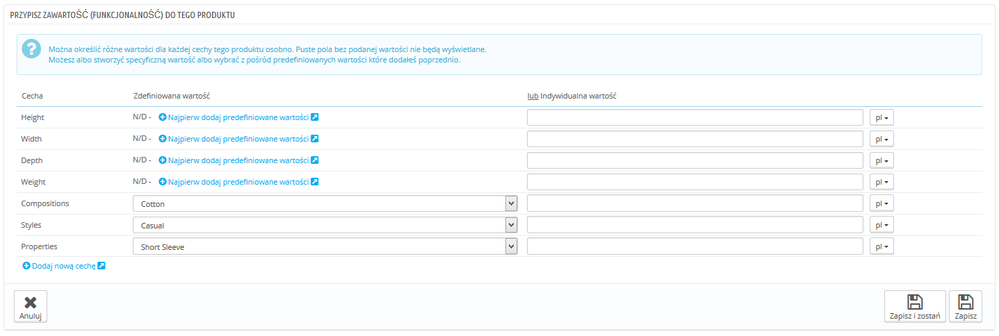

# Zarządzanie produktami

## Zarządzanie produktami 

Możesz zarządzać produktami w Twoim sklepie, korzystając ze strony "Produkty" w menu "Katalog"

Ten podrozdział podzielony jest na następujące części:

* [Zarządzanie produktami](zarzadzanie-produktami.md#Zarządzanieproduktami-Zarządzanieproduktami)
  * [Lista produktów](zarzadzanie-produktami.md#Zarządzanieproduktami-Listaproduktów)
  * [Przyciski globalne strony kreacji produktu](zarzadzanie-produktami.md#Zarządzanieproduktami-Przyciskiglobalnestronykreacjiproduktu)
  * [Wypełnianie Informacji o produkcie](zarzadzanie-produktami.md#Zarządzanieproduktami-WypełnianieInformacjioprodukcie)
  * [Określanie ceny produktów](zarzadzanie-produktami.md#Zarządzanieproduktami-Określaniecenyproduktów)
  * [Optymalizacja pozycjonowania (SEO) Twojego produktu](zarzadzanie-produktami.md#Zarządzanieproduktami-Optymalizacjapozycjonowania\(SEO\)Twojegoproduktu)
  * [Zarządzanie powiązaniami między produktami](zarzadzanie-produktami.md#Zarządzanieproduktami-Zarządzaniepowiązaniamimiędzyproduktami)
  * [Nadawanie kosztów przesyłki, rozmiaru, wagi, przewoźnika](zarzadzanie-produktami.md#Zarządzanieproduktami-Nadawaniekosztówprzesyłki,rozmiaru,wagi,przewoźnika)
  * [Dodawanie kombinacji produktów](zarzadzanie-produktami.md#Zarządzanieproduktami-Dodawaniekombinacjiproduktów)
  * [Zarządzanie Ilością produktu](zarzadzanie-produktami.md#Zarządzanieproduktami-ZarządzanieIlościąproduktu)
  * [Konfiguracja zdjęć produktów](zarzadzanie-produktami.md#Zarządzanieproduktami-Konfiguracjazdjęćproduktów)
  * [Konfiguracja funkcji produktów](zarzadzanie-produktami.md#Zarządzanieproduktami-Konfiguracjafunkcjiproduktów)
  * [Zarządzanie personalizacją](zarzadzanie-produktami.md#Zarządzanieproduktami-Zarządzaniepersonalizacją)
  * [Zarządzanie załącznikami](zarzadzanie-produktami.md#Zarządzanieproduktami-Zarządzaniezałącznikami)
  * [Ustawianie dostawcy produktu](zarzadzanie-produktami.md#Zarządzanieproduktami-Ustawianiedostawcyproduktu)
  * [Zarządzanie magazynami (zaawansowane)](zarzadzanie-produktami.md#Zarządzanieproduktami-Zarządzaniemagazynami\(zaawansowane\))
* [Tworzenie paczek produktów](zarzadzanie-produktami.md#Zarządzanieproduktami-Tworzeniepaczekproduktów)
* [Tworzenie wirtualnego produktu](zarzadzanie-produktami.md#Zarządzanieproduktami-Tworzeniewirtualnegoproduktu)

### Lista produktów 

Naciśnij na stronę "Produkty" w menu "Katalog", aby przejść do listy Twoich produktów, która wyświetla podstawowe informacje: ID, zdjęcie, indeks, kategorię itd.

Oprócz listy na stronie widać statystyki Twojego sklepu:

* Procent produktów dostępnych w magazynie,
* Procent średniej marży brutto,
* Procent sprzedaży w ciągu ostatnich 30 dni,
* Ilość wyłączonych produktów.

"Filtruj według kategorii" pozwala Ci na wyświetlanie produktów należących do wybranej kategorii, jak i na zmianę organizacji wyświetlania tych produktów w ramach kategorii.

Pozycja produktu

Nie możesz przeorganizować całej listy produktów. Produkty są wyświetlane tak, jak w sklepie (według rosnącego numeru ID), a klient może wybrać produkt, posługując się dostępnymi narzędziami sortowania: według najniższej/najwyższej ceny, według nazwy rosnąco/malejąco, według trafności największej/najmniejszej.

Możesz zorganizować produkty według kategorii, korzystając z opcji "Filtruj według kategorii". To uruchomi małe menu, gdzie wymienione będą wszystkie kategorie i podkategorie. Zaznaczenie jednej kategorii automatycznie filtruje listę wyświetlanych produktów do wybranej kategorii. Ponadto pojawia się kolumna "Pozycja", która pozwala Ci określić położenie produktu na stronie kategorii. Możesz zmienić położenie produktu, naciskając na krzyżyk w kolumnie "Pozycja" i przeciągając produkt na właściwe miejsce.

Kolejność wyświetlania produktów może być zmieniona przez klientów korzystających z narzędzi sortowania.

Zwróć uwagę, że kiedy zmienisz sortowanie produktów na liście w back-office (klikając na strzałkę przy którejś z kolumn), to z kolumny "Pozycja" zniknie "krzyżyk" i zmiana pozycji produktów nie będzie możliwa. Aby przywrócić tę opcję, ustaw sortowanie rosnąco w kolumnie "Pozycja".

W górnym prawym rogu listy produktu dostępne są 4 przyciski:

* **Dodaj nowy.** Tworzy nowy produkt.
* **Eksportuj.** Tworzy plik eksportu w formacie CSV wszystkich produktów Twojego katalogu.
* **Importuj.** Przenosi Cię do strony "Import CSV", gdzie możesz importować produkty.
* **Odśwież listę.** Przeładowuje listę produktów, aby wyświetlić ostatnie zmiany.

Możesz dodać produkt, naciskając przycisk "Dodaj nowy". Pojawi się formularz z kilkoma zakładkami po lewej stronie.

### Przyciski globalne strony kreacji produktu 

Domyślnie strona kreacji produktu posiada dwa przyciski, które dostępne są również na innych stronach administracyjnych "Rekomendowane moduły" oraz "Pomoc".

Na dole stronie kreacji są dostępne trzy przyciski:

* **Zapisz.** To zachowuje wszelkie wprowadzone zmiany i przekierowuje Cię na listę produktów.
* **Zapisz i zostań.** Zapisuje wprowadzone zmiany i pozostawia Cię na aktualnie otwartej zakładce. To bardzo przydatne, kiedy chcesz przechodzić pomiędzy zakładkami bez utraty wprowadzonych danych.
* **Anuluj.** Przenosi Cię na listę produktów bez zachowywania jakichkolwiek zmian.\
  \
  

Jak tylko nazwiesz swój produkt i naciśniesz "Zapisz i zostań", pojawi się więcej przycisków u góry strony:

* **Podgląd.** Wyświetla stronę front-office Twojego produktu. Jest to bardzo przydatne i działa nawet wtedy, gdy twój produkt jest wyłączony (Zakładka "Informacja").
*   **Skopiuj.** Tworzy idealną kopię produktu. To szczególnie przydatne, gdy chcesz wykorzystać bieżący produkt jako szablon pod kolejny produkt, a nie chcesz wpisywać wszystkich danych ręcznie.

    Na przykład dwa produkty mogą być całkiem różne, ale mieć podobne powiązania, przewoźników, dostawców etc.

    Nie duplikuj za dużo!

    Jeśli potrzebne Ci stworzenie kilku wersji tego samego produktu ze względu na różnorodność kolorów, pojemność, rozmiar etc, powinieneś stworzyć kombinacje produktów, zamiast duplikować go x razy. Zobacz zakładkę "Kombinacje", która jest objaśniona w części "Dodawanie Kombinacji produktów" tego rozdziału.
* **Sprzedaż produktu.** Przekierowuje Cię na stronę "Szczegóły produktu" w dziale "Statystyki", co daje Ci dostęp do wykresów wizyt na stronie produktu oraz jego sprzedaży.
* **Usuń ten produkt.** Usuwa wszystkie dane dotyczące tego produktu, także jego zdjęcia, kombinacje etc.

### Wypełnianie Informacji o produkcie 

Pierwsza zakładka zawiera podstawowe informacje o produkcie.

Pierwsza opcja jest najważniejsza, określa ona bowiem, czy produkt występuje jako zestaw (paczka - kombinacja dwóch już istniejących produktów), czy jako produkt wirtualny (pobieralny, usługa etc.), czy po prostu jako produkt standardowy - taki, który można wysłać pocztą. Na tę chwilę zajmiemy się tym ostatnim przykładem, pozostałe są omówione w innych częściach tego rozdziału.

Jest wiele innych opcji powiązanych z produktami, które znajdują się na stronie Preferencje->Produkty:

* Liczba dni, w ciągu których produkt widnieje oznaczony jako nowy.
* Domyślny porządek produktów.
* Uruchamianie zaawansowanej obsługi magazynu.
* itd.

Powinieneś sprawdzić, czy te globalne ustawienia są skonfigurowane w taki sposób, jak sobie tego życzysz.

Rozpoczynasz z 4 polami tekstowymi:

*   **Nazwa.** Pierwszą rzeczą jest nadanie nazwy produktowi, który będzie widoczny w wynikach wyszukiwania w internecie. Obok znajduje się kod języka, który pozwoli Ci na wybranie języka, dla którego chcesz wprowadzić lub zmienić nazwę produktu.

    Musisz podać nazwę produktu przynajmniej w języku domyślnym, aby go zachować. Nie będziesz w stanie zachować go bez podania nazwy - a wiele zakładek wymaga tego, aby produkt był najpierw zachowany, by następnie móc wprowadzać na nich zmiany. Upewnij się, że przetłumaczyłeś każde pole na każdy język, który wspiera Twój sklep.
* **Kod produktu.** To jest Twoje wewnętrzne oznaczenie, może to być numer, odniesienie do miejsca składowania, numer podany przez dostawcę albo cokolwiek unikalnego.
* **Kod kreskowy EAN-13 lub JAN.** Są to numery kodu rozpowszechnione na całym świecie, które służą do dokładnej identyfikacji produktu. Możesz użyć kodu EAN albo JAN.\

  * EAN 13 składa się 13 cyfr, więcej na ten temat: [http://pl.wikipedia.org/wiki/EAN](http://pl.wikipedia.org/wiki/EAN).
  * Kod JAN jest specyficzny dla Japonii, ale jest również kompatybilny z kodem EAN: [http://en.wikipedia.org/wiki/Japanese\_Article\_Number](http://en.wikipedia.org/wiki/Japanese\_Article\_Number).
* **Kod kreskowy UPC.** Kod 12-cyfrowy rozpowszechniony szczególnie w Ameryce Północnej, Wielkiej Brytanii, Australii i Nowej Zelandii, więcej na ten temat: [http://pl.wikipedia.org/wiki/Universal\_Product\_Code](http://pl.wikipedia.org/wiki/Universal\_Product\_Code).

Następnie masz do dyspozycji 4 opcje:

* **Włączony.** Określ status przedmiotu. Jeśli na przykład nie chcesz, aby był on od razu widoczny dla Twoich klientów, zaznacz "NIE".
* **Widoczność.** Możesz określić widoczność produktu w różnych kanałach:\

  * **Wszędzie.** Klient może dotrzeć do produktu poprzez katalog, wyszukiwanie nazwy produktu albo wchodząc bezpośrednio w adres URL.
  * **Tylko katalog.** Klient może dotrzeć do produktu poprzez katalog albo wchodząc bezpośrednio w adres URL.
  * **Tylko wyszukiwanie.** Klient może dotrzeć do produktu poprzez wyszukiwanie nazwy produktu albo wchodząc bezpośrednio w adres URL.
  * **Nigdzie.** Klient może dotrzeć do produktu wyłącznie wchodząc bezpośrednio w adres URL. Nie znajdzie go w katalogu albo wyszukując jego nazwę. To świetne narzędzie dla prywatnych, szczególnych produktów, do których tylko wybrani będą mogli dotrzeć (nawet tymczasowo, zawsze możesz to zmienić).
* **Opcje**\

  * **Sprzedaż** (tryb katalogu, jeśli nieaktywne). Jeśli to odznaczysz, to klienci nie będą mogli dodać tego produktu do koszyka. Przypomina to "tryb katalogu" dla jednego produktu.
  * **Pokaż cenę.** Jeśli pierwsza opcja zostanie odhaczona, to możesz mimo wszystko wyświetlać cenę, chociaż klienci nie będą mogli tego kupić.
  * **Tylko Online** (nie sprzedawany w Twoim sklepie stacjonarnym). Może być to szczególnie przydatne, gdy posiadasz sklepy stacjonarne, gdzie nie ma miejsca na prezentację pełnego asortymentu Twojego sklepu.
* **Stan.** Nie wszystkie sklepy sprzedają nowe produkty. Ta opcja pozwoli Ci wskazać stan produktu:\

  * **Nowy.** Produkt jest nowy i w oryginalnym opakowaniu.
  * **Używany.** Ten produkt był już sprzedany i używany przez kogoś innego. Powinien zostać dostarczony wraz oryginalnym opakowaniem, które będzie zaklejone taśmą.
  * **Odświeżony.** Produkt został zwrócony z różnych powodów, ale jego stan jest bliski nowemu, więc można go sprzedać po niższej cenie. Na ten temat: [http://en.wikipedia.org/wiki/Refurbishment\_%28electronics%29](http://en.wikipedia.org/wiki/Refurbishment\_\(electronics\)).

Po wprowadzeniu tych informacji możesz rozpocząć edycję opisów produktu.\
&#x20;Dobry opis to podstawa dla Twojego klienta (im więcej rzetelnych i dobrych informacji, tym lepiej), ale także dla wyszukiwarek internetowych (pozwoli to na lepsze pozycjonowanie Twojego sklepu i Twoich produktów)

Dwa różne pola opisów służą różnym celom:

* Pole **"Krótki opis"** pozwala Ci na wprowadzenie krótkiego opisu, który będzie pojawiać się w wyszukiwarkach internetowych i w opisie kategorii produktu. Pole to jest domyślnie ograniczone do 400 znaków. Jeśli przekroczysz to ograniczenie, PrestaShop odpowiednio Cię ostrzeże. Możesz zmienić to ograniczenie na stronie Preferencje->Produkty, pod opcją "Maksymalny rozmiar krótkiego opisu".
*   Pole **"Opis"** pozwala Ci na kompletne opisanie Twojego produktu. Edytor tekstowy oferuje szeroki wachlarz opcji w tworzeniu atrakcyjnie wyglądającego opisu (czcionka, rozmiar, kolor tekstu etc)

    To pole nie ma limitu, a coś takiego, jak zbyt dużo informacji, nie istnieje. Mimo wszystko jednak staraj się przedstawiać informacje w sposób interesujący i spójny, a wszystko będzie dobrze

Poniżej tych dwóch pól znajduje się małe narzędzie do dodawania zdjęć do opisu (które przypisałeś do tego produktu w zakładce "Zdjęcia") za pomocą tagów. Naciśnij na "Kliknij tutaj", aby je otworzyć.

Zaznacz zdjęcie, które chcesz, wybierz jego pozycję odnośnie tekstu oraz jego rozmiar, a PrestaShop wygeneruje "Tag zdjęcia do wstawienia", który następnie możesz wkleić w treść opisu (najlepiej pomiędzy dwoma paragrafami albo na początku paragrafu).

W polu **"Tagi"** wprowadź pojęcia i słowa kluczowe, które pomogą Twoim klientom łatwo odnaleźć to, czego szukają.

Będą one wyświetlone na stronie w bloku "Tagi" (jeśli dostępne). Jeśli nie chcesz wyświetlać bloku tagów, po prostu wyłącz moduł "Blok tagów" na stronie Moduły->Moduły.

Różnice z wersją PrestaShop 1.4.

PrestaShop 1.4 pozwalał na wprowadzenie Producenta bezpośrednio z poziomu tej zakładki. Od wersji 1.5 to ustawienie możesz znaleźć w zakładce "Powiązania". To samo dotyczy pola "domyślna kategoria", powiązanych kategorii, oraz pola "Akcesoria".

Wersja 1.4 pozwalała również na wprowadzenie rozmiaru i wagi produktu. Od wersji 1.5 dane te są dostępne w zakładce "Wysyłka".

Pole "Lokalizacja" z wersji 1.4 znajduje się w opcjach zakładki "Magazyny", która jest widoczna dopiero, gdy aktywowałeś Zaawansowane zarządzanie magazynem (Preferencje->Produkty, część "Stan produktów".

Gdy tylko wypełnisz wszystkie pola, zachowaj swoją pracę naciskając "Zapisz i zostań". Jeśli zaś chcesz dalej uzupełniać informacje, kliknij "Zapisz", aby wrócić do listy produktów.

### Określanie ceny produktów 

Wszystko to odbywa się w zakładce "Ceny". Ta sekcja może wydawać się nieco onieśmielająca ze wszystkimi polami wpływającymi na siebie, podatkami etc, ale w gruncie rzeczy jest dość prosta.

Ustal cenę, która pojawi się w Twoim sklepie, postępując według poniższych instrukcji:

* **Cena hurtowa netto.** Pozwala Ci dowiedzieć się, jaki będzie koszt netto, koszt fabryczny produktu, a dzięki porównaniu z Twoją ceną sprzedaży pozwoli Ci łatwo obliczyć zysk.
* **Cena sprzedaży netto.** Cena produktu przed naliczeniem podatków.
* **Reguła podatku.** To podatek nakładany na produkt, wybierz pomiędzy różnymi zapisanymi stawkami.\
  &#x20;Jeśli musisz utworzyć nowy podatek, naciśnij "Utwórz nowy podatek". Tworzenie podatku odbywa się na stronie Lokalizacja->Podatki i jest całkowicie wyjaśnione w rozdziale "Zrozumieć ustawienia lokalne" tego podręcznika.
* **Podatek ekologiczny (brutto).** Wartość podatku ekologicznego za ten produkt. Ta wartość zostanie wliczona w cenę sprzedaży netto.\
  &#x20;_Uwaga to pole nie jest domyślnie wyświetlane_. Jeśli chcesz dodać podatek ekologiczny, musisz najpierw go włączyć na stronie Lokalizacja->Podatki, część "Opcje podatku" i zaznacz "Tak" przy "Użyj podatku ekologicznego".
* **Cena sprzedaży z podatkiem.** Wyświetla cenę produktu wraz z podatkami. Możesz edytować tę wartość, a cena sprzedaży netto będzie automatycznie uaktualniana na podstawie reguły podatkowej, z której korzystasz.
* **Cena jednostkowa.** Pozwala Ci na dostosowanie się do lokalnych przepisów prawnych, które wymagają, aby produkt był wyświetlany wraz z jego ceną jednostkową.\
  &#x20;Na przykład, jeśli sprzedajesz 6 puszek napoju, wtedy powinieneś wypełnić to pole wartością za puszkę i wpisać "Puszkę" w polu "za". Opis zostanie automatycznie wzbogacony o tę linię.
* **Wyświetl ikonę "wyprzedaż" na stronie produktu oraz tekst na wyliczeniu produktów.** Zaznacz to pole, aby wyświetlić informację o wyprzedaży produktu na stronie produktu oraz na liście produktów. Ikona "Wyprzedaż" pojawi się pod produktem. Możesz zmienić to logo, zmieniając plik w katalogu: `themes/default/img/onsale_en.gif.`
* **Cena końcowa.** Ta cena, wraz z naliczonymi podatkami, będzie aktualizowana na bieżąco.

Możesz wypełnić "Cenę sprzedaży z podatkiem" oraz wybrać podatek, a pole "Ceny sprzedaży netto" będzie automatycznie przekalkulowane. To samo działa w drugą stronę.

Na tym etapie wszystkie podstawowe informacje dla podstawowego produktu są uzupełnione. Możesz je zachować i produkt będzie natychmiast dostępny w Twoim sklepie!

Czytaj jednak dalej, ponieważ jest jeszcze wiele kwestii, które mogą sprawić, że Twój produkt będzie jeszcze bardziej atrakcyjny dla klientów.

#### Specyficzne ceny: Obsługa rabatów ilościowych 

Możesz zmienić cenę całkowitą produktu w zależności od ilości produktów, które chce kupić Twój klient, grupy klientów, kraju pochodzenia. Możesz to zrobić w części "Specyficzne ceny". Naciśnij na "Dodaj nową cenę", aby wyświetlić formularz.

To bardzo proste, aby utworzyć cenę rabatową dla produktu i jego kombinacji.

Naciśnij "Dodaj nową cenę", aby wyświetlić formularz:

* **Za.** Pozwala Ci bardzo konkretnie określić różne grupy, dla których cena będzie obowiązywać, wliczając w to waluty, państwa, a nawet grupy klientów (co omówimy dalej).
* **Klient.** Możesz określić dokładnie, czy dotyczy to wszystkich klientów, a może konkretnych. Zacznij pisać pierwsze litery imienia lub nazwiska, a konta, które możesz dodać, zaczną się pojawiać.
* **Kombinacja.** Możesz określić, czy ta specyficzna cena ma dotyczyć wszystkich kombinacji produktu, czy tylko jednej. Jeśli chcesz zastosować ją dla kilku różnych kombinacji, ale nie wszystkich, to niestety musisz utworzyć specyficzną cenę dla każdej z kombinacji.
* **Dostępny od.. do...** Możesz określić przedział czasowy, kiedy cena rabatowa będzie wyświetlana. Pod każdym polem jest dostępny kalendarz, który znacznie upraszcza proces.
* **Już od x sztuk.** Możesz określić, od jakiej ilości przedmiotu cena rabatowa ma zostać przyznana.
* **Cena produktu netto.** Tu możesz podać cenę netto, niezależną od kalkulacji ceny regularnej. Wpisz "0" jeśli chcesz zachować cenę domyślną.\
  **Pozostaw cenę bazową.** Zaznacz to, aby wyczyścić pole "Cena produktu netto" i zapobiec jej edytowaniu.
* **Zastosuj zniżkę.** Zniżka zostanie zastosowana po określeniu ilości produktu przez klienta. Wybierz typ zniżki (albo konkretną kwotę, albo stosunek procentowy od ceny zakupu).

Po wprowadzeniu wybranych danych naciśnij "Zapisz i zostań", a pojawi się podsumowanie ustawień zniżek. Zniżka będzie natychmiast widoczna w Twoim sklepie.

Jeśli chcesz usunąć specyficzną cenę, to naciśnij ikonę kosza przy wybranej cenie na liście.

Jeśli chcesz zbudować bardziej złożone zniżki, przeczytaj rozdział o "Regułach cenowych"  w rozdziale "Tworzenie reguł cenowych oraz zniżek" tego przewodnika.

#### Zarządzanie priorytetami cenowymi 

Czasami jeden klient może pasować do kilku specyficznych warunków cenowych, nawet jeśli je bardzo wyszczególniłeś, dlatego PrestaShop korzysta z zestawów priorytetów, które możesz nadać dla takich klientów, aby otrzymali jedną specyficzną cenę. Możesz na przykład chcieć, aby użytkownicy grupy byli ważniejsi aniżeli na przykład waluta.

Ustalasz to, korzystając z ustawień "Zarządzania priorytetami".

Domyślny porządek stosowania priorytetów jest następujący:

1. Sklep (jeśli multisklep jest aktywny).
2. Waluta.
3. Kraj.
4. Grupa.

Pole poniżej pozwala Ci na określenie tych priorytetów dla wszystkich produktów w sklepie. Jeśli pole będzie odznaczone, to priorytety te dotyczyć będą wyłącznie tego produktu.

### Optymalizacja pozycjonowania (SEO) Twojego produktu 

Aby poprawić wyświetlanie produktu oraz widoczność Twojego sklepu, sugerujemy, abyś dokładnie wypełnił różne pola dotyczące SEO: tytuły meta, opisy meta, słowa kluczowe etc.

Skrót "SEO" oznacza Search Engine Optimization. Przeczytaj więcej na Wikipedii: [http://pl.wikipedia.org/wiki/Optymalizacja\_dla\_wyszukiwarek\_internetowych](http://pl.wikipedia.org/wiki/Optymalizacja\_dla\_wyszukiwarek\_internetowych).

Aby dostać się do informacji SEO, otwórz zakładkę "Optymalizacja SEO" po lewej.

Pola dostępne w tej zakładce pozwolą Ci na optymailzację widoczności Twojego katalogu w wynikach wyszukiwań.

* **Meta-tytuł.** To najważniejsze pole, ponieważ tytuł pojawia się we wszystkich wyszukiwarkach. Musisz być ostrożny: przekonaj użytkownika do naciśnięcia na Twój odnośnik, a nie inny. Upewnij się, że tytuł jest unikalny pośród produktów dostępnych na Twojej stronie:\

  * Dobry przykład: "Levi's 501® Original Jeans - Tidal Blue - Original Fit".
  * Zły przykład: "Item #02769869B bestseller".
* **Opis meta.** Prezentacja produktu w zaledwie kilku liniach (idealnie - mniej niż 155 znaków), skoncentrowana na przyciągnięciu uwagi klienta. Będzie widoczna w rezultatach niektórych wyszukiwarek w zależności od zapytania: niektóre silniki wyszukiwarek mogą wyświetlać słowa kluczowe bezpośrednio w kontekście strony, więc upewnij się, że Twój opis jest wyjątkowy dla danego produktu.
*   **Przyjazny adres URL.** To także bardzo ważne pole. Pozwala Ci przepisać adres internetowy produktu według potrzeb. Na przykład, adres:\
    [http://www.myprestashop.prestashop.com/index.php?id\_product=8\&controller=product](http://www.myprestashop.prestashop.com/index.php?id\_product=8\&controller=product)\
    możesz zamienić na:\
    [http://www.myprestashop.prestashop.com/8-nazwa-tego-produktu.html](http://www.myprestashop.prestashop.com/8-nazwa-tego-produktu.html).\

    Wszystko, co musisz zrobić, to wpisać słowa, które chciałbyś zobaczyć w miejscu oryginalnego adresu zamiast spacji, jednak pamiętaj o korzystaniu z myślników!

    Przycisk "Wygeneruj" ułatwi stworzenie prawidłowego przyjaznego adresu URL w oparciu o nazwę produktu. Raz wygenerowany adres możesz zmienić według potrzeb.

Przyjazne adresy URL będą funkcjonować jedynie, jeśli przepisywanie adresów URL jest włączone. Możesz to zrobić na stronie Preferencje->SEO & URL.

Więcej na ten temat znajdziesz w rozdziale "Zrozumieć preferencje" tego podręcznika.

### Zarządzanie powiązaniami między produktami 

Tworzenie powiązań dla produktu oznacza łączenie go z inną zawartością Twojej bazy danych:

* Kategoriami.
* Innymi produktami (Akcesoriami).
* Producentami.

#### Kategorie 

Sekcja "Powiązane kategorie" pozwala Ci na wybranie kategorii, w której produkt powinien być widoczny. Możesz zaznaczyć więcej niż jedną, ale pamiętaj, że lepiej dla klienta, jeśli kategoria posiada tylko podobne i zbliżone produkty. Dlatego powinieneś unikać przypisywania do kategorii głównej, natomiast korzystać z kategorii podrzędnych.

Przykładowo, kategoria "telefon" może posiadać podkategorie "marki", jak i "charakterystyki". To do Ciebie należy określenie, które kategorie będą najbardziej przydatne Twoim klientom.

Jeśli uważasz, że potrzebujesz nowej kategorii dla produktu, zachowaj obecny stan produktu zanim naciśniesz "Stwórz nową kategorię". Tworzenie kategorii jest wyjaśnione w innej części tego podręcznika.

Opcja "Domyślna kategoria" jest przydatna, kiedy produkt jest dostępny w wielu kategoriach. Służy ona przede wszystkim do jasnego określenia, której kategorii użyć, w przypadku gdy użytkownik przychodzi na Twoją stronę z wyszukiwarki internetowej, a nazwa kategorii będzie umieszczona w adresie URL.

&#x20;Lista produktów promowanych

Jeśli zaznaczysz "Główna" jako jedną z kategorii, to produkt ten pojawi się w bloku promowanych produktów na stronie głównej, jeśli aktualny szablon wspiera tę opcję. Aby go usunąć, odznacz go z kategorii głównej.

#### Produkty powiązane 

To pole daje Ci możliwość wybierania określonych produktów do tworzenia z nimi powiązań z aktualnie edytowanym produktem. Dzięki temu możesz sugerowania klientom inne produkty podczas ich wizyty na stronie produktu (jeśli szablon to wspiera). Wpisz pierwsze litery produktu i zaznacz go, a produkt zostanie dodany poniżej.

Możesz powiązać produkt z tyloma produktami, ile chcesz. Naciśnij krzyżyk, jeśli chcesz któryś produkt usunąć.

Powiązanie jest wyłącznie jednostronne, z produktu powiązanego nie da się przejść do obecnego produktu (chyba że utworzysz powiązanie z tamtym produktem).

Produkty dodawane nie są automatycznie zapisywane, więc nie zapomnij nacisnąć przycisk "Zapisz".

#### Producent 

Produkt może być przypisany wyłącznie do jednego producenta. Wybierz jednego producenta z rozwijanego menu albo stwórz nowego producenta, jeśli taka jest potrzeba (ale zachowaj najpierw ustawienia produktu, zanim naciśniesz "Stwórz nowego producenta").

### Nadawanie kosztów przesyłki, rozmiaru, wagi, przewoźnika 

Nie można lekceważyć kosztów przesyłki. Mogą one podwoić koszt zakupu i należy być bardzo otwartym w tej sprawie - klienci nie lubią złych niespodzianek.

Zakładka "Wysyłka" po lewej pozwala Ci określić kilka detali dotyczących wysyłki twojego produktu:

* **Szerokość, wysokość, głębokość, waga opakowania.** Warto uzupełnić każde pole, ponieważ znajomość dokładnych wymiarów i wagi opakowania nie jest przydatna tylko Tobie, ale PrestaShop może na podstawie tych danych przypisać automatycznie koszty dostawcy. Ostateczna cena zamówienia pokaże się klientowi, gdy wybierze przewoźnika.

Te wartości wykorzystują domyślne wartości wymiarów i wag określonych na stronie Lokalizacja->Lokalizacja.

Wartości nie muszą być zaokrąglone. Jeśli Twój produkt waży poniżej jednego kilograma, możesz użyć kropki, aby określić wartości po przecinku:

* 123 kg
* 1.23 kg
* 0.23 kg
* etc.
* **Dodatkowe koszty dostawy (dla pojedynczego przedmiotu).** Opcja może być przydatna w przypadku specyficznych lub ciężkich przedmiotów, których przesyłka wymaga dodatkowych opłat.
* **Przewoźnicy.** Możesz przypisać konkretnego przewoźnika/ów do produktu. Jeśli żaden nie zostanie wybrany, wtedy wszyscy przewoźnicy będą dostępni dla zamówień klientów.

### Dodawanie kombinacji produktów 

Możesz często sprzedawać ten sam produkt w wielu wariantach: posiadają one tę samą nazwę, ale mogą różnić kolorami, rozmiarami i innymi atrybutami. Przeważnie te atrybuty krzyżują się ze sobą: możesz mieć wersję czerwoną produktu o pojemności 1 Gb i 2 Gb oraz koszulkę o rozmiarach xl, s, etc. Dlatego PrestaShop nazywa to kombinacjami: Twój stan magazynowy może składać się z wielu wariacji jednego produktu, co w efekcie przekłada się na atrybuty połączone w specyficzny sposób.

Nie możesz utworzyć kombinacji, jeśli nie masz jeszcze ustawionych prawidłowo atrybutów w PrestaShop.

Nie powinieneś także tworzyć kombinacji dla funkcji, z których Twoi klienci nie będą mogli skorzystać.

Tworzenie atrybutów odbywa się na stronie "Atrybuty produktu" w menu "Katalog" i jest wyjaśnione w dalszej części tego przewodnika.

To, jakie atrybuty nadasz produktom, zależy od Ciebie, zaś PrestaShop daje Ci dwa sposoby na dokonanie tego.

#### Metoda manualna 

Ta metoda pomaga Ci stworzyć kombinacje jedna po drugiej. Dlatego jest ona zarezerwowana dla produktów z niewielką ilości kombinacji albo dla bardzo specyficznej kombinacji, która nie może być utworzona za pomocą metody automatycznej (omówionej za chwilę).

Dodanie nowego wariantu produktu wymaga kilku kroków. Naciśnij na "Nowa kombinacja" na dole strony, obok przycisku "Zapisz", aby wyświetlić formularz:

* **Atrybut-wartość.**\

  1. Z menu rozwijanego wybierz grupę atrybutów, na przykład "Kolor", Zawartość listy "Wartość" zaktualizuje się automatycznie.
  2. Wybierz wartość atrybutu, który chcesz dodać.
  3. Naciśnij przycisk "Dodaj", a pojawi się atrybut z zawartością.\
     &#x20;Możesz dodawać tyle par atrybut-wartość, ile potrzeba do jednej kombinacji.\
     &#x20;Możesz dodawać tylko jedną parę na atrybut dla jednej kombinacji. Nie można ustawić dwóch "Kolor: Niebieski" i "Kolor:Czerwony" jako dwóch par. Jeśli tego jednak wymagasz, utwórz nowe grupy atrybutów, na przykład "Kolor podstawowy", "Kolor drugorzędny".\
     &#x20;Możesz usunąć parę atrybut-wartość, zaznaczając ją i naciskając przycisk "Usuń".
* **Kod produktu, kod kreskowy EAN-13 lub JAN, oraz UPC.** Jeśli to potrzebne, wprowadź odpowiednie dane w odpowiednie pola, tak jakbyś wprowadzał nowe produkty do PrestaShop. Kody te mogą być wykorzystywane w Twoim magazynie, więc jest to bardzo ważne, abyś miał je uzupełnione.
* **Cena hurtowa (zakupu).** To pole jest przydatne, jeśli cena oryginalna produktu zmienia się ze względu na kombinację.
* **Wpływ na cenę/wagę/cenę jednostkową.** Jeśli kombinacja produktu powinna mieć wpływ na oryginalną cenę/wagę/cenę jednostkową, wybierz odpowiednie menu rozwijane, zaznacz "Wzrost" albo "Spadek" w zależności od kontekstu i wypełnij pole odpowiednią wartością.
* **Podatek ekologiczny (netto).** Specyficzny podatek ekologiczny dla danej kombinacji.
* **Minimalna ilość.** Możesz określić, że dana kombinacja może być sprzedawana w ilościach hurtowych.
* **Data dostępności.** Jeśli produkt nie jest dostępny, możesz określić datę pojawienia się go w magazynie.
* **Obraz.** Zdjęcia, które są przypisane do oryginalnego produktu (jako przesłane za pomocą zakładki zdjęcia); zaznacz pole obok obrazka, który odpowiada danej kombinacji.
* **Domyślnie.** Zaznacz to, jeśli kombinacja, którą aktualnie tworzysz ma być domyślną dla tego produktu.

Po określeniu wszystkich detali zachowaj ustawienia, naciskając "Zapisz i zostań", a Twoja lista kombinacji pojawi się na dole strony.

Różnice z PrestaShop 1.4

W wersji 1.4 PrestaShop istniał "Clor picker" na dole listy wszystkich kombinacji, gdzie można było określić, czy "wybór kolorów" pojawiał się na stronie produktów, czy też nie.

Od wersji 1.5 opcja ta została przeniesiona i poprawiona. Gdy tworzysz nowy atrybut (Katalog->Atrybuty produktu), możesz użyć "Typ atrybutu" do wyboru sposobu wyświetlania.

#### Metoda automatyczna 

Jeśli masz zbyt wiele różnych wariantów produktu, możesz użyć "Generatora kombinacji produktów". To narzędzie pomoże Ci automatycznie wygenerować wszystkie możliwe kombinacje.

Gdy naciśniesz "Generatora kombinacji produktów", zostaniesz przeniesiony do formularza.

Może pojawić się ostrzeżenie "Możesz utracić niezachowane zamiany. Czy chcesz kontynuować", to oznacza, że twój produkt posiada już jakieś utworzone kombinacje. Jeśli się zgodzisz, to wszystkie kombinacje, które nie zostały zapisane, zostaną usunięte. Uważaj więc i pamiętaj zapisywać zawsze swoją pracę zanim użyjesz generatora!

Po lewej stronie znajdują się atrybuty i ich wartości. Wybierz kombinacje, zaznaczając nazwy wartości (jeśli chcesz zaznaczyć więcej wartości, naciskaj z przytrzymanym klawiszem CTRL), następnie naciśnij "Dodaj".

Na przykład, możesz wybrać wartości "niebieskie", "S", "M", "L".

Aby usunąć wybór atrybutów, zaznacz ich wartość i naciśnij "Usuń".

Gdy wybierzesz wariacje atrybutów, możesz określić wpływ kombinacji na wagę i cenę produktu. Możesz, lecz nie musisz tego robić, jeśli będą miały tę samą cenę.

Określ domyślną ilość produktu poniżej, ale uważaj, będzie ona taka sama dla każdej kombinacji. Na przykład 200 produktów w każdej kombinacji = 2 kolory \* 1 rozmiar = 400 produktów w całości.

Możesz również dodać domyślną referencję (indeks) do tych kombinacji.

Naciśnij na "Generuj kombinacje", a PrestaShop przekieruje Cię z powrotem do zakładki "Kombinacje", gdzie znajdą się wszystkie wygenerowane kombinacje. Jeśli zajdzie taka potrzeba, możesz je edytować pojedynczo.

Jak widzisz, generator kombinacji pomoże Ci zachować sporo czasu, jeśli masz wiele atrybutów do złożenia, takich jak rozmiary i materiały. Automatycznie tworzy wszystkie możliwe kombinacje, które następnie pojawiają się na stronie produktu, w zakładce "Kombinacje" (jeśli szablon to wspiera).

Jeśli nie chcesz zachowywać wszystkich wygenerowanych kombinacji albo nie są one dokładnie te same (różne referencje, ceny, daty dostępności), możesz je usunąć albo zmodyfikować, wybierając konkretne pozycje z listy kombinacji. Ikona gwiazdki zmienia wybraną kombinację w domyślną, która w tym przypadku będzie znajdować się na niebieskim tle.

### Zarządzanie Ilością produktu 

Ilości produktu są zarządzane z poziomu jednej zakładki "Ilości". Jej sposób funkcjonowania jest bardzo prosty: strona przedstawia Ci tabelę wszystkich kombinacji dla obecnego produktu (jeśli ich nie ma, to tabela posiada tylko jedną linię). Do Ciebie należy określenie początkowej ilości dla wszystkich kombinacji. PrestaShop wykorzysta to do określenia, czy produkt będzie wkrótce niedostępny albo wyprzedany.

#### Opcje zarządzania ilościami 

Zakładka "Ilości" wspiera funkcję zaawansowanego zarządzania magazynem. To oznacza, że jeśli obecne kombinacje produktu są rozmieszczone w różnych magazynach, PrestaShop jest w stanie obsłużyć każdą lokalizację każdej kombinacji, nawet w ramach jednego magazynu.

Domyślnie musisz zarządzać ręcznie ilościami aktualnego produktu dla każdej kombinacji z poziomu tej strony. Z funkcją zaawansowanego zarządzania magazynem, możesz polegać na obsłudze tego przez PrestaShop.

Aby użyć tej funkcji, zaznacz opcję "Chcę używać zaawansowanego zarządzania stanem magazynowym dla tego produktu". Gdy to zaznaczysz, uaktywni się pole "Dostępne ilości bieżącego produktu i jego kombinacji bazują na stanie magazynowym w magazynie". Gdy to aktywujesz, nie będziesz już w stanie dyktować ilości z poziomu tej zakładki produktu.

#### Gdy nie ma na stanie 

Gdy nie ma na stanie. Ta opcja pozwala Ci na określenie, w jaki sposób ma zachować się PrestaShop, kiedy produktu nie ma na stanie: nie pozwól zamawiać (produkt nie jest już dostępny w sprzedaży) lub pozwól zamawiać (w skrócie możesz tak oznacza przedsprzedaż). Trzecia opcja jest domyślna przyjmuje określoną w ustawieniach wartość (Preferencje->Produkty, część "Stan produktów": "Zezwól na zamawianie produktów, których nie ma na stanie").

#### Ustawienia dostępności 

Na dole strony możesz określić dokładne zachowanie PrestaShop na podstawie dostępnej ilości obecnego produktu.

Opcje są następujące:

* **Tekst, gdy ilość<0.** Dostępność: pozwala Ci na wyświetlanie informacji klientom, kiedy produkt jest dostępny, na przykład "produkt dostępny". To upewni ich, że sklep może wysłać im produkt natychmiast.
* **Tekst gdy ilość=0, a towar dostępny na zamówienie.** Dostępność: pozwala na wyświetlanie wiadomości, kiedy produkt **nie jest dostępny,** ale klienci mogą go nadal zamówić, na przykład w przypadku przedsprzedaży.

Możesz również skonfigurować ustawienia ogólne, które mogą być stosowane do wszystkich produktów: domyślną opcją jest blokada możliwości złożenia zamówienia (Preferencje->Produkty), co zostało w pełni wyjaśnione w rozdziale "Zrozumieć preferencje".

### Konfiguracja zdjęć produktów 

Zakładka "Zdjęcia" jest odpowiedzialna za dołączanie zdjęć do stron produktu. Powinieneś przesłać wszystkie zdjęcia dla tego produktu wraz z jego kombinacjami (kolor, rozmiar, kształt etc).

Aby dodać jedno albo więcej zdjęć do produktów:

1.  Naciśnij "Dodaj pliki", a następnie zaznacz co najmniej jeden plik na Twoim komputerze. Możesz zaznaczyć ich więcej, przytrzymując klawisz CTRL podczas zaznaczania plików albo możesz wybierać po kolei. PrestaShop wyświetli wybrane zdjęcia na liście wraz z ich rozmiarem i przyciskiem umożliwiającym usunięcie ich z listy.

    Domyślny maksymalny rozmiar dla plików graficznych jest określany na podstawie ustawień PHP serwera. Ta wartość może być obniżona na stronie "Preferencje->Zdjęcia".
2. Nadaj zdjęciu nagłówek. Będzie on wyświetlany w przypadku, kiedy zdjęcia nie będą mogły być wyświetlane - co może być bardzo przydatne w optymalizacji pozycjonowania.
3. Naciśnij przycisk "Prześlij pliki", aby umieścić plik na serwerze.
4.  Przesłane pliki wyświetlane są w tabeli poniżej. Jeśli masz więcej niż jedno zdjęcie, możesz określić, który obraz ma być wykorzystany jako domyślny, klikając na pole w kolumnie "Okładka"

    To zdjęcie będzie również pokazywało się automatycznie na stronie produktu.

    Możesz nacisnąć na miniaturkę obrazka, aby go zobaczyć w pełnym rozmiarze

Gdy przeniosłeś już wszystkie pliki, możesz zmienić ich kolejność, przeciągając je i upuszczając po najechaniu na "Krzyżyk" w kolumnie "Pozycja".

### Konfiguracja funkcji produktów 

Zakładka "Funkcje" służy do określenia funkcji/charakterystyki produktu (jak na przykład rozmiar, materiał, kraj pochodzenia etc.)

Kiedy tworzysz funkcje i wartości (np. skład, styl, właściwości), przypisujesz je produktom, kiedy tego wymagają. To oznacza, że nie musisz wypełniać wszystkich funkcji dla każdego produktu, zamiast tego wypełnij tylko wartości niezbędne i zachowaj je.

Silnik porównywania produktów PrestaShop opiera się na funkcjach produktów: To one są porównywane.

Ponieważ porównywanie produktów działa także w ramach kategorii, upewnij się, że wszystkie produkty w danej kategorii dzielą te same funkcje z innymi wartościami, które pozwolą na porównywanie jednych i drugich.

Wiedz również, że **w przeciwieństwie do kombinacji, te wartości się nie zmieniają** i są nadawane dla produktu głównego (to oznacza, że kombinacje jednego produktu będą posiadały te same funkcje)!

#### Tworzenie funkcji 

Zanim utworzysz funkcję dla produktu, musisz utworzyć ją ogólnie dla całego sklepu. Albo idź na stronę "Funkcje" w menu "Katalog", albo naciśnij bezpośrednio odnośnik "Dodaj nową cechę". Pojawi się ostrzeżenie "Utracisz wszystkie niezapisane zmiany. Czy jesteś pewien, że chcesz kontynuować?" - upewnij się więc, że zachowałeś wszystkie zmiany przed zachowaniem.

Funkcje oraz wartości funkcji zostały szczegółowo omówione w kolejnej części przewodnika.

#### Przypisywanie wartości oraz funkcji do produktu 

Zakładamy, że już ustawiłeś funkcje oraz ich wartości.

W obecnej zakładce "Funkcje" jest wyświetlona tabela ukazująca wszystkie dostępne funkcje w Twoim sklepie. Nie wszystkie będą odpowiednie dla Twojego produktu: PrestaShop uzna za ważne jedynie te, w których wprowadzisz odpowiednią wartość.

Możesz wpisać wartość ręcznie w polu w prawej kolumnie albo użyć predefiniowanych wartości, jeśli są dostępne.

Jeśli żadna wartość nie jest dostępna, wyświetla się informacja "N/D" (skrót od niedostępna), a następnie odnośnik "Najpierw dodaj predefiniowane wartości".

Jeśli wybierzesz wpisywanie indywidualnych wartości, nie zapomnij określić ich dla każdego języka Twojego sklepu.

Jeśli będą dostępne wartości predefiniowane, to pojawią się one na liście rozwijanej do wyboru. Wystarczy wybrać i zaznaczyć odpowiednią wartość.

Gdy wybierzesz wszystkie funkcje, zachowaj ustawienia, a pojawią się one od razu na stronie produktu.

Pamiętaj: jeśli funkcja nie ma przypisanej żadnej wartości, to nie będzie ona wyświetlana przy produkcie.

### Zarządzanie personalizacją 

PrestaShop umożliwia Twoim klientom personalizację produktu, który kupują.

Na przykład: jesteś sprzedawcą biżuterii, a Twoi klienci mają możliwość jej grawerowania. Mogą wysłać tekst/zdjęcie podczas składania zamówienia.

Zaletą tej funkcji jest też to, że zapewnia Twoim klientom indywidualną obsługę, którą z pewnością docenią.

Spójrz zatem, jak skonfigurować tę funkcję. W zakładce "Dostosowanie" możesz określić dokładnie rodzaj kontekstu, która ma być spersonalizowany.

* **Pola plików.** Określ liczbę pól, które będą akceptować pliki. Jedno pole może przyjąć tylko jeden plik, tak więc utwórz tyle, ile mogą potrzebować Twoi klienci.
* **Pola tekstowe.** Określ liczbę pól tekstowych na stronie zamówień. Możesz dodać tyle pól, ile potrzeba.\
  &#x20;Na przykład: jeśli chcesz pozwolić klientowi na skorzystanie z tekstu 5-liniowego ograniczonego do 14 znaków, możesz dodać 5 pól tekstowych i określić liczbę dopuszczalnych znaków. nie możesz ograniczyć ilości znaków w ciągu znaków.

Gdy dodałeś odpowiednią liczbę pól, naciśnij "Zapisz i zostań". Strona przeładuje się i wyświetli tyle pól, ile należy. Wypełnij każde z nich z odpowiednią etykietą: to będzie wskazówka dla klienta, a zatem bądź konkretny w kwestii tego, czego oczekujesz.

Jeśli na przykład pozwalasz na przesyłanie okładek książek, możesz użyć następujących etykiet:

* Okładka przednia (20,95 x 27,31 cm, kolor).
* Okładka tylna ((20,95 x 27,31 cm, czarno-biała).
* Grzbiet (20,95 x 1,716 cm, kolor).

Podobnie w przypadku tekstu: jeśli klient może zamówić wygrawerowanie tekstu, możesz użyć następujących etykiet:

* Pierwsza linia (24 znaki).
* Druga linia (24 znaki).
* Trzecia linia (16 znaków).

Jeśli chcesz, możesz również określić, czy któreś z tych pól należy wypełnić lub uzupełnić przed dodaniem produktu do koszyka. Jeśli tak jest, zaznacz pole "Wymagany" obok etykiety.

**Usuwanie pól.** Jeśli pod koniec okaże się, że dodałeś zbyt dużo pól, zmień po prostu ich liczbę i naciśnij "Zapisz i zostań". Strona przeładuje się z odpowiednią liczbą pól, z których pierwsze to te, które zostaną zachowane.

Gdy prowadzisz wszystkie etykiety, nie zapomnij ich zachować!

#### Po stronie klienta 

Gdy produkt ma ustawione pola personalizacji, to na stronie produktu pojawia się nowa zakładka "Personalizacja produktu", obok zakładki "Więcej informacji".

Klient musi wskazać plik albo wpisać tekst zanim będzie mógł dodać produkt do koszyka

Zdjęcie oraz tekst będą widoczne w podsumowaniu koszyka.

Reszta procesu jest taka, jak zwykle.

**Po stronie sprzedawcy**

Gdy zamówienie zostanie potwierdzone przez klienta, sprzedawca otrzyma powiadomienie w back-office.

Możesz następnie sprawdzić zamówienie, które będzie wskazywać zdjęcia/tekst na liście produktów, przy każdym produkcie. Sprzedawca pobierze zdjęcia, naciskając na obrazek zamówienia, albo skopiuje tekst i użyje go w narzędziu personalizacji.

Reszta zamówienia jest taka sama, jak zazwyczaj.

### Zarządzanie załącznikami 

PrestaShop pozwala Ci na udostępnianie plików Twoim klientom zanim dokonają zakupu. Odbywa się to za pomocą zakładki "Załączniki".

Załóżmy na przykład, że sprzedajesz elektronikę i chciałbyś przekonać Twoich klientów do zapoznania się z dokumentem, który opisuje działanie produktu. W tym celu możesz przesłać dokument.

Możesz też udostępniać instrukcję obsługi urządzenia w formacie PDF bezpośrednio na stronie produktu.

Dodawanie załącznika odbywa się bardzo szybko:

1. Określ nazwę dla Twojego załącznika (nie musi być taka sama, jak pliku).
2. Opisz go. To pozwoli Ci na dobre rozróżnianie plików.
3. Naciśnij "Dodaj plik" i zaznacz pliki do przesłania na swoim komputerze. Gdy wybierzesz plik, PrestaShop pobierze go i wyświetli na liście.
4. Załącznik pojawi się na liście "Dostępne załączniki", zaznacz go tam, a następnie naciśnij "Dodaj", aby dodać go do listy "Załączniki dla tego produktu".
5. Zachowaj ustawienia dla produktu.

Po zachowaniu na stronie produktu pojawi się zakładka "Pobierz" (jeśli szablon to wspiera) i klienci będą mogli pobierać pliki, które przesłałeś.

Jeśli chcesz usunąć załącznik, to zaznacz go na liście "Załączniki dla tego produktu" i naciśnij "Usuń". Plik zostanie umieszczony na liście obok i będzie tam dostępny później w miarę potrzeby.

Możesz przeglądać wszystkie załączniki w Twoim sklepie, dodawać i usuwać je na stronie "Załączniki" menu "Katalog". To również umożliwia korzystanie z załączników, które przesłałeś dla innych plików: dzięki temu, jeśli będziesz chciał przypisać jeden załącznik do wielu produktów, wystarczy, że tylko raz prześlesz plik.

### Ustawianie dostawcy produktu 

Określenie dostawcy produktu nie jest specjalnie ważne dla Twoich klientów (zdecydowanie mniej ważne aniżeli Producenta), ale może być to istotna część Twojego zarządzania wewnętrznego, nie tylko zarządzania magazynem: musisz po prostu wiedzieć, gdzie kupiłeś dany produkt. Dostawca obecnego produktu może być określony w  zakładce "Dostawca".

Nie możesz skorzystać z tej funkcji, jeśli nie masz ustawionego co najmniej jednego dostawcy w swoim sklepie. Dostawcy są tworzeni na stronie "Dostawcy" w menu "Katalog".

Cały proces dodawania dostawców jest opisany szczegółowo dalej w tym rozdziale.

Możesz przejść do strony kreacji za pomocą odnośnika "Stwórz nowego dostawcę".

Przypisywanie aktualnego produktu do jednego lub wielu dostawców jest proste: po prostu zaznacz pole przy odpowiednim dostawcy i zachowaj zmiany.

Jeśli produkt jest przypisany do kilku dostawców, możesz określić, który z nich ma być domyślnym dostawcą, oznaczając odpowiednie pole po prawej.

Uwaga: Przycisk "Domyślnie" nie jest dostępny domyślnie. Aby z niego skorzystać, musisz najpierw nacisnąć "Zapisz i zostań", aby następnie zaznaczyć innego dostawcę.

#### Indeks(y) produktu/ów 

Strona dostawcy posiada również tabelę, która pozwoli Ci określić dokładny indeks oraz cenę za jednostkę dla każdej kombinacji produktu. Jeśli produkt ma więcej niż jednego dostawcę, tabela pokazuje kombinacje przypisane do pierwszego dostawcy, inni są domyślnie ograniczeni. Naciśnij nazwę dostawcy, aby otworzyć tabelę przypisaną do niego i zamknąć dla innego.

### Zarządzanie magazynami (zaawansowane) 

Kiedy włączyłeś opcję "Zaawansowanego zarządzania magazynami" (na stronie preferencji "Produkty"), ta zakładka została udostępniona dla wszystkich produktów i pozwala Ci na wskazanie, w którym magazynie obecny produkt jest przechowywany.

Nie możesz korzystać z tej funkcji, jeśli nie masz zapisanego co najmniej jednego magazynu w swoim sklepie. Magazyny są dodawane na stronie "Magazyny" menu "Magazyn".

Cały proces dodawania magazynu jest opisany w innym rozdziale tego przewodnika "Zarządzanie magazynem".

Możesz przejść do strony kreacji magazynu, naciskając "Stwórz nowy magazyn".

Zakładka "Magazyny" wyświetla tabelę, która pozawala Ci na określenie dokładnej lokalizacji każdej kombinacji produktu w każdym magazynie. Jeśli masz więcej niż jeden magazyn, tabela wyświetla domyślnie tylko pierwszy, pozostałe są niedostępne. Naciśnij na nazwę magazynu, aby wyświetlić jego podtabelę, a zamknąć inne.

Dla każdego magazynu możesz określić kombinację, która jest tam przechowywana, a pole tekstowe pozwala Ci wskazać dokładnie, gdzie znajduje się produkt w magazynie. Możesz napisać wszystko w tym polu: Rząd 5, "Obok albumów Radiohead", "A07 E08 H14", cokolwiek, co pomoże Twojej ekipie określić szybko położenie produktu.

## Tworzenie paczek produktów 

Być może chcesz sprzedawać paczki produktów, które będą składać się z kilku produktów, np. paczka komputerowa: złożona z komputera, monitora i drukarki. PrestaShop pozwala na łatwe stworzenie paczki produktów i dodawanie innych produktów do tej paczki.

Dzięki temu klienci mogą skorzystać ze specjalnych cen i ofert.

Obecnie nie można dodawać kombinacji ani produktów wirtualnych do paczek.

Jeśli potrzebujesz paczek z kombinacjami, musisz stworzyć każdą kombinacją jako osobny produkt. To znane ograniczenie PrestaShop, które zostanie naprawione w kolejnej wersji CMSa.

Nie możesz dodać istniejącej paczki do nowej paczki ani importować zawartości istniejącej paczki do nowej paczki.

Proces tworzenia paczki jest podobny do tworzenia normalnego produktu.

1. Idź na stronę kreacji produktu na stronie "Produkty" w menu "Katalog".
2. Naciśnij "Dodaj nowy produkt".
3. W zakładce "Informacje" zmień typ na "Paczka istniejących produktów".

Pojawi się nowe pole "Dodaj produkt do Twojej paczki" z polem wyszukiwania produktu, gdzie możesz odnaleźć produkt, który chciałbyś dodać do paczki. Możesz również określić jego ilość, zwiększając domyślną wartość "1" po prawej stronie pola wyszukiwania. Gdy już znajdziesz produkt i określisz ilość, naciśnij przycisk "Dodaj produkt", aby dodać go do paczki. Pojawi się "Wykaz produktów do tej paczki", gdzie będzie widoczne zdjęcie produktu dodanego oraz jego ilość.

Po dodaniu tylu produktów, ile chcesz, wprowadź nazwę oraz pozostałe dane, tak jak w przypadku zwyczajnego produktu. Pod koniec nie zapomnij zachować ustawień produktu, naciskając na "Zapisz".

Aby usunąć produkt z paczki, naciśnij ikonę kosza w prawym rogu zdjęcia produktu na liście.

## Tworzenie wirtualnego produktu 

Twój sklep może posiadać (w części albo całkowicie) produkty wirtualne - czyli produkty, które nie są wysyłane, ale raczej pobierane: bilety, ebooki, pliki PDF, usługi etc...

PrestaShop ułatwia tworzenie wirtualnych produktów.

Proces jest zbliżony do tworzenia produktu normalnego:

* Idź na stronę "Produkty" w menu "Katalog".
* Naciśnij "Dodaj nowy produkt".
* W zakładce "Informacje" wybierz typ produktu.

Zakładki po lewej zmienią się:

* Pojawi się zakładka 'Produkt wirtualny".
* Zniknie zakładka "Wysyłka".

W nowej zakładce pojawi się opcja "Czy ten produkt ma dołączony plik?". Zostaw "Nie", jeśli sprzedajesz usługi, natomiast wybierz "Tak", jeśli mają być to produkty do pobrania. Poniżej wyświetlą Ci się kolejne opcje.

* **Plik.** Wskaż plik na swoim komputerze, który ma być przesłany i związany z produktem (jak tylko go wybierzesz, zacznie się przesyłanie).
* **Nazwa pliku.** To pole jest automatycznie uzupełnione po przesłaniu pliku, nie powinno się zmieniać jego nazwy.

Maksymalny rozmiar pliku zależy od ustawień Twojego serwera i nie może być zwiększony przez PrestaShop.

Jeśli masz dostęp do pliku php.ini, to są wartości, które powinieneś zmienić:\

* `upload_max_filesize = 20M`
* `post_max_size = 20M`

Jeśli nie masz dostępu do tego pliku, to skontaktuj się z osobą odpowiedzialną za serwer.

Powinieneś skompresować plik do formatu zip, aby uniknąć złego odczytu plików typu .exe czy .jpg. Przeglądarki automatycznie pobierają plik bez żadnych pytań.

Jeśli sprzedajesz zdjęcia wysokiej rozdzielczości, przesyłanie ich za pomocą tego formularza nie powinno powstrzymywać Cię przed dodaniem miniatury w zakładce "Zdjęcia".

* **Ilość dozwolonych pobrań.** Możesz określić, ile razy klient może pobrać dany plik po jego zakupie. Lepiej to ograniczyć do 1 albo 5. Jeśli nie chcesz ograniczać, to wprowadź "0".
* **Data wygaśnięcia.** Możesz określić datę, po której link do pliku przestanie działać. Pozostaw puste, jeśli nie ma daty wygaśnięcia ważności linku.
* **Liczba dni.** Możesz również określić liczbę dni, po których link do pliku przestanie być dostępny dla klienta. Pozostaw puste, jeśli nie chcesz wprowadzać limitu.

Gdy skończysz uzupełnianie tej zakładki, możesz przejść do uzupełniania innych dostępnych zakładek, tak jak w przypadku normalnego produktu.
