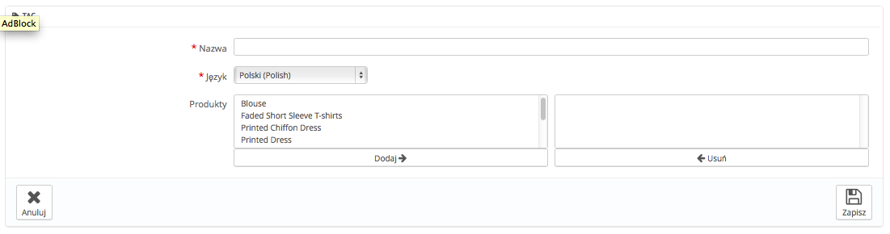

# Zarządzanie tagami

Funkcja tagów pozwala Ci na przypisanie do Twoich produktów słów kluczowych. Twoi klienci mogą używać słów kluczowych, aby łatwo i szybko odnaleźć produkty, których szukają.

Przykładowo załóżmy, że klient chce znaleźć odtwarzacz mp3 w Twoim sklepie. Aby znaleźć odpowiedni produkt odpowiadający jego wyszukiwaniom, potrzebne jest połączenie pomiędzy słowem kluczowym "odtwarzacz mp3" a "iPod Nano".

Tagi produktów to nie to samo, co słowa kluczowe strony, nie mają one bezpośredniego wpływu na umiejscowienie w wynikach wyszukiwania.

Aby poprawić pozycjonowanie, otwórz zakładkę "SEO" dla każdego produktu.

Istnieją dwa sposoby na ustawienie tej funkcji.

## Pierwsze rozwiązanie: podczas tworzenia nowego produktu 

Możesz przypisywać tagi do produktu podczas tworzenia go w PrestaShop, bezpośrednio w polu "Tagi" w zakładce "Informacje". Zobacz poprzedni rozdział tego przewodnika "Dodawanie produktów i kategorii".

## Drugie Rozwiązanie: zarządzanie tagami 

Strona "Tagi" w menu "Katalog" pozwala Ci na tworzenie nowych tagów i zarządzanie już istniejącymi. Po nadaniu tagów produktom, otrzymasz ważną listę tagów. Strona "Tagi" pozwoli Ci nimi zarządzać.

Aby utworzyć nowy, naciśnij "Dodaj nowy", a pojawi się formularz.

Interfejs pozwala Ci dodawać tagi do jednego lub wielu produktów.

* **Nazwa.** Nazwij swój tag. Powinien być krótki i rzeczowy, tak aby pomagał odnajdywać Twoim klientom powiązane produkty, a nie im przeszkadzał.
* **Język.** Określ język taga, który powinien być widoczny w sklepie. PrestaShop jest na tyle mądry, że nie będzie wyświetlać tagów polskich na stronie francuskiej.
* **Produkty.** Zaznacz produkty z prawej kolumny, do których chcesz zastosować tag. Przytrzymaj przycisk Ctrl na klawiaturze, aby zaznaczyć kilka produktów za jednym razem.

Gdy zachowasz stronę, tagi pojawią się przy przypisanych produktach w tabelce po prawej.

Aby dodać tag dla innego języka powtórz operację, tylko tym razem zmień język.

Po zachowaniu tagu pojawi się lista tagów, na której możesz je edytować, usuwać, a nawet usuwać grupami, korzystając z przycisku u dołu listy.

Obok ikon edycji i kosza liczba wskazuje, ile produktów korzysta z tagu.

Od tej pory, gdy Twoi klienci będą wyszukiwać produktów na stronie, to otrzymywane rezultaty będą również zależeć od przypisanych tagów.
