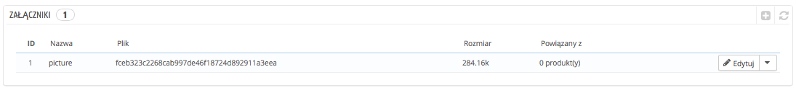

# Zarządzanie załącznikami

PrestaShop pozwala Ci na udostępnianie niektórych plików Twoim klientom przed zakupem.

Załóżmy przykładowo, że sprzedajesz elektronikę i chcesz, żeby Twoi klienci mogli przeczytać dokument dotyczący funkcjonowania urządzenia. W tym celu możesz udostępnić odpowiedni do tego dokument.

Możesz zwyczajnie udostępnić instrukcję produktu w formacie PDF, pozwalając na jej bezpośrednie pobieranie ze strony produktu.

Każdy produkt może mieć własny załącznik, który możesz wskazać w zakładce "Załącznik" na stronie produktu (co zostało wyjaśnione wcześniej w tym rozdziale). Ta strona daje Ci dostęp do wszystkich plików załączonych w sklepie. Jeśli potrzebujesz, możesz powiązać jeden plik z wieloma produktami i dzięki temu przesłać go na serwer tylko raz.

Możesz również przesyłać załączniki przed przypisaniem ich do produktów. Możesz to zrobić za pomocą strony "Załączniki" w menu "Katalog".

Proces zapisania nowego załącznika jest prosty:

1. Naciśnij na przycisk "Dodaj nowy załącznik". Pojawi się formularz.
2. **Nazwa pliku.** Podaj nazwę pliku we wszystkich językach.
3. **Opis.** Podaj krótki opis w wymaganych językach.
4. Naciśnij na "Dodaj plik" w celu wybrania z Twojego komputera pliku, który ma być przesłany.
5. Naciśnij na "Zapisz".

Zostaniesz następnie przekierowany do listy załączników, na której pojawi się Twój nowy plik. W ten sposób jest on dostępny dla wszystkich produktów za pomocą zakładki "Załączniki".

Jednocześnie na stronie produktu pojawi się zakładka "Pobierz", skąd Twoi klienci będą mogli pobrać plik.
